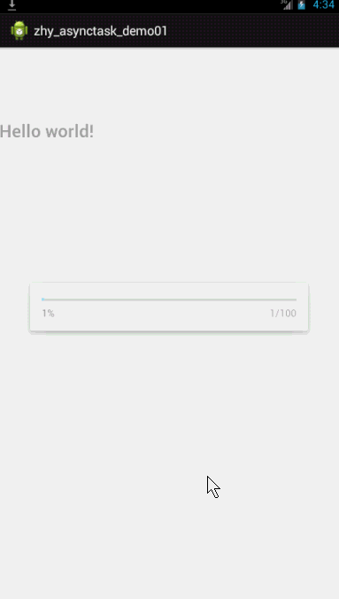

# AsyncTask源码解析.md

来源:[http://blog.csdn.net/lmj623565791/article/details/38614699](http://blog.csdn.net/lmj623565791/article/details/38614699)


## 1、概述

相信大家对AsyncTask都不陌生，对于执行耗时任务，然后更新UI是一把利器，当然也是替代Thread + Handler 的一种方式。如果你对Handler机制还不了解，请看：[Android 异步消息处理机制 让你深入理解 Looper、Handler、Message三者关系](http://blog.csdn.net/lmj623565791/article/details/38377229)。

## 2、简单的例子

相信大家都写过这样的代码：

```
[java] view plain copy print?package com.example.zhy_asynctask_demo01;  
  
import android.app.Activity;  
import android.app.ProgressDialog;  
import android.os.AsyncTask;  
import android.os.Bundle;  
import android.util.Log;  
import android.widget.TextView;  
  
public class MainActivity extends Activity  
{  
  
    private static final String TAG = "MainActivity";  
    private ProgressDialog mDialog;  
    private TextView mTextView;  
  
    @Override  
    protected void onCreate(Bundle savedInstanceState)  
    {  
        super.onCreate(savedInstanceState);  
        setContentView(R.layout.activity_main);  
  
        mTextView = (TextView) findViewById(R.id.id_tv);  
  
        mDialog = new ProgressDialog(this);  
        mDialog.setMax(100);  
        mDialog.setProgressStyle(ProgressDialog.STYLE_HORIZONTAL);  
        mDialog.setCancelable(false);  
  
        new MyAsyncTask().execute();  
  
    }  
  
    private class MyAsyncTask extends AsyncTask<Void, Integer, Void>  
    {  
  
        @Override  
        protected void onPreExecute()  
        {  
            mDialog.show();  
            Log.e(TAG, Thread.currentThread().getName() + " onPreExecute ");  
        }  
  
        @Override  
        protected Void doInBackground(Void... params)  
        {  
  
            // 模拟数据的加载,耗时的任务  
            for (int i = 0; i < 100; i++)  
            {  
                try  
                {  
                    Thread.sleep(80);  
                } catch (InterruptedException e)  
                {  
                    e.printStackTrace();  
                }  
                publishProgress(i);  
            }  
  
            Log.e(TAG, Thread.currentThread().getName() + " doInBackground ");  
            return null;  
        }  
  
        @Override  
        protected void onProgressUpdate(Integer... values)  
        {  
            mDialog.setProgress(values[0]);  
            Log.e(TAG, Thread.currentThread().getName() + " onProgressUpdate ");  
        }  
  
        @Override  
        protected void onPostExecute(Void result)  
        {  
            // 进行数据加载完成后的UI操作  
            mDialog.dismiss();  
            mTextView.setText("LOAD DATA SUCCESS ");  
            Log.e(TAG, Thread.currentThread().getName() + " onPostExecute ");  
        }  
    }  
}  

```

进入某个Activity，Activity中需要的数据来自于网络或者其它耗时操作，可以在AsyncTask中onPreExecute完成一些准备操作，比如上例中显示进度对话框；然后在doInBackground完成耗时操作，在进行耗时操作时还能不时的通过publishProgress给onProgressUpdate中传递参数，然后在onProgressUpdate中可以进行UI操作，比如上例更新进度条的进度；当耗时任务执行完成后，最后在onPostExecute进行设置控件数据更新UI等操作，例如隐藏进度对话框。

效果图：



## 3、源码解析
注：本篇源码分析基于Andorid-17，因为和3.0之前版本变动较大，有必要标出。

那么大家一定好奇，AsyncTask在Android中是如何实现的，下面进行源码分析：从我们的执行异步任务的起点开始，进入execute方法：

```
public final AsyncTask<Params, Progress, Result> execute(Params... params) {  
        return executeOnExecutor(sDefaultExecutor, params);  
}  
public final AsyncTask<Params, Progress, Result> executeOnExecutor(
							Executor exec,  Params... params) {  
        if (mStatus != Status.PENDING) {  
            switch (mStatus) {  
                case RUNNING:  
                    throw new IllegalStateException("Cannot execute task:"  
                            + " the task is already running.");  
                case FINISHED:  
                    throw new IllegalStateException("Cannot execute task:"  
                            + " the task has already been executed "  
                            + "(a task can be executed only once)");  
            }  
        }  
  
        mStatus = Status.RUNNING;  
  
        onPreExecute();  
  
        mWorker.mParams = params;  
        exec.execute(mFuture);  
  
        return this;  
}  
```

18行：设置当前AsyncTask的状态为RUNNING，上面的switch也可以看出，每个异步任务在完成前只能执行一次。

20行：执行了onPreExecute()，当前依然在UI线程，所以我们可以在其中做一些准备工作。

22行：将我们传入的参数赋值给了mWorker.mParams

23行：exec.execute(mFuture)

相信大家对22行出现的mWorker，以及23行出现的mFuture都会有些困惑。

mWorker找到这个类：

```
private static abstract class WorkerRunnable<Params, Result> 
										implements Callable<Result> {  
        Params[] mParams;  
}
```

可以看到是Callable的子类，且包含一个mParams用于保存我们传入的参数，下面看初始化mWorker的代码：

```
public AsyncTask() {
    mWorker = new WorkerRunnable<Params, Result>() {
        public Result call() throws Exception {
            mTaskInvoked.set(true);

            Process.setThreadPriority(Process.THREAD_PRIORITY_BACKGROUND);
            //noinspection unchecked
            Result result = doInBackground(mParams);
            Binder.flushPendingCommands();
            return postResult(result);
        }
    };

    mFuture = new FutureTask<Result>(mWorker) {
        @Override
        protected void done() {
            try {
                postResultIfNotInvoked(get());
            } catch (InterruptedException e) {
                android.util.Log.w(LOG_TAG, e);
            } catch (ExecutionException e) {
                throw new RuntimeException("An error occurred while 
                							executing doInBackground()",
                        e.getCause());
            } catch (CancellationException e) {
                postResultIfNotInvoked(null);
            }
        }
    };
}
```

可以看到mWorker在构造方法中完成了初始化，并且因为是一个抽象类，在这里new了一个实现类，实现了call方法，call方法中设置mTaskInvoked=true，且最终调用doInBackground(mParams)方法，并返回Result值作为参数给postResult方法.可以看到我们的doInBackground出现了，下面继续看：


```
private Result postResult(Result result) {
    @SuppressWarnings("unchecked")
    Message message = getHandler().obtainMessage(MESSAGE_POST_RESULT,
            new AsyncTaskResult<Result>(this, result));
    message.sendToTarget();
    return result;
}
```

可以看到postResult中出现了我们熟悉的异步消息机制，传递了一个消息message, message.what为MESSAGE_POST_RESULT；message.object= new AsyncTaskResult(this,result);

```
private static class AsyncTaskResult<Data> {
    final AsyncTask mTask;
    final Data[] mData;

    AsyncTaskResult(AsyncTask task, Data... data) {
        mTask = task;
        mData = data;
    }
}
```

AsyncTaskResult就是一个简单的携带参数的对象。

看到这，我相信大家肯定会想到，在某处肯定存在一个sHandler，且复写了其handleMessage方法等待消息的传入，以及消息的处理。

```
private static class InternalHandler extends Handler {
    public InternalHandler() {
        super(Looper.getMainLooper());
    }

    @SuppressWarnings({"unchecked", "RawUseOfParameterizedType"})
    @Override
    public void handleMessage(Message msg) {
        AsyncTaskResult<?> result = (AsyncTaskResult<?>) msg.obj;
        switch (msg.what) {
            case MESSAGE_POST_RESULT:
                // There is only one result
                result.mTask.finish(result.mData[0]);
                break;
            case MESSAGE_POST_PROGRESS:
                result.mTask.onProgressUpdate(result.mData);
                break;
        }
    }
}
```

哈哈，出现了我们的handleMessage，可以看到，在接收到MESSAGE_POST_RESULT消息时，执行了result.mTask.finish(result.mData[0]);其实就是我们的AsyncTask.this.finish(result)，于是看finish方法

```
private void finish(Result result) {
    if (isCancelled()) {
        onCancelled(result);
    } else {
        onPostExecute(result);
    }
    mStatus = Status.FINISHED;
}
```

可以看到，如果我们调用了cancel()则执行onCancelled回调；正常执行的情况下调用我们的onPostExecute(result);主要这里的调用是在handler的handleMessage中，所以是在UI线程中。如果你对异步消息机制不理解请看：[Android 异步消息处理机制 让你深入理解 Looper、Handler、Message三者关系](http://blog.csdn.net/lmj623565791/article/details/38377229)

最后将状态置为FINISHED。

mWoker看完了，应该到我们的mFuture了，依然实在构造方法中完成mFuture的初始化，将mWorker作为参数，复写了其done方法。

```
public AsyncTask() {
    mWorker = new WorkerRunnable<Params, Result>() {
        public Result call() throws Exception {
            mTaskInvoked.set(true);

            Process.setThreadPriority(Process.THREAD_PRIORITY_BACKGROUND);
            //noinspection unchecked
            Result result = doInBackground(mParams);
            Binder.flushPendingCommands();
            return postResult(result);
        }
    };

    mFuture = new FutureTask<Result>(mWorker) {
        @Override
        protected void done() {
            try {
                postResultIfNotInvoked(get());
            } catch (InterruptedException e) {
                android.util.Log.w(LOG_TAG, e);
            } catch (ExecutionException e) {
                throw new RuntimeException("An error occurred while 
                							executing doInBackground()",
                        e.getCause());
            } catch (CancellationException e) {
                postResultIfNotInvoked(null);
            }
        }
    };
}
```

16行：任务执行结束会调用：postResultIfNotInvoked(get());get()表示获取mWorker的call的返回值，即Result.然后看postResultIfNotInvoked方法

```
private void postResultIfNotInvoked(Result result) {
    final boolean wasTaskInvoked = mTaskInvoked.get();
    if (!wasTaskInvoked) {
        postResult(result);
    }
}
```

如果mTaskInvoked不为true，则执行postResult；但是在mWorker初始化时就已经将mTaskInvoked为true，所以一般这个postResult执行不到。

好了，到了这里，已经介绍完了execute方法中出现了mWorker和mFurture，不过这里一直是初始化这两个对象的代码，并没有真正的执行。下面我们看真正调用执行的地方。

execute方法中的：

还记得上面的execute中的23行：exec.execute(mFuture)

exec为executeOnExecutor(sDefaultExecutor, params)中的sDefaultExecutor

下面看这个sDefaultExecutor

```
private static volatile Executor sDefaultExecutor = SERIAL_EXECUTOR;  
public static final Executor SERIAL_EXECUTOR = new SerialExecutor();  
private static class SerialExecutor implements Executor {  
        final ArrayDeque<Runnable> mTasks = new ArrayDeque<Runnable>();  
        Runnable mActive;  
        public synchronized void execute(final Runnable r) {  
            mTasks.offer(new Runnable() {  
                public void run() {  
                    try {  
                        r.run();  
                    } finally {  
                        scheduleNext();  
                    }  
                }  
            });  
            if (mActive == null) {  
                scheduleNext();  
            }  
        }  
        protected synchronized void scheduleNext() {  
            if ((mActive = mTasks.poll()) != null) {  
                THREAD_POOL_EXECUTOR.execute(mActive);  
            }  
        }  
}
```

可以看到sDefaultExecutor其实为SerialExecutor的一个实例，其内部维持一个任务队列；直接看其execute（Runnable runnable）方法，将runnable放入mTasks队尾；

16-17行：判断当前mActive是否为空，为空则调用scheduleNext方法

20行：scheduleNext，则直接取出任务队列中的队首任务，如果不为null则传入THREAD_POOL_EXECUTOR进行执行。

下面看THREAD_POOL_EXECUTOR为何方神圣：

```
public static final Executor THREAD_POOL_EXECUTOR  
    = new ThreadPoolExecutor(CORE_POOL_SIZE, MAXIMUM_POOL_SIZE, KEEP_ALIVE,  
                    TimeUnit.SECONDS, sPoolWorkQueue, sThreadFactory);  
```

可以看到就是一个自己设置参数的线程池，参数为：

```
private static final int CORE_POOL_SIZE = 5;  
private static final int MAXIMUM_POOL_SIZE = 128;  
private static final int KEEP_ALIVE = 1;  
private static final ThreadFactory sThreadFactory = new ThreadFactory() {  
private final AtomicInteger mCount = new AtomicInteger(1);  
public Thread newThread(Runnable r) {  
     return new Thread(r, "AsyncTask #" + mCount.getAndIncrement());  
    }  
 };  
private static final BlockingQueue<Runnable> sPoolWorkQueue =  
            new LinkedBlockingQueue<Runnable>(10); 
```

看到这里，大家可能会认为，背后原来有一个线程池，且最大支持128的线程并发，加上长度为10的阻塞队列，可能会觉得就是在快速调用138个以内的AsyncTask子类的execute方法不会出现问题，而大于138则会抛出异常。

其实不是这样的，我们再仔细看一下代码，回顾一下sDefaultExecutor，真正在execute()中调用的为sDefaultExecutor.execute：

```
private static class SerialExecutor implements Executor {
    final ArrayDeque<Runnable> mTasks = new ArrayDeque<Runnable>();
    Runnable mActive;

    public synchronized void execute(final Runnable r) {
        mTasks.offer(new Runnable() {
            public void run() {
                try {
                    r.run();
                } finally {
                    scheduleNext();
                }
            }
        });
        if (mActive == null) {
            scheduleNext();
        }
    }

    protected synchronized void scheduleNext() {
        if ((mActive = mTasks.poll()) != null) {
            THREAD_POOL_EXECUTOR.execute(mActive);
        }
    }
}
```

可以看到，如果此时有10个任务同时调用execute（s synchronized）方法，第一个任务入队，然后在mActive = mTasks.poll()) != null被取出，并且赋值给mActivte，然后交给线程池去执行。然后第二个任务入队，但是此时mActive并不为null，并不会执行scheduleNext();所以如果第一个任务比较慢，10个任务都会进入队列等待；真正执行下一个任务的时机是，线程池执行完成第一个任务以后，调用Runnable中的finally代码块中的scheduleNext，所以虽然内部有一个线程池，其实调用的过程还是线性的。一个接着一个的执行，相当于单线程。

## 4、总结

到此源码解释完毕，由于代码跨度比较大，我们再回顾一下：

```
public final AsyncTask<Params, Progress, Result> execute(Params... params) {  
        return executeOnExecutor(sDefaultExecutor, params);  
}  
public final AsyncTask<Params, Progress, Result> executeOnExecutor(
				Executor exec,Params... params) {  
        if (mStatus != Status.PENDING) {  
            switch (mStatus) {  
                case RUNNING:  
                    throw new IllegalStateException("Cannot execute task:"  
                            + " the task is already running.");  
                case FINISHED:  
                    throw new IllegalStateException("Cannot execute task:"  
                            + " the task has already been executed "  
                            + "(a task can be executed only once)");  
            }  
        }  
  
        mStatus = Status.RUNNING;  
  
        onPreExecute();  
  
        mWorker.mParams = params;  
        exec.execute(mFuture);  
  
        return this;  
}  
```

18行：设置当前AsyncTask的状态为RUNNING，上面的switch也可以看出，每个异步任务在完成前只能执行一次。

20行：执行了onPreExecute()，当前依然在UI线程，所以我们可以在其中做一些准备工作。

22行：将我们传入的参数赋值给了mWorker.mParams ,mWorker为一个Callable的子类，且在内部的call()方法中，调用了doInBackground(mParams)，然后得到的返回值作为postResult的参数进行执行；postResult中通过sHandler发送消息，最终sHandler的handleMessage中完成onPostExecute的调用。

23行：exec.execute(mFuture)，mFuture为真正的执行任务的单元，将mWorker进行封装，然后由sDefaultExecutor交给线程池进行执行。

## 5、publishProgress

说了这么多，我们好像忘了一个方法：publishProgress

```
protected final void publishProgress(Progress... values) {  
    if (!isCancelled()) {  
        sHandler.obtainMessage(MESSAGE_POST_PROGRESS,  
                new AsyncTaskResult<Progress>(this, values)).sendToTarget();  
    }  
} 
```

也很简单，直接使用sHandler发送一个消息，并且携带我们传入的值；

```
private static class InternalHandler extends Handler {  
    @SuppressWarnings({"unchecked", "RawUseOfParameterizedType"})  
    @Override  
    public void handleMessage(Message msg) {  
        AsyncTaskResult result = (AsyncTaskResult) msg.obj;  
        switch (msg.what) {  
            case MESSAGE_POST_RESULT:  
                // There is only one result  
                result.mTask.finish(result.mData[0]);  
                break;  
            case MESSAGE_POST_PROGRESS:  
                result.mTask.onProgressUpdate(result.mData);  
                break;  
        }  
    }  
} 
```

在handleMessage中进行了我们的onProgressUpdate(result.mData);的调用。

## 6、AsyncTask曾经缺陷
记得以前有个面试题经常会问道：AsyncTask运行的原理是什么？有什么缺陷？

以前对于缺陷的答案可能是：AsyncTask在并发执行多个任务时发生异常。其实还是存在的，在3.0以前的系统中还是会以支持多线程并发的方式执行，支持并发数也是我们上面所计算的128，阻塞队列可以存放10个；也就是同时执行138个任务是没有问题的；而超过138会马上出现java.util.concurrent.RejectedExecutionException；

而在在3.0以上包括3.0的系统中会为单线程执行（即我们上面代码的分析）；

空说无凭：下面看测试代码：

```
package com.example.zhy_asynctask_demo01;  
  
import android.app.Activity;  
import android.app.ProgressDialog;  
import android.os.AsyncTask;  
import android.os.Bundle;  
import android.util.Log;  
import android.widget.TextView;  
  
public class MainActivity extends Activity  
{  
  
    private static final String TAG = "MainActivity";  
    private ProgressDialog mDialog;  
    private TextView mTextView;  
  
    @Override  
    protected void onCreate(Bundle savedInstanceState)  
    {  
        super.onCreate(savedInstanceState);  
        setContentView(R.layout.activity_main);  
  
        mTextView = (TextView) findViewById(R.id.id_tv);  
  
        mDialog = new ProgressDialog(this);  
        mDialog.setMax(100);  
        mDialog.setProgressStyle(ProgressDialog.STYLE_HORIZONTAL);  
        mDialog.setCancelable(false);  
          
          
        for(int i = 1 ;i <= 138 ; i++)  
        {  
            new MyAsyncTask2().execute();  
        }  
          
        //new MyAsyncTask().execute();  
  
          
    }  
  
    private class MyAsyncTask2 extends AsyncTask<Void,Void, Void>  
    {  
  
        @Override  
        protected Void doInBackground(Void... params)  
        {  
            try  
            {  
                Log.e(TAG, Thread.currentThread().getName());  
                Thread.sleep(10000);  
            } catch (InterruptedException e)  
            {  
                e.printStackTrace();  
            }  
            return null;  
        }  
          
    }  
}  
```

可以看到我for循环中执行138个异步任务，每个异步任务的执行需要10s;下面使用2.2的模拟器进行测试：

输出结果为：

AsyncTask#1 - AsyncTask #128同时输出

然后10s后，另外10个任务输出。

可以分析结果，得到结论：AsyncTask在2.2的系统中同时支持128个任务并发，至少支持10个任务等待；

下面将138个任务，改成139个任务：

```
for(int i = 1 ;i <= 139 ; i++)  {  
    new MyAsyncTask2().execute();  
}
```

运行结果：会发生异常：java.util.concurrent.RejectedExecutionException ； 于是可以确定仅支持10个任务等待，超过10个则立即发生异常。

简单说一下出现异常的原因：现在是139个任务，几乎同时提交，线程池支持128个的并发，然后阻塞队列数量为10，此时当第11个任务提交的时候则会发生异常。

简单看一下源码：

```
public static final Executor THREAD_POOL_EXECUTOR  
           = new ThreadPoolExecutor(CORE_POOL_SIZE, 
           			MAXIMUM_POOL_SIZE, KEEP_ALIVE, 
           			TimeUnit.SECONDS, sPoolWorkQueue, sThreadFactory);  
```

看ThreadPoolExecutor的execute方法：

```
if (isRunning(c) && workQueue.offer(command)) {  
	int recheck = ctl.get();  
	if (! isRunning(recheck) && remove(command)){
		reject(command);
	}else if (workerCountOf(recheck) == 0){
		addWorker(null, false);
	}
}else if (!addWorker(command, false)) {
	reject(command);  
}
```

当阻塞队列满的时候workQueue.offer(command)返回false;然后执行addWorker(command,false)方法，如果返回false则执行reject()方法.

```
private boolean addWorker(Runnable firstTask, boolean core) {  
…  
    int wc = workerCountOf(c);  
    if (wc >= CAPACITY ||  
        wc >= (core ? corePoolSize : maximumPoolSize))  
        return false;  
…  
} 
```

可以看到当任务数目大于容量则返回false，最终在reject()中抛出异常。

上面就是使用2.2模拟器测试的结果；

下面将系统改为4.1.1，也就是我的测试机小米2s

把线程数改为139甚至1000，你可以看到任务一个接一个的在那缓慢的执行，不会抛什么异常，不过线程倒是1个1个的在那执行；

好了，如果现在大家去面试，被问到AsyncTask的缺陷，可以分为两个部分说，在3.0以前，最大支持128个线程的并发，10个任务的等待。在3.0以后，无论有多少任务，都会在其内部单线程执行；

至此，AsyncTask源码分析完毕，相信大家对AsyncTask有了更深的理解~~~

[测试代码点击下载](http://download.csdn.net/detail/lmj623565791/7767659)