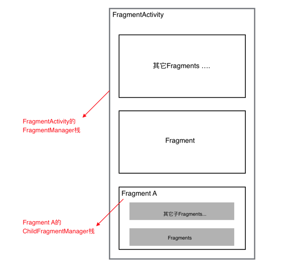

# Fragment全解析系列（二）：正确的使用姿势

来源:[www.jianshu.com](http://www.jianshu.com/p/fd71d65f0ec6)

* 1、[Fragment全解析系列（一）：那些年踩过的坑](http://www.jianshu.com/p/d9143a92ad94)
* 2、[Fragment全解析系列（二）：正确的使用姿势](http://www.jianshu.com/p/fd71d65f0ec6)
* 3、[Fragment之我的解决方案：Fragmentation](http://www.jianshu.com/p/38f7994faa6b)

本篇主要介绍一些Fragment使用技巧。

Fragment是可以让你的app纵享丝滑的设计，如果你的app想在现在基础上**性能大幅度提高**，并且**占用内存降低**，同样的界面Activity占用内存比Fragment要多，响应速度Fragment比Activty在中低端手机上快了很多，甚至能达到好几倍！如果你的app当前或以后有**移植**平板等平台时，可以让你节省大量时间和精力。

## 简陋的目录

* 1、一些使用建议
* 2、add(), show(), hide(), replace()的那点事
* 3、关于FragmentManager你需要知道的
* 4、使用ViewPager+Fragment的注意事项
* 5、Fragment事务，你可能不知道的坑
* 6、是使用单Activity＋多Fragment的架构，还是多模块Activity＋多Fragment的架构？

作为一个稳定的app，从后台且回到前台，一定会在任何情况都能恢复到离开前的页面，并且保证数据的完整性。

如果你没看过本系列的[第一篇](http://www.jianshu.com/p/fd71d65f0ec6)，为了方便后面文章的介绍，先规定一个“术语”，安卓app有一种特殊情况，就是 app运行在后台的时候，系统资源紧张的时候导致把app的资源全部回收（杀死app的进程），这时把app再从后台返回到前台时，app会重启。这种情况下文简称为：“内存重启”。

## 一些使用建议

* 1、对Fragment传递数据，建议使用`setArguments(Bundle args)`，而后在onCreate中使用`getArguments(`)取出，在 “内存重启”前，系统会帮你保存数据，不会造成数据的丢失。和Activity的Intent原理一致。

* 2、使用newInstance(参数) 创建Fragment对象，优点是调用者只需要关系传递的哪些数据，而无需关心传递数据的Key是什么。

* 3、如果你需要在Fragment中用到宿主Activity对象，建议在你的基类Fragment定义一个Activity的全局变量，在`onAttach`中初始化。原因参考第一篇的“getActivity()空指针”部分，在onCreateView() 内出现getActivity()的代码 很可能是危险的。

```
protected Activity mActivity;
@Override
public void onAttach(Activity activity) {
    super.onAttach(activity);
    this.mActivity = activity;
}
```

## add(), show(), hide(), replace()的那点事

* 1、区别

`show()`，`hide()`最终是让Fragment的View `setVisibility`(true还是false)，不会调用生命周期；
replace()的话会销毁视图，即调用onDestoryView、onCreateView等一系列生命周期；

`add()`和`replace()`不要在同一个阶级的FragmentManager里混搭使用。

* 2、使用场景

如果你有一个很高的概率会再次使用当前的Fragment，建议使用`show()`，`hide()`，可以提高性能。

在我使用Fragment过程中，大部分情况下都是用show()，hide()，而不是replace()。

* 3、onHiddenChanged的回调时机

当使用add()+show()，hide()跳转新的Fragment时，旧的Fragment回调onHiddenChanged()，不会回调onStop()等生命周期方法，而新的Fragment在创建时是不会回调onHiddenChanged()，这点要切记。

* 4、Fragment重叠问题

使用show()，hide()带来的一个问题就是，如果你不做任何处理，在“内存重启”后，Fragment会重叠；

有些小伙伴可能就是为了避免Fragment重叠问题，而选择使用replace()，但是使用show()，hide()时，重叠问题是完全可以解决的，有两种方式解决，详情参考上一篇。

## 关于FragmentManager你需要知道的

* 1、FragmentManager栈视图

（1）每个Fragment以及宿主Activity(继承自FragmentActivity)都会在创建时，初始化一个FragmentManager对象，处理好Fragment嵌套问题的关键，就是理清这些不同阶级的栈视图。

下面给出一个简要的关系图：



（2）对于宿主Activity，getSupportFragmentManager()获取的FragmentActivity的FragmentManager对象;

对于Fragment，getFragmentManager()是获取的是父Fragment(如果没有，则是FragmentActivity)的FragmentManager对象，而getChildFragmentManager()是获取自己的FragmentManager对象。

* 2、恢复Fragment时（同时防止Fragment重叠），选择getFragments()还是findFragmentByTag()

（1）选择getFragments()

对于一个Activity内的多个Fragment，如果Fragment的关系是“流程”，比如登录->注册/忘记密码->填写信息->跳转到主页Activity。这种情况下，用getFragments()的方式是最合适的，在你的Activity内（更好的方式是在你的所有"流程"基类Activity里），写下如下代码：

```
@Override
protected void onCreate(@Nullable Bundle savedInstanceState) {
    super.onCreate(savedInstanceState);

    if (savedInstanceState != null) {
        List<Fragment> fragments = getSupportFragmentManager().getFragments();

        if (fragments != null && fragments.size() > 0) {
            boolean showFlag = false;

            FragmentTransaction ft = getSupportFragmentManager().beginTransaction();
            for (int i = fragments.size() - 1; i >= 0; i--) {
                Fragment fragment = fragments.get(i);
                if (fragment != null) {
                    if (!showFlag) {
                        ft.show(fragments.get(i));
                        showFlag = true;
                    } else {
                        ft.hide(fragments.get(i));
                    }
                }
            }
            ft.commit();
        }
    }
}
```

（2）选择findFragmentByTag()恢复

如果你的Activity的Fragments，不是“流程”关系，而是“同级”关系，比如QQ的主界面，“消息”、“联系人”、“动态”，这3个Fragment属于同级关系，用上面的代码就不合适了，恢复的时候总会恢复最后一个，即“动态Fragment”。

正确的做法是在onSaveInstanceState()内保存当前所在Fragment的tag或者下标，在onCreate()是恢复的时候，隐藏其它2个Fragment。

```
@Override
protected void onCreate(Bundle savedInstanceState) {
    super.onCreate(savedInstanceState);
    setContentView(R.layout.activity);

    MsgFragment msgFragment;
    ContactFragment contactFragment;
    MeFragment meFragment;

    if (savedInstanceState != null) {  // “内存重启”时调用
        msgFragment = getSupportFragmentManager().findFragmentByTag(msgFragment.getClass().getName);
        contactFragment = getSupportFragmentManager().findFragmentByTag(contactFragment.getClass().getName);
        meFragment = getSupportFragmentManager().findFragmentByTag(meFragment.getClass().getName);

        index = saveInstanceState.getInt(KEY_INDEX);
        // 根据下标判断离开前是显示哪个Fragment，
        // 这里省略判断代码，假设离开前是ConactFragment
        // 解决重叠问题
        getFragmentManager().beginTransaction()
                .show(contactFragment)
                .hide(msgFragment)
                .hide(meFragment)
                .commit();
    }else{  // 正常时
        msgFragment = MsgFragment.newInstance();
        contactFragment = ContactFragment.newInstance();
        meFragment = MeFragment.newInstance();

        getFragmentManager().beginTransaction()
                .add(R.id.container, msgFragment, msgFragment.getClass().getName())
                .add(R.id.container, contactFragment, contactFragment.getClass().getName())
                .add(R.id,container,meFragment,meFragment.getClass().getName())
                .hide(contactFragment)
                .hide(meFragment)
                .commit();
    }
}

@Override
public void onSaveInstanceState(Bundle outState) {
    super.onSaveInstanceState(outState);
    // 保存当前Fragment的下标
    outState.putInt(KEY_INDEX, index);
}
```

当然在“同级”关系中，使用getFragments()恢复也是可以的。

## 使用ViewPager+Fragment的注意事项

* 1、使用ViewPager＋Fragment时，切换不同ViewPager页面，不会回调任何生命周期方法以及onHiddenChanged()，只有setUserVisibleHint(boolean isVisibleToUser)会被回调，所以如果你想进行一些懒加载，需要在这里处理。
* 2、在给ViewPager绑定FragmentPagerAdapter时，new FragmentPagerAdapter(fragmentManager)的FragmentManager，一定要保证正确，如果ViewPager是Activity内的控件，则传递getSupportFragmentManager()，如果是Fragment的控件中，则应该传递getChildFragmentManager()。只要记住ViewPager内的Fragments是当前组件的子Fragment这个原则即可。
* 3、如果使用ViewPager+Fragment，不需要在“内存重启”的情况下，去恢复的Fragments，有FragmentPagerAdapter的存在，不需要你去做恢复工作。

## Fragment事务，你可能不知道的坑

* 1、如果你在使用popBackStackImmdiate()方法后，紧接着直接调用类似如下事务的方法，因为他们运行在消息队列的问题，还没来得及出栈就运行事务的方法了，这可能会导致不正常现象。

```
getSupportFragmentManager().popBackStackImmdiate();
getSupportFragmentManager().beginTransaction()
        .add(R.id.container, fragment , tag)
        .hide(currentFragment)
        .commit;
```

正确的做法是使用主线程的Handler，将事务放到Runnable里运行。

```
getSupportFragmentManager().popBackStackImmdiate();
new Handler().post(new Runnable(){
          @Override
           public void run() {
                // 在这里执行Fragment事务
           }
});
```

* 2、给Fragment设定Fragment转场动画时，如果你没有一整套解决方案，应避免使用`.setTransition(transit)`以及`.setCustomAnimations(enter, exit, popEnter, popExit)`，而只使用`.setCustomAnimations(enter, exit)`这个方法。

其它2个方法会在某种情况下的“内存重启”中会出现BUG。

本系列最后一篇给出了我的解决方案，解决了该问题，有兴趣可以自行查看 :)

另外一提：谨慎使用`popStackBack(String tag/int id,int flasg)`系列的方法，原因在[上一篇](http://www.jianshu.com/p/d9143a92ad94)中已经描述。

## 是使用单Activity＋多Fragment的架构，还是多模块Activity＋多Fragment的架构？

* 单Activity＋多Fragment：

一个app仅有一个Activity，界面皆是Frament，Activity作为app容器使用。

优点：性能高，速度最快。参考：新版知乎 、google系app

缺点：逻辑比较复杂，尤其当Fragment之间联动较多或者嵌套较深时，比较复杂。

* 多模块Activity＋多Fragment：

一个模块用一个Activity，比如

1、登录注册流程：LoginActivity + 登录Fragment + 注册Fragment + 填写信息Fragment ＋ 忘记密码Fragment

2、或者常见的数据展示流程：DataActivity + 数据列表Fragment + 数据详情Fragment ＋ ...

优点：速度快，相比较单Activity+多Fragment，更易维护。

我的观点：

权衡利弊，我认为多模块Activity＋多Fragment是最合适的架构，开发起来不是很复杂，app的性能又很高效。

当然。Fragment只是官方提供的灵活组件，请优先遵从你的项目设计！真的特别复杂的界面，或者单个Activity就可以完成一个流程的界面，使用Activity可能是更好的方案。

## 最后

如果你读完了[第一篇](http://www.jianshu.com/p/d9143a92ad94)和这篇文章，那么我相信你使用多模块Activity+多Fragment的架构所遇到的坑，大部分都应该能找到解决办法。

但是如果流程较为复杂，比如Fragment A需要启动一个新的Fragment B并且关闭当前A,或者A启动B，B在获取数据后，想在返回到A时把数据交给A（类似Activity的startActivityForResult），又或者你保证在Fragment转场动画的情况下，使用pop(tag\id)从栈内退出多个Fragment，或者你甚至想Fragment有一个类似Activity的SingleTask启动模式，那么你可以参考[下一篇](http://www.jianshu.com/p/38f7994faa6b)，我的解决方案库，[Fragmentation](https://github.com/YoKeyword/Fragmentation)。它甚至提供了一个让你在开发时，可以随时查看所有阶级的栈视图的UI界面。

文／YoKey（简书作者）
原文链接：http://www.jianshu.com/p/fd71d65f0ec6
著作权归作者所有，转载请联系作者获得授权，并标注“简书作者”。