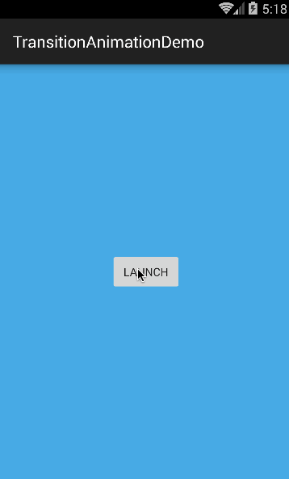

# 一种新的Activity转换动画实现方式

来源:[codethink.me](http://codethink.me/2015/06/21/a-new-implementation-of-activity-transition-animations/)

## 0. 前言
为Android中基本的View组建Activity设置转换动画的方式一般有两种：通过overridePendingTransitions设置，以及使用TransitionManager实现。overridePendingTransitions只能使用XML来设置Activity的进入和退出动画，局限性很大。而使用TransitionManager只兼容API level 19及以上的设备。最近在[InstaMaterial concept](http://frogermcs.github.io/Instagram-with-Material-Design-concept-part-2-Comments-transition/)中发现其利用addOnPreDrawListener方法，提供了一种新的Activity转换动画实现方式，这里详细记录下这种基于addOnPreDrawListener()的实现方式。

## 1. 实现展开动画
首先创建一个基本的Activity转换场景，去掉默认的转换动画，没有任何动画的Activity转换效果如下。


修改第二个Activity的布局activty_second，设置最顶层的布局id为root。之后，在SecondAcivity的onCreate中，为root设置动画，核心部分代码如下：

```
@Override
public void onCreate(Bundle savedInstanceState) {
    super.onCreate(savedInstanceState);

    setContentView(R.layout.activity_second);

    rootView = findViewById(R.id.root);

    if (savedInstanceState == null) {
        rootView.getViewTreeObserver().addOnPreDrawListener(
        				new ViewTreeObserver.OnPreDrawListener() {
            @Override
            public boolean onPreDraw() {
                rootView.getViewTreeObserver().removeOnPreDrawListener(this);
                startRootAnimation();
                return true;
            }
        });
    }
}
```

这里需要注意的是： 

* 1)只需要在首次创建时执行动画，因此需要满足条件savedInstanceState == null；
* 2）在onPreDraw中要首先移除OnPreDrawListener，否则在动画过程中会多次调用，导致死循环。

最后，startRootAnimation的实现如下：

```
rivate void startRootAnimation() {
    rootView.setScaleY(0.1f);
    rootView.setPivotY(rootView.getY() + rootView.getHeight() / 2);

    rootView.animate()
            .scaleY(1)
            .setDuration(1000)
            .setInterpolator(new AccelerateInterpolator())
            .start();
}
```

此时的动画效果如下：



## 2. 设置Activity透明背景
上面的动画还有一个问题：第二个Activity展开的时候，它的背景不是第一个Activity，而是白色背景，这是因为默认的主题为每个Activity设置了白色作为窗口的背景，因此需要在style中创建一个背景为透明的主题，并在AndroidManifest.xml中设置SecondActivty的主题为透明背景主题。
透明背景主题代码如下：

```
 <style name="AppTheme.TransparentActivity">
    <item name="android:windowBackground">@android:color/transparent</item>
    <item name="android:windowIsTranslucent">true</item>
    <item name="android:windowAnimationStyle">@null</item>
 </style>
```

最后的效果如下：


## 3. 小结
至此实现了一个简单的基于addOnPreDrawListener的转换动画，这种转换动画相对于overridePendingTransitions更为灵活，提供了更多想象空间，同时相比于TransitionManager有更好的兼容性。

这种方式目前存在的问题是需要为顶级view以及各层子view分别设置动画，使得顶级view和子view同时展开，或子view延后展开（否则会出现子view已经绘制到目标位置，顶级view仍然在执行动画的情况），对于复杂的布局而言实现有些繁琐。

## 评论内容

参考链接：http://frogermcs.github.io/Instagram-with-Material-Design-concept-is-getting-real/

不需要rootview，直接`rootView = ((ViewGroup)findViewById(android.R.id.content)).getChildAt(0);`
