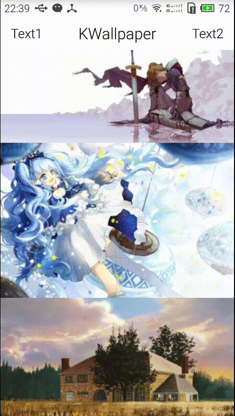

# 实现Activity间的共享控件转场动画

来源:[www.jianshu.com](http://www.jianshu.com/p/841f7b95ca77)

Lollipop中有`shared_element`可以进行元素在activity之间进行共享，网上已经有很多介绍了，然而目前还有大量的kitkat设备，所以说啊，兼容更重要。

如下的方法，可以实现在旧的手机上实现动画效果。采用了类似于豌豆荚的`开眼`项目使用的技术。github上可能有在5.0以下的兼容包，但是个人并不推荐使用第三方的UI工具。



## 实现原理
最近逛业界良心酷安网，发现了豌豆荚的一款叫做[开眼](http://coolapk.com/apk/com.wandoujia.eyepetizer)的项目，这个项目的意义就是每天把墙外的东西搬运回来让村里的阿Q们开开眼，这款app至少目前看还没有那么毒瘤，还是比较小而美的，于是下载试用了一下。

有个转场动画使用了类似上面gif的效果，第一感觉是自定义了一个`popwindow`，于是起床，打开电脑，对两个效果的始末进行查询

```
adb shell dumpsys window windows | grep -E 'mCurrentFocus'
```

结果如下，可以发现是2个activity，而不是自定义view实现的

```
mCurrentFocus=xx/xxxx.ui.activity.FeedActivity}
mCurrentFocus=xx/xxxx.ui.activity.DetailActivity}
```

反复研究，最后发现原理如下

* FeedActivity将view的`top/width/height`，内容等信息通过intent进行发送
* DetailActivity设置为背景`透明模式`，转场动画关闭，这里关闭是非常重要的
* DetailActivity接着读取`intent`，并根据高度等信息进行动画绘制，由于`DetailActivity`的背景是透明的，所以用户会误认为是进行了“放大”操作

> 在UED中，“放大”与“右转”是两种常见的场景切换操作，安利一本叫做[《Learn iOS Design》](https://designcode.io/iosdesign)的书，Android开发者也值得借鉴一下

## 步骤
步骤非常简单，主要时间是耗在了调试动画上

### 1. 设置DetailActivity的主题

```
<style name="DetailedTheme" parent="AppTheme">
  <!--背景透明-->
  <item name="android:windowIsTranslucent">true</item>
  <item name="android:windowBackground">@android:color/transparent</item>
  <!--无进入动画-->
  <item name="android:windowAnimationStyle">@null</item>
</style>
```
### 2. 获取FeedActivity中的itemview
楼主在RecyclerView的Adapter中的viewholder中手动加了一个接口，在主界面实现。这里使用的是ObjectAnimator，它在动画完成后，可以保存动画结束的布局，而且最后测试机(1080P/2G/4.4)的渲染时间均在警戒线(60fps)的一半左右，性能可以满足。

```
@Override public void onItemClick(View v, int position) {
  Parcelable imgInfo = ((CardAdapter) mRvFragCard.getAdapter()).getData().get(position);
  //封装了width/top等信息
  Position viewPosition = Position.from(v);
  DetailedActivity.startActivity(v.getContext(), viewPosition, imgInfo);
}
```
### 3. 在DetailActivity中进行动画
动画没有什么技巧，跟老司机开车一样，属于熟练工种，我们这里主要是使用了AnimationSet进行并发动画

```
void anim(final Position position, final boolean in,
    final Animator.AnimatorListener listener, View... views) {
  if (isPlaying) {
    return;
  }
  //记住括号哦，我这里调试了一小时
  float delta = ((float) (position.width)) / ((float) (position.height));

  float[] y_img = { position.top - views[0].getTop(), 0 };
  float[] s_img = { 1f, delta };

  float[] y_icn = { views[1].getHeight() * 4, 0 };
  float[] s_icn = { 3f, 1f };

  views[0].setPivotX(views[0].getWidth() / 2);
  views[1].setPivotX(views[1].getWidth() / 2);

  Animator trans_Y =
      ObjectAnimator.ofFloat(views[0], View.TRANSLATION_Y, in ? y_img[0] : y_img[1],
          in ? y_img[1] : y_img[0]);
  Animator scale_X =
      ObjectAnimator.ofFloat(views[0], View.SCALE_X, in ? s_img[0] : s_img[1],
          in ? s_img[1] : s_img[0]);
  Animator scale_Y =
      ObjectAnimator.ofFloat(views[0], View.SCALE_Y, in ? s_img[0] : s_img[1],
          in ? s_img[1] : s_img[0]);
  Animator scale_icn_X =
      ObjectAnimator.ofFloat(views[1], View.SCALE_X, in ? s_icn[0] : s_icn[1],
          in ? s_icn[1] : s_icn[0]);
  Animator scale_icn_Y =
      ObjectAnimator.ofFloat(views[1], View.SCALE_Y, in ? s_icn[0] : s_icn[1],
          in ? s_icn[1] : s_icn[0]);

  Animator trans_icn_Y =
      ObjectAnimator.ofFloat(views[1], View.TRANSLATION_Y, in ? y_icn[0] : y_icn[1],
          in ? y_icn[1] : y_icn[0]);

  AnimatorSet set = new AnimatorSet();

  set.playTogether(trans_Y, scale_X, scale_Y);
  set.playTogether(scale_icn_X, scale_icn_Y, trans_icn_Y);
  set.setDuration(400);
  set.addListener(new Animator.AnimatorListener() {
    @Override public void onAnimationStart(Animator animation) {
      listener.onAnimationStart(animation);
      isPlaying = true;
    }

    @Override public void onAnimationEnd(Animator animation) {
      listener.onAnimationEnd(animation);
      isPlaying = false;
    }

    @Override public void onAnimationCancel(Animator animation) {
      listener.onAnimationCancel(animation);
      isPlaying = false;
    }

    @Override public void onAnimationRepeat(Animator animation) {
      listener.onAnimationRepeat(animation);
    }
  });
  set.setInterpolator(new AccelerateInterpolator());
  set.start();
}
```

这样，动画就搞定了，是不是很简单？

## 总结

源码仍在更新中，后期将加入大量仿iOS的组件

[https://github.com/miao1007/AnimeWallpaper](https://github.com/miao1007/AnimeWallpaper)

最后，总结一下，这个东西实现不难，但是

* 调试动画太费时间了，暗坑多
* 属性android:windowIsTranslucent暗坑多，大部分手机运行状态未知
* 编码改动量大，回调接口多，很难把所有业务封装在一个文件中，源码乱，后期维护困难

所以除了情怀，很少有专门的人愿意这样写，我建议在个人app中使用，或者提起商量好了再合作编码。另外关于状态栏适配，可以[参考这里](http://www.jianshu.com/p/249b23ed3b89)

谢谢大家的观看，如果觉得本文有意义的话，不妨点个赞或者分享吧！
