# 移动开发需要知道的像素知识『多图』

来源:[weizhifeng.net](http://weizhifeng.net/you-should-know-about-dpi.html)

> 作者: JeremyWei | 可以转载, 但必须以超链接形式标明文章原始出处和作者信息及版权声明 
> 网址: http://weizhifeng.net/you-should-know-about-dpi.html

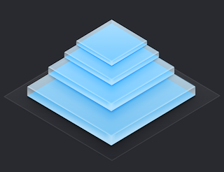

像素（Pixel）对于WEB开发者来说很是熟悉，在PC互联网时代没少与其打交道。进入移动互联网之后，随着移动设备屏幕的解析度越来越高，衍生了一些关于屏幕和像素的一些新概念，比如DPI，DP，PT，Retina，4K等等，本文对这些概念做一个简单的介绍。

## DPI与PPI

DPI（Dots Per Inch）是印刷行业中用来度量空间点密度用的，这个值是打印机每英寸可以喷的墨汁点数。计算机显示设备从打印机中借鉴了DPI的概念，由于计算机显示设备中的原子单位不是墨汁点而是像素，所以就创造了PPI（Pixels Per Inch），这个值是屏幕每英寸的像素数量，即像素密度（Screen density）。由于各种原因，目前PPI(主要是iOS)和DPI(比如在[Android](http://developer.android.com/guide/practices/screens_support.html#terms)中)都会用在计算机显示设备的参数描述中，不过二者的意思是一样的，都是代表像素密度。

高PPI屏幕显示的元素会比较精细（看起来会比较小），低PPI屏幕显示的元素相对来说就比粗糙（看起来会比较大），我们通过一幅图来看看在不同PPI下元素显示的区别：

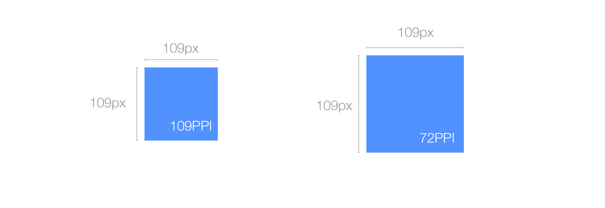

## HD与4K

现在移动设备、智能电视宣传最多的两个关键词估计就是HD、4K，这二者都是用来描述显示设备分辨率的标准，到底二者之间有什么区别？

**HD(High-Definition)**的分辨率要高于1280x720px或者720p。

**Full HD**的分辨率要高于1920x1080px，目前是主流电视以及高端手机（比如Galaxy SIV, HTC one, Sony Xperia Z, Nexus5等）采用的是这个分辨率。

**4K（也叫做Quad HD或者Ultra HD）**的分辨率从3840x2160起步，主要是现在高端电视的分辨率；其还有一个更高的4096x2160的标准，主要用于电影放映机或者专业相机。

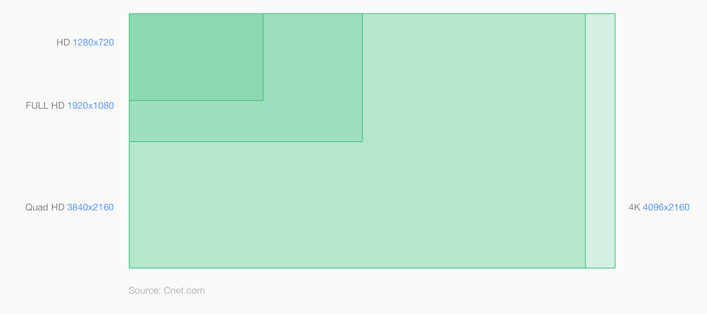

## Retina

[Retina display](http://en.wikipedia.org/wiki/Retina_Display)即视网膜屏幕，是苹果发布iPhone 4时候提出的，之所以叫做视网膜屏幕，是因为屏幕的PPI太高，人的视网膜无法分辨出屏幕上的像素点。iPhone 4/S的PPI为326，是iPhone 3G/S的两倍，如下图：

由于屏幕在宽和高的像素数量提高了整整一倍，所以之前非Retina屏幕上的一个像素渲染的内容在Retina屏幕上会用4个像素去渲染：`1x1px(non Retina) = 2x2px(Retina)`，这样元素的内容就会变得精细，比如：

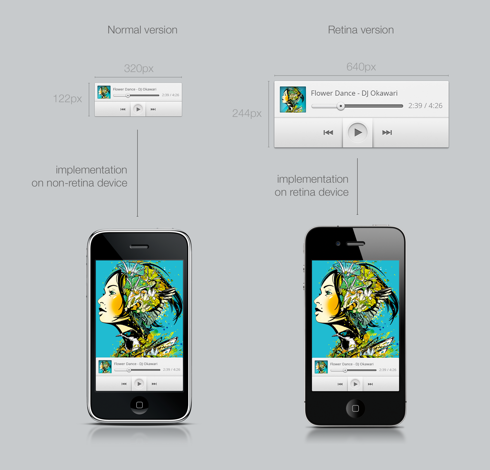

注意，`Retina display`是苹果注册的命名方式，其他厂商只能使用`HI-DPI`或者其他的命名方式，不过意思都是一样的，就是屏幕的PPI非常高。

## DP/PT/SP

随着移动设备屏幕PPI的不断提高，对于开发者来说以前用物理像素(Physical Pixel)来度量显示元素的方法已经不奏效了。为了解决这个问题，两大平台都提出了抽象像素的概念：iOS叫做PT（Point，显示点），Android中叫做DP/DiP（Device independent Pixel，设备无关像素），如果没有特殊说明，以下统一用DP来进行描述。

举个例子，44x44dp的元素在非Retina屏幕中等于44x44px，在Retina屏幕中等于88x88px（变为4倍）。

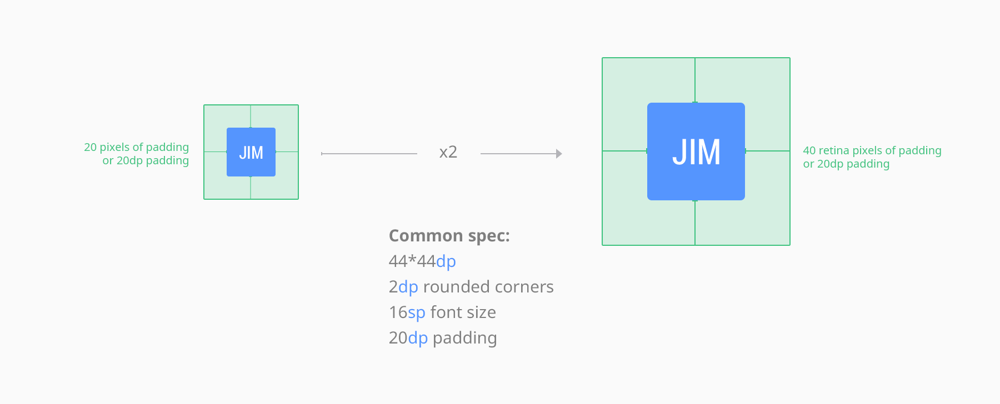

SP（Scale-independent pixel）是缩放无关的像素，与DP和PT一样都是抽象像素，只不过用于描述字体的大小。

## iOS中处理PPI

iOS中处理不同PPI显示的方法很简单：首先规定在多高的PPI下1DP等于1px，并以这个PPI作为基准（1x multiplier），如果显示设备的PPI是基准PPI的2倍，那么1DP等于2px（2x multiplier），其实就是简单的小学乘法。

在iPhone系列中，3G/S为1x multiplier，其他为2x multiplier：

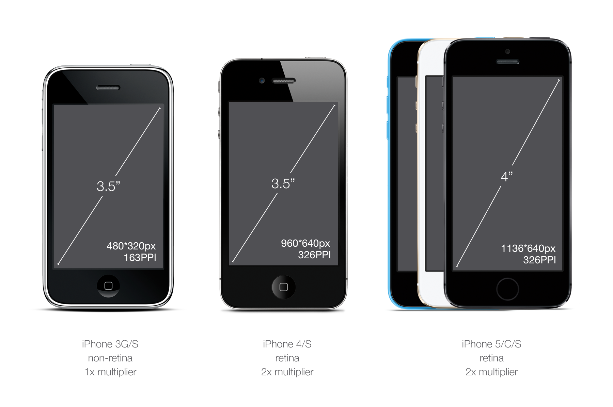

在iPad系列中，iPad 1代和2代为1x multiplier，其他为2x multiplier：

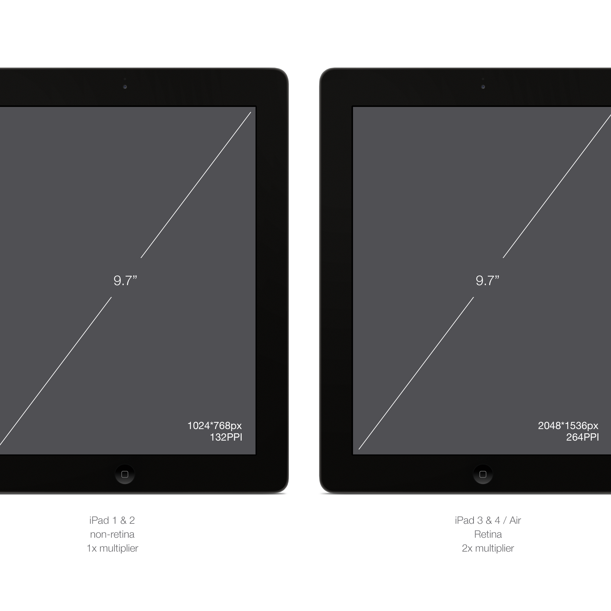

在iPad Mini系列中，iPad Mini一代为1x multiplier，其他为2x multiplier：

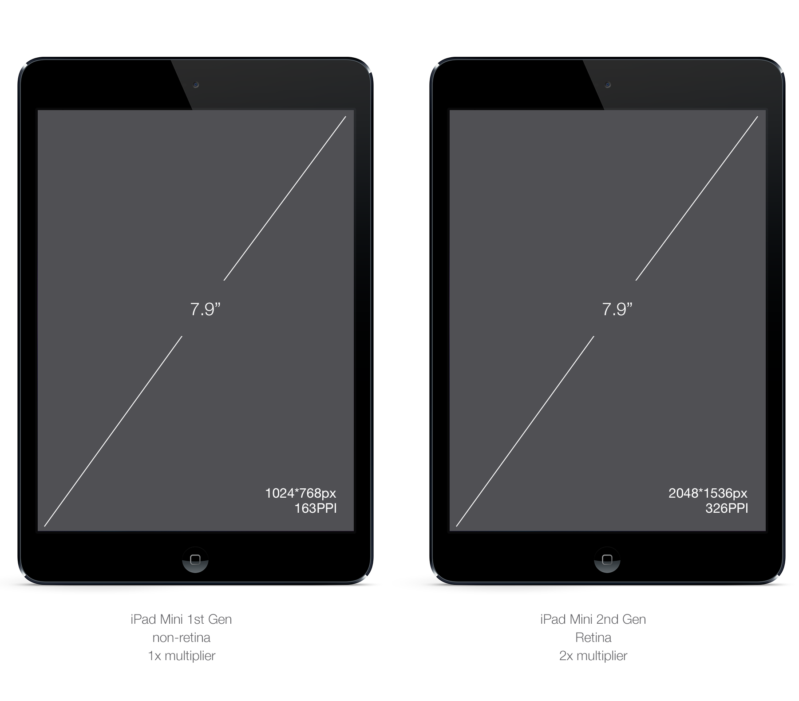

在iOS中，同一个应用在非Retina屏幕和Retina屏幕显示的资源是不同的，其规则是： name.png为非Retina资源，`name@2x.png`为Retina资源，所以对于设计人员来说，在你设计的时候需要考虑到Retina屏幕和非Retina屏幕，看下面这个例子：

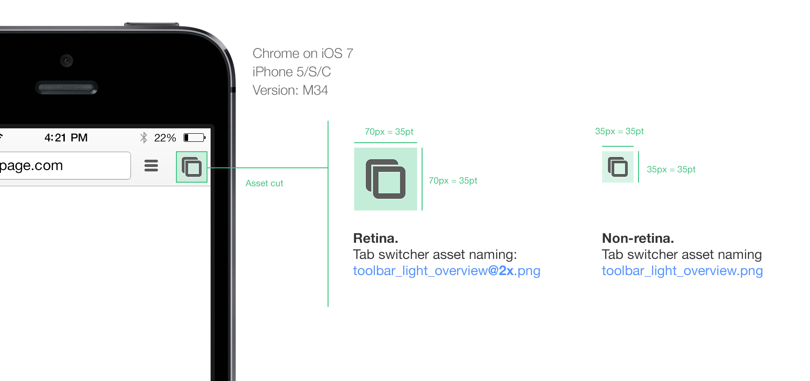

## Android中处理PPI

由于Android系统是开放的系统，要适配的PPI非常多，所以它对PPI划分的非常细：

* ldpi (low) ~120dpi
* mdpi (medium) ~160dpi
* hdpi (high) ~240dpi
* xhdpi (extra-high) ~320dpi
* xxhdpi (extra-extra-high) ~480dpi
* xxxhdpi (extra-extra-extra-high) ~640dpi

你需要把对应dpi的资源放到对应的目录就可以了，Android会根据dpi自动选择资源，目录规则如下：

* drawable-mdpi/asset.png
* drawable-hdpi/asset.png
* drawable-xhdpi/asset.png
* ...

可以看出Android中mdpi与iOS中的1x multiplier所代表的PPI是一样的，xhdpi与iOS的2x multiplier所代表的PPI一样，如图：

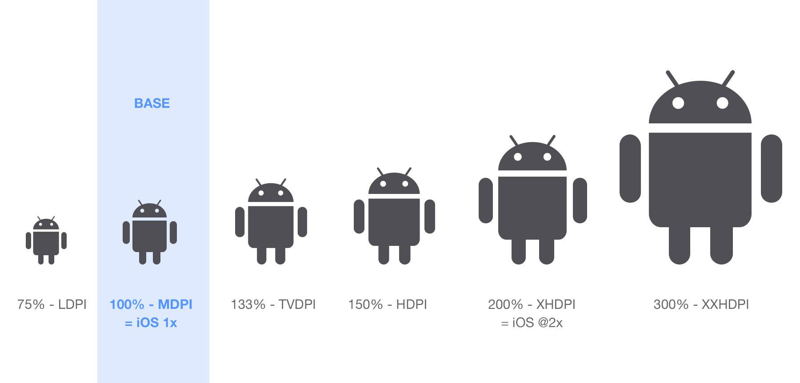
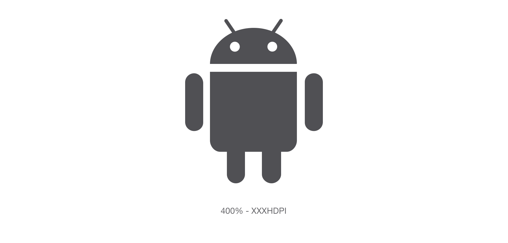

## 参考
* [http://sebastien-gabriel.com/designers-guide-to-dpi/home](http://sebastien-gabriel.com/designers-guide-to-dpi/home)
* [http://developer.android.com/guide/practices/screens_support.html](http://developer.android.com/guide/practices/screens_support.html)