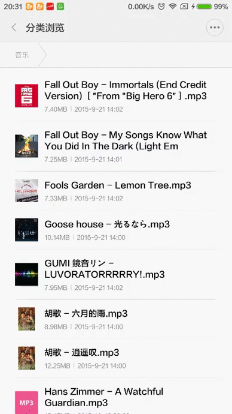
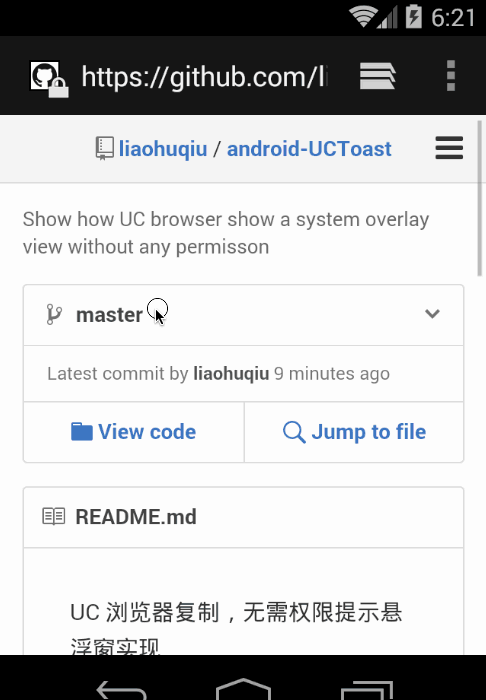

# Android无需权限显示悬浮窗, 兼谈逆向分析app

来源:[简书](http://www.jianshu.com/p/167fd5f47d5c)

## 前言
最近UC浏览器中文版出了一个快速搜索的功能, 在使用其他app的时候, 如果复制了一些内容, 屏幕顶部会弹一个窗口, 提示一些操作, 点击后跳转到UC, 显示这个悬浮窗不需要申请`android.permission.SYSTEM_ALERT_WINDOW`权限.

如下图, 截图是在使用Chrome时截的, 但是屏幕顶部却有UC的view浮在屏幕上. 我使用的是小米, 我并没有给UC授悬浮窗权限, 所以我看到这个悬浮窗时是很震惊的.


## 悬浮窗原理
做过悬浮窗功能的人都知道, 要想显示悬浮窗, 要有一个服务运行在后台, 通过`getSystemService(Context.WINDOW_SERVICE)`拿到`WindowManager`, 然后向其中addView, addView第二个参数是一个`WindowManager.LayoutParams`, `WindowManager.LayoutParams`中有一个成员**type**, 有各种值, 一般设置成**TYPE_PHONE**就可以悬浮在很多view的上方了, 但是调用这个方法需要申请`android.permission.SYSTEM_ALERT_WINDOW`权限, 在很多机型上, 这个权限的名字叫悬浮窗, 比如小米手机上默认是禁用这个权限的, 有些恶意app会用这个权限弹广告, 而且很难追查是哪个应用弹的. 如果这个权限被禁用, 那么结果就是悬浮窗无法展示, 比如有道词典的复制查词功能, 在小米手机上经常没用, 其实是用户没有授权, 而且应用也没有引导用户给它打开授权.

现在UC能突破这个限制, 我很好奇它是怎么做到的.

## 研究实现
Android开发有点蛋疼的地方就是太容易被反编译, 但有时这也成为我们研究别人app的一种手段.

### 反编译
使用apktool可以很轻松的反编译UC.

### 找代码
逆向别人的app, 比较关键的地方是怎么找代码, 因为代码基本上都是混淆的, 直接看肯定是看不懂的, 只能去找, 突破口一般在字符资源上, 比如我们看到上图中的**快速搜索**是UC的字符, 那么我们到`res/values/strings.xml`去找**快速搜索**, 就可以找到下面的内容

```
<string name="dark_search_banner_search">快速搜索</string>
```

这里我们拿到了**快速搜索**对应的名字`dark_search_banner_search`, Android在编译时会给每个资源分配一个id, 我们grep一下这个字符资源的名字就能知道id是多少, 一般在`R.java`, `res/values/public.xml`中有定义, 我直接到`public.xml`中找到了它的id

```
<public type="string" name="dark_search_banner_search" id="0x7f070049" />
```

有了字符资源的id 0x7f070049, 我们再在代码里面grep一下这个id, 就能知道哪几个文件使用了这个字符资源.

之所以这么确定是在代码里, 是因为UC在我们复制的内容不同时, 悬浮窗标题会不一样, 一定是在代码里控制的, 结果如下

```
./com/uc/browser/b/f.smali
```

结果可能和大家不一样, 但是一定会找到一个被混淆的smali文件

### 看代码

这一部应该是最恶心的. smali代码和java代码的关系, 就像汇编代码和C++代码, 但是smali比汇编代码要容易理解的多, 不然也不会有那么多公司故意将代码写在C++层了.

虽然代码都被混淆了, 而且以我们不熟悉的方式出现, 但我们可以根据一些蛛丝马迹来判断代码的执行, 比如Framework的类和API是不能被混淆的, 这也是我们能看懂smali的原因之一, 我们可以结合这些面包屑来还原整个app代码, 当然这需要我们对smali很熟悉, 如果不熟悉smali, 至少要对Android的API熟悉. 因为有时实在看不懂, 我们要靠猜来还原一段代码的逻辑.

首先在代码里面找到`0x7f070049`, 发现了如下代码

```
(省略)
const v3, 0x7f070049

invoke-virtual {v1, v3}, Landroid/content/res/Resources;->getString(I)Ljava/lang/String;

move-result-object v1

iput-object v1, v0, Lcom/uc/browser/b/a;->dpC:Ljava/lang/String;

:cond_9

(省略)

invoke-virtual {v0, v1}, Lcom/uc/browser/b/a;->o(Landroid/graphics/drawable/Drawable;)V
:try_end_2
.catch Ljava/lang/Exception; {:try_start_2 .. :try_end_2} :catch_0

goto/16 :goto_0
(省略)
```

这是`0x7f070049`出现之后的一部分代码, 一路看下来, 其实都是在取值赋值, 就拿`0x7f070049`来说:

```
 #使v3寄存器的值为0x7f070049
    const v3, 0x7f070049
 #v1是Resources实例, 调用它的getString方法, 方法的参数是v3中的值
    invoke-virtual {v1, v3}, Landroid/content/res/Resources;->getString(I)Ljava/lang/String;
 #将结果存入v1寄存器
    move-result-object v1
```

其实就是我们常用的`getResources().getString`

其实如果一直这么看下去, 会发现毫无头绪, 剩下的代码一直在干差不多的事情, 所以我只截取了这部分, 注意最后一行

```
goto/16 :goto_0
```

也就是说, 有可能代码转到goto_0那儿去了, 那么看看goto_0那里又写了些什么

```
    :goto_0
    (省略)

    const-string v1, "window"

    invoke-virtual {v0, v1}, Landroid/content/Context;->getSystemService(Ljava/lang/String;)Ljava/lang/Object;

    move-result-object v0

    check-cast v0, Landroid/view/WindowManager;

    invoke-interface {v0}, Landroid/view/WindowManager;->getDefaultDisplay()Landroid/view/Display;

    move-result-object v0

    invoke-virtual {v0}, Landroid/view/Display;->getWidth()I

    move-result v0

    iget-object v1, v10, Lcom/uc/browser/b/a;->dpx:Landroid/view/WindowManager$LayoutParams;

    iput v0, v1, Landroid/view/WindowManager$LayoutParams;->width:I

    iget-object v0, v10, Lcom/uc/browser/b/a;->dpx:Landroid/view/WindowManager$LayoutParams;

    invoke-virtual {v10}, Lcom/uc/browser/b/a;->getContext()Landroid/content/Context;

    move-result-object v1

    invoke-virtual {v1}, Landroid/content/Context;->getResources()Landroid/content/res/Resources;

    move-result-object v1

    const v2, 0x7f0d0022

    invoke-virtual {v1, v2}, Landroid/content/res/Resources;->getDimension(I)F

    move-result v1

    float-to-int v1, v1

    iput v1, v0, Landroid/view/WindowManager$LayoutParams;->height:I

    iget-object v0, v10, Lcom/uc/browser/b/a;->mWindowManager:Landroid/view/WindowManager;

    iget-object v1, v10, Lcom/uc/browser/b/a;->dpx:Landroid/view/WindowManager$LayoutParams;

    invoke-interface {v0, v10, v1}, Landroid/view/WindowManager;->addView(Landroid/view/View;Landroid/view/ViewGroup$LayoutParams;)V
```

其实看到`const-string v1, "window"`, 我们就应该有所警惕了, 这可能是关键代码了. 为什么这么说? 因为悬浮窗的实现里面, 需要获取`WindowManager`, 从而需要调用`Context.getSystemService(Context.WINDOW_SERVICE)`, 而官方文档写了`Context.WINDOW_SERVICE`就是常量`window. 而后我们看到代码中构造了`WindowManager.LayoutParams`, 最终在addView时传入.

看到这里, 我也觉得很奇怪, 我在**悬浮窗**原理中写的是我知道的实现悬浮窗的方法, UC的实现好像跟我调用的是相同的API, 也没看到反射之类可能展示奇技淫巧的代码, 为什么UC就可以不需要权限直接显示悬浮窗呢?


### 猜测
我认为`addView`的第二个参数`WindowManager.LayoutParams`可能是关键, 所以我需要知道UC是如何构造这个`WindowManager.LayoutParams`的.

由于是系统的类, 无法混淆, 直接搜索LayoutParams就找到了下面的代码

```
iget-object v1, v10, Lcom/uc/browser/b/a;->dpx:Landroid/view/WindowManager$LayoutParams;
```

这句话就是把*v10*的值赋给*v1*, *v10*是`com/uc/browser/b/a`的成员dpx, 那么打开`com/uc/browser/b/a.smali`看看dpx到底是怎么构造的.

```
    (省略)

.field dpx:Landroid/view/WindowManager$LayoutParams;

    (省略)
    .line 68
    new-instance v0, Landroid/view/WindowManager$LayoutParams;

    invoke-direct {v0}, Landroid/view/WindowManager$LayoutParams;-><init>()V

    iput-object v0, p0, Lcom/uc/browser/b/a;->dpx:Landroid/view/WindowManager$LayoutParams;

    .line 69
    if-eqz p2, :cond_0

    .line 70
    iget-object v0, p0, Lcom/uc/browser/b/a;->dpx:Landroid/view/WindowManager$LayoutParams;

    const/16 v1, 0x7d5

    iput v1, v0, Landroid/view/WindowManager$LayoutParams;->type:I

    .line 74
    :goto_0
    iget-object v0, p0, Lcom/uc/browser/b/a;->dpx:Landroid/view/WindowManager$LayoutParams;

    const/4 v1, 0x1

    iput v1, v0, Landroid/view/WindowManager$LayoutParams;->format:I
    (省略)
```

这里的代码就很简单的, 我最先看的是下面这段

```
const/16 v1, 0x7d5

iput v1, v0, Landroid/view/WindowManager$LayoutParams;->type:I
```

这两句代码就是把`WindowManager.LayoutParams.type`字段设成`0x7d5`, 官网上写了`0x000007d5`是`WindowManager.LayoutParams.TYPE_TOAST`的值.

## 验证
实际测试了一下, 将type设置成**TYPE_TOAST**果然有奇效, 不需要`android.permission.SYSTEM_ALERT_WINDOW`权限就能显示一个悬浮窗.

之前我一直以为调用了系统`WindowManager.addView`需要`android.permission.SYSTEM_ALERT_WINDOW`权限, 但实际上调用这个方法是不需要权限的, 在Android源码中有这么一段

```
public int checkAddPermission(WindowManager.LayoutParams attrs) {
    int type = attrs.type;

    if (type < WindowManager.LayoutParams.FIRST_SYSTEM_WINDOW
            || type > WindowManager.LayoutParams.LAST_SYSTEM_WINDOW) {
        return WindowManagerImpl.ADD_OKAY;
    }
    String permission = null;
    switch (type) {
        case TYPE_TOAST:
            // XXX right now the app process has complete control over
            // this...  should introduce a token to let the system
            // monitor/control what they are doing.
            break;
        case TYPE_INPUT_METHOD:
        case TYPE_WALLPAPER:
            // The window manager will check these.
            break;
        case TYPE_PHONE:
        case TYPE_PRIORITY_PHONE:
        case TYPE_SYSTEM_ALERT:
        case TYPE_SYSTEM_ERROR:
        case TYPE_SYSTEM_OVERLAY:
            permission = android.Manifest.permission.SYSTEM_ALERT_WINDOW;
            break;
        default:
            permission = android.Manifest.permission.INTERNAL_SYSTEM_WINDOW;
    }
    if (permission != null) {
        if (mContext.checkCallingOrSelfPermission(permission)
                != PackageManager.PERMISSION_GRANTED) {
            return WindowManagerImpl.ADD_PERMISSION_DENIED;
        }
    }
    return WindowManagerImpl.ADD_OKAY;
}
```

可以猜到这个方法是往系统的*WindowManager*里`addView`的时候做权限检查用的, 那个type就是我们在构造`WindowManager.LayoutParams`时赋值的type, 可以看到, 除了**TYPE_TOAST**, 其他都是要权限的, 而且非常喜感的是, 代码中的注释还说他们现在对这种type毫无限制, 应该引入标记来限制开发者.

### 处理兼容性

在这篇文章刚刚公布的时候, 就有同学反馈悬浮窗无法接收事件, 刚开始我并没有特别在意, 在廖祜秋大神做了一个demo之后, 这篇文章阅读量又涨了不少, 随即收到更多反馈事件的问题, 我今天晚上借了台MIUI V5 4.2.2实测了一下, 这台机器上UC的快速搜索功能也无法正常使用.

在这个ROM上表现为:

* 使用**TYPE_PHONE**这类需要权限的type时, 只有在app处于前台时能显示悬浮窗, 且能正常接受触摸事件. 如果在应用详情里面授悬浮窗权限, 则工作完全正常.(这里是MIUI V5对悬浮窗的特殊处理, 现在的ROM, 包括MIUI V6上, 如果不授权, 无法显示任何悬浮窗)
* 使用TYPE_TOAST这个不需要权限的type时, 悬浮窗正常显示, 但不能接受触摸事件.

我重新检查了一下smali代码, 发现UC是有分版本处理的, 不过因为smali代码的规则问题, 很难直接看出来, 我把分析过程写出来, 顺便解释一下smali的语法, 供大家以后逆向时拿来参考.

这次我是在OS X上反编译的, 所以变量名可能略有区别.

接着上面`com/uc/browser/b/a.smali`中查看dpx的构造过程, 代码如下:

```
.field dpx:Landroid/view/WindowManager$LayoutParams;

(省略)

 # direct methods
.method public constructor <init>(Landroid/content/Context;Z)V
.locals 7

(省略)

.line 68
new-instance v0, Landroid/view/WindowManager$LayoutParams;

invoke-direct {v0}, Landroid/view/WindowManager$LayoutParams;-><init>()V

iput-object v0, p0, Lcom/uc/browser/b/a;->dpx:Landroid/view/WindowManager$LayoutParams;

.line 69
if-eqz p2, :cond_0

.line 70
iget-object v0, p0, Lcom/uc/browser/b/a;->dpx:Landroid/view/WindowManager$LayoutParams;

const/16 v1, 0x7d5

iput v1, v0, Landroid/view/WindowManager$LayoutParams;->type:I
```

为了方便说明, 我遵循smali的规则, 它用`.line XX`, 我们就说这是第XX行的代码.

上面是我之前分析得到UC使用的是**TYPE_TOAST**的地方, 证据就是第70行的`const/16 v1`, `0x7d5`, 但是要知道, smali代码没有跳转的话, 就是从上往下执行, 我们看第69行的代码如下:

```
.line 69
if-eqz p2, :cond_0
```

这句话的意思是**如果p2等于0, 控制流跳转到cond_0**, 否则就是继续顺序往下执行. 也就是说UC只有在p2 != 0条件满足的时候才会使用TYPE_TOAST, 我们看看cond_0对应的代码.

```
.line 72
:cond_0
iget-object v0, p0, Lcom/uc/browser/b/a;->dpx:Landroid/view/WindowManager$LayoutParams;

const/16 v1, 0x7d2

iput v1, v0, Landroid/view/WindowManager$LayoutParams;->type:I
```

这里很简单, 就是将0x7d2赋给了type, 官网写了0x000007d2是TYPE_PHONE, 也就是说UC在某种情况下还是会用需要权限的老方法展示悬浮窗.

现在问题是条件是什么, 关键在p2, 在smali里面, 有两种寄存器命名规则, 一种叫v命名规则, 另一种是p命名规则, 当然只是命名规则而已, 在使用apktool时是可以选的. 这里是p命名规则.

我刚才分析的赋值过程, 所在的方法是下面这个, 我在刚才的代码片段中也保留了这个部分.

```
 # direct methods
.method public constructor <init>(Landroid/content/Context;Z)V
.locals 7
```

这就是`com/uc/browser/b/a`的构造方法, dpx就是在构造方法里初始化的, `.locals 7`告诉我们这个方法中将出现7个局部寄存器(local register), 名字是*v0, v1...v6*, 而这个方法的参数有3个, 隐式告诉我们这个方法中将出现3个参数寄存器(parameter register), 名字分别是*p0, p1, p2*.

我是怎么知道这个方法有3个参数的呢. smali中非静态方法, 都隐含一个参数**p0**, 指向自身, 和Java中的this是一个意思, 而方法的参数写在括号里, 也就是`Landroid/content/Context;Z`, 其中`Landroid/content/Context;`很明显就是Android中的Context, 值存储在p1里, 而Z对应的是Android中的boolean, **p2**就是他了.

也就是说, type是用**TYPE_TOAST**还是用**TYPE_PHONE**, 取决于这个构造方法的第二个参数, 那到底谁构造了`com/uc/browser/b/a`呢? 可以去代码里面搜形如`new-instance ***, Lcom/uc/browser/b/a;`的代码. 更保险的做法是搜`Lcom/uc/browser/b/a`然后一个一个的看.

我在`com/uc/browser/b/f.smali`里面找到了下面的代码:

```
.prologue
const/4 v0, 0x0

const/4 v1, 0x1

(省略)

new-instance v3, Lcom/uc/browser/b/a;

iget-object v4, v9, Lcom/uc/browser/b/e;->mContext:Landroid/content/Context;

sget v5, Landroid/os/Build$VERSION;->SDK_INT:I

const/16 v6, 0x13

if-lt v5, v6, :cond_0

move v0, v1

:cond_0
invoke-direct {v3, v4, v0}, Lcom/uc/browser/b/a;-><init>(Landroid/content/Context;Z)V
```

这段代码首先是创建了`com/uc/browser/b/a`的实例, 存储在*v3*中, 从另一处拿到了一个Context存储在v4中, 然后拿到了当前系统的`android.os.Build.VERSION.SDK_INT`存储在*v5*中, 此时将*v6*的值设为*0x13*, 千万别粗心看成13了, 我好几次都觉得这是13, 其实是十进制的19, 接下来是一个条件分支, 如果v5的值小于v6, 也就是说**android.os.Build.VERSION.SDK_INT < 19**, 直接跳转到cond_0, 否则先将v1的值赋给v0, 再顺序执行.

这句代码

```
invoke-direct {v3, v4, v0}, Lcom/uc/browser/b/a;-><init>(Landroid/content/Context;Z)V
```

就是调用v3的构造方法, 参数是v4和v0, 分析一下上面这段代码的逻辑就是:

如果当前系统API level小于19, 那么第二个参数就是0, 否则就是1.

而这第二个参数的值就是之前我们分析的p2的值, UC只有在`p2 != 0`条件满足的时候才会使用**TYPE_TOAST**, 把整个逻辑串起来就是:

UC在*API level >= 19*的时候, 使用**TYPE_TOAST**, 其他情况使用**TYPE_PHONE**(需要权限).

可能是为了规避在低版本**TYPE_TOAST**不能接受事件的问题.

关于针对源代码的分析, 请看[Android悬浮窗使用TYPE_TOAST的小结](http://www.jianshu.com/p/634cd056b90c)

### 实测效果
我之前写的一个app有悬浮窗播放功能, 支持拖动窗口和点击暂停, 关闭窗口等等, 在4.4.4上实测功能正常.



感谢微博上关注的大神[廖祜秋](http://weibo.com/liaohuqiu?from=feed&loc=nickname), 他做了个[demo](https://github.com/liaohuqiu/android-UCToast), 虽然交互和UC不同, 可以参考一下实现.



关于这个, 他也写了一篇[Android 悬浮窗的小结](http://www.liaohuqiu.net/cn/posts/android-windows-manager/)

## 其他补充
评论区的浮海大虾同学有更多补充如下:

TYPE_TOAST一直都可以显示, 但是用TYPE_TOAST显示出来的在2.3上无法接收点击事件, 因此还是无法随意使用.

下面是我之前研究后台线程显示对话框的时候记得笔记, 大家可以看看我们项目中有需求需要在后台任务中显示Dialog, 项目最初的做法是用Activity模拟Dialog, 一个Activity已经承载了近20种Dialog, 代码混乱至极. 后来我发现Dialog可以通过改变Window Type实现不依赖Activity显示, 然后就很兴奋的要在使用这种方式来作为新的实现方式.

最初WindowType是**WindowManager.LayoutParams.TYPE_SYSTEM_ALERT**, 可是这是悬浮窗了, MIUI会默认禁止(真他妈操蛋，也没有任何提示)最终放弃. 后来试着换成了**WindowManager.LayoutParams.TYPE_TOAST**, 起初效果很好，MIUI也不禁止了, 哪里都能显示, 这下开心了. 可是后来又发现在2.3上不能接收点击事件, 也就是说Dialog上的按钮不能点击, 这他妈就很操蛋了, 又放弃了. 又试了试其他的Type都不能满足需求, 结果如下：

* TYPE_SEARCH_BAR: 未知
* TYPE_ACCESSIBILITY_OVERLAY: 拒绝使用
* TYPE_APPLICATION: 只能配合Activity在当前APP使用TYPE_APPLICATION_ATTACHED_DIALOG: 只能配合Activity在当前APP使用
* TYPE_APPLICATION_MEDIA: 无法使用(什么也不显示)
* TYPE_APPLICATION_PANEL: 只能配合Activity在当前APP使用(PopupWindow默认就是这个Type)
* TYPE_APPLICATION_STARTING: 无法使用(什么也不显示)
* TYPE_APPLICATION_SUB_PANEL: 只能配合Activity在当前APP使用TYPE_BASE_APPLICATION: 无法使用(什么也不显示)
* TYPE_CHANGED: 只能配合Activity在当前APP使用
* TYPE_INPUT_METHOD: 无法使用(直接崩溃)
* TYPE_INPUT_METHOD_DIALOG: 无法使用(直接崩溃)
* TYPE_KEYGUARD_DIALOG: 拒绝使用
* TYPE_PHONE: 属于悬浮窗(并且给一个Activity的话按下HOME键会出现看不到桌面上的图标异常情况)
* TYPE_TOAST: 不属于悬浮窗, 但有悬浮窗的功能, 缺点是在Android2.3上无法接收点击事件
* TYPE_SYSTEM_ALERT: 属于悬浮窗, 但是会被禁止
```

## 尾声
现在我们都知道了如何在不申请权限的情况下显示悬浮窗, 我相信以中国Android开发者的脑洞, 一定会有很多有趣或恶心的功能被开发出来, 一方面我自己觉得这个东西很有用, 可以实现一些很神奇的功能, 另一方面又担心这个API被滥用, 最终不得不限制权限.

还有就是, 逆向分析仅用于学习, 不要干违法的事情.

本人技术有限, 如果文中有错误的欢迎指正, 以免误导他人

> 利益声明: 虽然我目前在UC实习, 但我并没有UC浏览器中文版的代码权限, 也不会将公司的代码分享给外人. 本文完全是靠我自己开发经验+逆向分析经验+Google完成, 在此之前没有看过UC浏览器的任何代码.
