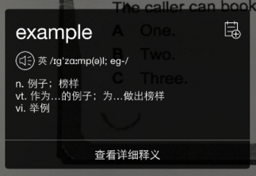
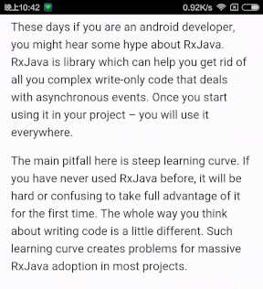
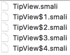
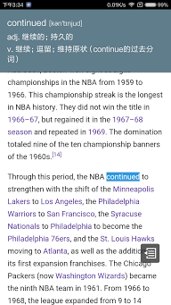

# Android逆向实践: 使用Smali注入改造YD词典悬浮窗

来源:[简书](http://www.jianshu.com/p/6e5082b9d2e2)

## 前言

最近有个开源APP[咕咚翻译](https://github.com/maoruibin/TranslateApp). 参考我之前在[Android无需权限显示悬浮窗, 兼谈逆向分析app](http://www.jianshu.com/p/167fd5f47d5c)中介绍的一个小的细节, 以悬浮窗的形式做了复制查词功能. 在我写那篇文章之后, 就一直想有这样一个能提供复制查词功能的APP, 无奈自己不知道怎么做一个词典APP, 也就一直没管(主要是懒). 自己平时一直用YD词典, 它也有复制查词功能, 但是YD悬浮窗的交互我觉得特别蛋疼, 每次安装还要把悬浮窗权限手动打开才能用.



几天前下载咕咚翻译试用, 发现了一个崩溃, 顺手改了一下发了pull request. 然后就在想怎么给咕咚翻译的悬浮窗加上交互, 至少能让我主动关闭悬浮窗, 参考了iOS上通知的交互方式, 也就是能往下拉一点点, 还能往上滑动关闭, 无奈好像遇到了Android的bug, 就用了一种奇怪的方式实现, 有一定副作用, 于是没有push到github, 就自己本地用了. 下面故意展示了副作用.



寝室每天都要断电, 断电了就没网, 咕咚翻译必须联网查词, 一到晚上断电就没法用. 而YD词典拥有离线复制查词功能, 悬浮窗有点蛋疼, 凑合凑合也能用.

## 需求
我的需求是: 咕咚翻译能提供离线查词的功能.

这事说起来简单, 实际上很复杂, 例如离线词典数据从哪来? 查词速度如何? 怎么管理离线词典数据? 如何实现功能? 没有找过开源项目, 一直用YD词典的复制查词功能, 于是我就盯上了YD词典.

不知道怎么实现离线查词, 必然需要研究YD词典的实现, 在手机上粗略看了一下YD词典在/data/data下的目录结构, 大概能确定YD词典的离线查词功能实现在native层, 这要我研究到狗年马月.

今天突然来了个奇思妙想, 既然YD词典过于庞大, 无法剥离离线查词功能, 何不将咕咚翻译的悬浮窗"赠与"YD词典, 来个移花接木. 之前从来没有做过这方面的尝试, 但是凭着自己以往的经验, 觉得难度不算大, 可以在几个小时之内搞定.

## 可行性
想把咕咚翻译的悬浮窗"赠与"YD词典, 我只想到了一种方案: Smali注入.

我是个懒人, 一个事情太麻烦我就不想做了, Smali注入这个方案看起来很吓人, 实际想想可行性非常高.

观察一下Smali文件的结构:

```
 # class信息

 # 注解信息

 # 实现的接口

 # static字段

 # 成员字段

 # 直接成员方法

 # 重写成员方法
```

Smali文件中对外部类的引用使用类似完全限定名的形式.

可以猜测: 如果一个类只依赖Android framework, 不依赖其他自定义类, 那么直接把这个类的Smali文件放到apktool反编译生成的目录中, 不会产生错误.

同时, 假设一个类依赖其他自定义类, 如果把整个依赖关系中涉及的所有非Framework的Smali文件都放入apktool生成的目录中, 同样不会产生错误.

基于以上猜测, 我们可以做到将一个APP中的类安全的添加到另一个APP中.

剩下的就是对被注入APP的Smali代码进行修改, 使得被注入APP调用注入的Smali代码, 且能将信息传递给注入的Smali代码.

## 观察实现

知道了思路, 就可以实际操作了. 操作前需要了解两个APP的逻辑, 这样才能选择合适的地方进行Smali注入, 减少工作量, 同时减少出错的可能.

### 咕咚翻译的实现
对咕咚翻译, 我们可以同时观察它的Java代码和Smali代码.

> 本文粘贴的咕咚翻译代码是我修改的版本, 与github上的源码有区别.

咕咚翻译中悬浮窗使用MVP的设计, 当View被创建时会使用Dagger 2创建Presenter, 同时进行双方的依赖注入.

View的实现类TipView关键代码如下所示:

```
public class TipView extends FrameLayout implements ITipView {

    @Inject
    protected ITipPresenter mPresenter;

    public TipView(Context context) {
        this(context,null);
    }

    public TipView(Context context, AttributeSet attrs) {
        this(context, attrs,0);
    }

    public TipView(Context context, AttributeSet attrs, int defStyleAttr) {
        ......
        DaggerTipComponent.builder().tipModule(new TipModule(this)).build().inject(this);
    }

}
```

Presenter的接口如下所示:

```
public interface ITipPresenter {
    void readyForShow();

    void tipShowFully();

    void tipHided();

    void favoriteClicked(Result result);

    void onUserTouch();

    void onTouchOver();
}
```

当TipView中的收藏按钮被点击时, `favoriteClicked`方法会被调用. `ITipPresenter`的实现类是`TipPresenterImpl`

我们需要将TipView的相关类全部注入到YD词典中, 根据前面的分析, 我们的依赖应当越少越好, 否则一旦类的关系没设计好, 一个类可能带起一堆类, 特别麻烦, 所以我把`Dagger 2`相关的依赖注入改成自己直接手写, 同时把收藏按钮去掉, 因为这会导致`TipPresenterImpl`中依赖咕咚翻译Model层, 这会带起一堆依赖, 为了简单直接去掉. 悬浮窗的代码中还使用RxJava相关的东西, 同样需要把悬浮窗中涉及RxJava的部分去掉.

这一步做完, 我们需要直接注入的类就已经变得很清爽了.

此外, 我们还需要知道如何调用TipView, 咕咚翻译里相关代码如下所示:

```
public void show(Result result) {
    TipView tipView = new TipView(mContext);
    tipView.setContent(result);
    tipView.setViewManager(mWindowManager);
    LayoutParams params = getPopViewParams();
    tipView.saveLayoutParams(params);
    mWindowManager.addView(tipView, params);
}
```

在这里我们知道如果要调用TipView, 我们需要创建它, 同时获取一个`LayoutParams`, 一个`Result`, 再通过`WindowManager`完成全部调用.

这是我们需要在YD词典中添加的smali代码的逻辑, 通过这段代码来调用我们注入的`TipView`.

再观察上面方法中出现的Result是什么:

```
public class Result {
    ......

    public Result(IResult mIResult) {
        ......
    }

    ......
}
```

这个类可以通过传入一个IResult完成构造, IResult是个接口, 这其实对我们很有利. 假如YD词典离线查词的结果实现了IResult, 我们就能直接构造一个Result传给TipView了. 因此我们的目的之一就是将YD词典离线查词的结果改造成实现IResult接口. 为此, 我们可以精简IResult, 只保留我们需要的方法, 精简结果如下:

```
public interface IResult {
    List<String> wrapExplains();

    String wrapQuery();

    int wrapErrorCode();

    String wrapPhAm();
}
```

由于我希望精简之后, 咕咚翻译还能正常编译运行, 所以保留了一个多余的`wrapErrorCode`方法, 这个方法在Smali注入中没用.

总结一下, 在Smali层面上, 我们需要将TipView的所有代码注入YD词典中, 需要在YD词典中合适的地方编写调用TipView的逻辑, 需要让YD词典离线查词结果实现IResult接口.

### YD词典的实现
对YD词典, 我们可以观察的Smali代码, 也可以观察比较接近YD词典源码的Java代码.

关于复制查词的实现, 一个常识是开发者需要在Service中监听剪贴板信息变化, 在手机里观察YD词典的信息, 可以大概猜是哪个Service在监听剪贴板.


根据名字, 可以猜到在ClipboardWatcher中, 建议先用jadx或者dex2jar观察, 毕竟直接看Smali还是太不直观了, 不到必要的时候不用看Smali.

首先看到了如下代码:

```
private class ClipboardListener implements OnPrimaryClipChangedListener {
    ......
    public void onPrimaryClipChanged() {
        ......
        if (ClipboardWatcher.isValidText(clipboardText)) {
            ......
            ClipboardWatcher.this.queryWordViaService(clipboardText);
        }
    }
}
```
    
比较惊喜的是代码竟然没有混淆, 这下可以节省不少时间, 不用去猜变量的意思了. 接着看`ClipboardWatcher.queryWordViaService`:

```
private void queryWordViaService(String word) {
    if (...) {
        QuickQueryService.show(this, word, 0, 
                Util.dip2px(this, BitmapDescriptorFactory.HUE_ORANGE),
                QuickQueryType.COPY_REQ_POPUP);
    }
}
```
非常简单, 还是方法调用, 我们接着看QuickQueryService.show:

```
public static void show(Context context, String word, 
                        int screenX, int screenY, QuickQueryType quickQueryType) {
    show(context, word, screenX, screenY, true, true, quickQueryType);
}

private static void show(Context context, String word, int screenX, int screenY, 
                         boolean showCloseButton, boolean belowWord,
                         QuickQueryType quickQueryType) {
    Intent intent = new Intent(context, QuickQueryService.class);
    ......
    intent.putExtra(WORD, word);
    ......
    context.startService(intent);
}
```

整个过程很清晰, `ClipboardWatcher`负责监听剪贴板, 当剪贴板内容变化后, 获取其内容, 交给`QuickQueryService`处理. 直接去看`QuickQueryService.onStartCommand`, 十有八九是在这里进行下一步逻辑:

```
public int onStartCommand(Intent intent, int flags, int startId) {
    ......
    try {
        if (...) {
            ......
            String word = intent.getStringExtra(WORD);
            ......
            this.handler.obtainMessage(0, Util.deleteRedundantSpace(word)).sendToTarget();
        } else if (...) {
            ......
        }
    } catch (Exception e) {
        e.printStackTrace();
    }
    return 2;
}
```

这里不用管其他的逻辑, 只看关键代码, `QuickQueryService从intent`中获取需要查询的单词, 交给handler处理, 再看`handler.handleMessage`的逻辑:

```
public void handleMessage(Message msg) {
    try {
        QuickQueryService.this.mainHandler.obtainMessage(0, 
                QueryServerManager.getLocalQueryServer().queryWord(msg.obj)).sendToTarget();
    } catch (Exception e) {
        e.printStackTrace();
    }
}
```

显然, handler应该是一个非主线程的handler, 在这里进行了本地查词相关的工作, 最后把结果交给mainHandler处理, `mainHandler.handleMessage`逻辑如下:

```
public void handleMessage(Message msg) {
    try {
        QuickQueryService.this.view.setContent(msg.obj);
    } catch (Exception e) {
        e.printStackTrace();
    }
}
```

可以猜到view就是YD词典的悬浮窗类, 服务只需要调用它的setContent方法, 剩下的由view自行处理, 这里是复制查词功能整个调用的终点. 如果我们要进行Smali注入, 这个方法是非常不错的注入点. 最后一个问题: 上面的msg.obj是什么?

我们知道这个对象是通过调用`QueryServerManager.getLocalQueryServer().queryWord`得到的, 查看这个类的代码可以很容易知道msg.obj的类型是`YDLocalDictEntity`, 根据之前的讨论, 我们需要让它实现IResult, 因此我们还要对这个类进行Smali注入.

总结一下, 我们需要对`mainHandler.handleMessage`注入代码, 让它调用我们的TipView, 需要对`YDLocalDictEntity`注入代码, 让它实现IResult接口. 此外, 由于调用TipView还需要WindowManager支持, 因此我们可能还需要对QuickQueryService进行注入.

### 实施注入
先用apktool反编译YD词典APK. 下面开始进行Smali注入.

### 直接复制Smali
对于完整的类, 我们不需要手写Smali代码, 直接编译一个咕咚翻译APK, 再用apktool反编译, 到对应的路径下把相应的smali文件复制到YD词典目录下.

注意复制smali文件的时候务必要复制全部, 一个java文件可能生成不止一个smali文件, 例如下面是TipView对应的全部smali文件.



所有引用到的类的smali都要复制进去, 且按照原APK的包名设置目录并对应放置.

这一步很简单, 仅仅是复制一下就完成了.

### 修改Smali

完成了复制, 还需要添加调用代码, 注入代码必须要看smali了.

首先对`mainHandler.handleMessage`进行注入.

这里有同学可能会去`QuickQueryService.smali`里面找代码, 实际上这部分代码不在这个文件里, 而是在`QuickQueryService$2.smali`中, 这主要是因为mainHandler是一个内部类实例, 内部类实例都是在`class$n.smali`这种命名的文件里. 要知道具体是哪个文件, 可以看jadx中的初始化代码, 代码上都会有注释写清楚真正的代码在哪个文件里, 也可以在`QuickQueryService.smali`中直接找到答案, 例如`QuickQueryService.onCreate`方法中有如下一段:

```
.method public onCreate()V
    ......
    new-instance v1, Lcom/youdao/dict/services/QuickQueryService$2;

    invoke-direct {v1, p0}, Lcom/youdao/dict/services/QuickQueryService$2;-><init>(Lcom/youdao/dict/services/QuickQueryService;)V

    iput-object v1, p0, Lcom/youdao/dict/services/QuickQueryService;->mainHandler:Landroid/os/Handler;

    ......
    return-void
.end method
```

这就是典型的初始化操作, 创建一个实例`QuickQueryService$2`, 由v1指向它. 随后调用v1的<init>方法, 传入参数p0, 这个方法完成后对象就构造完毕了, p0就是java中的this, 之所以内部类能访问外部类的成员, 一部分原因是因为内部类隐式持有了外部类的引用, 这个引用就是在这里被传入的. 最后v1的值存入了p0的成员mainHandler中. 换句话说, 这三句就是初始化mainHandler用的, 可知`mainHandler`的代码在`QuickQueryService$2.smali`中. 直接到`QuickQueryService$2.smali`中找`handleMessage`方法, 代码如下(可以略过这段smali代码):

```
# virtual methods
.method public handleMessage(Landroid/os/Message;)V
    .locals 3
    .param p1, "msg"    # Landroid/os/Message;

    .prologue
    .line 85
    :try_start_0
    iget-object v1, p1, Landroid/os/Message;->obj:Ljava/lang/Object;

    check-cast v1, Lcom/youdao/dict/model/YDLocalDictEntity;

    .line 86
    .local v1, "entity":Lcom/youdao/dict/model/YDLocalDictEntity;
    iget-object v2, p0, Lcom/youdao/dict/services/QuickQueryService$2;->this$0:Lcom/youdao/dict/services/QuickQueryService;

    # getter for: Lcom/youdao/dict/services/QuickQueryService;->view:Lcom/youdao/dict/widget/QuickQueryView;
    invoke-static {v2}, Lcom/youdao/dict/services/QuickQueryService;->access$100(Lcom/youdao/dict/services/QuickQueryService;)Lcom/youdao/dict/widget/QuickQueryView;

    move-result-object v2

    invoke-virtual {v2, v1}, Lcom/youdao/dict/widget/QuickQueryView;->setContent(Lcom/youdao/dict/model/YDLocalDictEntity;)V
    :try_end_0
    .catch Ljava/lang/Exception; {:try_start_0 .. :try_end_0} :catch_0

    .line 90
    .end local v1    # "entity":Lcom/youdao/dict/model/YDLocalDictEntity;
    :goto_0
    return-void

    .line 87
    :catch_0
    move-exception v0

    .line 88
    .local v0, "e":Ljava/lang/Exception;
    invoke-virtual {v0}, Ljava/lang/Exception;->printStackTrace()V

    goto :goto_0
.end method
```

别看这段代码这么长, 实际上就是下面这段Java代码:

```
public void handleMessage(Message msg) {
	try {
		QuickQueryService.this.view.setContent(msg.obj);
	} catch (Exception e) {
		e.printStackTrace();
	}
}
```

因为内部类访问外部类实例的本质, 是通过编译器给咱们加的各种合成方法(Synthetic Method)实现的, 所以转换成smali之后特别冗长.

我们要做的就是把这段smali代码改成类似下面的Java代码的效果

```
public void handleMessage(Message msg) {
    TipView tipView = new TipView(mContext);
    Result result = new Result((YDLocalDictEntity) msg.obj);
    tipView.setContent(result);
    tipView.setViewManager(QuickQueryService.this.mWindowManager);
    LayoutParams params = QuickQueryService.getPopViewParams();
    tipView.saveLayoutParams(params);
    QuickQueryService.this.mWindowManager.addView(tipView, params);
}
```

但是这段代码的能跑的前提是YDLocalDictEntity实现了IResult, 以及QuickQueryService有一个成员变量mWindowManager和一个静态方法getPopViewParams.

### YDLocalDictEntity注入
打开YDLocalDictEntity.smali, 和写Java一样, 一个类要实现一个接口, 需要写implements interface_name, 同时实现方法, smali也类似, 修改后smali如下所示, 添加的代码我重点标出来了:

```
.class public Lcom/youdao/dict/model/YDLocalDictEntity;
.super Ljava/lang/Object;
.source "YDLocalDictEntity.java"

 # interfaces
.implements Ljava/io/Serializable;
 #========在这里添加要实现的接口==================
.implements Lname/gudong/translate/mvp/model/entity/IResult;
 #=============================================


......

 #======下面是IResult四个方法的实现=============

.method public wrapQuery()Ljava/lang/String;
    .locals 1

    .prologue
    iget-object v0, p0, Lcom/youdao/dict/model/YDLocalDictEntity;->word:Ljava/lang/String;

    return-object v0
.end method

.method public wrapExplains()Ljava/util/List;
    .locals 1
    .annotation system Ldalvik/annotation/Signature;
        value = {
            "()",
            "Ljava/util/List",
            "<",
            "Ljava/lang/String;",
            ">;"
        }
    .end annotation

    .prologue
    iget-object v0, p0, Lcom/youdao/dict/model/YDLocalDictEntity;->translations:Ljava/util/ArrayList;

    return-object v0
.end method

.method public wrapErrorCode()I
    .locals 1

    .prologue
    const v0, 0x0

    return v0
.end method

.method public wrapPhAm()Ljava/lang/String;
    .locals 1

    .prologue
    iget-object v0, p0, Lcom/youdao/dict/model/YDLocalDictEntity;->phoneticUS:Ljava/lang/String;

    return-object v0
.end method
 #=============================================
```

`iget-object v0, p0, field`可以理解为`v0 = p0.field`.

这里`wrapQuery, wrapExplains`和`wrapPhAm`三个方法都只是取当前对象中的一个成员返回, `wrapErrorCode`纯粹是为了兼容才写入接口的, 直接返回0. 这些代码可以从类似的Java代码对应的smali中修改得到, 也可以直接写, 毕竟这些代码很简单.

### QuickQueryService注入
我们需要给`QuickQueryService`添加一个`WindowManager`成员和一个静态方法, 为了方便代码书写, 全部使用public修饰.

`QuickQueryService.smali`修改后如下:

```
......
.field private view:Lcom/youdao/dict/widget/QuickQueryView;

 #============添加一个成员 mWindowManager==============
.field public mWindowManager:Landroid/view/WindowManager;
 #==================================================

......

.method public onCreate()V
    .locals 3
    ......
 #=======初始化 mWindowManager==================
    const-string/jumbo v0, "window"

    invoke-virtual {p0, v0}, Landroid/content/Context;->getSystemService(Ljava/lang/String;)Ljava/lang/Object;

    move-result-object v0

    check-cast v0, Landroid/view/WindowManager;

    iput-object v0, p0, Lcom/youdao/dict/services/QuickQueryService;->mWindowManager:Landroid/view/WindowManager;
 #=======================================

    .line 108
    return-void
.end method

......

 #====添加静态方法 getPopViewParams==========
.method public static getPopViewParams()Landroid/view/WindowManager$LayoutParams;
    .locals 8

    ...(建议用Java写了反编译复制过来)...
.end method
 #=====================
```

添加成员可以说是依葫芦画瓢, 初始化也很容易写, 注意把初始化的代码放到onCreate方法的最下面, 因为这个方法无返回值, 因此在方法末尾可以随意使用寄存器, 不需要操心破坏寄存器里的原始值. 静态方法的声明很容易, 但是这个方法代码量大, 建议用Java写了反编译了复制, 这里就不贴了, 实在太长了, 光看到.locals 8就够吓人了.

### mainHandler注入
我们只需要注入mainHandler.handleMessage, 但是因为代码较多, 需要仔细写, 这里我们没有动外层的try-catch, 直接在内层做修改, 注释标明了这块区域:

```
# virtual methods
.method public handleMessage(Landroid/os/Message;)V
    .locals 3
    .param p1, "msg"    # Landroid/os/Message;

    .prologue
    .line 85
    :try_start_0
    iget-object v1, p1, Landroid/os/Message;->obj:Ljava/lang/Object;

    check-cast v1, Lcom/youdao/dict/model/YDLocalDictEntity;

    .line 86
    .local v1, "entity":Lcom/youdao/dict/model/YDLocalDictEntity;
    iget-object v2, p0, Lcom/youdao/dict/services/QuickQueryService$2;->this$0:Lcom/youdao/dict/services/QuickQueryService;

    #前面的代码使得v1是YDLocalDictEntity, v2是QuickQueryService
    #=======下面是注入代码=============
    #v0指向一个Result, 使用v1做参数初始化, v1是YDLocalDictEntity
    new-instance v0, Lname/gudong/translate/mvp/model/entity/Result;

    invoke-direct {v0, v1}, Lname/gudong/translate/mvp/model/entity/Result;-><init>(Lname/gudong/translate/mvp/model/entity/IResult;)V
    #将v1改为指向一个TipView, 使用v2做采纳数初始化, v2是QuickQueryService
    new-instance v1, Lname/gudong/translate/listener/view/TipView;

    invoke-direct {v1, v2}, Lname/gudong/translate/listener/view/TipView;-><init>(Landroid/content/Context;)V
    #下面这句等于v1.setContent(v0)
    invoke-virtual {v1, v0}, Lname/gudong/translate/listener/view/TipView;->setContent(Lname/gudong/translate/mvp/model/entity/Result;)V
    #下面这句将v0指向QuickQueryService.this.mWindowManager
    iget-object v0, v2, Lcom/youdao/dict/services/QuickQueryService;->mWindowManager:Landroid/view/WindowManager;
    #等于v1.setViewManager(v0)
    invoke-virtual {v1, v0}, Lname/gudong/translate/listener/view/TipView;->setViewManager(Landroid/view/ViewManager;)V

    invoke-static {}, Lcom/youdao/dict/services/QuickQueryService;->getPopViewParams()Landroid/view/WindowManager$LayoutParams;
    #下面这句将上面方法得到的结果存到v0, 也就是说v0此时是LayoutParams
    move-result-object v0
    #v1.saveLayoutParams(v0)
    invoke-virtual {v1, v0}, Lname/gudong/translate/listener/view/TipView;->saveLayoutParams(Landroid/view/WindowManager$LayoutParams;)V
    # v2是QuickQueryService, 下面这句等于v2 = v2.mWindowManager, 此时v2是mWindowManager
    iget-object v2, v2, Lcom/youdao/dict/services/QuickQueryService;->mWindowManager:Landroid/view/WindowManager;
    #等于v2.addView(v1, v0)
    invoke-interface {v2, v1, v0}, Landroid/view/WindowManager;->addView(Landroid/view/View;Landroid/view/ViewGroup$LayoutParams;)V

    #======上面是注入代码========

    :try_end_0
    .catch Ljava/lang/Exception; {:try_start_0 .. :try_end_0} :catch_0

    .line 90
    .end local v1    # "entity":Lcom/youdao/dict/model/YDLocalDictEntity;
    :goto_0
    return-void

    .line 87
    :catch_0
    move-exception v0

    .line 88
    .local v0, "e":Ljava/lang/Exception;
    invoke-virtual {v0}, Ljava/lang/Exception;->printStackTrace()V

    goto :goto_0
.end method
```

如果不明白注入的代码, 可以看我写的注释, 总体上来看还是很简单的. 当然, 我手写的代码的效率没有生成的高.

### 添加资源
由于TipView中会使用layout, 所以还需要把layout下的文件放到YD词典目录的对应位置. 而且需要自己在res/values/ids.xml和res/values/public.xml中添加一些内容. 如果layout中引用了drawable, 还需要把对应的drawable放到YD词典目录的对应位置. 引用了color, dimen等的, 都需要添加对应的定义.

apktool在打包的时候会用aapt来帮助生成id, 但是实际上smali文件中已经没有对R文件的引用了, 全是常量, 所以对于代码中直接使用的R.id.name, 需要我们自己到ids.xml中添加id, 然后到public.xml中指定好唯一的值, 再把smali中的常量替换成我们定义的, 对于layout, 只需要到public.xml中指定好值, 把smali中R.layout.name换成我们指定的值就行. 其他的如color, dimen的, aapt会自动帮我们生成id. 但如果直接在代码中使用了, 还是要和layout一样, 自己去定义.

例如我在ids.xml中添加了如下内容:

```
<item type="id" name="pop_view_content_all">false</item>
<item type="id" name="pop_view_content_without_shadow">false</item>
<item type="id" name="ll_pop_src">false</item>
<item type="id" name="tv_pop_src">false</item>
<item type="id" name="tv_pop_phonetic">false</item>
<item type="id" name="ll_pop_dst">false</item>
<item type="id" name="tv_point">false</item>
```

在public.xml中添加了如下内容:

```
<public type="layout" name="pop_view" id="0x7f0301a7" />
<public type="id" name="pop_view_content_all" id="0x7f0d0629" />
<public type="id" name="pop_view_content_without_shadow" id="0x7f0d062a" />
<public type="id" name="ll_pop_src" id="0x7f0d062b" />
<public type="id" name="tv_pop_src" id="0x7f0d062c" />
<public type="id" name="tv_pop_phonetic" id="0x7f0d062d" />
<public type="id" name="ll_pop_dst" id="0x7f0d062e" />
<public type="id" name="tv_point" id="0x7f0d062f" />
```

### 签名与安装
最后使用apktool打包, 使用jarsigner签名, 就可以安装到手机上了, YD词典的功能均可用, 同时悬浮窗被替换成了咕咚翻译的悬浮窗.



## 尾声
这个YD词典给我的印象一直是卡卡的, 用着还行, 这次逆向顺便把它的硬件加速开了, 流畅很多, 也不知道这个APP还有没有人维护, 怎么连硬件加速都不愿意开. 用Smali注入给它换个悬浮窗本来只是一个想法, 感觉这个想法挺有意思的, 就试了一下, 花了8小时才做出来, 现在手机复制查词爽多了.
