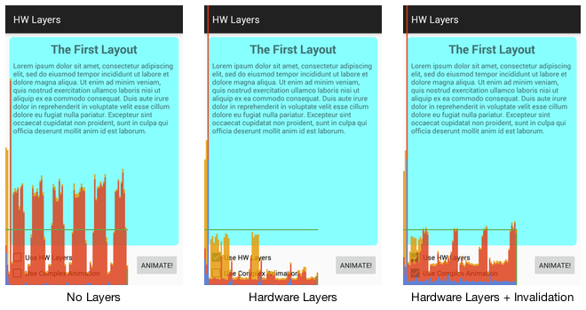

# 通过Hardware Layer提升Android动画性能

来源:[通过Hardware Layer提升Android动画性能](http://www.jcodecraeer.com/a/anzhuokaifa/androidkaifa/2015/1027/3631.html)

> 原文链接： [Using hardware layers to improve Android animation performance](http://blog.danlew.net/2015/10/20/using-hardware-layers-to-improve-animation-performance/)<br/>
> 原文作者： [Daniel Lew](http://blog.danlew.net/)<br/>
> 译文出自： [小鄧子的简书](http://www.jianshu.com/users/df40282480b4/latest_articles)<br/>
> 译者： 小鄧子<br/>

当有人问我关于动画性能表现不佳问题的时候，我首先会询问他们是否使用了**Hardware Layer**层。

你的View可能在执行动画期间的每一帧都进行重绘，如果使用**View Layer**，可以避免重绘每一帧，因为View的渲染一旦进入离屏缓冲区就能够被复用。

另外，**Hardware Layer**缓存在GPU上（*译者注： Hardware Layer使用GPU内存*），它能够使动画中的某些操作变得更顺畅。通过使用这个View Layer能够迅速渲染简单的变换（如，移动，旋转，缩放，透明度）。因为许多动画都是多种变换的组合，所以使用**View Layer**能够显著提高动画性能。

## 用法
Layer的API十分简单：只需使用[View.setLayerType()](http://developer.android.com/reference/android/view/View.html#setLayerType(int,%20android.graphics.Paint)) 。你应该只是暂时设置**Hardware Layer**，因为它们无法自动释放（稍后介绍）。基本使用步骤如下：

1. 动画运行期间，在每个想要缓存的View上调用`View.setLayerType(View.LAYER_TYPE_HARDWARE, null)`。
2. 运行动画。
3. 动画结束时，调用`View.setLayerType(View.LAYER_TYPE_NONE, null)`进行清理操作。

```
// Set the layer type to hardware 
myView.setLayerType(View.LAYER_TYPE_HARDWARE, null);
 
// Setup the animation
ObjectAnimator animator = ObjectAnimator.ofFloat(
						myView, View.TRANSLATION_X, 150);
 
// Add a listener that does cleanup 
animator.addListener(new AnimatorListenerAdapter() {  
  @Override
  public void onAnimationEnd(Animator animation) {
    myView.setLayerType(View.LAYER_TYPE_NONE, null);
  }
});
 
// Start the animation
animator.start();
```

如果你基于**minSdkVersion 16+**，并且使用[ViewPropertyAnimator](http://developer.android.com/reference/android/view/ViewPropertyAnimator.html) ，那么可以通过[withLayer()](http://developer.android.com/reference/android/view/ViewPropertyAnimator.html#withLayer()) 方法代替上面操作。

```
myView.animate()  
	.translationX(150)
	.withLayer()
	.start();
```

这样做，你的动画就能变得顺畅平滑。

## 注意事项

**。。。。你可能已经想到了，事情并不会这么简单。**

**Hardware Layer**在提升动画性能的能力上表现的十分神奇，如果滥用，将是弊大于利的。**切记，不要盲目使用View Layer。**

第一，在某些情况下，实际上Hardware Layer可能要做非常多的工作，而不仅仅是渲染视图。缓存一个层需要花费时间，因为这一步要划分为两个过程：首先，视图渲染入GPU上的一个层中，然后，GPU再渲染那个层到窗口，如果View的渲染十分简单（比如一个纯色），那么在初始化的时候可能增加Hardware Layer不必要的开销。

第二，对所有缓存来讲，存在一个缓存失效的可能性。动画运行时，如果某个地方调用了View.invalidate( )，那么Layer就不得不重新渲染一遍。倘若不断地失效，你的Hardware Layer实际上要比不添加任何Layer性能更差，因为（如上所述）Hardware Layer在设置缓存的时候增加了开销。如果你不断的重缓存Layer，会对性能造成极大地负担。

这种问题很容易遇到，因为动画通常有多个移动部件。假设你设置了一个拥有三个移动部件的动画。

```
Parent ViewGroup  
--> Child View 1 (translates left)  
--> Child View 2 (translates right)  
--> Child View 3 (translates up)
```

如果你仅在父布局ViewGroup上设置一个Layer，实际上会不断地缓存失效，因为（作为一个整体）ViewGroup会随着子View不断地改变。然而，每个单独的View，仅仅是移动罢了。这种情况下，最好的办法就是在每一个子View上设置Hardware Layer（而不是在父布局上）。

再次重申，起初因为我不懂这个：经常在多个View上适当的设置Hardware Layer，以为这样他们就不会在动画运行时失效了。

["显示硬件层更新"](http://www.curious-creature.com/2013/09/13/optimizing-hardware-layers/)（Show hardware layers updates） 是追踪这个问题的开发利器。当View渲染Hardware Layer的时候闪烁绿色，它应该在动画开始的时候闪烁一次（也就是Layer渲染初始化的时候），然而，如果你的View在整个动画期间保持绿色不变，这就是持续的缓存失效问题了。

第三，Hardware Layer使用GPU内存，很明显你不想看到内存泄露。因此，你应该只在必要的时候使用Hardware Layer，比如，动画运行期间。

所有这一切表明：这里没有硬性规则。Android渲染系统是复杂的，并且常常令我感到惊讶。如同所有性能问题一样，测试才是关键。“GPU呈现模式分析”和“显示硬件层更新”等开发者选项非常适合确定图层正在帮助还是正在损害你的性能。


## 举例
我写了一个简单的app，示范Hardware Layer的基本用法。 [从这里获取代码](https://github.com/dlew/android-hw-layers-sample).

这是运行在我的Galaxy Nexus（一款又老又慢的设备），通过开启开发者选项中的“GPU呈现模式分析”：



在不使用Hardware Layer的情况下，这个简单的动画烂透了。它不断地越过绿线，这就意味着它看起来很糟糕。相比之下，使用Hardware Layer的版本一直保持在绿线之下，这非常棒！

第三个例子展示了，在使用Hardware Layer的情况下，动画运行时存在缓存失效的风险。由于错误的Hardware Layer用法，许多性能收益被干掉了。

（这里有一些奇怪，如果它正处在invalidating，应该至少与不使用Hardware Layer一样迟钝。我不能理解透彻，但是，很显然，即使它们在每一步都必须进行重绘，优化的Hardware Layer还是发挥了一些提升性能的作用。所以，最好正确的使用它们。）

这篇文章的寓意是：Hardware Layer可以让动画变得很棒，但是前提是把握好它们的使用契机。

