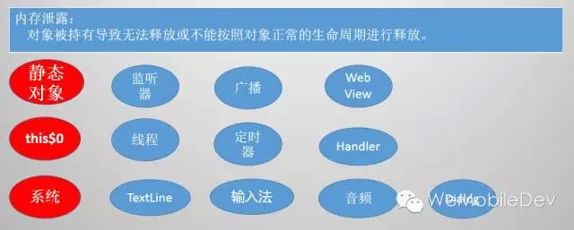
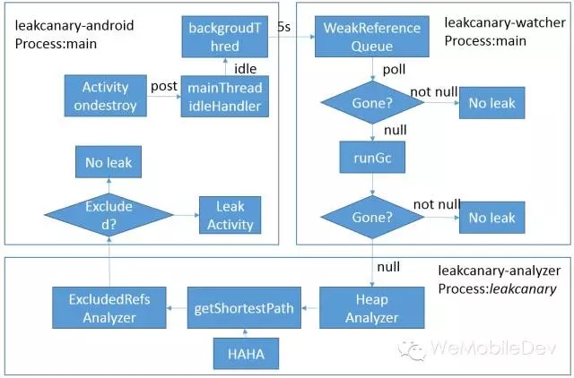
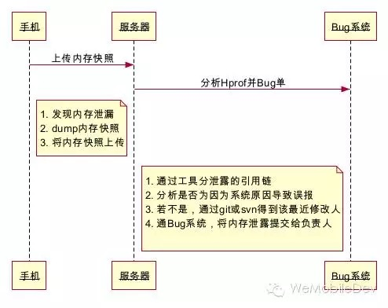
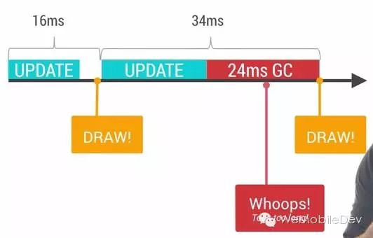
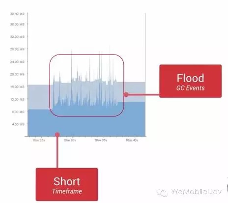
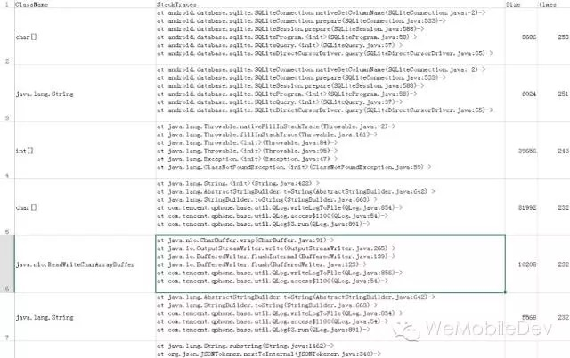

# Android内存优化杂谈

来源:[微信公众号:shwenzhang WeMobileDev](http://mp.weixin.qq.com/s?__biz=MzAwNDY1ODY2OQ==&mid=400656149&idx=1&sn=122b4f4965fafebf78ec0b4fce2ef62a&mpshare=1&scene=23&srcid=1104a8iWmvj68rw7HDsOPqRQ#rd)

Android内存优化是我们性能优化工作中比较重要的一环，这里其实主要包括两方面的工作：

* 优化RAM，即降低运行时内存。这里的目的是防止程序发生OOM异常，以及降低程序由于内存过大被LMK机制杀死的概率。另一方面，不合理的内存使用会使GC大大增多，从而导致程序变卡。
* 优化ROM，即降低程序占ROM的体积。这里主要是为了降低程序占用的空间，防止由于ROM空间不足导致程序无法安装。

本文的着重点为第一点，总结概述降低应用运行内存的技巧。在这里我们不再细述PSS、USS等概念与Android应用的内存管理，如对这部分内容感兴趣，可自行阅读文末的参考文章。

## 内存泄露的检测与修改

内存泄露：简单来说对象由于编码错误或系统原因，仍然存在着对其直接或间接的引用，导致系统无法进行回收。内存泄露，容易留下逻辑隐患,同时增加了应用内存峰值与发生OOM的概率。它属于bug issue,是我们一定要修改的。

下面是造成内存泄露的一些常见原因，但是如何建立一套发现内存泄露、解决内存泄露的闭环方案，才是我们工作的重点。



### 一. 内存泄露的监控方案

Square的开源库leakcanry是一个非常不错的选择,它通过弱引用方式侦查Activity或对象的生命周期，若发现内存泄露自动dump Hprof文件，通过HAHA库得到泄露的最短路径，最后通过notification展示。

内存泄露判断与处理的流程如下图 ，各自运行的进程空间(主进程通过idlehandler，HAHA分析使用的是单独的进程)：



微信在leakcanry推出之前已经有了自己的内存泄露监控体系，与leakcanry大致有以下的区别：

* 在微信中，对于4.0以上的机型也是采用通过注册ActivityLifecycleCallbacks接口，对于4.0以下的机型我们会尝试反射ActivityThread中的mInstrumentation对象。当然，现在微信也改成只支持android-15以上，美美哒。
* leakcanry尽管使用了idlehandler与分进程，但是dumphprof依然会造成应用明显的卡顿(SuspendAll Thread)。而在三星等一些手机，系统会缓存最后一个Activity，所以在微信，我们采取了更严格的检测模式，即泄露三次确认以及经过5个新建的Activity，确保不是由于系统缓存的原因造成。
* 在微信中，当发现疑似内存泄露时会弹出对话框，当我们主动点击时才会去做dumpHprof以及上传Hprof快照的操作，而是否误报、泄露链等分析工作也是放于服务器端。

事实上，通过对leakcanry做简单的定制，我们就可以实现以下一个内存泄露监控闭环。 



### 二. 对系统内存泄露的Hack Fix

AndroidExcludedRefs列出了一些由于系统原因导致引用无法释放的例子，同时对于大多数的例子，都会提供建议如何通过hack的建议去修复。在微信中，对TextLine、InputMethodManager、AudioManger、android.os.Message也采用了类似Hack的方式(详细可看参考资料)。

### 三. 通过兜底回收内存

Activity泄漏会导致该Activity引用到的Bitmap、DrawingCache等无法释放，对内存造成大的压力，兜底回收是指对于已泄漏Activity，尝试回收其持有的资源，泄漏的仅仅是一个Activity空壳，从而降低对内存的压力。

做法也非常简单，在Activity onDestory时候从view的rootview开始，递归释放所有子view涉及的图片，背景，DrawingCache，监听器等等资源，让Activity成为一个不占资源的空壳，泄露了也不会导致图片资源被持有。        

```
   …
   …
   Drawable d = iv.getDrawable();
   if (d != null) {
       d.setCallback(null);
   }        
   iv.setImageDrawable(null);
   ...
   ...
```

总的来说，我们不是只懂得一些内存泄露解决方法就可以，更重要的是通过日常测试与监控，得到内存泄露检测与修改的一整套闭环体系。

## 降低运行时内存的一些方法
当我们能确保应用中不会出现内存泄露时，我们需要一些其他的方法来降低运行时的内存。更多的时候，我们其实只希望降低应用发生OOM的概率。

Android OOM：

* Android 2.x系统，当dalvik allocated + external allocated + 新分配的大小 >= dalvik heap 最大值时候就会发生OOM。其中bitmap是放于external中 。

* Android 4.x系统，废除了external的计数器，类似bitmap的分配改到dalvik的java heap中申请，只要allocated + 新分配的内存 >= dalvik heap 最大值的时候就会发生OOM（art运行环境的统计规则还是和dalvik保持一致）

### 一. 减少bitmap占用的内存

说到内存，bitmap必然是这里的大头。对于bitmap内存占用，想说的有以下几点:

1. 防止bitmap占用资源多大导致OOM
   
   Android 2.x 系统 BitmapFactory.Options 里面隐藏的的inNativeAlloc反射打开后，申请的bitmap就不会算在external中。对于Android 4.x系统，可采用facebook的fresco库，即可把图片资源放于native中。

2. 图片按需加载
   
   即图片的大小不应该超过view的大小。在把图片载入内存之前，我们需要先计算出一个合适的inSampleSize缩放比例，避免不必要的大图载入。对此，我们可以重载drawable与ImageView，例如在Activity ondestroy时，检测图片大小与View的大小，若超过，可以上报或提示。

3. 统一的bitmap加载器
   
   Picasso、Fresco都是比较出名的加载库，同样微信也有自己的库ImageLoader。加载库的好处在于将版本差异、大小处理对使用者不感知。有了统一的bitmap加载器，我们可以在加载bitmap时，若发生OOM(try catch方式)，可以通过清除cache，降低bitmap format(ARGB8888/RBG565/ARGB4444/ALPHA8)等方式，重新尝试。

4. 图片存在像素浪费

   对于.9图，美工可能在出图时在拉伸与非拉伸区域都有大量的像素重复。通过获取图片的像素ARGB值，计算连续相同的像素区域，自定义算法判定这些区域是否可以缩放。关键也是需要将这些工作做到系统化，可及时发现问题，解决问题。

一个好的imageLoader，可以将2.X、4.X或5.X对图片加载的处理对使用者隐藏，同时也可以将自适应大小、质量等放于框架中。

### 二. 自身内存占用监控

对于系统函数onLowMemory等函数是针对整个系统而已的，对于本进程来说，其dalvik内存距离OOM的差值并没有体现，也没有回调函数供我们及时释放内存。假若能有那么一套机制，可以实时监控进程的堆内存使用率，达到设定值即关于通知相关模块进行内存释放，这会大大的降低OOM。

* 实现原理

这个其实比较简单，通过Runtime获得maxMemory,而totalMemory-freeMemory即为当前真正使用的dalvik内存。  

```
Runtime.getRuntime().maxMemory();  
Runtime.getRuntime().totalMemory() - Runtime.getRuntime().freeMemory()；
```

* 操作方式

我们可以定期(前台每隔3分钟)去得到这个值，当我们这个值达到危险值时(例如80%)，我们应当主要去释放我们的各种cache资源(bitmap的cache为大头)，同时显示的去Trim应用的memory,加速内存收集。

```
WindowManagerGlobal.getInstance().startTrimMemory(TRIM_MEMORY_COMPLETE);
```
### 三. 使用多进程

对于webview，图库等，由于存在内存系统泄露或者占用内存过多的问题，我们可以采用单独的进程。微信当前也会把它们放在单独的tools进程中

### 四. 上报OOM详细信息

当系统发生OOM的crash时，我们应当上传更加详细的内存相关信息，方便我们定位当时内存的具体情况。

其他例如使用large heap、inBitmap、SparseArray、Protobuf等不再一一细述，对代码采用`优化--埋坑--优化--埋坑`的方式并不推荐。我们应该着力于建立一套合理的框架与监控体系，能及时的发现诸如bitmap过大、像素浪费、内存占用过大、应用OOM等问题。

## GC优化

Java拥有GC的机制，不同的系统版本GC的实现可能有比较大的差异。但是无论哪种版本，大量的GC操作则会显著占用帧间隔时间(16ms)。如果在帧间隔时间里面做了过多的GC操作，那么自然其他类似计算，渲染等操作的可用时间就变得少了。 



### 一. GC的类型

GC的类型有以下几种，其中GC_FOR_ALLOC是同步方式进行，对应用帧率的影响最大。

* **GC_FOR_ALLOC**

当堆内存不够的时候容易被触发，尤其是new一个对象的时候，很容易被触发到，所以如果要加速启动，可以提高dalvik.vm.heapstartsize的值，这样在启动过程中可以减少GC_FOR_ALLOC的次数。注意这个触发是以同步的方式进行的。如果GC后仍然没有空间，则堆进行扩张

* **GC_EXPLICIT**

这个gc是被可以调用的，比如system.gc, 一般gc线程的优先级比较低，所以这个垃圾回收的过程不一定会马上触发， 千万不要认为调用了system.gc，内存的情况就能有所好转

* **GC_CONCURRENT**

当分配的对象大小超过384K时触发，注意这是以异步的方式进行回收的.如果发现大量反复的Concurrent GC出现，说明系统中可能一直有大于384K的对象被分配，而这些往往是一些临时对象，被反复触发了。给到我们的暗示是：对象的复用不够。

* **GC_EXTERNAL_ALLOC** （在3.0系统之后被废了）

Native层的内存分配失败了，这类GC就会被触发。如果GPU的纹理、bitmap、或者java.nio.ByteBuffers的使用没有释放，这种类型的GC往往会被频繁触发。

### 二. 内存抖动现象

Memory Churn内存抖动，内存抖动是因为在短时间内大量的对象被创建又马上被释放。瞬间产生大量的对象会严重占用内存区域，当达到阀值，剩余空间不够的时候，会触发GC从而导致刚产生的对象又很快被回收。即使每次分配的对象占用了很少的内存，但是他们叠加在一起会增加Heap的压力，从而触发更多其他类型的GC。这个操作有可能会影响到帧率，并使得用户感知到性能问题。



通过Memory Monitor，我们可以跟踪整个app的内存变化情况。若短时间发生了多次内存的涨跌，这意味着很有可能发生了内存抖动。

### 三. GC优化

通过Heap Viewer，我们可以查看当前内存快照，便于对比分析哪些对象有可能发生了泄漏。更重要的工具是Allocation Tracker，追踪内存对象的类型、堆栈、大小等。手Q有做一个统计工具，对Allocation Tracker的原始数据，按照（类型&堆栈）的组合（堆栈取栈顶的5层）统计某一种对象分配的大小、次数。同时按照次数、大小的排序，从多/大到少/小结合代码分析，并自顶向下的逐轮进行优化。



这样，我们就可以快速知道发生内存抖动时，是因为哪些变量的创建造成频繁GC。一般来说我们需要注意以下几个方面：

* 字符串拼接优化

减少字符串使用加号拼接，改为使用StringBuilder。减少StringBuilder.enlarge，初始化时设置capacity；这里需要注意的是，若打开Looper中Printer回调,也会存在较多的字符串拼接。

```
Printer logging = me.mLogging;
	if (logging != null) {
        logging.println(">>>>> Dispatching to " + msg.target + " " +
                msg.callback + ": " + msg.what);
}
```

读文件优化 读文件使用ByteArrayPool，初始设置capacity，减少expand

* 资源重用

建立全球缓存池，对频繁申请、释放的对象类型重用

* 减少不必要或不合理的对象

例如在ondraw、getview中应减少对象申请，尽量重用。更多是一些逻辑上的东西，例如循环中不断申请局部变量等

* 选用合理的数据格式 使用SparseArray, SparseBooleanArray, and LongSparseArray来代替Hashmap

## 总结

我们并不能将内存优化中用到的所有技巧都一一说明，而且随着Android版本的更替，可能很多方法都会变的过时。我在想更重要的是我们能持续的发现问题，精细化的监控，而不是一直处于"哪个有坑填哪里的"的窘况。在这里给大家的建议有：

* 率先考虑采用已有的工具；中国人喜欢重复造轮子，我们更推荐花精力去优化已有工具，为广大码农做贡献。生活已不易，码农何为为难码农！
* 不拘泥于点，更重要在于如何建立合理的框架避免发生问题，或者是能及时的发现问题。

当前微信内存监控体系中也存在一些不尽人意的地方，在未来的日子里也同样需要努力去优化。

## 参考文章

* [Android内存管理](http://developer.android.com/intl/zh-cn/training/articles/memory.html)
* [leakcanary](https://github.com/square/leakcanary)
* [AndroidExcludedRefs](https://github.com/square/leakcanary/blob/master/leakcanary-android/src/main/java/com/squareup/leakcanary/AndroidExcludedRefs.java)
* [fresco](https://github.com/facebook/fresco)
* [优化安卓应用内存的神秘方法以及背后的原理](http://bugly.qq.com/blog/?p=621)
* [Android性能优化之内存篇](http://hukai.me/android-performance-memory/)