# android系统不释放内存吗？

来源:[知乎](https://www.zhihu.com/question/24976909)

## 问题

Android系统下关闭程序后，系统内存并不释放。即使关掉后台进程，内存也增加不多。据说即使前台关掉进程，其实该进程在后台还在运行（休眠）。why？有人说是因为智能手机无需将程序彻底关掉，可以减少再启动的时间。是这样吗？

## 回答

### [高爷](https://www.zhihu.com/people/gracker)

我来逐条回答你的问题把

#### 1.android系统下关闭程序后，系统内存并不释放。
这个是不准确的,只能说对了一半. 你所描述的"android系统下关闭程序",指的是怎么个关闭法呢?目前阶段有好几种关闭程序的方法:

**点击Back键退出**. 这种退出的方法, 进程是否被杀掉,取决于这个应用程序的实现. 举个栗子,如果你创建一个空的应用, 这时候查看系统内存信息(包名为com.exmaple.gaojianwu.myapplication,pid为5708,内存为13910kb):

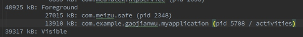

可以看到,这个应用程序的pid为5708 , 其优先级为Foreground,即前台程序.

这时候我们点击Back键退出,然后再查看系统的内存信息(`adb shell dumpsys meminfo`)

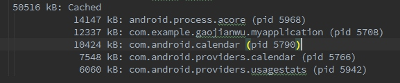

我们看到,这个程序在Back键之后,其进程5708依旧是存在的.只是其进程优先级变成了Cache.其占用内存变成了12337kb,和之前的13910kb相比是变小了一些. 但是大部分内存是没有被释放掉的.

**在任务管理器中杀掉应用:**

在任务管理器中杀掉应用,这个结果是不一致的,其取决于这个OS的任务管理器的实现,大部分国内的厂家都会对任务管理器进行定制,以达到更有效的杀掉应用的效果.一般来说厂家定制的任务管理器都会比较暴力,除了少数白名单,其他的应用一概直接将进程杀掉.

我们以上面的那个测试程序为例,打开这个程序之后, 其进程优先级为Foreground,这时候我们直接调用任务管理器杀掉改程序(以魅族MX4 Pro为栗子):

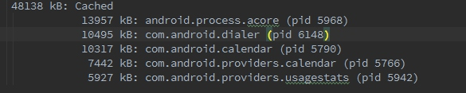

可以看到用任务管理器杀掉之后, 整个应用程序的进程都被杀掉了.

**通过命令行或者开发者工具杀掉应用.**
我们可以通过`adb shell am force-stop` 包名来杀掉这个程序,其结果也是进程直接被杀掉. IDE(比如Android Studio)选择一个进程后,点击:

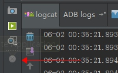

也是可以干掉这个进程的.

#### 2.即使关掉后台进程，内存也增加不多。
这个不对,一个进程被杀死后,其内存会被释放掉的.

我们以知乎App Android客户端为栗子:

打开这个程序之前,系统剩余内存,以(MX4 Pro为栗子):

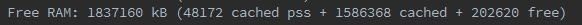

打开这个程序之后,系统剩余内存:


知乎占用的内存:


使用任务管理器杀掉知乎,系统剩余内存:


可以看到,杀掉进程之后,内存是会增加的.

#### 3.据说即使前台关掉进程，其实该进程在后台还在运行（休眠）。why？

这个和第一条一样,取决于你关掉进程的方法.

另外像豌豆荚这样的应用,他会起好几个进程:

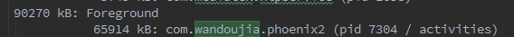

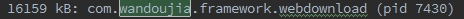

当我们用任务管理器杀掉他后,

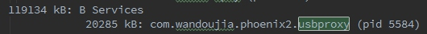

这个进程不会被杀掉. 因为人家就是需要在后台跑一个Services来维持usb的链接.休眠?NO NO NO, 人家还是要干活的...

想想也是哈,如果我把这个进程也干掉了,那手机不就连不上电脑了么???

以此类推:

要是我把QQ的

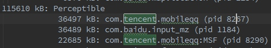

干掉的话,不就收不到推送信息了? 不行不行,得留着.

```
要是......................?不行不行,得留着.
要是......................?不行不行,得留着.
要是......................?不行不行,得留着.
要是......................?不行不行,得留着.
要是......................?不行不行,得留着.

警告:系统内存不足!!!!!!!!!!!!
系统:杀杀杀!
用户:啥破手机,老是杀我后台!!!
手机:怪我咯?
APP:怪我咯?

程序员: 怪我咯? 产品狗说要加这么多功能的, 还要一直后台接受消息的..
产品狗: 怪我咯? 自己技术不行...
```

#### 4. 有人说是因为智能手机无需将程序彻底关掉，可以减少再启动的时间。是这样吗？

这个说法前半句是不对的,后半句是对的. 

先说前半句 : Android设计的时候,确实是想让大家不去关心内存问题,Android会有一套自己的内存管理机制,在内存不足的时候通过优先级干掉一些应用,这个 [@monkey code](https://www.zhihu.com/people/20dfdd48d756c944982c3a782ea1cfa2) 已经说了. 每个应用在接收到内存不足的信号(之前是onLowMemory,现在一般用onTrimMemory,onLowMemory的级别相当于onTrimMemory中的最严重的哪个等级). 会根据内存不足的程度,来释放掉一部分内存.以保持自己的进程不被杀死,这样下次启动的时候就不用去fork zygote. 但是.................凡是总有个但是, 理想是丰满的,现实是骨干的. 严格按照Google想的那一套去做的应用不多,国内开发者对内存的敏感程度很低,导致很多应用程序跑起来分分钟就100-200MB了,墨迹天气这样的应用,400m妥妥的(不好意思又黑了墨迹天气) . 所以手机低内存的情况非常常见,这时候大部分应用并没有重写onTrimMemory方法, 所以低内存的情况会很频繁. 这时候你再起一个应用,申请内存的时候发现内存不够,就开始杀应用了. 所以经常会出现你在看电子书,突然这时候微信来了个消息,你切过去回了个消息,打开相机拍了个照,然后发给朋友, 又发了条微博,再回来

看书的时候发现电子书已经挂了,正在重新加载程序....WLGQ...

这时候你就发现杀掉进程的重要性了, 把不重要的进程直接干掉,保证重要的进程不会被系统杀掉. 

所以说不重要的程序是需要在使用结束后直接干掉的.一劳永逸,麻麻再也不用担心这货偷跑流量/后台安装程序/占内存/占CPU 了....

再说后半句: 可以减少启动的时间. 这个是对的, 如果一个应用程序的进程没有被杀死,那么下一次启动这个应用程序的时候,就不需要去创建这个进程了(fork zygote,这个耗时还是蛮多的), 而是直接在这个进程中创建对应的组件即可(Android四大组件). 

update 2015-6-3

补充：

* 1.关于墨迹天气

下面是我抓的墨迹天气的内存使用：

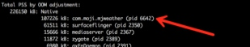


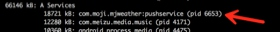

三个进程，一个在Native，一个是前台进程，还有一个推送的Service。

* 2.内存工具

另外有人问我是怎么抓的，其实就是上面提到的那个命令：

> adb shell dumpsys meminfo

另外Android Studio提供了简单的图形操作方式：

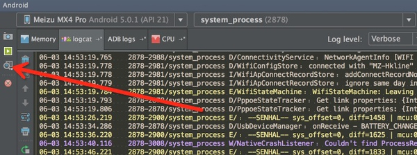

弹出的框选第三个：

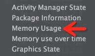

然后就会有一个报告自动打开。

### [monkey code](https://www.zhihu.com/people/code_doge)

简单点说，这样做的好处就是再次打开这个应用的时候速度会变快，因为节省了fork，重新解析加载布局等操作，直接resume就可以了，这个也就是冷启动和热启动的区别。

这样做的是基于OOM_ADJ的，当系统内存的压力值达到某个地步的时候，就会开始杀对应优先级的进程。

一个很好的例子就是当你进入大游戏后回到主菜单，主菜单会有一个重新加载的过程，但是状态栏就没有，这个过程简单点说可以是这样的：

进入大游戏，逐渐申请内存，前台大游戏的OOM_ADJ值是0，后台的launcher是6，当逐渐内存压力变大的时候，lmk就开始杀进程，于是从最低优先级的进程（CACHED_APP_MAX_ADJ = 15）杀起，一路杀到launcher，如果发现够了，就不再杀。
而从大游戏退出到launcher后，重新创建launcher，于是有了重新加载的过程。

而systemui由于是persist进程优先级为-12，因此不会杀到。

希望你能理解~

### [一转倾心](https://www.zhihu.com/people/yizhuan-qing-xin)

我的愚见是：之前使用过的手机基本上都遵循这个规律

1.一键清理后台之后，你可以到“系统设置-所有应用程序”的地方看看，正在运行的程序之中会有一些没有成功清理，这就是传说中的不清理后台的程序列表，大概就是系统自愿或者不自愿地把它们放进了白名单。例如微信，微博，音乐播放器。通常，我会选择点击这些程序手动停止，遇到部分比较顽强的抵抗，我也只有从了。

2.同样在正在运行的界面，点击显示“缓存后台程序”，这些程序和前面的不同，一般是不会占用系统内存的，也就是非活跃的内存区域，简而言之可以忽略，而且你也无法手动停止他们。

3.根据以上两点现象，我们讨论一下android的后台机制，和WP，ios那种假后台不同，安卓系统和windows比较类似，采用了多任务的机制，所以原则上内存越大，能够并行的多任务越多。如果有一键清理，强迫症的用户，例如我，就会经常点击一下，这是手动释放内存的方法。安卓自动释放内存的规律是，等到内存池溢出，安卓系统才会强制根据算法进行筛选，将最不常用的进程，或者最早的进程砍掉，腾出空间。

4.这就是你总感觉系统不流畅，尤其是切换多任务的时候，出现了部分应用假死也是常有的事，这好比windows，我们也要经常到资源管理器杀进程

5.一键清理后台也有弊病，当我们过于频繁清理后台之后，我们会发现部分应用打开的时间，切换应用的时间同样需要等待，这时候不是内存空间不足导致，而是重新加载到内存所导致。

6.所以即使是升级到android4.4之后，我也不建议用户购买1GB内存以下的机型，因为随着我们并行的任务逐渐增多，谷歌再优化也是无补于是，倒不如根据我们的使用习惯，适当地选择大内存的手机更划算，2GB机型已经开始普及到千元以下的价位，3GB基本上成为旗舰机标配，今年，华硕，乐视的机型也上了4GB的配置，所以只要不是ios和WP阵营，大内存还是很有必要的。

