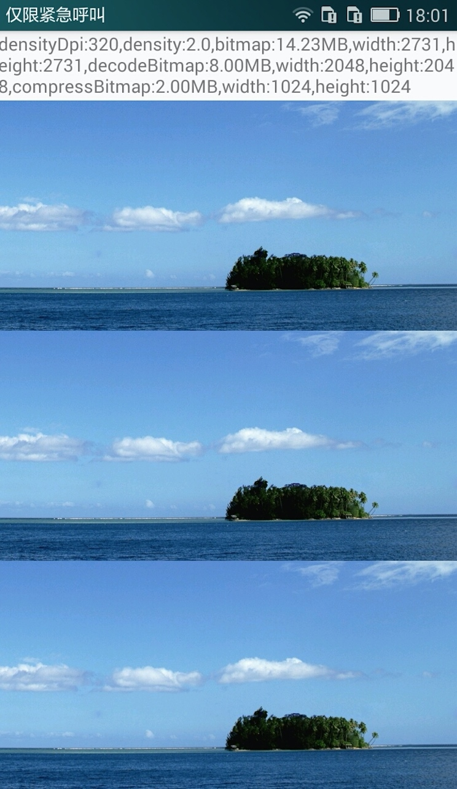
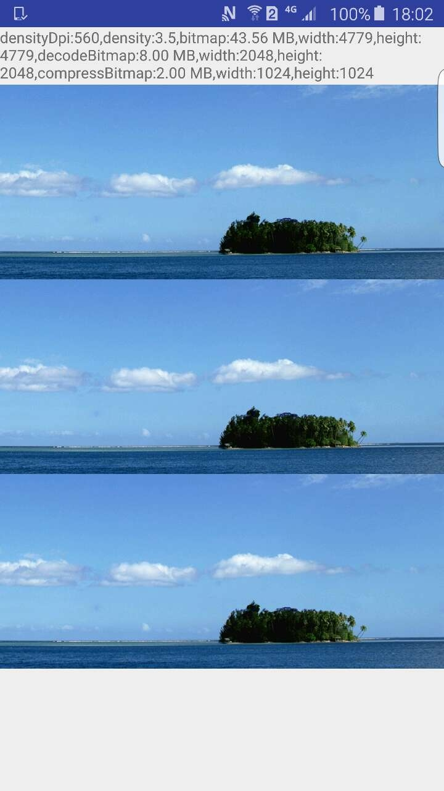

# Android性能优化之Bitmap的内存优化
来源:[http://blog.csdn.net/u010687392/article/details/50721437](http://blog.csdn.net/u010687392/article/details/50721437)

[TOC]

## 1、BitmapFactory解析Bitmap的原理

BitmapFactory提供的解析Bitmap的静态工厂方法有以下五种：

```
Bitmap decodeFile(...)
Bitmap decodeResource(...)
Bitmap decodeByteArray(...)
Bitmap decodeStream(...)
Bitmap decodeFileDescriptor(...)
```

其中常用的三个：`decodeFile`、`decodeResource`、`decodeStream`。 

`decodeFile`和`decodeResource`其实最终都是调用`decodeStream`方法来解析Bitmap,`decodeStream`的内部则是调用两个native方法解析Bitmap的：

```
nativeDecodeAsset()
nativeDecodeStream()
```

这两个native方法只是对应`decodeFile`和`decodeResource`、`decodeStream`来解析的，像`decodeByteArray`、`decodeFileDescriptor`也有专门的native方法负责解析Bitmap。

接下来就是看看这两个方法在解析Bitmap时究竟有什么区别`decodeFile`、`decodeResource`，查看后发现它们调用路径如下：

```
decodeFile->decodeStream 
decodeResource->decodeResourceStream->decodeStream
```

`decodeResource`在解析时多调用了一个`decodeResourceStream`方法，而这个`decodeResourceStream`方法代码如下：

```
    public static Bitmap decodeResourceStream(Resources res, TypedValue value,
            InputStream is, Rect pad, Options opts) {

        if (opts == null) {
            opts = new Options();
        }

        if (opts.inDensity == 0 && value != null) {
            final int density = value.density;
            if (density == TypedValue.DENSITY_DEFAULT) {
                opts.inDensity = DisplayMetrics.DENSITY_DEFAULT;
            } else if (density != TypedValue.DENSITY_NONE) {
                opts.inDensity = density;
            }
        }

        if (opts.inTargetDensity == 0 && res != null) {
            opts.inTargetDensity = res.getDisplayMetrics().densityDpi;
        }

        return decodeStream(is, pad, opts);
    }
```

它主要是对**Options**进行处理了，在得到`opts.inDensity`属性的前提下，如果我们没有对该属性设定值，那么将**opts.inDensity = DisplayMetrics.DENSITY_DEFAULT;**赋定这个默认的Density值，这个默认值为160，为标准的dpi比例，即在**Density=160**的设备上**1dp=1px**，这个方法中还有这么一行

```
opts.inTargetDensity = res.getDisplayMetrics().densityDpi;
```

对`opts.inTargetDensity`进行了赋值，该值为当前设备的`densityDpi`值，所以说在`decodeResourceStream`方法中主要做了两件事：

* 1、对opts.inDensity赋值，没有则赋默认值160 
* 2、对opts.inTargetDensity赋值，没有则赋当前设备的densityDpi值

之后重点来了，之后参数将传入decodeStream方法，该方法中在调用native方法进行解析Bitmap后会调用这个方法`setDensityFromOptions(bm, opts);`：

```
    private static void setDensityFromOptions(Bitmap outputBitmap, Options opts) {
        if (outputBitmap == null || opts == null) return;

        final int density = opts.inDensity;
        if (density != 0) {
            outputBitmap.setDensity(density);
            final int targetDensity = opts.inTargetDensity;
            if (targetDensity == 0 || density == targetDensity || density == opts.inScreenDensity) {
                return;
            }

            byte[] np = outputBitmap.getNinePatchChunk();
            final boolean isNinePatch = np != null && NinePatch.isNinePatchChunk(np);
            if (opts.inScaled || isNinePatch) {
                outputBitmap.setDensity(targetDensity);
            }
        } else if (opts.inBitmap != null) {
            // bitmap was reused, ensure density is reset
            outputBitmap.setDensity(Bitmap.getDefaultDensity());
        }
    }
```

该方法主要就是把刚刚赋值过的两个属性inDensity和inTargetDensity给Bitmap进行赋值，不过并不是直接赋给Bitmap就完了，中间有个判断，当inDensity的值与inTargetDensity或与设备的屏幕Density不相等时，则将应用inTargetDensity的值，如果相等则应用inDensity的值。

所以总结来说，`setDensityFromOptions`方法就是把`inTargetDensity`的值赋给Bitmap，不过前提是`opts.inScaled = true；`

进过上面的分析，可以得出这样一个结论：

在不配置Options的情况下： 

* 1、decodeFile、decodeStream在解析时不会对Bitmap进行一系列的屏幕适配，解析出来的将是原始大小的图 
* 2、decodeResource在解析时会对Bitmap根据当前设备屏幕像素密度densityDpi的值进行缩放适配操作，使得解析出来的Bitmap与当前设备的分辨率匹配，达到一个最佳的显示效果，并且Bitmap的大小将比原始的大
### 1.1、关于Density、分辨率、-hdpi等res目录之间的关系

|Density Dpi|	分辨率|res|Density|
|:--|:--|:--|:--|
|160dpi	|320x533|mdpi|1|
|240dpi	|480x800|hdpi|1.5|
|320dpi	|720x1280	x|hdpi|2|
|480dpi	|1080x1920|xxhdpi|3|
|560dpi|1440x2560|xxxhdpi|3.5|

dp与px的换算公式为：

```
px = dp * Density
```

## 1.2、DisplayMetrics::densityDpi与density的区别

```
getResources().getDisplayMetrics().densityDpi——表示屏幕的像素密度 
getResources().getDisplayMetrics().density——1dp等于多少个像素(px)
```

举个栗子：在屏幕密度为160的设备下，1dp=1px。在屏幕密度为320的设备下，1dp=2px。 

所以这就为什么在安卓中布局建议使用dp为单位，因为可以根据当前设备的屏幕密度动态的调整进行适配

## 2、Bitmap的优化策略

### 2.1、BitmapFactory.Options的属性解析

BitmapFactory.Options中有以下属性：

```
inBitmap——在解析Bitmap时重用该Bitmap，不过必须等大的Bitmap而且inMutable须为true
inMutable——配置Bitmap是否可以更改，比如：在Bitmap上隔几个像素加一条线段
inJustDecodeBounds——为true仅返回Bitmap的宽高等属性
inSampleSize——须>=1,表示Bitmap的压缩比例，如：inSampleSize=4，将返回一个是原始图的1/16大小的Bitmap
inPreferredConfig——Bitmap.Config.ARGB_8888等
inDither——是否抖动，默认为false
inPremultiplied——默认为true，一般不改变它的值
inDensity——Bitmap的像素密度
inTargetDensity——Bitmap最终的像素密度
inScreenDensity——当前屏幕的像素密度
inScaled——是否支持缩放，默认为true，当设置了这个，Bitmap将会以inTargetDensity的值进行缩放
inPurgeable——当存储Pixel的内存空间在系统内存不足时是否可以被回收
inInputShareable——inPurgeable为true情况下才生效，是否可以共享一个InputStream
inPreferQualityOverSpeed——为true则优先保证Bitmap质量其次是解码速度
outWidth——返回的Bitmap的宽
outHeight——返回的Bitmap的高
inTempStorage——解码时的临时空间，建议16*1024
```

### 2.2、优化策略

```
1、BitmapConfig的配置 
2、使用decodeFile、decodeResource、decodeStream进行解析Bitmap时，配置inDensity和inTargetDensity，两者应该相等,值可以等于屏幕像素密度*0.75f 
3、使用inJustDecodeBounds预判断Bitmap的大小及使用inSampleSize进行压缩 
4、对Density>240的设备进行Bitmap的适配（缩放Density） 
5、2.3版本inNativeAlloc的使用 
6、4.4以下版本inPurgeable、inInputShareable的使用 
7、Bitmap的回收
```

针对上面方案，把Bitmap解码的代码封装成了一个工具类，如下：

```
public class BitmapDecodeUtil {
    private static final int DEFAULT_DENSITY = 240;
    private static final float SCALE_FACTOR = 0.75f;
    private static final Bitmap.Config DEFAULT_BITMAP_CONFIG = Bitmap.Config.RGB_565;

    private static BitmapFactory.Options getBitmapOptions(Context context) {
        BitmapFactory.Options options = new BitmapFactory.Options();
        options.inScaled = true;
        options.inPreferredConfig = DEFAULT_BITMAP_CONFIG;
        options.inPurgeable = true;
        options.inInputShareable = true;
        options.inJustDecodeBounds = false;
        if (Build.VERSION.SDK_INT <= Build.VERSION_CODES.GINGERBREAD_MR1) {
            Field field = null;
            try {
                field = BitmapFactory.Options.class.getDeclaredField("inNativeAlloc");
                field.setAccessible(true);
                field.setBoolean(options, true);
            } catch (NoSuchFieldException e) {
                e.printStackTrace();
            } catch (IllegalAccessException e) {
                e.printStackTrace();
            }
        }
        int displayDensityDpi = context.getResources().getDisplayMetrics().densityDpi;
        float displayDensity = context.getResources().getDisplayMetrics().density;
        if (displayDensityDpi > DEFAULT_DENSITY && displayDensity > 1.5f) {
            int density = (int) (displayDensityDpi * SCALE_FACTOR);
            options.inDensity = density;
            options.inTargetDensity = density;
        }
        return options;
    }

    public static Bitmap decodeBitmap(Context context, int resId) {
        checkParam(context);
        return BitmapFactory.decodeResource(context.getResources(), resId, getBitmapOptions(context));
    }

    public static Bitmap decodeBitmap(Context context, String pathName) {
        checkParam(context);
        return BitmapFactory.decodeFile(pathName, getBitmapOptions(context));
    }

    public static Bitmap decodeBitmap(Context context, InputStream is) {
        checkParam(context);
        checkParam(is);
        return BitmapFactory.decodeStream(is, null, getBitmapOptions(context));
    }

    public static Bitmap compressBitmap(Context context,int resId, int maxWidth, int maxHeight) {
        checkParam(context);
        final TypedValue value = new TypedValue();
        InputStream is = null;
        try {
            is = context.getResources().openRawResource(resId, value);
            return compressBitmap(context, is, maxWidth, maxHeight);
        } catch (Exception e) {
            e.printStackTrace();
        } finally {
            if (is != null) {
                try {
                    is.close();
                } catch (IOException e) {
                    e.printStackTrace();
                }
            }
        }
        return null;
    }

    public static Bitmap compressBitmap(Context context, String pathName, int maxWidth, int maxHeight) {
        checkParam(context);
        InputStream is = null;
        try {
            is = new FileInputStream(pathName);
            return compressBitmap(context, is, maxWidth, maxHeight);
        } catch (FileNotFoundException e) {
            e.printStackTrace();
        } finally {
            if (is != null) {
                try {
                    is.close();
                } catch (IOException e) {
                    e.printStackTrace();
                }
            }
        }
        return null;
    }

    public static Bitmap compressBitmap(Context context, InputStream is, int maxWidth, int maxHeight) {
        checkParam(context);
        checkParam(is);
        BitmapFactory.Options opt = new BitmapFactory.Options();
        opt.inJustDecodeBounds = true;
        BitmapFactory.decodeStream(is, null, opt);
        int height = opt.outHeight;
        int width = opt.outWidth;
        int sampleSize = computeSampleSize(width, height, maxWidth, maxHeight);
        BitmapFactory.Options options = getBitmapOptions(context);
        options.inSampleSize = sampleSize;
        return BitmapFactory.decodeStream(is, null, options);
    }

    private static int computeSampleSize(int width, int height, int maxWidth, int maxHeight) {
        int inSampleSize = 1;
        if (height > maxHeight || width > maxWidth) {
            final int heightRate = Math.round((float) height / (float) maxHeight);
            final int widthRate = Math.round((float) width / (float) maxWidth);
            inSampleSize = heightRate < widthRate ? heightRate : widthRate;
        }
        if (inSampleSize % 2 != 0) {
            inSampleSize -= 1;
        }
        return inSampleSize <= 1 ? 1 : inSampleSize;
    }
    private static <T> void checkParam(T param){
        if(param == null)
            throw new NullPointerException();
    }
}
```

主要有两类方法： 

* 一、decodeBitmap:对Bitmap不压缩，但是会根据屏幕的密度合适的进行缩放压缩 
* 二、compressBimtap:对Bitmap进行超过最大宽高的压缩，同时也会根据屏幕的密度合适的进行缩放压缩。

## 3、Bitmap优化前后性能对比

针对上面方案，做一下性能对比,图片大小为3.26M,分辨率为2048*2048 

有两台设备：

### 3.1、density为320的设备



### 3.2、density为560的设备



可以看到，都是加载同一图片，在高屏幕像素密度的设备下所需要的内存需要很大、载入内存中的Bitmap的宽高也因设备的屏幕像素密度也改变，正如上面分析的一样，使用decodeResource会自动适配当前设备的分辨率达到一个最佳效果，而只有这个方法会自动适配其它方法将不会，依次思路，我们在封装的工具类中在每一个方法都加入了依屏幕像素密度来自动适配，而在实际中并不需要那么高清的图片，所以我们可以根据设备的density来进行缩放，比如：在400>=density>240的情况下x0.8,在density>400的情况下x0.7，这样Bitmap所占用的内存将减少非常多，可以对面上面两个图片中bitmap和decodeBitmap两个值的大小，decodeBitmap只是对density进行了一定的缩放，而占用内存却减少非常多，而且显示效果也和原先的并无区别。 
之后对比我们进行了inSampleSize压缩的图片，进行压缩后的效果也看不出太大区别，而占用内存也减少了很多。

## 4、Bitmap的回收

### 4.1、Android 2.3.3(API 10)及以下的系统

在2.3以下的系统中，Bitmap的像素数据是存储在native中，Bitmap对象是存储在java堆中的，所以在回收Bitmap时，需要回收两个部分的空间：native和java堆。 
即先调用recycle()释放native中Bitmap的像素数据，再对Bitmap对象置null，保证GC对Bitmap对象的回收

### 4.2、Android 3.0(API 11)及以上的系统

在3.0以上的系统中，Bitmap的像素数据和对象本身都是存储在java堆中的，无需主动调用recycle()，只需将对象置null，由GC自动管理

