# Android Weak Handler：可以避免内存泄漏的Handler库

来源:[www.jcodecraeer.com](http://www.jcodecraeer.com/a/anzhuokaifa/androidkaifa/2014/1123/2047.html)

android使用java作为其开发环境。java的跨平台和垃圾回收机制已经帮助我们解决了底层的一些问题。但是尽管有了垃圾回收机制，在开发android的时候仍然时不时的遇到`out of memory`的问题，这个时候我们不禁要问，垃圾回收机器去哪儿了？

我们主要讲的是handler引起的泄漏，并给出三种解决办法，其中最后一种方法就是我们想介绍的`WeakHandler`库。

可能导致泄漏问题的handler一般会被提示 Lint警告：

```
This Handler class should be static or leaks might occur 
意思：class使用静态声明否则可能出现内存泄露。
```

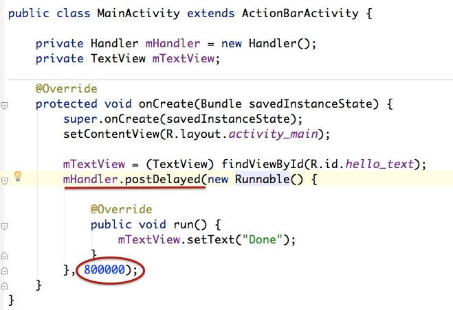

这是一个基本的activity。在handler的post方法中我们加入了一个匿名的runnable，同时我将其执行延迟了整整80秒。我们运行这个程序，并且旋转几次手机，然后分析内存。

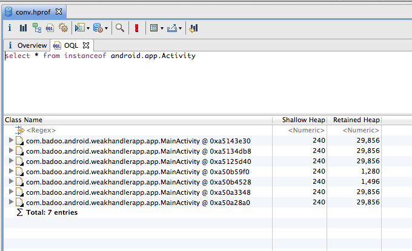

现在内存中有7个activity了，这太不靠谱了，所以我们来研究下为什么GC没有清理它。（上图中我查询内存中activity列表时用的是oql(对象查询语言)，简单强大的工具，ps 怎么用的，谁能告诉我？）

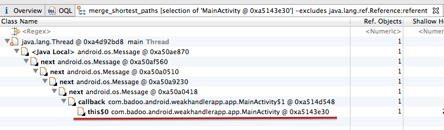

从上图中我们可以看到其中一个对mainactivity的引用是来自`this$0`，`this$0`是什么呢？以下是关于`this$0`的解释：

-------什么是`this$0`---------

非static的`inner class`里面都会有一个`this$0`的字段保存它的父对象。在Java中，**非静态(匿名)内部类会默认隐性引用外部类对象。而静态内部类不会引用外部类对象。**一个编译后的inner class 很可能是这样的：

```
class parent$inner{
	synthetic parent this$0;
	parent$inner(parent this$0){
		this.this$0 = this$0;
		this$0.foo();
	}
}
```
-------什么是`this$0`结束---------

在我们的代码中，匿名的runnable是一个非静态的内部类，因此他会使用`this$0`来保存MainActivity，然后runnable会继续被它的callback引用，而callback又接着被接下来一连串的message引用，这样主线程的引用就太他妈多了。 当Activity finish后，延时消息会继续存在主线程消息队列中80秒，然后处理消息，因此handler在继续存在于内存中，而handler引用了Activity，在我们旋转手机的时候，Activity 不停的重建和finish，导致多个activity的引用出现。

一旦将Runnable或者是Message 发送进handler，将保存一连串的引用了主线程（这里是MainActivity吧）的Message命令，直到message执行完。如果发送Runnable设置了延迟时间，那么至少在这段延迟时间内内存泄漏是肯定的，如果是直接发送，在Message比较大的情况下，也是有可能发生暂时的泄漏的。


### 解决办法一：使用Static

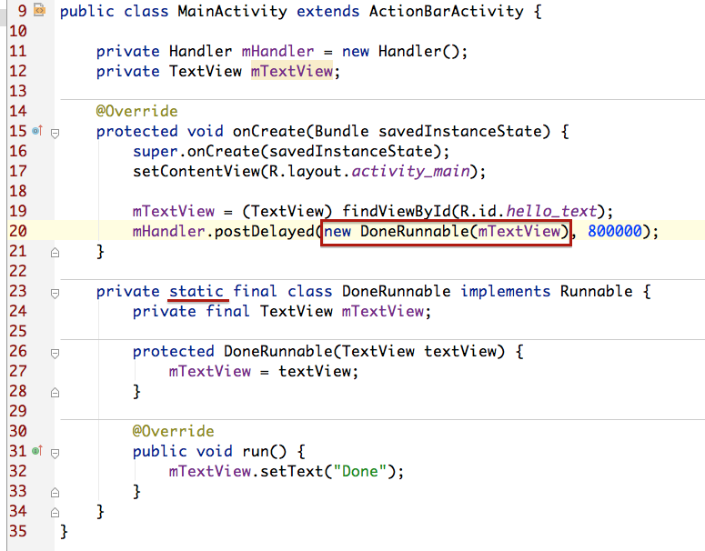

再次执行，同时旋转手机，分析内存如下：

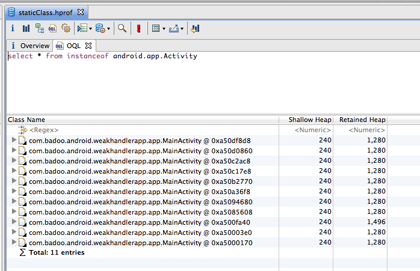

尼玛，还是一样的。我们看看是谁还拉着activity不放：

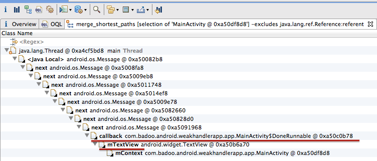

在最底下我们发现activity继续被DoneRunnable里面mTextView中的mContext引用着。看来在这种情况下，看来仅仅使用static并没有解决问题啊。还需要做点工作才行。


**静态的Runnable加WeakReference**

既然是因为mTextView引起的，那我们把mTextView换成弱引用好了：

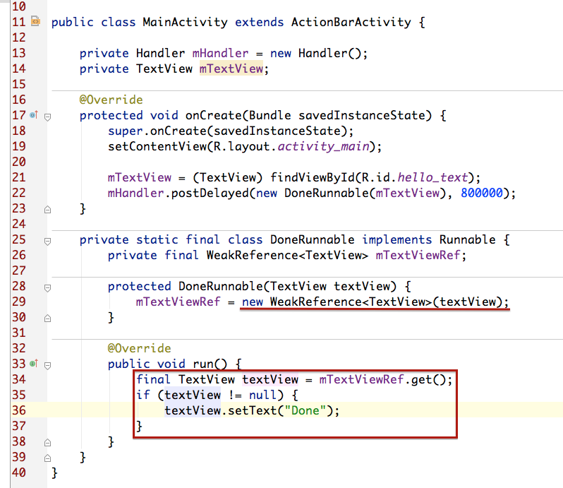

需要注意的，既然mTextView是弱引用，所以随时都可能为null，因此需要在使用前判断是否为空。好了继续看看内存的情况：

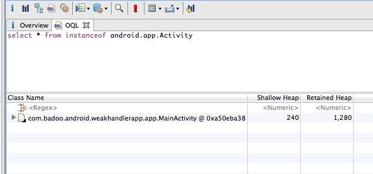

all right,我想我们已经完美的解决问题了。总结一下我们做了哪些工作：

使用静态的内部类

对所有handler/Runnable中的变量都用弱引用。

但是这种方式代码是不是很多，而且还必须得小心翼翼。


**在onDestroy中清理掉所有Messages**

Handler有个很方便的方法：removeCallbacksAndMessages,当参数为null的时候，可以清除掉所有跟次handler相关的Runnable和Message，我们在onDestroy中调用次方法也就不会发生内存泄漏了。

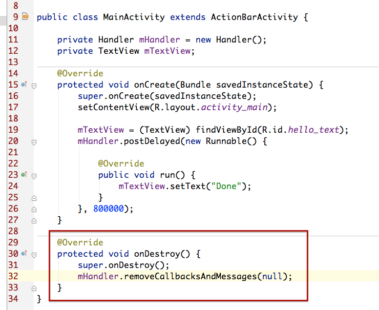

运行，旋转手机

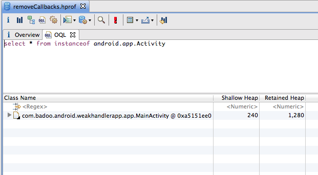

但是如果你对代码有更高的要求，觉得这样还不方便可以使用作者提供的WeakHandler库


### WeakHandler

WeakHandler使用起来和handler一模一样，但是他是安全的，WeakHandler使用如下：

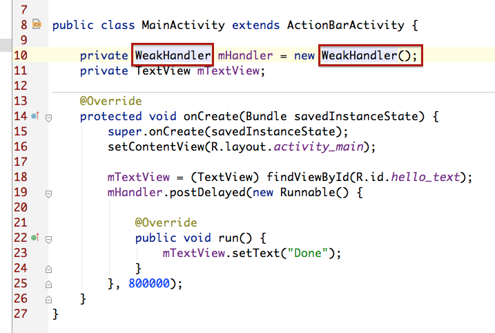

你只需要把以前的Handler替换成WeakHandler就行了。


**WeakHandler的实现原理**

WeakHandler的思想是将Handler和Runnable做一次封装，我们使用的是封装后的WeakHandler，但其实真正起到handler作用的是封装的内部，而封装的内部对handler和runnable都是用的弱引用。

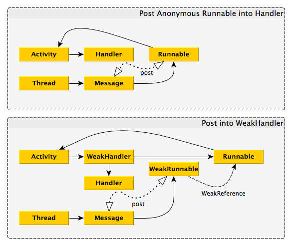

第一幅图是普通handler的引用关系图

第二幅图是使用WeakHandler的引用关系图

其实原文有对WeakHandler更多的解释，但是表述起来也挺复杂的。

* 原文地址：[https://techblog.badoo.com/blog/2014/10/09/calabash-android-query/](https://techblog.badoo.com/blog/2014/10/09/calabash-android-query/)

* github项目地址：[https://github.com/badoo/android-weak-handler](https://github.com/badoo/android-weak-handler)

