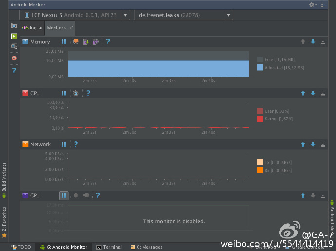
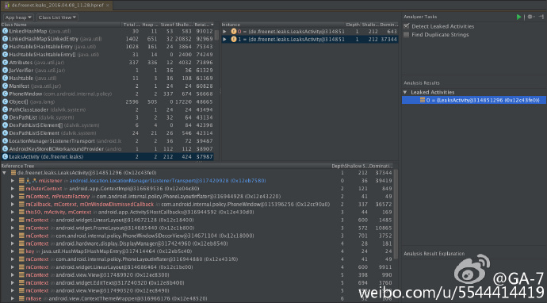
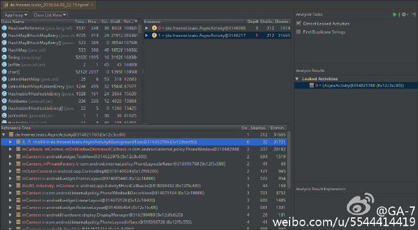
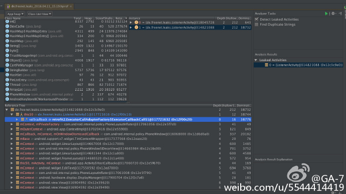

# Android内存泄漏 ——检测、解决和避免

来源:[Adison's Notes](http://blog.adisonhyh.com/2016/08/20/Android%E5%86%85%E5%AD%98%E6%B3%84%E6%BC%8F-%E2%80%94%E2%80%94%E6%A3%80%E6%B5%8B%E3%80%81%E8%A7%A3%E5%86%B3%E5%92%8C%E9%81%BF%E5%85%8D/)

作为开发人员，在我们的日常开发中，为了构建更好的应用程序，我们需要考虑很多事情以保证应用运行在正轨上，其中之一是要确保我们的应用程序不会崩溃。应用崩溃的一个常见原因是内存泄漏。这方面的问题可以以各种形式表现出来。在大多数情况下，我们看到内存使用率稳步上升，直到应用程序不能分配更多的资源，并不可避免地崩溃。在Java中这往往导致一个**OutOfMemoryException**异常被抛出。在某些罕见的情况下，泄露的类甚至可以逗留很长时间来接收已注册的回调，这会导致一些非常奇怪的错误，并往往抛出臭名昭著的**IllegalStateException**异常。

为了帮助他人在代码分析上减少花费时间，我将介绍内存泄漏的几个例子，阐述在Android Studio中如何检查它们，当然最重要的是如何将其解决。

## 声明

在这篇文章中的代码示例的目的是为了促进大家对内存管理有更深的了解，特别是在java。其通用的体系结构，线程管理和代码示例的 HTTP 请求处理在真实的生产环境并不是理想的，这些示例仅仅为了说明一个问题：在Android中，内存泄漏是一件要考虑的事情。

## 监听器注册

这真的不应该是个问题，但我经常看到各种注册方法的调用，但他们对应的注销方法却无处可寻。这是泄漏的潜在来源，因为这些方法明确设计成互相抵消。如果没有调用注销方法，被引用的对象已经被终止后，监听实例可能会持有该对象很长的时间，从而导致泄漏内存。在Android中，如果该对象是一个Activity对象，是特别麻烦的，因为他们往往拥有大量的数据。让我告诉你，可能是什么样子。

```
public class LeaksActivity extends Activity implements LocationListener {
    private LocationManager locationManager;
    @Override
    protected void onCreate(Bundle savedInstanceState) {
        super.onCreate(savedInstanceState);
        setContentView(R.layout.activity_leaks);
        locationManager = (LocationManager) getSystemService(
        								Context.LOCATION_SERVICE);
        locationManager.requestLocationUpdates(
        			LocationManager.NETWORK_PROVIDER,
                TimeUnit.MINUTES.toMillis(5), 100, this);
    }
    // Listener implementation omitted
}
```

在这个例子中，我们让Android的 [LocationManager](https://developer.android.com/reference/android/location/LocationManager.html)通知我们位置更新。我们所需要做的就是获取系统服务本身和设置一个回调来接收更新。在这里，我们在Activity中实现了位置监听接口，这意味着LocationManager将持有该Activity的引用。现在，如果该设备被旋转，新的Activity将被创建并取代已经注册位置更新接口的旧的Activity。由于系统服务存活时间肯定比任何Activity都要长，LocationManager仍然持有以前的Activity的引用，这使GC不可能回收依赖于以前的Activity的资源，从而导致内存泄漏。如果反复旋转设备，将导致大量的不可回收的Activity填满内存，最终导致OutOfMemoryException异常。

但为了解决内存泄漏，我们首先必须要能够找到它。幸运的是，Android Studio有一个叫做 **Android Monitor**的内置工具，我们可以用它来 观察除应用内存使用情况。我们需要做的仅仅是打开Android Monitor 并转到对应tab，看看使用了多少内存和内存实时分配情况。



任何导致资源分配的交互都在这里反映出来，使之成为跟踪应用程序的资源使用情况的理想场所。为了找到内存泄露，当我们怀疑在某个时间点内存被泄露时，我们需要知道在该时间点包含了那些内存。对于这个特殊的例子，我们所要做的就是启动我们的应用程序，然后旋转设备一次，然后调用**Dump Java Heap**操作（在Memory的旁边，从左边数起第三个图标）。这将生成一个HPROF文件，其中包含我们调用该操作时的一个内存快照。几秒钟后，Android Studio 会自动打开该文件，给我们更易于分析内存的直观表示。

我不会去深入有关如何分析巨大的内存堆。相反，我会把你的注意力引导到 Analyzer Tasks（下面截图中的右上角）。为了检测上面的例子中引入的内存泄漏，你所需要做的检测是检查泄露的Activity（**Detect Leaked Activities**），点击播放按钮然后在Analysis Results下面就会显示泄露的Activity情况。



如果我们选中泄露的Activity，可以得到一个引用树，该引用树可以检测持有该Activity的引用。通过寻找深度为零的实例，我们发现位置管理器中的实例mListener，是我们的Activity不能被GC回收的原因。回到我们的代码，我们可以看到，这个引用是由于我们在requestLocationsUpdates方法中设置Activity作为位置更新回调导致的。通过阅读[位置管理器文档](https://developer.android.com/reference/android/location/LocationManager.html)，问题很快变得清晰，为了取消回调设置，我们简单地调用removeUpdates方法就行了。在我们的例子，因为我们注册更新是在onCreate方法，显然要注销的地方在onDestroy方法。

```
public class LeaksActivity extends Activity implements LocationListener {
    private LocationManager locationManager;
    @Override
    protected void onCreate(Bundle savedInstanceState) {
        super.onCreate(savedInstanceState);
        setContentView(R.layout.activity_leaks);
        locationManager = (LocationManager) getSystemService(LOCATION_SERVICE);
        locationManager.requestLocationUpdates(
        			LocationManager.NETWORK_PROVIDER,
					TimeUnit.MINUTES.toMillis(5), 100, this);
    }
    @Override
    protected void onDestroy() {
        locationManager.removeUpdates(this);
        super.onDestroy();
    }
    // Listener implementation omitted
}
```

重新构建程序并执行与上述相同的内存分析，无论旋转多少次设备，应该都不会导致Activity泄漏。

## 内部类

内部类在Java中是一个很常见的数据结构。它们很受欢迎，因为它们可以以这样的方式来定义：即只有外部类可以实例化它们。很多人可能没有意识到的是这样的类会持有外部类的隐式引用。隐式引用很容易出错，尤其是当两个类具有不同的生命周期。以下是常见的Android Activity写法。

```
public class AsyncActivity extends Activity {
    TextView textView;
    @Override
    protected void onCreate(Bundle savedInstanceState) {
        super.onCreate(savedInstanceState);
        setContentView(R.layout.activity_async);
        textView = (TextView) findViewById(R.id.textView);
        new BackgroundTask().execute();
    }
    private class BackgroundTask extends AsyncTask<Void, Void, String> {
        @Override
        protected String doInBackground(Void... params) {
            // Do background work. Code omitted.
            return "some string";
        }
        @Override
        protected void onPostExecute(String result) {
            textView.setText(result);
        }
    }
}
```

这种特殊的实现在执行上没有问题。问题是，它保留内存的时间肯定会超过必要的时间。**由于BackgroundTask持有一个AsyncActivity隐式引用并运行在另一个没有取消策略的线程上，它将保留AsyncActivity在内存中的所有资源连接，直到后台线程终止运行**。在HTTP请求的情况下，这可能需要很长的时间，尤其是在速度较慢的连接。

通过执行相同的步骤，如同前面的示例，并确保长时间运行的后台任务，我们最终会得到下面的分析结果。



从上面的分析中可以看出，BackgroundTask 确实是这种内存泄漏的罪魁祸首。我们第一要务是使用静态类的实现方式来消除指向Activity的引用，但这样我们也不能直接访问 textView 了。因此我们还需要添加一个构造函数，把textView作为参数传递进来。最后，我们需要引入[AsyncTask文档](http://developer.android.com/reference/android/os/AsyncTask.html)中所述的取消策略。考虑到所有这一切，让我们看看我们的代码最终呈现。

```
public class AsyncActivity extends Activity {
    TextView textView;
    AsyncTask task;
    @Override
    protected void onCreate(Bundle savedInstanceState) {
        super.onCreate(savedInstanceState);
        setContentView(R.layout.activity_async);
        textView = (TextView) findViewById(R.id.textView);
        task = new BackgroundTask(textView).execute();
    }
    
    @Override
    protected void onDestroy() {
        task.cancel(true);
        super.onDestroy();
    }
    private static class BackgroundTask 
    				extends AsyncTask<Void, Void, String> {
        private final TextView resultTextView;
        public BackgroundTask(TextView resultTextView) {
            this.resultTextView = resultTextView;
        }
        
        @Override
        protected void onCancelled() {
            // Cancel task. Code omitted.
        }
        @Override
        protected String doInBackground(Void... params) {
            // Do background work. Code omitted.
            return "some string";
        }
        @Override
        protected void onPostExecute(String result) {
            resultTextView.setText(result);
        }
    }
}
```

现在，隐式引用已被消除，我们通过构造函数传递相关实例，并在合适的地方取消任务。让我们再运行分析任务，看看这种改变是否消除了内存泄漏。


看来我们还有一些工作要做。根据前一个例子的经验，我们可以知道在引用树中高亮标注的实例导致了Activity泄露。那么这是什么回事？我们看一下它的父节点就可以发现resultTextView持有一个mContext引用，毫无疑问，它就是泄露的Activity的引用。那么如何解决这个问题？我们无法消除resultTextView绑定的context引用，因为我们需要在BackgroundTask中使用resultTextView的引用，以便更新用户界面。为了解决这个问题，一种简单的方法是使用[WeakReference](https://developer.android.com/reference/java/lang/ref/WeakReference.html)。我们持有的resultTextView引用是强引用，具有防止GC回收的能力。相反，WeakReference不保证其引用的实例存活。当一个实例最后一个强引用被删除，GC会把其资源回收，而不管这个实例是否有弱引用。下面是使用WeakReference的最终版本：

```
public class AsyncActivity extends Activity {

    TextView textView;
    AsyncTask task;

    @Override
    protected void onCreate(Bundle savedInstanceState) {
        super.onCreate(savedInstanceState);
        setContentView(R.layout.activity_async);
        textView = (TextView) findViewById(R.id.textView);

        task = new BackgroundTask(textView).execute();
    }
    
    @Override
    protected void onDestroy() {
        task.cancel(true);
        super.onDestroy();
    }

    private static class BackgroundTask 
    						extends AsyncTask<Void, Void, String> {

        private final WeakReference<TextView> textViewReference;

        public BackgroundTask(TextView resultTextView) {
            this.textViewReference = new WeakReference<>(resultTextView);
        }
        
        @Override
        protected void onCancelled() {
            // Cancel task. Code omitted.
        }

        @Override
        protected String doInBackground(Void... params) {
            // Do background work. Code omitted.
            return "some string";
        }

        @Override
        protected void onPostExecute(String result) {
            TextView view = textViewReference.get();
            if (view != null) {
                view.setText(result);
            }
        }
    }
}
```

请注意，在onPostExecute我们要检查空值，判断实例是否被回收。

最后，再一次运行分析器任务，确认我们的Activity不再被泄露 ！

## 匿名类

这种类型的类和内部类有同样的缺点，即他们持有外部类的引用。如同内部类，一个匿名类在Activity生命周期之外执行或在其他线程执行工作时，可能会导致内存泄漏。在这个例子中，我将使用流行的HTTP请求库[Retrofit](http://square.github.io/retrofit/)执行API调用，并传递响应给对应回调。根据[Retrofit homepage上](http://square.github.io/retrofit/)面例子对Retrofit进行配置。我会在Application中持有GitHubService引用，这不是一个特别好的设计，这仅仅服务于这个例子的目的。

```
public class ListenerActivity extends Activity {

    TextView textView;

    @Override
    protected void onCreate(Bundle savedInstanceState) {
        super.onCreate(savedInstanceState);
        setContentView(R.layout.activity_listener);
        textView = (TextView) findViewById(R.id.textView);

        GitHubService service = ((LeaksApplication) 
        						getApplication()).getService();
        service.listRepos("google")
                .enqueue(new Callback<List<Repo>>() {
                    @Override
                    public void onResponse(Call<List<Repo>> call,
                                           Response<List<Repo>> response) {
                        int numberOfRepos = response.body().size();
                        textView.setText(String.valueOf(numberOfRepos));
                    }

                    @Override
                    public void onFailure(Call<List<Repo>> call, Throwable t) {
                        // Code omitted.
                    }
                });
    }
}
```

这是常见的解决方案，不应该导致任何泄漏。但是，如果我们在慢速连接中执行这个例子，分析结果会有所不同。请记住，直到该线程终止，该Activity会一直被持有，就像在内部类的例子。



根据在内部类的例子中同样的推理，我们得出一个结论：匿名回调类是内存泄漏的原因。然而，正如内部类的例子，此代码包含两个问题。首先，请求没有取消策略。其次，需要消除对Activity的隐式引用。明显的解决办法：我们在内部类的例子做了同样的事情。

```
public class ListenerActivity extends Activity {

    TextView textView;
    Call call;

    @Override
    protected void onCreate(Bundle savedInstanceState) {
        super.onCreate(savedInstanceState);
        setContentView(R.layout.activity_listener);
        textView = (TextView) findViewById(R.id.textView);

        GitHubService service = ((LeaksApplication) 
        						getApplication()).getService();
        call = service.listRepos("google");
        call.enqueue(new RepoCallback(textView));
    }

    @Override
    protected void onDestroy() {
        call.cancel();
        super.onDestroy();
    }

    private static class RepoCallback implements Callback<List<Repo>> {

        private final WeakReference<TextView> resultTextView;

        public RepoCallback(TextView resultTextView) {
            this.resultTextView = new WeakReference<>(resultTextView);
        }

        @Override
        public void onResponse(Call<List<Repo>> call,
                Response<List<Repo>> response) {
            TextView view = resultTextView.get();
            if (view != null) {
                int numberOfRepos = response.body().size();
                view.setText(String.valueOf(numberOfRepos));
            }
        }

        @Override
        public void onFailure(Call<List<Repo>> call, Throwable t) {
            // Code omitted.
        }
    }
}
```

根据上述解决方案，运行分析任务，将不会再有Activity的泄露。

## 结论

后台任务独立于Activity的生命周期运行是一件麻烦事。再加上需要协调用户界面和各种后台任务之间的数据流，如果你不小心，那将是一个灾难。所以要知道你在做什么，以及你的代码是否对性能有影响。这些基本准则是处理Activity的良好开端：

* **尽量使用静态内部类**。每个非静态内部类将持有一个外部类的隐式引用，这可能会导致不必要的问题。使用静态内部类代替非静态内部类，并通过弱引用存储一些必要的生命周期引用。
* **考虑后台服务等手段**， Android提供了多种在非主线程工作的方法，如HandlerThread，IntentService和AsyncTask，它们每个都有自己的优缺点。另外，Android提供了一些机制来传递信息给主线程以更新UI。譬如，广播接收器就可以很方便实现这一点。
* **不要一味依赖垃圾回收器**。使用具有垃圾回收功能的语言编码很容易有这样的想法：即没必要考虑内存管理。我们的示例清楚地表明，并非如此。因此，请确保你分配的资源都被预期回收。

[原文链接](https://medium.com/freenet-engineering/memory-leaks-in-android-identify-treat-and-avoid-d0b1233acc8#.9r06xyg05)


欢迎您扫一扫上面的微信公众号，订阅我的博客！