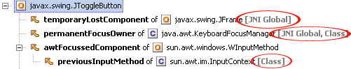

# GC Root

来源:[www.xuebuyuan.com](http://www.xuebuyuan.com/593213.html)

常说的**GC(Garbage Collector) roots**，特指的是垃圾收集器*（Garbage Collector）*的对象，GC会收集那些不是GC roots且没有被GC roots引用的对象。

一个对象可以属于多个root，GC root有几下种：

* **Class** - 由系统类加载器(system class loader)加载的对象，这些类是不能够被回收的，他们可以以静态字段的方式保存持有其它对象。我们需要注意的一点就是，通过用户自定义的类加载器加载的类，除非相应的`java.lang.Class`
实例以其它的某种（或多种）方式成为roots，否则它们并不是roots.
* **Thread** - 活着的线程
* **Stack Local** - Java方法的local变量或参数
* **JNI Local**- JNI方法的local变量或参数
* **JNI Global** - 全局JNI引用
* **Monitor Used** - 用于同步的监控对象
* **Held by JVM** - 用于JVM特殊目的由GC保留的对象，但实际上这个与JVM的实现是有关的。可能已知的一些类型是：系统类加载器、一些JVM知道的重要的异常类、一些用于处理异常的预分配对象以及一些自定义的类加载器等。**然而，JVM并没有为这些对象提供其它的信息，因此就只有留给分析分员去确定哪些是属于"JVM持有"的了。**

以下是一张由Java Profiler的标示出哪些是GC roots的示例图：

译自：[http://www.yourkit.com/docs/80/help/gc_roots.jsp](http://www.yourkit.com/docs/80/help/gc_roots.jsp)