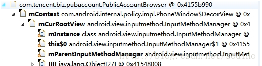
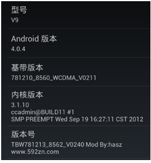
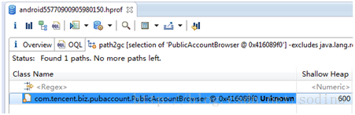
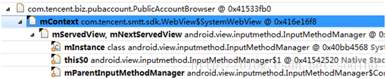
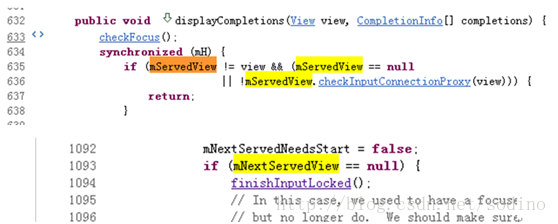

# InputMethodManager内存泄露现象及解决

来源:[Sodino的专栏](http://blog.csdn.net/sodino/article/details/32188809)

## 现象

在特定的机型天语k_touch_v9机型上,某个界面上出现InputMethodManager持有一Activity,导致该Activity无法回收.如果该Activity再次被打开,则旧的会释放掉,但新打开的会被继续持有无法释放回收.MAT显示Path to gc如下:



天语k_touch_v9手机版本信息:



一番搜索后,已经有人也碰到过这个问题(见文章最后引用链接),给出的方法是:

```
public void onDestory() {  
    //Fix memory leak: http://code.google.com/p/android/issues/detail?id=34731  
    InputMethodManager imm = (InputMethodManager) 
    				getSystemService(Context.INPUT_METHOD_SERVICE);  
    imm.windowDismissed(this.getWindow()
    			.getDecorView().getWindowToken()); // hide method  
    imm.startGettingWindowFocus(null); // hide method  
    super.onDestory();  
}
```

但在实践中使用后,没有真正解决,Activity仍存在,但path to gc指向为unknown.如下图:



搜索来的代码不管用,就再想办法.

要想让Activity释放掉,思路就是将path togc这个链路剪断就可以.在这个bug中这个链路上有两个节点mContext(DecorView)和 mCurRootView(InputMethodManager)可供考虑.下面思路就是从这两个节点中选择一个入手剪断path to gc即可.

阅读源码可知, **DecorView继承自FrameLayout,mContext是其上下文环境,牵涉太多,不适合操作入手.mCurRootView在InputMehtodManager中的使用就简单得多了,在被赋值初始化后,被使用的场景只有一次判断及一次日志打印.所以这里选中mCurRootView为突破口.剪断其path to gc的操作为通过Java Reflection方法将mCurRootView置空即可**(见文后代码).

编码实现后,再测,发现仍有泄露,但泄露情况有所变化,如下图:



新的泄露点为mServedView/mNextServedView,可以通过同样的JavaReflection将其置空,剪断path to gc.但这里有个问题得小心,这里强制置空后,会不会引起InputMethodManager的NullPointerException呢?会不会引起系统内部逻辑崩溃?再次查阅源码,发现mServedView及mNextServedView在代码逻辑中一直有判空逻辑,所以这时就可以放心的强制置空来解决问题了.



最后贴出代码实现:

```
public static void fixInputMethodManagerLeak(Context context) {
    if (context == null) {
        return;
    }
    try {
        // 对 mCurRootView mServedView mNextServedView 进行置空...  
        InputMethodManager imm = (InputMethodManager) 
        			context.getSystemService(Context.INPUT_METHOD_SERVICE);
        if (imm == null) {
            return;
        }// author:sodino mail:sodino@qq.com  

        Object obj_get = null;
        Field f_mCurRootView = imm.getClass().getDeclaredField("mCurRootView");
        Field f_mServedView = imm.getClass().getDeclaredField("mServedView");
        Field f_mNextServedView = imm.getClass()
        							.getDeclaredField("mNextServedView");

        if (f_mCurRootView.isAccessible() == false) {
            f_mCurRootView.setAccessible(true);
        }
        obj_get = f_mCurRootView.get(imm);
        if (obj_get != null) { // 不为null则置为空  
            f_mCurRootView.set(imm, null);
        }

        if (f_mServedView.isAccessible() == false) {
            f_mServedView.setAccessible(true);
        }
        obj_get = f_mServedView.get(imm);
        if (obj_get != null) { // 不为null则置为空  
            f_mServedView.set(imm, null);
        }

        if (f_mNextServedView.isAccessible() == false) {
            f_mNextServedView.setAccessible(true);
        }
        obj_get = f_mNextServedView.get(imm);
        if (obj_get != null) { // 不为null则置为空  
            f_mNextServedView.set(imm, null);
        }
    } catch (Throwable t) {
        t.printStackTrace();
    }
}
```

在Activity.onDestory()方法中执行以上方法即可解决.

```
public  void onDestroy() {  
	super.ondestroy();  
	fixInputMethodManagerLeak(this);  
} 
```

事情看上去圆满的解决了，但真的是吗？

经过以上处理后，内存泄露是不存在了，但出现另外一个问题，就是有输入框的地方，点击输入框后，却无法出现输入法界面了！

事故现场复现的操作步骤为：
> ActivityA界面，点击进入Activity B界面，B有输入框，点击输入框后，没有输入法弹出。原因是InputMethodManager的关联View已经被上面的那段代码置空了。

事故原因得从Activity间的生命周期方法调用顺序说起：

从Activity A进入Activity B的生命周期方法的调用顺序是：

> A.onCreate()→A.onResume()→B.onCreate()→B.onResume()→A.onStop()→A.onDestroy()  

也就是说，Activity B已经创建并显示了，ActivityA这里执行onDestroy()将InputMethodManager的关联View置空了，导致输入法无法弹出。

原因发现了，要解决也就简单了。

`fixInputMethodManagerLeak(ContextdestContext)`方法参数中将目标要销毁的Activity A作为参数传参进去。在代码中，去获取InputMethodManager的关联View，通过View.getContext()与Activity A进行对比，如果发现两者相同，就表示需要回收；如果两者不一样，则表示有新的界面已经在使用InputMethodManager了，直接不处理就可以了。

修改后，最终代码如下：

```
public static void fixInputMethodManagerLeak(Context destContext) {
	if (destContext == null) {
		return;
	}
	
	InputMethodManager imm = (InputMethodManager) destContext
						.getSystemService(Context.INPUT_METHOD_SERVICE);
	if (imm == null) {
		return;
	}

	String [] arr = new String[]{"mCurRootView", 
							"mServedView", "mNextServedView"};
	Field f = null;
	Object obj_get = null;
	for (int i = 0;i < arr.length;i ++) {
		String param = arr[i];
		try{
			f = imm.getClass().getDeclaredField(param);
			if (f.isAccessible() == false) {
				f.setAccessible(true);
			} // author: sodino mail:sodino@qq.com
			obj_get = f.get(imm);
			if (obj_get != null && obj_get instanceof View) {
				View v_get = (View) obj_get;
				if (v_get.getContext() == destContext) { 
					// 被InputMethodManager持有引用的context是想要目标销毁的
					f.set(imm, null); // 置空，破坏掉path to gc节点
				} else {
					// 不是想要目标销毁的，即为又进了另一层界面了，
					// 不要处理，避免影响原逻辑,也就不用继续for循环了
					if (QLog.isColorLevel()) {
						QLog.d(ReflecterHelper.class.getSimpleName(), 
							QLog.CLR, "fixInputMethodManagerLeak break, 
									context is not suitable, get_context=" 
									+ v_get.getContext()
									+" dest_context=" + destContext);
					}
					break;
				}
			}
		}catch(Throwable t){
			t.printStackTrace();
		}
	}
}
```

## 引用:
[InputMethodManager:googlecode](http://grepcode.com/file/repository.grepcode.com/java/ext/com.google.android/android/2.3.4_r1/android/view/inputmethod/InputMethodManager.java#InputMethodManager.clearConnectionLocked%28%29)<br/>
[InputMethodManger导致的Activity泄漏](http://hi.baidu.com/auxor/item/2c90272b04f0ad0c76272cfe)<br/>
[MainActivity is not garbage collected after destruction because it is referenced byInputMethodManager indirectly](http://stackoverflow.com/questions/5038158/main-activity-is-not-garbage-collected-after-destruction-because-it-is-reference)<br/>
[InputMethodManagerholds reference to the tabhost - Memory Leak - OOM Error](http://stackoverflow.com/questions/5769748/inputmethodmanager-holds-reference-to-the-tabhost-memory-leak-oom-error)

## 评论

这个问题修复了

[https://github.com/square/leakcanary/issues/1](https://github.com/square/leakcanary/issues/1)

但是在我的锤子T1上面貌似不管用