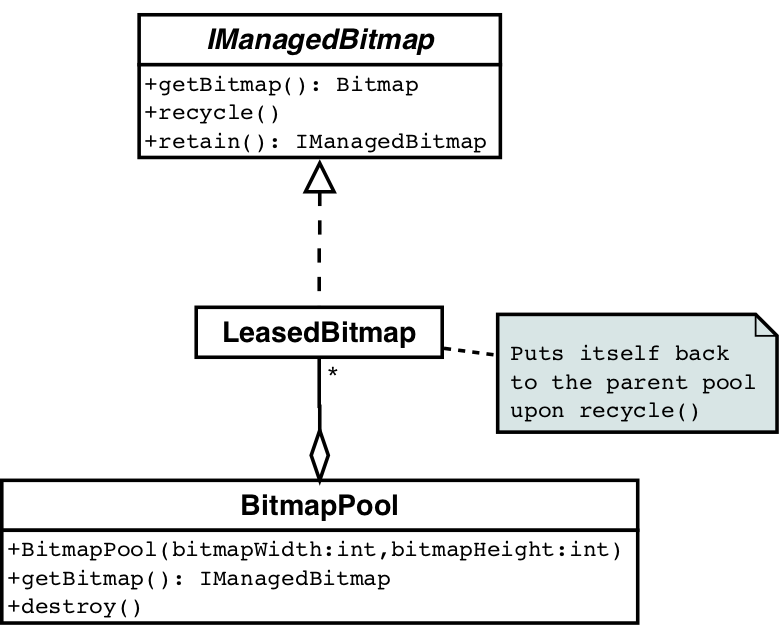
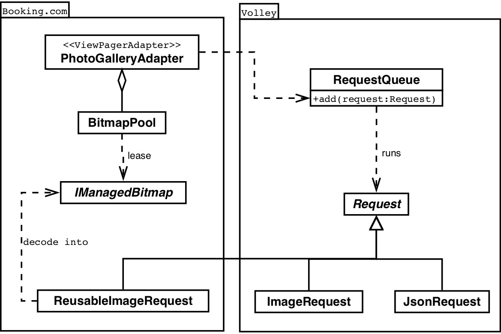

# booking.com android客户端的bitmap复用

来源:[blog.aaapei.com](http://blog.aaapei.com/article/2015/02/bookingcom-androidke-hu-duan-de-bitmapfu-yong)

## 前言
被鞭炮吵得睡不着觉，rss中找一篇简单的文档翻译下，原文链接：http://blog.booking.com/android-reuse-bitmaps.html，大部分团队应该都做过这个bitmap优化，不过估计设置过BitmapFactory.Options.inTempStorage参数的应该不多 :)

booking.com android客户端在新版本的增加了一个新功能：酒店的图片集合


不幸的是，增加了这个新功能后，发现这个应用的内存消耗增长了20%。图片集的界面的滑动有明显的卡顿，经定位，我们发现viewpager加载图片时的gc问题造成了以上的问题。由于应用的图片资源多；控件布局层次复杂；数据量较大，造成内存的申请很容易触发GC。

当申请bitmap内存时，logcat输出信息如下：

```
GC_FOR_ALLOC freed 3255K, 20% free 21813K/26980K, paused 62ms, total 62ms
GC_FOR_ALLOC freed 710K, 20% free 30242K/37740K, paused 72ms, total 72ms
GC_FOR_ALLOC freed <1K, 20% free 31778K/39280K, paused 74ms, total 74ms
```

通过日志信息可以知道，一个bitmap图片的申请，造成应用约70ms的gc停顿，导致应用程序掉5次左右的帧。为了保证应用的流畅体验，必须保证gc停顿的时间降到16ms以下。 我们决定利用inBitmap参数进行图片资源的复用，不过这个参数必须保证图片的大小一致；幸好，在android4.4之后，二次复用的图片不需要严格遵守这个规则，只需保证不比原图片资源大即可。

基于这个api，我们在viewpager adapter中抽象了一个图片池管理图片复用。当一个imageview移除屏幕以外时，apater管理bitmap的生命周期，将其关联的bitmap buffer内存放置到图片池中而不是直接销毁。

## bitmap的生命周期管理

为了管理bitmap内存，需要为bitmap进行引用计数，引用技术的接口是这样的； 



```
package com.booking.util.bitmap;

import android.graphics.Bitmap;

/**
 * A reference-counted Bitmap object. The Bitmap is not really recycled
 * until the reference counter drops to zero.
 */
public interface IManagedBitmap {

    /**
     * Get the underlying {@link Bitmap} object.
     * NEVER call Bitmap.recycle() on this object.
     */
    Bitmap getBitmap();

    /**
     * Decrease the reference counter and recycle the underlying Bitmap
     * if there are no more references.
     */
    void recycle();

    /**
     * Increase the reference counter.
     * @return self
     */
    IManagedBitmap retain();
}
```

其中bitmappool类管理bitmap集合，当不存在bitmap内存时，或新申请，或复用已有内存。 bitmapPool类不直接引用bitmap，而通过IManagedBitmap进行bitmap的引用计数。

由于我们只在主线程进行imageview的创建和销毁，我们被未对BitmapPool进行线程安全同步，如果你需要在后台线程申请位图资源，请自行进行线程同步。

BitmapPool的代码片段是这样的:

```
package com.booking.util.bitmap;

import java.util.Stack;

import android.graphics.Bitmap;
import android.os.Handler;

/**
 * A pool of fixed-size Bitmaps. Leases a managed Bitmap object
 * which is tied to this pool. Bitmaps are put back to the pool
 * instead of actual recycling.
 *
 * WARNING: This class is NOT thread safe, intended for use
 *          from the main thread only.
 */
public class BitmapPool {
    private final int width;
    private final int height;
    private final Bitmap.Config config;
    private final Stack<Bitmap> bitmaps = new Stack<Bitmap>();
    private boolean isRecycled;

    private final Handler handler = new Handler();

    /**
     * Construct a Bitmap pool with desired Bitmap parameters
     */
    public BitmapPool(int bitmapWidth,
                      int bitmapHeight,
                      Bitmap.Config config)
    {
        this.width = bitmapWidth;
        this.height = bitmapHeight;
        this.config = config;
    }

    /**
     * Destroy the pool. Any leased IManagedBitmap items remain valid
     * until they are recycled.
     */
    public void recycle() {
        isRecycled = true;
        for (Bitmap bitmap : bitmaps) {
            bitmap.recycle();
        }
        bitmaps.clear();
    }

    /**
     * Get a Bitmap from the pool or create a new one.
     * @return a managed Bitmap tied to this pool
     */
    public IManagedBitmap getBitmap() {
        return new LeasedBitmap(bitmaps.isEmpty()
            ? Bitmap.createBitmap(width, height, config) : bitmaps.pop());
    }

    private class LeasedBitmap implements IManagedBitmap {
        private int referenceCounter = 1;
        private final Bitmap bitmap;

        private LeasedBitmap(Bitmap bitmap) {
            this.bitmap = bitmap;
        }

        @Override
        public Bitmap getBitmap() {
            return bitmap;
        }

        @Override
        public void recycle() {
            handler.post(new Runnable() {
                @Override
                public void run() {
                    if (--referenceCounter == 0) {
                        if (isRecycled) {
                            bitmap.recycle();
                        } else {
                            bitmaps.push(bitmap);
                        }
                    }
                }
            });
        }

        @Override
        public IManagedBitmap retain() {
            ++referenceCounter;
            return this;
        }
    }
}
```

## 网络层
Booking.com客户端的网络通信层使用Vollery框架，默认情况下，Volley通过ImageRequest进行网络图片的bitmap的获取，为了和ImagePool集成，我们实现了一个自定义的ImageRequest（ReusableImageRequest）,ReusableImageRequest内部持有一个IManagedBitmap进行bitmap的解码。 为了避免内存泄漏，当ReusableImageRequest被取消时，需要有机制通知IManagedBitmap进行引用释放，因此，我们为ReusableImageRequest扩展了一个onFinished方法。

与volley的结构图是这样的：



## 其他工作

当我们实现了一个自定义的ImageRequest时，我们还利用 [BitmapFactory.Options.inTempStorage](http://developer.android.com/reference/android/graphics/BitmapFactory.Options.html#inTempStorage). 参数进行了图片解码的优化。inTempStorege可以预申请一块内存，对所有解码过程中指定相同的内存，以达到减少临时内存的目的。