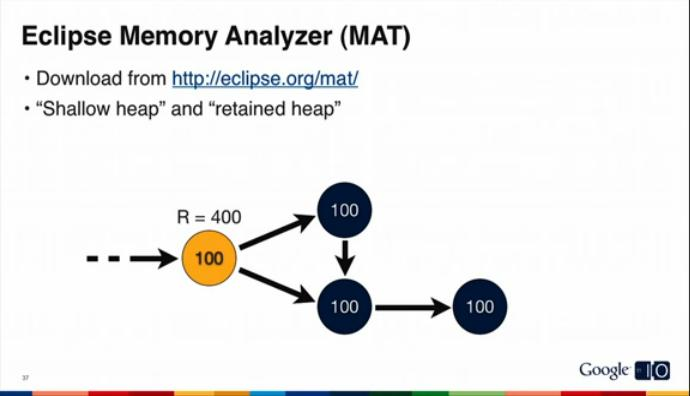
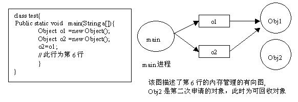
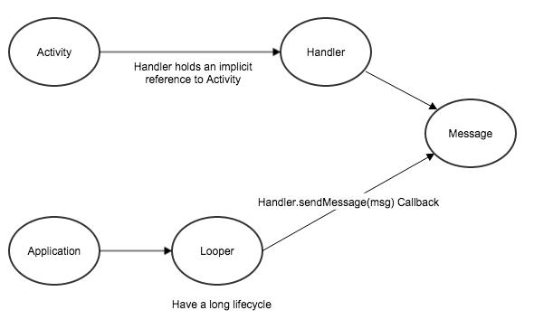

# 简析Android的垃圾回收与内存泄露

来源:[简书](http://www.jianshu.com/p/8c6cf3d7a98a)

> Android系统是运行在Java虚拟机上的，作为嵌入式设备，内存往往非常有限，了解Android的垃圾回收机制，可以有效的防止内存泄露问题或者OOM问题。本文作为入门文章，将浅显的讨论垃圾回收与内存泄露的原理，不讨论Dalvik虚拟机底层机制或者native层面的问题。

## 1. 基础
在分析垃圾回收前，我们要复习Java与离散数学的基础。

* **实例化：**对象是类的一个实例，创建对象的过程也叫类的实例化。对象是以类为模板来创建的。比如Car car = new Car();，我们就创造了一个Car的实例（Create new class instance of Car）

* **引用：**某些对象的实例化需要其它的对象实例，比如ImageView的实例化就需要Context对象，就是表示ImageView对于Context持有引用(ImageView holds a reference to Context)。

* **有向图：**在每条边上都标有有向线段的图称为有向图，Java中的garbage collection采用有向图的方式进行内存管理，箭头的方向表示引用关系，比如 B ← A ,就是B中需要A，B引用A。

* **可达：**有向图D={S,R}中，对于Si,Sj 属于S，如果从Si到Sj有任何一条通路存在，则可称Si可达Sj。也就是说，当B ← A中间箭头断了，就称作不可达，这时A就不可达B了。

* **Shallow heap**与**Retain heap**的对比

   * **Shallow heap**表示当前对象所消耗的内存
   * **Retained heap**表示当前对象所消耗的内存加上它引用的内存总合



<center><i>Google I/O 2011: Memory management for Android Apps</i></center>

上图的橙色的Object是该有向图的起点，它的Shallow heap是100，而它的Retained heap是100 + 300 = 400。

## 2. 什么是垃圾回收
Java GC（Garbage Collection，垃圾收集，垃圾回收）机制，是Java与C++/C的主要区别之一，作为Java开发者，一般不需要专门编写内存回收和垃圾清理代码，对内存泄露和溢出的问题，也不需要像C程序员那样战战兢兢。这是因为在Java虚拟机中，存在自动内存管理和垃圾清扫机制。概括地说，该机制对虚拟机中的内存进行标记，并确定哪些内存需要回收，根据一定的回收策略，自动的回收内存，永不停息（Nerver Stop）的保证虚拟机中的内存空间，防止出现内存泄露和溢出问题。

## 3. 什么情况需要垃圾回收
对于GC来说，当程序员创建对象时，GC就开始监控这个对象的地址、大小以及使用情况。通常GC采用有向图的方式记录并管理堆中的所有对象，通过这种方式确定哪些对象时“可达”，哪些对象时“不可达”。当对象不可达的时候，即对象不再被引用的时候，就会被垃圾回收。

网上有很多文档介绍可达的关系了，如图，在第六行的时候，o2改变了指向，Obj2就不再引用main的了，即他它们是不可达的，Obj2就可能在下次的GC中被回收。



<center><i>developerWorks Java technology</i></center>

4. 什么是内存泄露
当你不再需要某个实例后，但是这个对象却仍然被引用，**防止被垃圾回收**(Prevent from being bargage collected)。这个情况就叫做**内存泄露**(Memory Leak)。

下面将以[How to Leak a Context: Handlers & Inner Classes](http://www.androiddesignpatterns.com/2013/01/inner-class-handler-memory-leak.html)这篇文章翻译为例，介绍一个内存泄露。

看如下的代码

```
public class SampleActivity extends Activity {

  private final Handler mLeakyHandler = new Handler() {
    @Override
    public void handleMessage(Message msg) {
      // ... 
    }
  }
}
```

当你打完这个代码后，IDE应该就会提醒你

> In Android, Handler classes should be static or leaks might occur.

* 当你启动一个application时，它会自动在主线程创建一个Looper对象，用于处理Handler中的message。Looper实现了简单的消息队列，在循环中一个接一个的处理Message对象。大多数Application框架事件（比如Activity生命周期调用，按钮点击等）都在Message中，它们在Looper的消息队列中一个接一个的处理。注意Looper是存在于application整个生命周期中。
* 当你新建了一个handler对象后，它会被分配给Looper的消息队列。被发送到消息队列的Message将保持对Handler的引用，因为当消息队列处理到这个消息时，需要使用[Handler#handleMessage(Message)](http://developer.android.com/reference/android/os/Handler.html#handleMessage(android.os.Message)这个方法。(也就是说，只要没有处理到这个Message，Handler就一直在队列中被引用)

* 在java中，非静态的内部Class与匿名Class对它们外部的Class有强引用。static inner class除外。



现在，我们尝试运行如下代码

```
public class SampleActivity extends Activity {

  private final Handler mLeakyHandler = new Handler() {
    @Override
    public void handleMessage(Message msg) {
      // ...
    }
  }

  @Override
  protected void onCreate(Bundle savedInstanceState) {
    super.onCreate(savedInstanceState);

    // Post a message and delay its execution for 10 minutes.
    mLeakyHandler.postDelayed(new Runnable() {
      @Override
      public void run() { /* ... */ }
    }, 1000 * 60 * 10);

    // Go back to the previous Activity.
    finish();
  }
}
```

这个程序很简单，我们可以脑补一下，它应该是启动了又瞬间关闭，但是事实真的是关闭了吗？

稍有常识的人可以看出，它发送了一个Message，将在十分钟后运行，也就是说Message将被保持引用达到10分钟，这就照成了至少10分钟的内存泄露。

最后正确的代码如下

```
public class SampleActivity extends Activity {

  /**
   * Instances of static inner classes do not hold an implicit
   * reference to their outer class.
   */
  private static class MyHandler extends Handler {
    private final WeakReference<SampleActivity> mActivity;

    public MyHandler(SampleActivity activity) {
      mActivity = new WeakReference<SampleActivity>(activity);
    }

    @Override
    public void handleMessage(Message msg) {
      SampleActivity activity = mActivity.get();
      if (activity != null) {
        // ...
      }
    }
  }

  private final MyHandler mHandler = new MyHandler(this);

  /**
   * Instances of anonymous classes do not hold an implicit
   * reference to their outer class when they are "static".
   */
  private static final Runnable sRunnable = new Runnable() {
      @Override
      public void run() { /* ... */ }
  };

  @Override
  protected void onCreate(Bundle savedInstanceState) {
    super.onCreate(savedInstanceState);

    // Post a message and delay its execution for 10 minutes.
    mHandler.postDelayed(sRunnable, 1000 * 60 * 10);

    // Go back to the previous Activity.
    finish();
  }
}
```

## 结论
* GC是按照有向图是否可达来判断对象实例是否有用
* 如果不在需要某个实例，却仍然被引用，这个情况叫做内存泄露
* 匿名类/非静态类内部class会保持对它所在Activity的引用，使用时要注意它们的生命周期不能超过Activity，否则要用static inner class
* 善于在Activy中的生命周期(比如onPause)中[手动控制](http://stackoverflow.com/a/13560296/4016014)其他类的生命周期
* 最后再补充一下iOS的情况，iOS在新版的OC与Swift中，已经引入了新的内存管理体系ARC(auto reference counting，引用自动计数)，C代码在编译时，编译器自动适时的添加释放内存的代码。

## References

* [http://www.jianshu.com/p/22e73e80e950](http://www.jianshu.com/p/22e73e80e950)
* [http://www.ibm.com/developerworks/cn/java/l-JavaMemoryLeak/](http://www.ibm.com/developerworks/cn/java/l-JavaMemoryLeak/)
* [http://stackoverflow.com/a/70358/4016014](http://stackoverflow.com/a/70358/4016014)
* [http://blog.csdn.net/luoshengyang/article/details/8852432](http://blog.csdn.net/luoshengyang/article/details/8852432)
* [http://developer.android.com/training/articles/perf-tips.html](http://developer.android.com/training/articles/perf-tips.html)
* [https://techblog.badoo.com/blog/2014/08/28/android-handler-memory-leaks/](https://techblog.badoo.com/blog/2014/08/28/android-handler-memory-leaks/)


