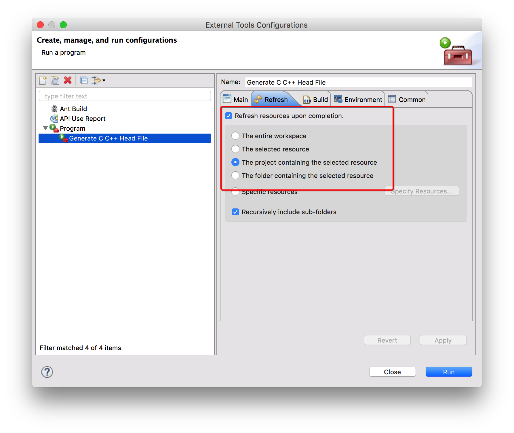

# JNI与原生代码通信

## 什么是JNI？

> JNI：Java Native Interface

## JNI的能力

* 允许Java类的默写方法原生实现
* 能够像普通Java方法一样调用原生方法
* 原生方法可以使用Java对象，使用方法与java代码使用对象的方法一致
* 原生方法可以创建新的Java对象或者使用Java应用程序创建的对象

## JNI开发流程 - 示例(ndk的hello-jni示例)

### 原生方法声明

使用`native`关键字声明一个native方法，但是不能有方法体(因为方法需要让jni层实现)


```
/* 原生方法由'hello-jni'原生库实现
 *
 * 'hello-jni',该原生库与本应用程序一起打包
 */
public native String stringFromJNI();
```

此时还不能直接调用这个方法，因为虚拟机不知道到哪里去找这个方法的实现

### 加载共享库

原生方法被编译成一个共享库。需要先加载共享库，虚拟机才能找到原生方法的实现。
java.lang.System类提供了两个静态方法，`load`和`loadLibrary`，用于在运行时加载共享库。

```
/* 这段代码用于在应用程序启动的时候加载'hello-jni'库
 * 该库在安装时由包管理器解压到/data/data/包名/lib/libhello-jni.so中
 */
 static{
 	System.loadLibrary("hello-jni");
 }
```

Java的设计目标是平台独立，作为Java框架API的一部分，`loadLibrary`也要保持平台独立性。尽管Android NDK生成的实际共享库被命名为`libhello-jni.so`,但是`loadLibrary`方法只能使用`hello-jni`这个库名，在按照所使用的具体操作系统加上必要的前缀或者后缀。库名与`Android.mk`文件中使用`LOCAL_MODULE`构建系统变量定义的模块名一致。

`loadLibrary`的参数也不包含共享库的位置。Java库路径，也就是系统属性`java.library.path`保存`loadLibrary`方法在共享库搜索的目录列表，Android上的Java库路径包含`/vendor/lib`和`/system/lib`.

需要强调的是，`loadLibrary`在扫描Java库路径时，一旦返现同名的库，立即加载共享库。因为Java库路径的第一组目录是Android系统目录，为了避免与系统库命名冲突，强烈建议开发人员为每个共享库选择唯一的名字。

### 实现原生方法

#### C/C++头文件生成器:javah

让原生函数名以及参数列表和Java类文件的原始定义一致是繁杂而多余的，因为JDK自带一个名为`javah`的命令行工具来执行任务，`javah`工具可以为原生方法解析Java类文件并生成由原生方法声明组成的头文件。

* 在命令行方式下运行

将当前工作目录改为`HelloJni`项目的导入目录，即`<Eclispe Workspace>/HelloJni`,`javah`工具对编译过的Java类文件进行操作，用编译过的类文件所在的位置和要解析的Java类名为参数调用`javah`,命令格式如下：

```
javah -classpath bin/classes com.example.hello.HelloJni
```

`javah`工具讲解析`com.example.hellojni.HelloJni`类文件，且生成`com_example_hellojni_HelloJni.h`的C/C++头文件，生成的方法签名内容如下：

```
Java_com_example_hellojni_HelloJni_stringFromJNI(JNIEnv*,jobject)
```

* 在Eclipse中运行

打开Eclipse,菜单栏选择Run->External Tools -> External Tools Configurations.
在打开的`External Tools Configurations`对话框中选择Program，单击`New launch configuration`按钮，单击Main选项卡，按照下面的内容进行填写：


```
// MacOS / Linux
-classpath "${project_classpath}:${env_var:ANDROID_SDK_HOME}/platforms/android-15/android.jar" ${java_type_name}

// Windows
-classpath "${project_classpath};${env_var:ANDROID_SDK_HOME}/platforms/android-15/android.jar" ${java_type_name}
```

切换到Refresh选项卡，勾选`Refresh resource upon completion`，并在列表中选择`The project containint the selected resource`


切换到Common选项卡，选中`Display in favorites menu`组下的复选框`External Tools`


点击OK保存配置。


*macos下配置Android SDK和Android NDK环境变量*

```
// 配置SDK
echo export ANDROID_SDK_HOME=/Users/wangheng/Android/android-sdk-macosx >> ~/.bash_profile
echo export PATH=\$ANDROID_SDK_HOME/tools:\$ANDROID_SDK_HOME/platform-tools:\$PATH >> ~/.bash_profile

// 配置NDK
echo export ANDROID_NDK_HOME=/Users/wangheng/Android/android-ndk-r10e >> ~/.bash_profile
echo export PATH=\$ANDROID_NDK_HOME:\$PATH >> ~/.bash_profile

```

运行新创建的这个Program,即可生成指定.h文件

#### 方法声明

尽管java方法`stringFromJNI`不带任何参数，但是原生方法带有两个参数:

```
JNIEXPORT jstring JNICALL Java_com_example_hellojni_HelloJni_stringFromJNI
  (JNIEnv *, jobject);
```

第一个参数`JNIEnv`是指向可用JNI函数表的接口指针；
第二个参数`jobject`是HelloJni类的Java对象引用

* JNIEnv接口指针

原生代码通过`JNIEnv`接口指针提供的各种函数来使用虚拟机功能。`JNIEnv`是要给指向线程-局部数据的指针，而线程-局部数据中包含指向函数表的指针。实现原生方法的函数讲`JNIEnv`接口指针作为它们的第一个参数。

> 注意，传递给每一个原生方法调用的JNIEnv接口指针在与方法调用相关的线程中也有效，但是它不能被缓存以及被其他线程使用

原生代码是C与原生代码是C++其调用JNI函数的语法不通。C语言中，`JNIEnv`是指向`JNINativeInterface`结构的指针，为了访问任何一个JNI函数，该指针需要首先被解引用。因为C代码的JNI函数不了解当前的JNI环境，`JNIEnv`实例应该作为第一个参数传递给每一个JNI函数，格式如下:

```
return (*env)->NewStringUTF(env,"Hello from JNI!!!");
```

在C++中，`JNIEnv`实际上是C++类实例，JNI函数以成员函数的形式存在。因为JNI方法已经访问了当前JNI环境，因此JNI方法调用不要求JNIEnv实例作为参数，在C++中，完成同样功能的函数调用格式:

```
return env->NewStringUTF("Hello from JNI!!!");
```

* 实例方法和静态方法

实例方法和类实例有关，他们只能在类实例中调用；静态方法不与类实例相关，他们可以再静态上下文中直接调用。静态方法和实例方法均可以声明为原生的，可以通过JNI技术以代码的形式提供他们的实现。原生实例方法通过第二个参数获取实力引用，该参数是jobject类型的。

因为静态方法没有与实例绑定，所以第二个参数是类引用而不是实例引用，第二个参数是jclass类型的：

```
JNIEXPORT jstring JNICALL Java_com_example_hellojni_HelloJni_getStringFromJNI
  (JNIEnv *, jclass);
```

## 数据类型

### Java数据类型
* 基本数据类型:boolean、byte、char、short、int、long、float、double
* 引用类型:字符串型、数组类型等等

### 基本数据类型映射

|Java类型|JNI类型|C/C++类型|大小|
|:--:|:--:|:--:|:--:|
|boolean|jboolean|unsigned char|无符号8位|
|byte|jbyte|char|有符号8位|
|char|jchar|unsigned short|无符号16位|
|short|jshort|short|有符号16位|
|int|jint|int|有符号32位|
|long|jlong|long long|有符号64位|
|float|jfloat|float|32位|
|double|jdouble|double|64位|


### 引用类型

与基本数据类型不同，引用类型对原生方法不透明；它们的内部数据结构并不直接向原生代码公开

|Java类型|原生类型|
|:--:|:--:|
|java.lang.Class|jclass|
|java.lang.Throwable|jthrowable|
|java.lang.String|jstring|
|Other objects|jobjects|
|java.lang.Object[]|jobjectArray|
|boolean[]|jbooleanArray|
|byte[]|jbyteArray|
|char[]|jcharArray|
|short[]|jshortArray|
|int[]|jintArray|
|long[]|jlongArray|
|float[]|jfloatArray|
|double[]|jdoubleArray|
|Other Arrays|jarray|

## 对引用类型的操作

引用类型以不透明的引用方式传递给原生代码，而不是以原生数据类型的方式呈现，因此引用类型不能直接使用和修改。JNI提供了与这些应用类型密切相关的一组API，这些API通过JNIEnv接口指针提供给原生函数。

### 字符串

JNI把Java字符串当成应用类型来处理。这些应用类型并不像原生C字符串一样可以直接使用。JNI提供了Java字符窜和C字符串之间相互转换的必要函数，因为Java字符串不可变，所以JNI不提供任何修改现有Java字符串内容的函数；JNI支持Unicode编码格式和UTF-8编码格式的字符串，还提供两组函数通过JNIEnv接口指针处理这些字符串编码。

* 创建Java字符串

*NewString* 返回一个Unicode编码格式的Java字符串应用类型的jstring
*NewStringUTF* 返回一个UTF-8编码格式的Java字符串应用类型的jstring

```
jstring javaString;
javaString = (*env)->NewStringUTF(env,"Hello World!");;
```

在内存溢出的情况下，这些函数返回`NULL`以通知原生代码在虚拟机中抛出异常，这样原生代码就会停止运行

* Java字符串转为C字符串

Java字符串不能直接使用，需要使用`GetStringChars`函数讲Unicode的Java字符串转为C字符串或者用`GetStringUTFChars`函数将UTF-8格式的Java字符串转为C字符串；这两个函数的第三个参数均为可选参数(参数名isCopy)，它让调用者确定返回的C字符串地址指向副本还是指向堆中的固定对象：

```
const jbyte* str;
jboolean isCopy;

str = (*env)->GetStringUTFChars(env,javaString,&isCopy);
if(0 != str){
	printf("Java string:%s",str);
	
	if(JNI_TRUE == isCopy){
		printf("C string is a copy of the java string.");
	}else{
		printf("C string points to actual string.");
	}
}
```

* 释放字符串

通过JNI `GetStringChars`和`GetStringUTFChars`函数获得的C字符串在原生代码中使用完之后需要正确的释放，否则将会引起内存泄露。JNI提供了`ReleaseStringChars`函数释放Unicode编码格式的字符串，提供了`ReleaseStringUTFChars`函数释放UTF-8编码格式的字符串:

```
(*env)->ReleaseStringUTFChars(env,javaString,str);
```

### 数组

JNI把Java数组当成引用类型处理，JNI提供必要的函数访问和处理Java数组。

* 创建数组

用`New<Type>Array`函数在原生代码中创建数组实例，其中`<Type>`可以是`int`,`char`,`boolean`等,例如`NewIntArray`,使用这些函数的时候，应该以参数形式给出数组大小：

```
jintArray javaArray;

javaArray = (*env)->NewIntArray(env,10);

if(javaArray != 0){
	/** 可以使用数组了 **/
}

```

与`NewString`函数一样，在内存溢出的情况下，`New<Type>Array`函数讲返回`NULL`以通知原生代码虚拟机中有异常抛出，这样原生代码就会停止运行。

* 访问数组元素

JNI提供两种访问Java数组元素的方法，可以将数组复制成C数组或者让JNI提供直接指向数组元素的指针。

* 对副本的操作

`Get<Type>ArrayRegion`函数将给定的基本Java数组复制到给定的C数组中：

```
jint nativeArray[10];
(*env)->GetIntArrayRegion(env,javaArray,0,10,nativeArray);
```

原生代码可以像使用普通的C数组一样使用和修改数组元素。当原生代码想将所做的修改提交给Java素组时，可以使用`Set<Type>ArrayRegion`函数将C数组复制回Java数组：

```
(*env)->SetIntArrayRegion(env,javaArray,0,10,nativeArray);
```

当数组很大时，为了对数组进行操作而复制数组会引起性能问题。在这种情况下，如果可能的话，原生代码应该只获取或者设置数组元素区域而不是获取整个数组。另外JNI提供了不同的函数集以获得数组元素而非其副本的直接指针

* 对直接指针的操作

可能的话，原生代码可以用`Get<Type>ArrayElements`函数获得指向数组元素的直接指针：

```
jnit *nativeDirectArray;
jboolean isCopy;

nativeDirectArray = (*env)->GetIntArrayElements(env,javaArray,&isCopy);
```

因为可以像普通的C数组一样访问和处理数组元素，因此JNI没有提供访问和处理数组元素的方法，JNI要求原生代码用完这些指针立即释放，否则会出现内存泄露。原生代码可以使用JNI提供的`Release<Type>ArrayElements`函数释放`Get<Type>ArrayElements`函数返回的C数组：

```
(*env)->ReleaseIntArrayElements(env,javaArray,nativeDirectArray,0);
```

该函数带有四个参数，第四个参数是释放模式，参考如下：

|释放模式|动作|
|:--:|:--:|
|0|将内容赋值回来并释放原生数组|
|JNI_COMMIT|将内容赋值回来但是不释放原生数组，一般用于周期性的更新一个Java数组|
|JNI_ABORT|释放原生数组但不用将内容释放回来|

### NIO操作

原生IO(NIO)在缓冲管理区、大规模网络和文件IO及字符集支持方面的性能有所改进，JNI提供了在原生代码中使用NIO的函数。与数组操作相关 ,NIO混充去的数据传送性能较好，更适合在原生代码和Java应用程序之间传送大量数据。

* 创建直接字节缓冲区

原生代码可以创建Java使用的直接字节缓冲区，该过程是以提供一个原生C字节数组为基础的:

```
unsigned char* buffer = (unsigned char*)malloc(1024);
...
jobject directBuffer;
directBuffer = (*env)->NewDirectByteBuffer(env,buffer,1024);

```

> 原生方法中的内存分配超出了虚拟机的管理范围，且不能用虚拟机的GC机制回收原生方法中的内存，原生方法应该通过释放未使用的内存分配以避免内存泄露来正确管理内存。

* 直接字节缓冲区获取

Java也可以创建直接字节缓冲区，在原生代码中调用`GetDirectBufferAddress`方法可以获得原生字节数组的内存地址：

```
unsigned char* buffer;
buffer = (unsigned char*) (*env)->GetDirectBufferAddress(env,directBuffer);
```

### 访问变量

JNI提供了访问静态变量和实例变量的方法:

```
public class JavaClass{
	/** 实例变量 **/
	private String instanceField = "Instance Field";
	
	/** 静态变量 **/
	private static String staticField = "Static Field";
}
```

* 获取变量Id 

获取变量Id都是通过类的Class对象获取的


```
// 获取指定对象的class
jclass clazz;
clazz = (*env)->GetObjectClass(env,thiz);

```

获取Class之后，就可以通过`GetFiledId`获取实例变量，通过`GetStaticFieldId`获取静态变量：

```
// 获取实例变量Id
jfieldID instanceFieldId;
instanceFieldId = (*env)->GetFieldId(env,thiz,"instanceField","Ljava/lang/String;");

// 获取静态变量id
jfieldID staticFieldId;
staticFieldId = (*env)->GetStaticFieldId(env,clazz,"staticField","Ljava/lang/Stirng;");

```

为了提高应用程序性能，可以缓存变量Id，一般总是缓存使用最频繁的变量Id

* 获取字段的值

得到字段Id之后，就可以通过`GetObjectField`获取实例变量的值或者使用`GetStaticObjectFiled`获取静态变量的值了：

```
// 获取实例变量的值
jstring instanceField = (*env)->GetObjectField(instanceFiledId);

// 获取静态变量的值
jstring staticField = (*env)->GetStaticObjectField(staticFieldId);

```

> 注意，如果内存溢出，这些函数返回`NULL`，此时原生代码不会继续执行

**获得单个变量需要调用两到三个JNI函数，原生代码回到Java中获取每个单独的变量，这给应用程序增加了额外的负担，进而导致性能下降。强烈建议将所有需要的参数传递给原生方法调用，而不是让原生代码到Java中取**

### 调用方法

与字段一样，JNI提供访问静态方法和实例方法的函数

```
public class JavaClass{
	
	// 实例方法
	private String instanceMethod(){
		return "Instance Method";
	}
	// 静态方法
	private static String staticMethod(){
		return "Static Method";
	}

}
```

* 获取方法ID

可以通过`GetMethodID`获取实例方法ID，通过`GetStaticMethodID`获取静态方法的ID

```
// 首先获取指定类的class
jclass clazz = (*env)->GetObjectClass(env,thiz);

// 获取实例方法的MethodID
jmethodID instanceMethodId = (*env)->GetMethodID(env,clazz,"instanceMethod","()Ljava/lang/String;");

// 获取静态方法的MethodID
jmethodID staticMethodId = (*env)->GetStaticMethodID(env,clazz,"staticMethod","()Ljava/lang/String;");
```

与字段一样，最后一个参数表示方法描述符，在Java中他表示方法签名

> 为了提升应用性能，可以缓存方法ID，一般总是缓存使用最频繁的方法ID

* 调用方法

可以以方法ID为参数调用`Call<Type>Method`函数来调用实例方法，或者调用`CallStatic<Type>Method`函数调用静态方法：

```
jstring instanceMethodResult = (*env)->CallStringMethod(env,thiz,instanceMethodId);

jstring staticMethodResult = (*env)->CallStaticStringMethod(env,clazz,staticMethodId);
```

### 变量和方法描述符


> 注意几个比较特殊的：void对应的是V，boolean对应的是Z,long对应的是J

用类型签名映射手工生成变量和方法描述符并让它们跟Java代码同步是一件非常繁琐的任务，所以可以使用javap工具，他可以从class文件中得到变量和方法的描述符

* 命令行下运行

进入<project_path>目录，然后运行:`javap -classpath bin/classes -p -s 包名.类名`,或者进入到<project_path>/bin/classes下运行`javap -p -s 包名.类名`

例子:

```
gebilaowang$ javap -p -s com.example.hellojni.HelloJni
Compiled from "HelloJni.java"
public class com.example.hellojni.HelloJni extends android.app.Activity {
  private java.lang.String name;
    Signature: Ljava/lang/String;
  private static java.lang.String company;
    Signature: Ljava/lang/String;
  static {};
    Signature: ()V

  public com.example.hellojni.HelloJni();
    Signature: ()V

  public void onCreate(android.os.Bundle);
    Signature: (Landroid/os/Bundle;)V

  public native java.lang.String stringFromJNI();
    Signature: ()Ljava/lang/String;

  public native java.lang.String unimplementedStringFromJNI();
    Signature: ()Ljava/lang/String;

  public static native java.lang.String getStringFromJNI();
    Signature: ()Ljava/lang/String;

  public static native int getInt();
    Signature: ()I

  public native java.lang.String getString();
    Signature: ()Ljava/lang/String;

  private java.lang.String printByInstance(java.lang.String);
    Signature: (Ljava/lang/String;)Ljava/lang/String;

  private static void printByStatic();
    Signature: ()V
}
```

* Eclipse下调用，参考javah,并在第一步按照下图进行配置


然后执行这个程序就可以在Console中看到相同的输出

## 异常处理

异常处理是Java的重要功能，JNI的异常行为与Java中有所不同。在Java中，当抛出一个异常时，虚拟机停止停止执行代码块并进入调用栈反向检查能处理特定类型异常的异常处理程序代码块，这也叫异常捕获。虚拟机清除异常并将控制权交给异常处理程序。相比之下，JNI要求开发人员在异常发生后显式地实现异常处理流。

* 捕获异常

JNIEnv提供了一组与异常相关的函数集，在运行过程中可以使用Java类查看这些函数：

```
// 抛出方法
public class JavaClass{
		private void throwingMethod() throws NullPointerException{
			throw new NullPointerException("Null Pointer");
		}
}
// 访问方法(原生方法)
private native void accessMethods();
```

调用`throwingMethod`方式时，`accessMethods`原生方法需要显式的做异常处理。JNI提供了`ExeptionOccurred`函数查询虚拟机中是否有挂起的异常。在使用完之后，异常处理程序需要用`ExceptionClear`函数显示的清除异常：

```
jthrowable ex;
...
(*env)->CallVoidMethod(env,thiz,throwingMethodID);
ex = (*env)->ExceptionOccurred(env);
if(0 != ex){
	(*env)->ExceptionClear(env);
	/** Exception处理 **/
}

```

* 抛出异常

JNI也允许原生代码抛出异常。因为异常是Java类，应该先用`FindClass`函数找到异常类，用`ThrowNew`函数可以初始化且抛出新的异常：

```
jclass clazz;
...
clazz = (*env)->FindClass(env,"java/lang/NullPointerException");

if(0 != clazz){
	(*env)->ThrowNew(env,clazz,"Exception Message!");
}

```

因为原生代码执行不受虚拟机的控制，因此异常并不会停止原生代码执行并把控制权转交给异常处理程序。到抛出异常时，原生函数应该释放所有已分配的原生资源，例如内存以及合适的返回值等。通过JNIEnv接口获得的引用是局部引用且一旦返回原生函数，他们自动的被虚拟机释放。

## 局部和全局引用


虚拟机通过追踪类实例的引用并收回不再引用的垃圾来管理类实例的使用期限。因为原生代码不是一个管理环境，因此JNI提供了一组函数允许原生代码显式的管理对象引用和使用期间原生大代码。JNI支持三种引用：局部引用、全局引用和弱全局引用

* 局部引用

大多数JNI函数返回局部引用。局部引用不能在后续的调用中被缓存和重用，主要因为它们的使用期限仅限于原生方法，一旦原生函数返回，局部引用即被释放。例如：`FindClass`函数返回一个局部引用，当原生方法返回时，它被自动释放，也可以用`DeleteLocalRef`函数显式的释放原生代码：

```
jclass clazz;
clazz = (*env)->FindClass(env,"java/lang/String");
...

(*env)->DeleteLocalRef(env,clazz);

```

根据JNI规范，虚拟机应该允许原生代码创建至少16个局部引用，在单个方法调用时进行多个内存密集型操作的最佳实践是删除未用的局部变量。如果不可能，原生代码可以在使用之前用`EnsureLocalCapacity`方法请求更多的局部变量引用槽。

* 全局引用

全局引用在原生方法的后续调用过程中依然有效，除非它们被原生代码显式释放。

**创建全局引用**

可以使用`NewGlobalRef`函数将局部引用初始化微全局引用

```
jclass localClazz;
jclass globalClazz;
...
localClazz = (*env)->FindClass(env,"java/lang/String");
globalClazz = (*env)->NewGlobalRef(env,localClazz);
...
(*env)->DeleteLocalRef(env,localClazz);

```

**删除全局引用**

当原生代码不再需要一个全局引用时，可以随时用`DeleteGlobalRef`函数释放它:

```
(*env)->DeleteGlobalRef(env,globalClazz);
```

* 弱全局引用

全局引用的另一种类型是弱全局引用。与全局引用一样，弱全局引用在原生方法的后续调用中仍然有效。但是弱全局引用不阻止潜在的对象被GC回收

**创建 - NewWeakGlobalRef**

```
jclass weakGlobalClazz = (*env)->NewWeakGlobalRef(env,localClazz);
```

**有效性检查 - IsSameObject**:是否仍然指向活动的类实例

```
if(JNI_FLASE == (*env)->IsSameObject(env,weakGlobalClazz,NULL)){
	// 对象仍然处于活动状态且可以使用
}else{
	// 对象被GC回收，不能使用
}
```

**删除 - DeleteWeakGlobalRef**

```
(*env)->DeleteWeakGlobalRef(env,weakGlobalClazz);

```
全局应用释放前一直有效，它们可以被其他函数以及原生线程使用。

## 线程

作为多线程环境的一部分，虚拟机支持运行原生代码。在开发原生组件时要记住JNI技术的一些约束：

* 只在native方法执行期间以及在执行原生方法的线程环境下局部引用是有效的，局部变量不能在多线程间共享
* 被传递给每个native方法的JNIEnv接口指针在与方法调用相关的线程中也是有效的，它不能被其他线程缓存或者使用


### 同步

与Java的同步类似，JNI的监视器允许原生代码利用java对象同步，虚拟机保证存取监视器的线程能够安全执行，而其他线程等待监视器对象变成可用状态:

```
// java同步代码块
synchronized(obj){
	// 同步执行安全代码块
}

// JNI同步
if(JNI_OK == (*env)->MotitorEnter(env,obj)){
	/** 错误处理 **/
}

/** 同步线程安全代码块 **/

if(JNI_OK == (*env)->MonitorExit(env,obj)){
	/** 错误处理 **/
}

```

> 对MonitorEnter函数的调用应该与MonitorExit的调用相匹配，从而避免出现死锁

### 原生线程

为了执行特定任务，这些native组件可以并行使用native线程。因为VM不知道的native 线程，因此它们不能与Java组件直接通信。为了与应用的依然活跃部分交互，原生线程应该先附着在VM上。

JNI通过JavaVM接口指针提供了`AttachCurrentThread`函数以便让native代码将native线程附着到VM上，JavaVM接口指针应该尽早被缓存，否则的话他不能被获取:

```
JavaVM* cachedJvm;
...
JNIEnv* env;
...
/** 将当前线程附着到VM **/
(*cachedJvm)->AttachCurrentThread(cachedJvm,&env,NULL);

/** 可以用JNIEnv接口实现与Java应用程序的通信 **/

/** 将当前线程与虚拟机分离 **/
(*cachedJvm)->DetachCurrentThread(cachedJvm);

```

对`AttachCurrentThread`函数的调用允许应用程序获得对当前线程的有效JNIEnv接口指针。将一个已经附着的原生线程再次附着不会有任何副作用。当原生线程完成时，可以用`DetachCurrentThread`函数将原生线程与VM分离。


