# Android UI性能优化详解

来源:[http://music4kid.github.io/](http://music4kid.github.io//android/2016/01/11/android-performance-ui/)

设计师，开发人员，需求研究和测试都会影响到一个app最后的UI展示，所有人都很乐于去建议app应该怎么去展示UI。UI也是app和用户打交道的部分，直接对用户形成品牌意识，需要仔细的设计。无论你的app UI是简单还是复杂，重要的是性能一定要好。

## UI性能测试

性能优化都需要有一个目标，UI的性能优化也是一样。你可能会觉得“我的app加载很快”很重要，但我们还需要了解终端用户的期望，是否可以去量化这些期望呢？我们可以从人机交互心理学的角度来考虑这个问题。研究表明，0-100毫秒以内的延迟对人来说是瞬时的，100-300毫秒则会感觉明显卡顿，300-1000毫秒会让用户觉得“手机卡死了”，超过1000ms就会让用户想去干别的事情了。

这是人类心理学最基础的理论，我们可以从这个角度去优化页面／view／app的加载时间。 Ilya Grigorik 有一个很棒的演讲，是关于搭建1000毫秒内加载完成移动网站的。如果你的网页能在1秒内加载好，就超过了人类感知的预期，你的用户一定会感觉很满意。还有研究表明，如果网页在3-4秒内还没加载出任何内容，用户就会放弃了。把这些数据应用到app的加载，不难明白加载时间是越短越好。这篇文章主要关注UI的加载时间。当然UI性能优化还会涉及到其他方面，比如必需在后台运行到任务，要从服务器下载一个文件等等，这些我们在后面的文章再聊。

## 卡顿（Jank）

内容的快速加载很重要，渲染的流畅性也很重要。android团队把滞缓，不流畅的动画定义为jank，一般是由于丢帧引起的。安卓设备的屏幕刷新率一般是60帧每秒（1/60fps＝16.6ms每帧），所以你想要渲染的内容能在16ms内完成十分关键。每丢一帧，用户就会感觉的动画在跳动，会出现违和感。为了保证动画的流畅性，我们接下来看下从哪些方面优化可以让内容在16ms内渲染完成，同时分析一些常见的导致UI卡顿的问题。

### android设备的UI渲染性能

早期android用户抱怨最多的就是UI，尤其是触碰反馈和动画流畅度，感觉都很卡。后来随着android系统逐渐成熟，开发人员也投入了大量的时间和精力让交互变的流畅起来。下面列举一些不同系统版本所带来的提升：

在Gingerbread或者更早的设备上，屏幕完全是由软件绘制（CPU绘制）的（不需要GPU的参与）。后来随着屏幕尺寸变大和像素的提升，纯粹靠软件绘制遇到了瓶颈。

Honeycomb加入了平板设备，进一步增加了屏幕尺寸。同时出于性能考虑，加入了GPU芯片，app在渲染内容的时候多了一个GPU硬件加速的选项。

对于针对Ice Cream Sandwich或者更高系统的设备，GPU硬件加速是默认打开的。将软件绘制（CPU）的压力大部分转移到了GPU上。

Jelly Bean 4.1 (and 4.2) “Project Butter” 做了近一步的提升来避免卡顿，通过引入VSYNC机制和增加额外的frame buffer(vsync和frame buffer的解释可以参考[这篇文章](http://blog.ibireme.com/2015/11/12/smooth_user_interfaces_for_ios/#more-41893))，运行 Jelly Bean的设备丢帧的概率变的更小。引入这些机制的同时，android开发团队还加入了一些优秀的工具来测量屏幕的绘制，开发者可以使用这些工具来检测VSYNC buffering和卡顿。

我们从普通开发者的角度，来逐一看下这些提升和相关的测量工具。我们的目标很明显：

* 屏幕绘制低延迟
* 保证流程稳定的帧率来避免卡顿

当android开发团队引入这些UI流畅性的提升时，他们需要能量化这些提升的工具。经由他们的努力，这些工具都打包进了SDK以方便开发者们来检测UI相关的性能问题。接下来我们就使用这些工具来优化几个demo程序。

### 搭建Views

大家应该都对android studio里xml布局编辑器很熟悉了，知道怎么在android studio（Eclipse）中搭建和检测View结构。下图是一个简单的app view，包含一些套嵌的子view。搭建这些view的时候，一定要留意屏幕右上角的组件树（Component Tree）。套嵌的子view越深，组件树就越复杂，渲染起来也就越费时间。

*图4-1*

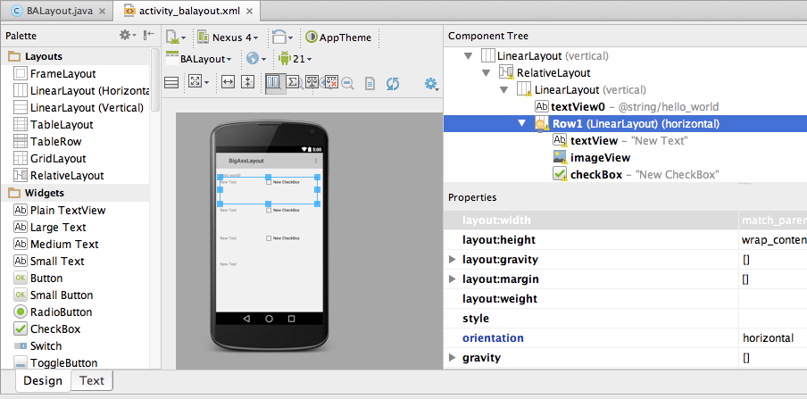

对于app里的每一个view，android系统都会经过三部曲来渲染：measure，layout，draw。可以在脑中回想下你搭建的view的xml布局文件结构，measure从最顶部的节点开始，顺着layout树形结构依次往下：测量每个view需要在屏幕当中展示的尺寸大小（上图当中：LinearLayout；RelativeLayout，LinearLayout；然后是textView0和LinearLayout Row1点分支，该分支又有另外3个子节点）。每个子节点都需要向自己的父节点提供自己的尺寸来决定展示的位置，遇到冲突的时候，父节点可以强制子节点重新measure（由此可能导致measure的时间消耗为原来的2-3倍）。这就是为什么扁平的view结构会性能更好。节点所处位置越深，套嵌带来的measure越多，计算就会越费时。我们来看一些具体的例子，看measure是怎么影响渲染性能的。

### Remeasureing Views（重新测量views）

并不是只有发生错误的时候才会触发remeasure。RelativeLayouts经常需要measure所有子节点两次才能把子节点合理的布局。如果子节点设置了weights属性，LinearLayouts也需要measure这些节点两次，才能获得精确的展示尺寸。如果LinearLayouts或者RelativeLayouts被套嵌使用，measure所费时间可能会呈指数级增长（两个套嵌的views会有四次measure，三个套嵌的views会有8次的measure）。可以看下面图4-9里面一个夸张点的例子。

一旦view开始被measure，该view所有的子view都会被重新layout，再把该view传递给它的父view，如此重复一直到最顶部的根view。layout完成之后，所有的view都被渲染到屏幕上。需要特别注意到是，并不是只有用户看得见的view才会被渲染，所有的view都会。后面我们会看下“屏幕重复绘制”的问题。app拥有的views越多，measure，layout，draw所花费的时间就越久。要缩短这个时间，关键是保持view的树形结构尽量扁平，而且要移除所有不需要渲染的view。移除这些view会对加速屏幕渲染产生明显的效果。理想情况下，总共的measure，layout，draw时间应该被很好的控制在16ms以内，以保证滑动屏幕时UI的流畅。

虽然可以通过xml文件查看所有的view，但不一定能轻易的查出哪些view是多余的。要找到那些多余的view（增加渲染延迟的view），可以用android studio monitor里的Hierarachy Viewer工具，可视化的查看所有的view。（monitor是个独立的app，下载android studio的时候会同时下载）

### Hierarchy Viewer

Hierarchy Viewer可以很方便可视化的查看屏幕上套嵌view结构，是查看你的view结构的实用工具。这个工具包含在android studio monitor当中，需要运行在带有开发者版本的android系统的设备上。后续所有的view和屏幕截图都来自一款三星的Note II设备，系统版本是Jelly Bean。在老的设备（处理器慢）上测试渲染性能，更容易发现问题。

如图4-2所示，打开Hierarchy Viewer之后，会看到几个窗口：左边的窗口列出了连上你电脑的android设备和设备上所有运行的进程。活跃的进程是粗体展示的。第二个tab某一个编译版本的详情（后面细说）。中间的部分是可缩放的view的树形图。点击某一个view能看到在设备上展示的样子和一些额外的数据。右边有两个view：树形结构总览和布局view。树形结构总览显示了整个view的树形结构，里面有一个方块显示了中间窗口在整个树形结构当中所处的位置。布局view当中深红色高亮的区域表示所选中的view被绘制的部分（浅红色展示的是父view）。

*图4-2*

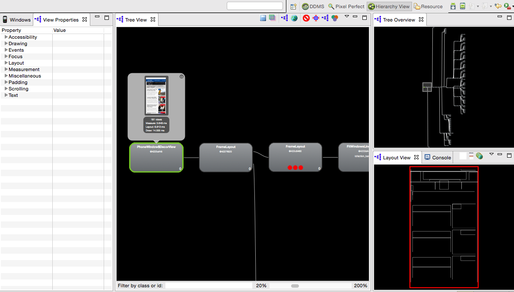

在中间的这个窗口，你可以点击任何一个view来查看该view在android设备屏幕上的展示。点击树形图工具栏里红绿紫三色的维恩图图标，还能展示子view的数量，和measure，layout，draw三部曲所花费的时间。这个时间是被选择的view及其所有子节点所花费时间的总和。（图4-3中，我选择了最顶部的view来获取整个view结构的时间）

*图4-3*

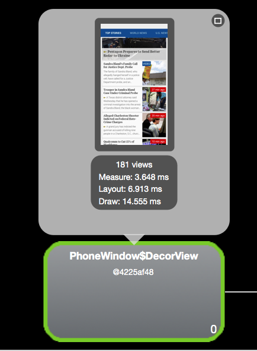

最顶部的view总共包含181个view，measure的总时间为3.6ms，layout是7ms，draw花了14.5ms（总共大约25ms）。要缩短渲染这些view的总时间，我们先看下app的树形结构图预览，看看所有的view是怎么拼凑到一起的。从树形结构图上可以看出屏幕里有非常多的view，树的结构比较扁平。前面说过，扁平的结构性能好，树的深度对渲染的性能会产生很大的影响。我们的结构虽然是扁平的，却依然花费了26ms的时间来渲染，说明扁平的结构也有可能会卡顿，也需要去考虑怎么优化。

*图4-4*

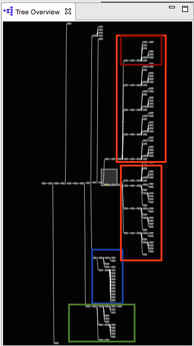

排查一个新闻类app的树形结构，大致可以看三个区域：头部（底部蓝色的方框），文章列表（两个橙色的方框表示两个不同的tab），单篇文章的view是用红色方框来标注的。内部标题view的结构重复出现了九次，5个在上面橙色的方框内，4个在下面的方框内。最后，我们可以看到从边上拉出来的导航栏是用底部绿色的方框标出来的。头部用了22个view，两个文章列表个用了67和44个view（每个标题部分使用了13个view），导航抽屉使用了20个。这样我们还剩下18个view没有计算在内。剩下的这些view其实是在滑动手势动画过程当中生成的。很显然，view的数量很多，要做到不卡顿要让view的绘制非常高效才行。

*图4-5*

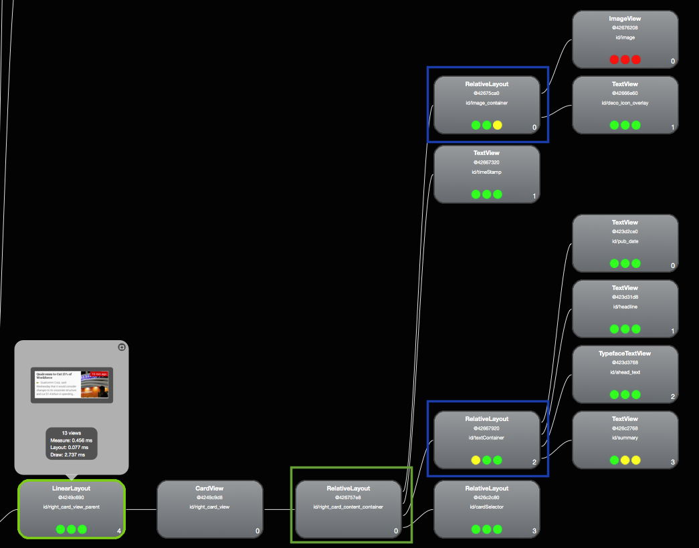

仔细看下标题部分，一个标题是由13个view组成的。每个标题的结构有5层之深，一共花费0.456ms来measure，0.077ms来layout，2.737ms来draw。第五层是通过第四层的两个RelativeLayouts来连接的（蓝色高亮），这些又是通过第三层的另一个RelativeLayout来连接的（绿色高亮）。如果我们把第四第五层的view都移到第三层来，我们可以少渲染一整层。而且我之前解释过，RelativeLayout里的measure都会发生两次，套嵌的view会导致measure时间的增加。

现在，你可能已经注意到了每个view里红色，黄色和绿色的圆圈。它们表示该view在那一层树形结构里measure，layout和draw所花费的相对时间（从左到右）。绿色表示最快的前50%，黄色表示最慢的前50%，红色表示那一层里面最慢的view。显然，红色的部分是我们优先优化的对象。

再看下文章标题的树形结构，绘制最慢的view是右上角的ImageView。顺着ImageView一直找到文章父view，父view是通过两个RelativeLayouts来连接的（这里增加了measure的时间），然后是3个没有子节点的view（在最底部）。这3个view可以优化合并成一个view，这样能减少两个layer的渲染。

我们再看另一个新闻类app是怎么来减少标题view里面的子view数量的。从图4-6里能看到一个和图4-5类似的树形结构图。

*图4-6*

图4-6里的标题view也有RelativeLayouts（绿色的部分）的问题，一共消耗了1.275ms的measure时间，layout用了0.066ms，draw 3.24ms（总共是4.6ms）。在这些数据基础上，我们再做一些调整，加入一个更大的图片展示和分享按钮，但是整个树形结构变得扁平一点（如图4-7所示）。

*图4-7*

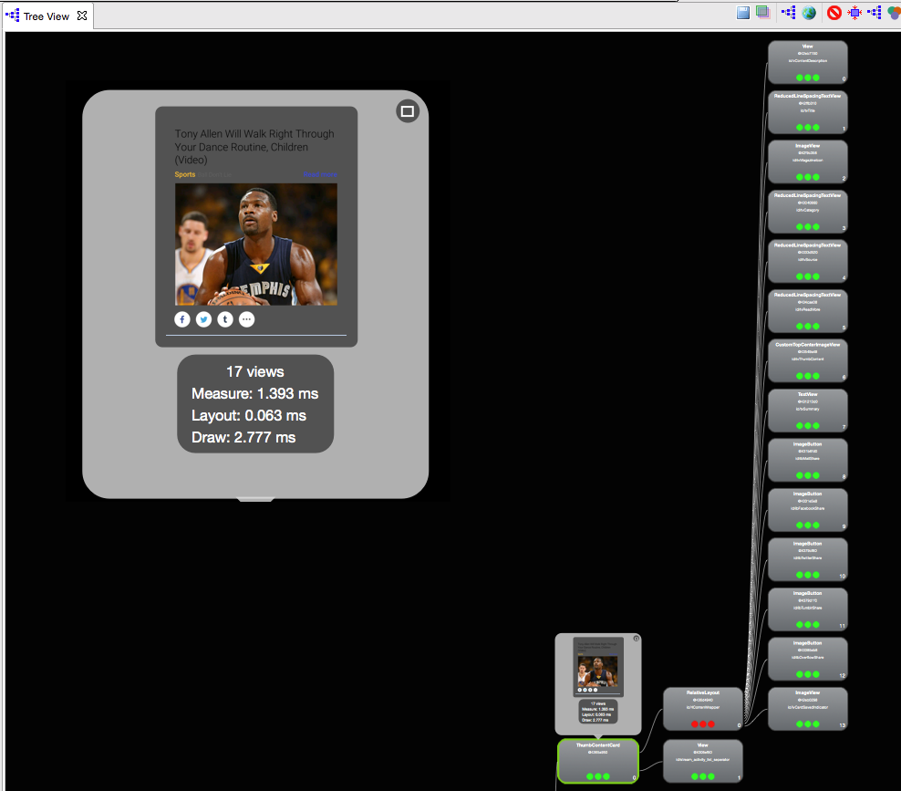

容，但节省了400ms！

为了更好的了解这部分的优化，我们再看另一个例子app。这个例子会展示一个山羊图片等列表。界面使用了几种不同的layout方式，性能差的和性能好的都有。仔细的查看这些布局，然后一步步优化它们，我们就能清楚的理解怎么去优化一个app的渲染性能了。我们分几步来进行优化，每一步改变都可以通过Hierarchy View可视化的查看。每换一种layout方式，xml渲染的性能要么变好，要么变差。我们先从性能差的布局方式开始。先快速的扫一眼图4-8里的Hierarchy View。

*图4-8*

这个简单的app里有59个view。但是和图4-4里的app不同，这个app的树形结构更扁平，水平方向的view更多一些。叠加的view越多，渲染就会越费时，减少view树形结构的深度，app每一帧的渲染就会变快。

蓝色方框里面的view是action bar。橘色方框里的是屏幕顶部的text box，紫色方框里展示的是山羊的详细信息（有6个这种view）。红色方框标示了7个view，每个都增加了树形结构的深度。我们仔细看些这7个view其中三个的remeasure数据（图4-9）。

*图4-9*

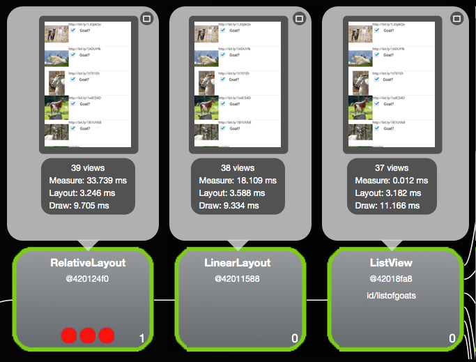

当设备开始measure views的时候，先从右边的子views开始，然后到左边的父views。右边ListView包含6行数据，一共37个view，花了0.012ms来measure。把这个ListView加到中间的LinearLayout之后，变成38个views。有意思的是，measure的时间由于remeasure被触发，瞬间跳到了18.109ms，是原来的三个数量级。LinearLayout左边的RelativeLayout使得measure的时间再次翻倍到33.739ms。再依次往左继续观察（图4-8里红色方框部分），measure的时间叠加到了68ms。但是只要移除上面的一个LinearLayout，measure的时间瞬间降到了1ms。我们可以移除更多的层让树形结构更扁平一些，这样我们可以得到图4-10里的结果，层数减少到了3层。

*图4-10*

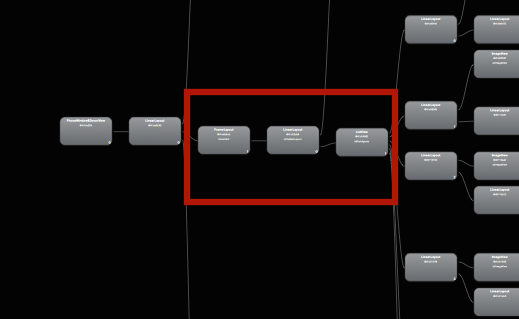

我们可以继续看下山羊信息到row展示部分，来继续减少view结构的深度。每一行山羊信息有6个view，一个有6行数据在屏幕中展示（图4-8中有一行数据是用紫色方框高亮的）。我们用Hierarchy View看下一行view的结构是怎么样的（图4-11），先看下左边两个view（一个LinearLayout，一个RelativeLayout），这两个view唯一的作用就是加深了树机构的深度。LinearLayout连接了RelativeLayout，但并没有展示其他什么内容。

*图4-11*

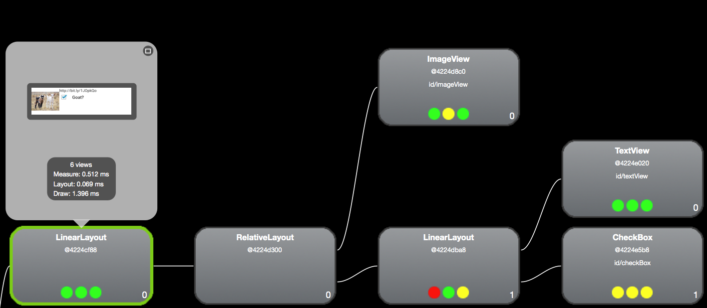

因为RelativeLayout会measure两次（我们现在关注优化measure的时间），我们先移除RelativeLayout（图4-12）。这样树形结构的深度从4减到了3，渲染立马快了一些。

*图4-12*

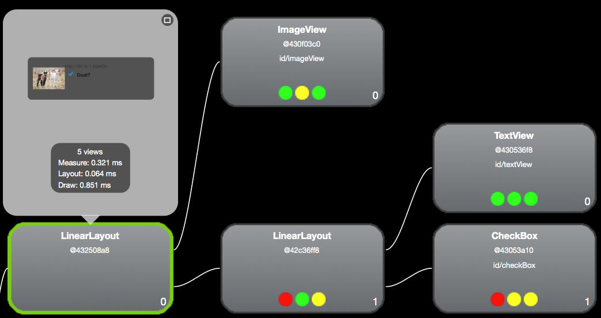

但效果还并不理想。我们继续移除LinearLayout，同时调整下RelativeLayout来展示整个row的信息（图4-13），这样深度近一步减少到了2。渲染又快了0.1ms。这样看来优化的途径有很多种，多尝试总是有好处的（看下表格4-1里的结果）。

*图4-13*

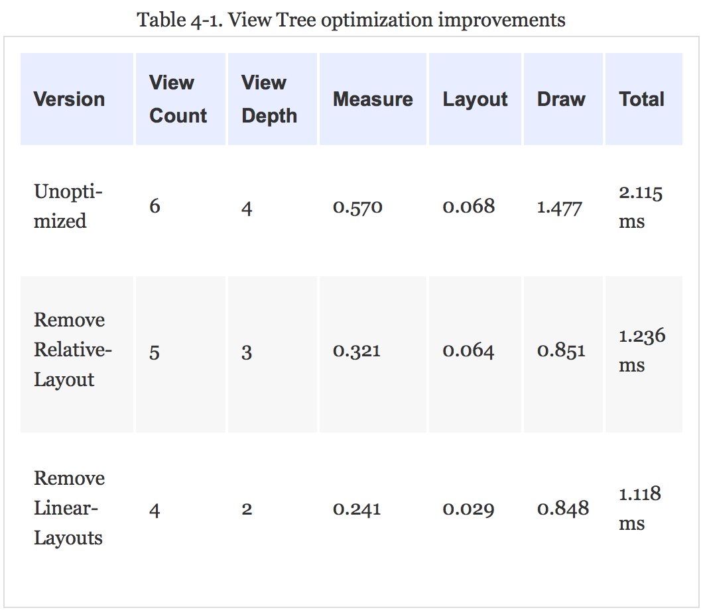

每一行减少大约1ms的时间，我们一共可以节省6ms的渲染时间。如果你的app有卡顿，或者你通过工具检测到每次渲染接近16ms了，减少6ms的时间当然会让你的app更快一点。

### View的重用

如果一个程序员面向对象编程经验丰富，他就会尽可能重用创建的view（而不是每次都创建）。拿上面山羊app作为例子，其实每一行展示的layout都是重用的。如果xml文件里最外层的view只是用来承载子view的，那这个view只不过是增加了view结构的深度，这种情况下，我们可以移除这个view，用一个merge标签来代替。这种方式可以移除树形结构里多余的层。

大家可以从github上下载这个山羊app练习下，改变里面xml文件的布局方式，再用Hierarchy View工具看下渲染时间的变化。

### Hierarchy Viewer（不止是树形结构图）

Hierarchy Viewer还有一个功能，可以帮助开发者发现overdraw（重复的绘制）。从左到右看下树形结构窗口的选项，可以发现这些功能：

* 把view的树形结构图保存为png图片。
* 导出为photoshop的格式。
* 重新加载一个view（第二个紫色树形按钮）。
* 在另一个窗口里打开较大的view结构图，还可以设置背景色来发现重复绘制。
* 让一个view的绘制失效（有条红线的按钮）。
* 让view重新layout。
* 让view生出draw命令到logcat（紫色树形按钮到第三个用处）。这样可以查看绘制到底触发了哪些opengl行为。这个功能对opengl的专家做深度优化比较有用。

Hierarchy Viewer对于优化app view的树形结构重要性不言而喻了，很可能会帮你节省几十毫秒的绘制时间。

### 资源缩减

在我们把app的view结构变扁平，view的总数量减少之后，我们还可以尝试减少每个view里面使用的资源数量。2014年的时候，Instagram把标题栏里的资源数量从29减少到了8个。他们测量后发现app的启动时间增加了10%－20％（因设设备而异）。主要是通过资源上色的方式来进行缩减。比如只加载一个资源，然后在运行的时候通过ColorFilter进行上色。我们看下下面的例子是怎么个一个drawable上色的。

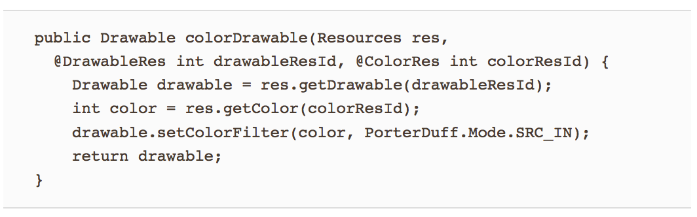

这样一个资源文件就可以表示几种不同的状态了（加星或者不加星，在线或者离线等等）。

### 屏幕的重复绘制

每过几年，就会有传闻说某个博物馆在用x光扫描一副无价的名画之后，发现画作的作者其实重用了老的画布，在名画的底下还藏着另一副没有被发现的画作。有时候，博物馆还能用高级的图像技术来还原画布上的原作。android里面的view的绘制就是类似的情况。当android系统绘制屏幕的时候，先画父view，然后子view，再是更深的子view等等。这会导致所有的view都被绘制到了屏幕上，就像画家的画布一样，这些view都被他们的子view覆盖住了。

文艺复兴时期，有很多伟大的画家要等画干了以后才能重用画布。但在我们的高科技触摸屏上，屏幕重画的速度要快几个数量级，但是多次的重新绘制屏幕会使得绘制延迟变大，最终导致布局的卡顿。重新绘制屏幕的行为叫做overdraw，下面我们会看下怎么检测overdraw。

overdraw还带来的另一个问题，当view内容有更新的时候，之前绘制的view就失效了，view的每一个像素都需要重绘。android设备没法判断哪个view是可见的，所以只能绘制每个view的相关像素。类比上面画家的例子，画家只能把老画一幅幅还原出来，再一层层画到画布上，最后再画上最新的画。你的app如果有很多层，每一层的相关像素都需要绘制一遍。如果不小心，这些绘制就会带来性能问题。

### 检测overdraw

android提供了一些很好的工具来检测overdraw。Jelly Bean 4.2里，开发者选项菜单里增加了Debug GPU Overdraw的选项。如果你用的是Jelly Bean 4.3 或者 KitKat 设备，在屏幕的左下角会有一个计数展示屏幕overdraw的程度。我亲身试过这个工具对检测overdraw十分有效。虽然有时候这个会多提示6-7次overdraw（发生的概率还不小）。

图4-14中的截图还是来自上面的山羊app。左下方可以看到overdraw的计数。屏幕中可以看到3个overdraw的计数，其中开发者能控制的是主窗口的计数。overdraw的计数是在左下方。没优化过的app overdraw的次数是8.43，我们优化过后可以降到1.38。导航栏overdraw的次数是1.2（菜单按钮是2.4），也就是说文字和图标的overdraw贡献了额外的20%。overdraw计数可以在不影响用户体验的前提下，快速便捷的比较不同app的overdraw，但没办法定位overdraw是哪里产生的。

*图4-14*

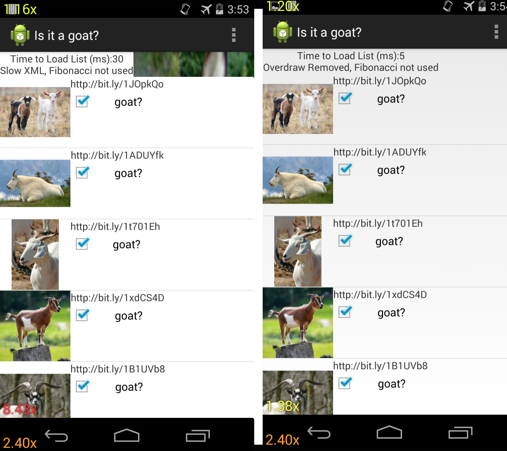

另一种查看overdraw的方式是在Debug GPU overdraw菜单里选择“Show Overdraw areas”选项。选择之后，会在app的不同区域覆盖不同的颜色来表示overdraw的次数。比较屏幕上这些不同的颜色，可以快速方便的定位overdraw问题：

白色：没有overdraw 蓝色：1x overdraw（屏幕绘制了2次） 绿色：2x overdraw 浅红色：3x overdraw 深红色：4x或者更多overdraw

在图4-15中，可以看到山羊app优化前后overdraw区域的变化。app的菜单栏优化前后都没有颜色（没有overdraw），但android图标和菜单按钮图标都是绿色的（2x overdraw）。山羊图片等列表在优化之前是深红色的（4x以上的overdraw）。优化app 之后，只有checkbox和图片区域是蓝色（1x）的了，说明至少3层overdraw被消灭掉了！text和空白区域都没有overdraw了。

*图4-15*

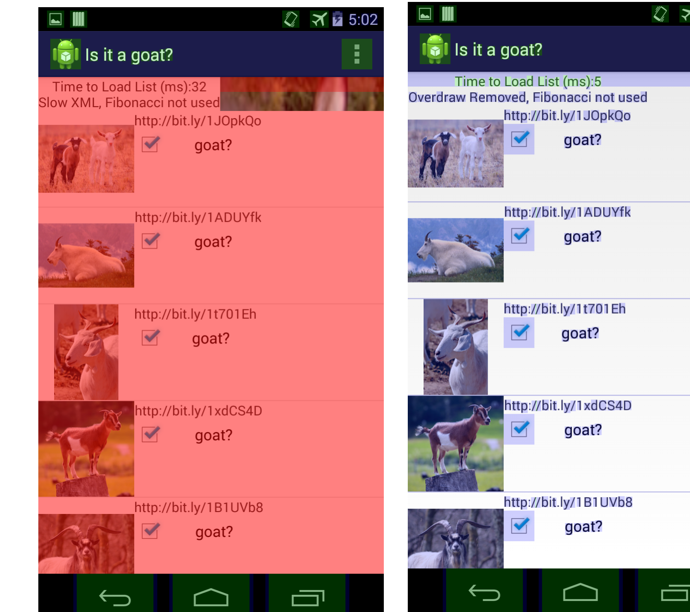

通过减少view的数量（或者去移除重复绘制的view），app的渲染会更快。通过比较父view在优化前后的绘制时间，可以发现优化后带来50％性能的提升，由13.5ms降到6.8ms。

### Hierarchy Viewer当中的overdraw

另一种查看app当中overdraw的方式是把Hierarchy Viewer中的view的树形结构保存成photoshop识别的文档（树形view里的第二个选项）。如果你没有安装photoshop，有几个其他的免费软件也可以打开这个文档。打开文档查看view，可以清楚看到不同layer里的overdraw。对于大部分的线上app，在一个白色背景上放上另一个白色背景很常见。听起来还好，但这里其实有一次绘制是多余的，完全可以避免的。我们再看下山羊app，所有overdraw图片区域都放在了一张驴子的背景图片上（替换了之前的白色背景）。之前的驴子看不到，是因为被白色背景图挡住了。移除掉之后就可以看到下面的驴子了，这样我们就可以快速的定位哪里出现了overdraw。用GIMP打开文档之后，app里所有可见的view的左边都有一个小眼睛图标。在图4-16中，可以看到我从最上面开始把view一个个隐藏起来了。在右边的layout视图中，可以看到一些其他的全屏layout（都显示了驴子的图片）。

*图4-16*

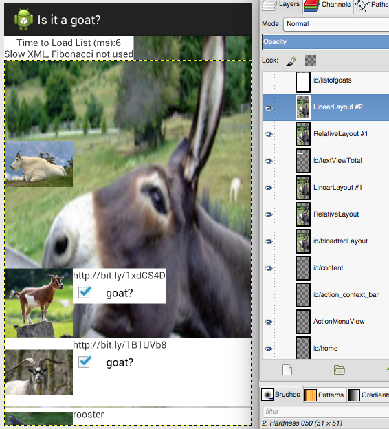

在图4-17中可以看到另一个逐步隐藏view的办法。从最左边的全屏图片开始，到中间的图片，可以看到我们隐藏了两行山羊的图片展示，每一行下面的出现了一张拉伸的驴子的图片。在这些驴子图片的下面是一张白色的背景图（从最右边的图片可以看出）。再移除这张白色背景可以看到一张大的驴子的图片，在左下角。再往下是另一张白色的全屏背景图。

*图4-17*

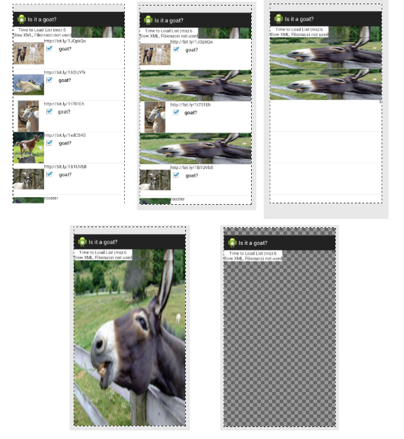

### KitKat里的overdraw

在KitKat或者更新的设备里，overdraw被大幅度的削减了。这项技术叫overdraw avoidance，系统可以检测发现简单的overdraw场景（比如一个view完全盖住了另一个view），然后自动移除额外的绘制，应用到上面的例子，也就是说驴子那张大背景图就不会去绘制了。这很明显会极大的提高设备的绘制性能。但开发者还是要尽可能的避免额外的overdraw（为了更好的性能，也为了能兼容Jelly Bean及更老的设备）。

### Overdraw Avoidance和相关开发者工具

当用上面提到的overdraw检测工具时，KitKat的overdraw avoidance功能会被禁止，这只是为了方便你查看view的布局，和在设备上真正运行的情况并不一样。

## 分析卡顿（测量GPU的渲染性能）

在我们优化过view的树形结构和overdraw之后，你可能还是感觉自己的app有卡顿和丢帧，或者滑动慢：卡顿还是存在。可能高端机器上感觉不到卡顿，但低端机上还是可能会出现卡顿。为了能获取更全面的卡顿检测信息，android在Jelly Bean及更新的系统里加入了一个GPU绘制开发者选项。能够测出每一帧的绘制用了多少时间。你可以把测量出来的数据保存到一个logfile（adb shell dumpsys gfxinfo），或者在设备的屏幕上实时查看这些信息（只支持android 4.2+）。

我们快速来看下怎么分析，我比较喜欢在屏幕上直接展示GPU的渲染数据，这样感觉更直观全面（logfile里面的数据很适合离线的详细分析）。我们最好在不同的设备上都试一下。图4-18展示的是Nexus 6运行Lollipop（左边）和Moto G运行 KitKat（右边）同时跑山羊app的GPU渲染数据。重点看下GPU测量图表底部的水平绿条。它是设备16ms绘制一帧的分割线，如果你有很多帧都超过了这条绿线，那就表示有卡顿了。在下图里可以看到Nexus6上有偶尔的卡顿。出现在滑动到页面底部的时候，播放里一个反弹的动画。用户体验不算太糟。每一次屏幕绘制（竖线）被分成四种颜色来表示额外的测量数据：**draw（蓝色），prepare（紫色），process（红色），执行（黄色）**。在KitKat和更早的版本里，prepare的数据没有独立出来，包含在其他项里面（因此只有看到3种颜色）。

*图4-18*

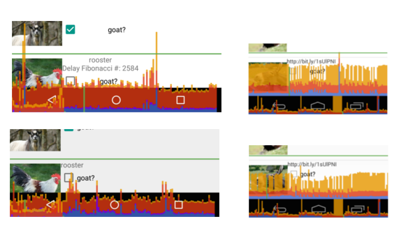

对比下Nexus 6和Moto G的GPU数据可以看出真机测试的重要性。图4-18中，没有优化过的山羊app精确的表示Moto G绘制的时间是Nexus 6的两倍（比较两图中绿线的高度）。这一点可以通过数据采集（adb shell dumpsys gfxinfo）进一步说明。下一个例子当中，优化过的view绘制在Moto G上用了两倍多时间。对于两台设备来说，draw，prepare，process这几步都花了差不多的时间（少于4ms）。差别出现在execute阶段（紫色），Moto G比Nexus 6多用了差不多4ms。说明GPU渲染测试最好是在低端机器上来做，比较容易发现卡顿问题。

*图4-19*

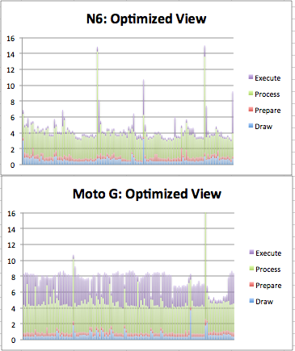

一般来说，GPU Profiler可以帮你发现问题。在山羊app里，如果我打开Fibonacci延迟（在创建view多时候进行耗时的递归计算），GPU profiler看不出任何卡顿，因为计算都发生在主线程而且完全阻止了渲染（在低端机上，可能会出现ANR消息）。

### Fibonacci算法

Fibonacci序列是这样一组数的集合：每个数字都是它前面两个数字的和。比如0，1，1，2，3，5，8等等。程序里一般用来表示递归，这里我用了最低效的方式来生成Fibonacci序列。

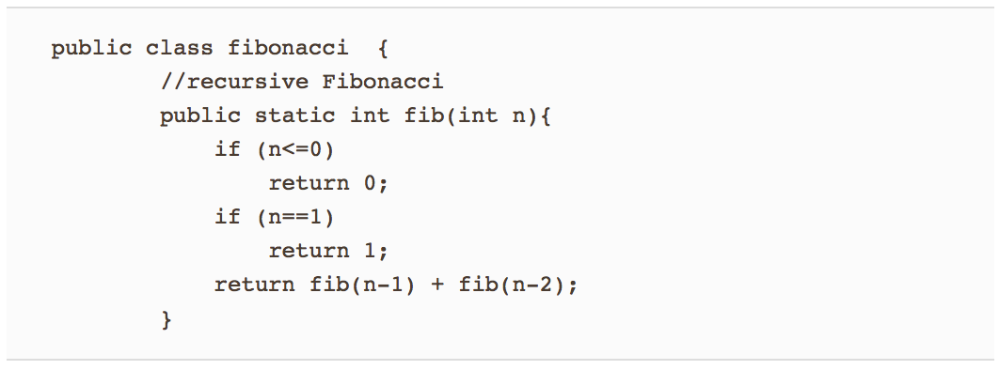

生成这些数字的计算次数呈指数级增长。这样做的目的是在渲染的时候增加CPU的压力，这样渲染事件就无法得到及时处理，出现延迟。计算n＝40就把app变得很慢了（低端机上会crash）。这个例子虽然有点牵强，但我们定位卡顿是由Fibonacci产生的过程会很有意义。

### Android Marshmallow里的GPU渲染

在android marshmallow里，运行`adb shell dumpsys gfxinfo` . 可以发现一些检测卡顿的新功能。首先，数据报告开头部分能看到每一帧渲染的信息了。

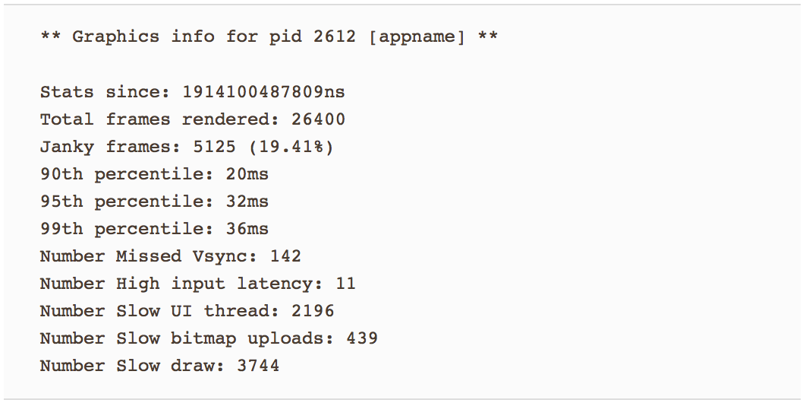

从app的启动开始，我们可以看到一共渲染了多少帧，其中多少帧的渲染时间是控制在理想值的90%以内，还能看到渲染比较慢的帧（90%，95%，99%）。最后五行列出的是没有在16ms内渲染完成的原因。注意，这里不止有卡顿的问题，帧率还收到了其他因素的影响。

android marshmallow在gfxinfo库里增加了另一个好用的测试工具，`adb shell dumpsys gfxinfo framestats`。它能够输出每一帧里发生的某些事件耗时，格式是逗号分隔的一张大表。列名没有给出，但在Android Developer网站里有解释。为了算出渲染里每一步的费时，我们要计算出报告里不同framestats的差异。下面是一些绘制事件：

* VSYNC-Intended_VSYC（告诉你是否丢帧里，也就是卡顿）
* 处理输入事件的时间（一般要小于2ms）
* 动画计算（一般小于2ms）
* layout和measure
* view.draw()耗时
* Sync耗时（如果大于0.4ms，表示很多bitmap正在发送到GPU）
* GPU耗时（overdraw的时间会在这里面）
* 绘制一帧的总时间

有时候即使出现了超过16ms的绘制，但由于有vsync buffer的存在，也不会出现丢帧。对于没有额外buffer的低端设备，就可能会出现卡顿了。

### 不只是卡顿（丢帧）

有时候GPU Profile里看不到超过16ms的数据，但你从屏幕上看到明显的卡顿或跳动。出现这种情况可能是由于CPU在做别的事情被堵住了，从而导致里丢帧。在Monitor或者Android Studio中，可以查看DDMS里的logfiles。通过过滤log更容易查看app的运行情况。可以重点看下类似下图中的log。

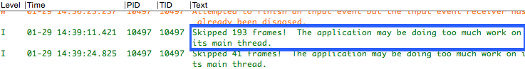

我们在后面的文章里会讲诉CPU导致的丢帧是怎么产生的。

## Systrace

在上面的这些优化之后，如果你的界面还有卡顿，我们还有办法。Systrace工具也可以测量你app的性能。甚至可以帮助你定位问题产生的位置。这个工具是作为“Project Butter”一部分同Jelly Bean一同发布的，它能够从内核级检测你设备的运行状态。Systrace可配置的参数很多。我们这里重点关注UI是怎么渲染的，用systrace检测卡顿问题。

Systrace和之前的工具不同的是，它记录的是整个android系统的状态，并不是针对某一个app 的。所以最好是用运行app比较少的设备来做检测，这样就不会受到其他app的干扰了。Systrace图标是绿色和粉红色组成的（下图红色的椭圆里）。点击下，会弹出一个带几个选项的窗口。

*图4-22*

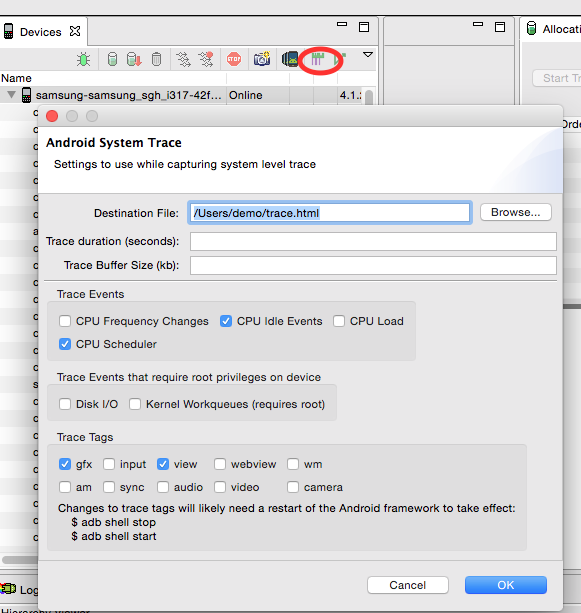

trace数据记录在一个html文件里，可以用浏览器打开。这里主要研究屏幕的交互数据，主要收集CPU，graphics和view数据（如图4-22所示）。duration留空（默认是5秒）。点击OK之后，Systrace会马上开始采集设备上的数据（最好马上开始操作）。因为采集的数据非常之多，所以最好一次只针对一个问题。

traces里面的数据看着有点吓人（我们只是勾选里4个选项！）。鼠标可以控制滑动，WASD可以用来zoom in／out（W，S）和左右滑动（A，D）。在刚跑的trace数据最上面，能看到CPU的详细数据，CPU数据的下面是几个可折叠的区域，分别表示不同的活跃进程。每一个色条表示系统的一个行为，色条的长度表示该行为的耗时（放大可以看到更多细节）。选中屏幕底部的一个色条，第一眼看到的总览有点吓人，我们一条条分析看下这些数据。

*图4-23*

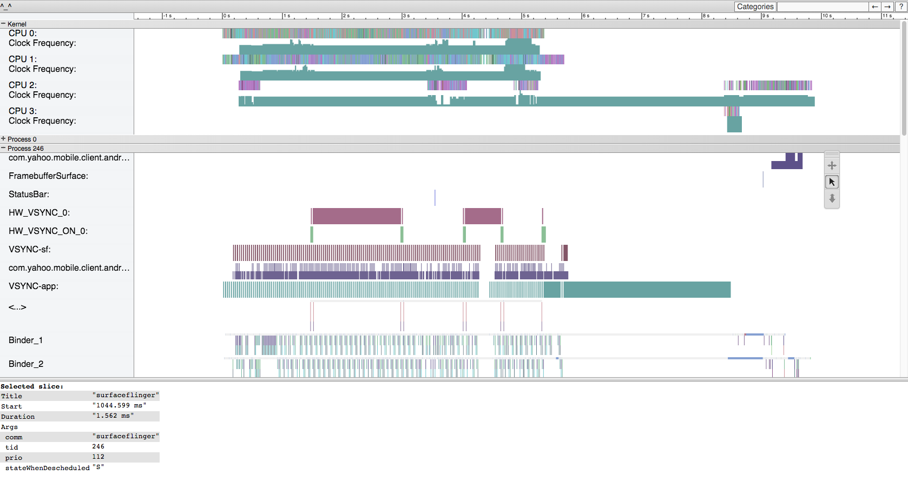

### Systrace进化史

就像android生态圈一样，Systrace在不同的系统版本里有不同的界面，展示，和输出结果。

* 在Jelly Bean设备，在设置的开发者选项里可以打开tracing。必须要同时打开电脑和手机上的该功能。
* 随着android系统版本的升级，trace生成的数据也更加详细，布局也有一些改变。
* 我建议通过Jelly Bean查看Systraaces，然后喝Lollipop上的数据对比，收集到的数据会不一样。

在2015年的google io大会上，google发布了新版本的Systrace，新版本增加了一些新特性，下面会有更详细的介绍。

我们继续滑动Systrace的输出结果，运行期间每个进程的数据都可以看到。我们主要研究卡顿相关信息，查看屏幕刷新时可能有问题的绘制。只要刷新率和绘制都正常，屏幕的渲染应该就是流畅的。但只要一个出问题，就有可能会导致页面渲染的卡顿。

### Systrace Screen Painting

我们通过图4-24来看下屏幕绘制的步骤。最顶部一行的trace（蓝色高亮）时VSYNC，由一些均匀分布的蓝绿色宽条组成。VSYNC是操作系统发来的信号，表示此时该刷新屏幕了。每个宽条表示16ms（宽条之间的空白也是16ms）。当VSYNC事件发生的时候（在蓝绿色宽条的任意一侧），surface flinger（红色高亮方框包含几种颜色的长条）会从view buffer（没展示出来）里选一个view，然后绘制到屏幕上。理想情况下，surfaceflinger事件之间相距16ms（没有卡顿），因此如果出现长条空缺则表示surfaceflinger丢掉了一次VSYNC更新事件，屏幕就没有及时的刷新（此时就会有卡顿）。在trace文件2/3的位置可以看到这样的空缺（绿色高亮方框）。

*图4-24*

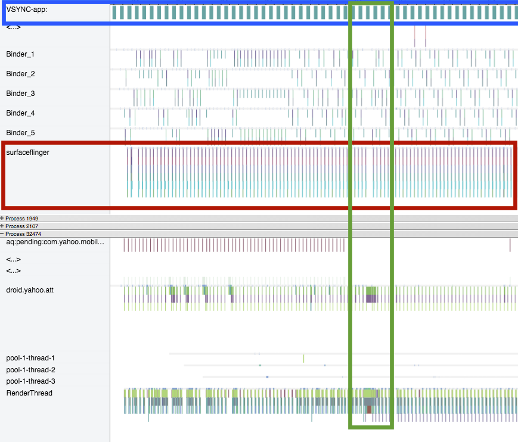

图4-24底部展示的是app的详情。第二行数据（绿色和紫色的线条）表示的app正在创建view，然后是底部的数据（绿色，蓝色，和一些紫色的条状），表示的是RenderThread，view的渲染和发送到buffer（图中没有画出来）都是在这个线程里做的。注意看可以发现大概1/3的位置，这些条状在该区域集中变粗了，表示app此时由于某种原因发生了卡顿。不同app情况不一样，发生卡顿的原因也不同，但是我们可以根据一些共同的现象推测卡顿的发生。

这种总览很适合查找卡顿，但要调查清楚原因需要放大仔细看下。要明白Systrace都记录了什么数据，最好搞明白Systrace到底是怎么进行测量的，app没有卡顿的时候Systrace输出又是什么样的。一旦弄明白了Systrace是怎么工作的，查找问题就方便多了。在图4-25中，我把app正常运行时Systrace纪录的相关线条放到了一起。我们从屏幕左边的droid.yahoo.com看起。我描述的时候在trace文件里会来回跳动到不同的位置。当绘制发生的时候：

* 红色方框：droid.yahoo.com完成了所有view的measure，然后把结果发送给RenderThread。
* 橘色方框：RenderThread，这里app会：
* 绘制frame（浅绿色）
* 显示buffer里的内容（灰色）
* 清空buffer（紫色）
* 发送给缓存的view列表。
* 黄色方框：com.yahoo.mobile.client.andr…

buffer里面有一些view，线条的高度表示了buffer当中view的数量。刚开始，只有一个，当新的view加入到buffer中之后，高度就变成了2倍。

* 绿色方框：VSYNC－sf 提示surface flinger有16ms的时间来渲染屏幕。里面棕色的条状表示16ms的长度。
* 蓝色方框：surfaceflinger从队列里抓取一个view（注意黄色方框里的buffer中view数量从2变为1）。完成之后，view被发送给GPU，屏幕就绘制被绘制了。
* 紫色方框：VSYNC－app告诉app去渲染新的view（这里有个16ms的timer）。
* 当VSYNC一开始，droid.yahoo.att就不停的重复这个过程，measure view,发送给RenderThread等等，不停的循环。

*图4-25*

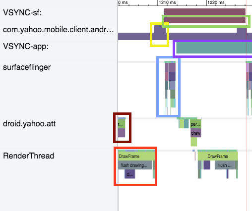

再回过头想一下设备能这么短的时间内流畅的渲染屏幕，确实是件很神奇的事情。了解了渲染的过程，我们来找下卡顿的原因。

图4－26中，我们看下OS层的行为。我增加了一些箭头来表示16ms的间隔，红色的方框表示surfaceflinger的丢帧。

*图4-26*

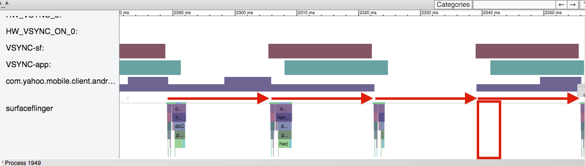

为什么会出现这种情况？箭头上方的一行是view buffer，行的高度表示有多少帧缓存在了buffer里面。trace开始的时候，buffer里缓存的数量是1到2交替出现。surfaceflinger每抓取一个view（buffer里的数量减一），又会马上从app里生成一个新的view来填充。但是当surfaceflinger完成第三个动作之后，buffer被清空了，但是没有从app里及时填充新的view。所以，我们从app层面来检查下这期间发生了什么。

在图4-27中，我们可以看到开始的时候RenderThread发送了一个view到buffer（红色方框）。橘色方框表示app新建了另一个view，渲染，然后交给buffer（droid.yahoo.att measure,layout所有的view，RenderThread负责绘制）。不幸的是，app没来得及创建新view就被挂起了（黄色方框内）。为了创建下一个view，droid.yahoo.att app在运行暗绿色的“performTraversals”（3ms）之前，要先运行“obtainView” 7ms，“setupListItem” 8.7ms。app然后把数据交给RenderThread，这一步也比较慢（12ms）。创建这一帧总共用了近31ms（上一个只用了6ms）。当创建这一帧开始的时候，buffer里只有一帧的数据，但是设备需要两帧。buffer没有被填满，所以屏幕绘制出现了卡顿。

*图4-27*

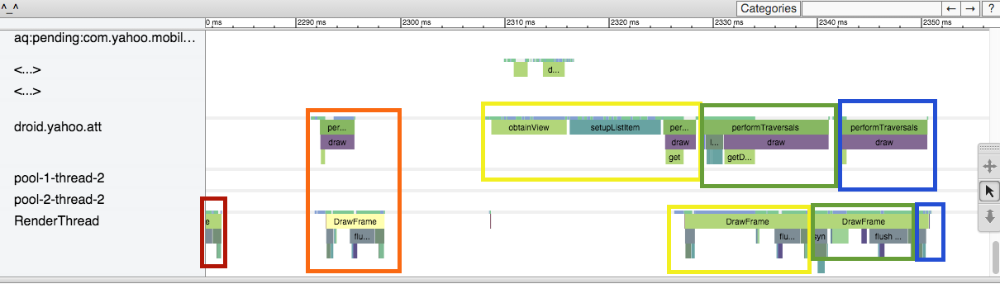

有意思的是app后面马上就速度追了上来。黄色方框内延迟递交的view创建并交给buffer之后，后续的两帧紧接着创建好了（绿色和蓝色的方框）。通过快速的填充新的帧，app就只丢了一帧。这个trace结果是在Nexus 6上运行的（处理器比较快，能快速的跟上）。在三星S4 Mini，Jelly Bean 4.2.2上运行同样的结果得到图4-28.

*图4-28*

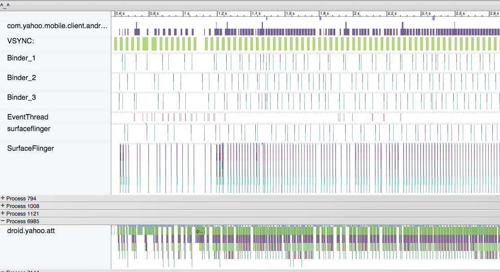

从总览图上可以清晰的看到有很多帧都丢掉了（trace开始的时候surfacelinger部分有很多的空缺）。而且顶部那一行（view buffer）里的buffer经常是空的（导致里卡顿），buffer里同时有两个view的情况非常少。对于一个GPU性能比较差的设备来说，app能够像Nexus 6一样赶上填满buffer的概率比较小。

小贴示： 其实你可以偶尔渲染一帧超过16ms，因为buffer里面一般都有1到2帧准备好的view备用。但是如果超过2-3帧渲染很慢，用户就会感觉到卡顿了。

上面的trace是在运行Jelly Bean的手机上跑的，RenderThread的数据归到了droid.yahoo.att那一行（Lollipop之前measure,draw,layout都是和在一起的）。把每一行数据合在一起之后竖条变宽。每一次调用之间的细条空白说明手机在每帧的绘制之后，只剩下很少的时间处理其它任务。手机上的app只能稍稍领先surfacelinger填满buffer的速度。如果app能够减小所绘制view的复杂度，也就是加快view的渲染，细条的空白就会变的宽一点，buffer填满的概率就更大，也就给低端设备在绘制之外更多的空间去处理其它任务。

把这块区域加高亮之后，Systrace会把所有条状所占的时间计算出一个总和，用鼠标在上面依次移动就能看到基本的数据了。图4-29中，可以看到performtraversals（父view的draw命令）平均用了13.8ms，大概有5ms的波动。16ms的卡顿阈值在波动的范围之内，所以很有可能设备上会有卡顿。

*图4-29*

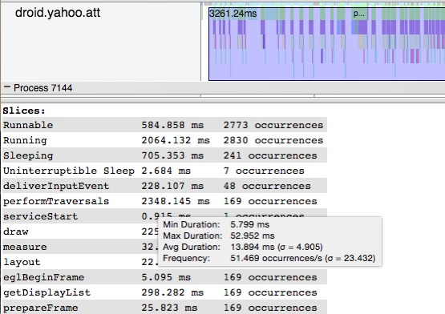

把这块放大能看到更多的细节（图4-30）。每个垂直的红线表示16ms。从图中可以看出，大概有5，6次SurfaceFlinger错过了红线标记。绿色的“performtraversals”线条都几乎有16ms长（这一步是必须做的，有卡顿）。还有两个蓝绿色的 deliverInputEvents（每个都超过了16ms）也阻碍了app的屏幕绘制。

*图4-30*

那到底是什么触发了deliverInputEvents呢？这其实是用户在点击屏幕，强制ListView重绘所有的view。这部分影响是CPU，我们接下来简单看下这时候CPU都在干啥。

### Systrace和CPU对渲染的影响

如果你频繁的感觉到卡顿，但是在绘制或者surfaceflinger部分看不到什么明显的异常，这时候可以尝试看下CPU在处理什么事情，在Systrace的顶部可以看到这部分的数据。如果你能大概猜到是哪部分的逻辑影响了绘制，可以先把这部分代码注释掉试试。山羊app里有个选项可以开启Fibonacci延迟。打开之后，app在每一行数据渲染的时候都会计算一个很大的Fibonacci值。用膝盖想都知道这时CPU会变得很忙。由于计算是在主线程做的，会妨碍的view的渲染，理所当然就导致里丢帧，滑动也会变的很卡。图4-21里显示的log就能看到这种情况下的丢帧。我们再深挖一点看能不能通过Systrace定位到计算Fibonacci数的代码。

我们再重头看下trace数据，图4-31里是没有优化过的山羊app在Nexus 6上跑的数据。

*图4-31*

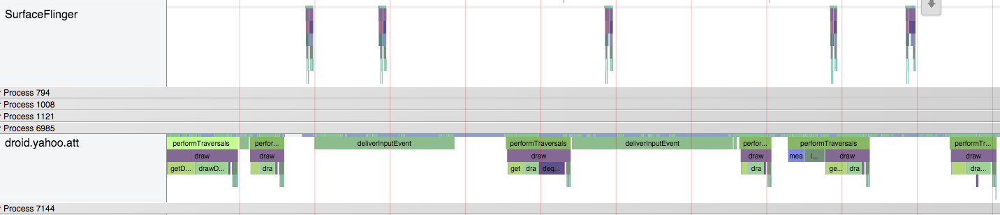

展示做了一些修改，CPU和surfaceflinger之间的一些线被去掉了。这个trace里看不到卡顿，surfaceflingers每16ms的间隔很均匀。RenderThread和每一行view填满buffer的表现也很正常。和CPU那一行数据对比一下，可以发现一个新规律。当RenderThread在绘制layout的时候，CPU1正在运行一个蓝色的任务(注意我们看的是窄一点的CPU1，不是CPU1:C－State)。当山羊app的view正在被measure的时候，CPU0有一个相应的紫色的行为。view的layout和绘制是由两个CPU完成的。注意X轴上的点击是每隔10ms发生的，这里每个行为都没有超过2-4ms。

当我们加入费时的Fibonacci计算之后，Systrace的结果看起来就很不一样了。（图4-32）

*图4-32*

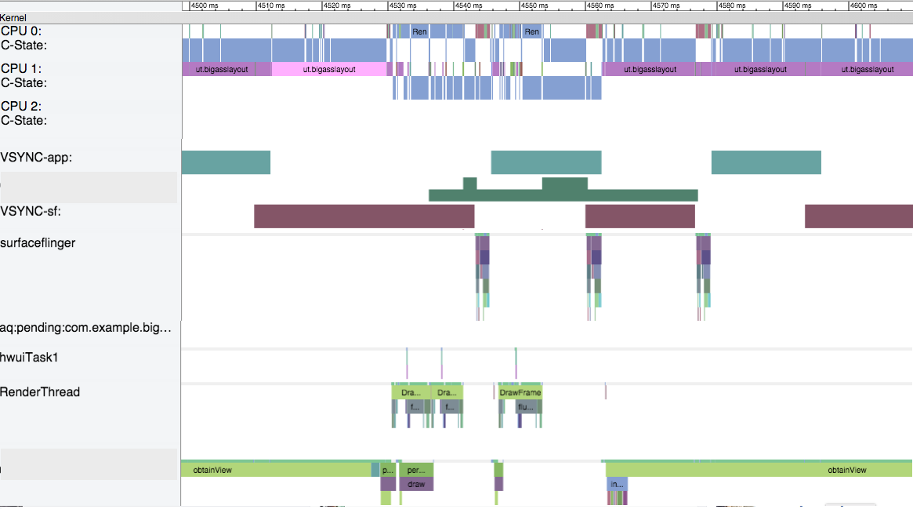

从Systrace里能看到很多卡顿，在相同的100ms时间范围内，surfaceflinger就画了三帧（上面不卡顿的情况画了7帧）。可以看到RenderThread绘制view还是很快的（从图中可以看出，蓝色的RenderThread是在CPU0上运行的）。但是，measure view的时候，Fibonacci的递归计算就导致了问题。山羊app进程那一行花了大部分的时间在obtainView的状态，而不是measure。同时可以看到CPU1上紫色对应的山羊进程不再是2-4ms宽了，变成了2-17ms宽。Fibonacci计算每次大概用了13-17ms，对app的绘制性能产生了很大的影响。

### Systrace更新－I／O 2015

在2015年Google I／O大会上，google发布了新版本的systrace，上面提到的分析数据变的更简单了。在图4-27里，我把每一帧的更新都高亮出来了。在新版本的systrace（图4-33）里，每一帧都是由一个带F的小圆圈标示的。正常渲染的帧会有绿点，慢帧则是黄色或者红色。选择一个点，然后按下m就可以高亮某一帧，分析起来更方便。

*图4-33*

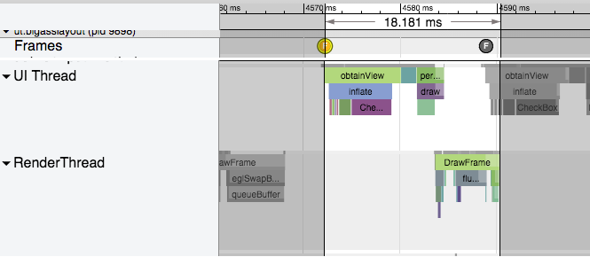

新版本的systrace对于正在发生的行为也有更清晰的描述了。在图4-33中，帧的渲染时间是18.181ms，是用黄色标示的，如果有很多帧超过了16ms就会导致卡顿了。在trace文件下方的描述信息面板上（图4-34），可以看到警告信息，说我的app在重用ListView的item，而不是创建新的item，这样拖慢了view inflation。

*图4-34*

在systrace里可以看到其它类似的警告，形状像泡泡或是点，屏幕右边的警告面板也列出了这些信息（图4-35）。

*图4-35*

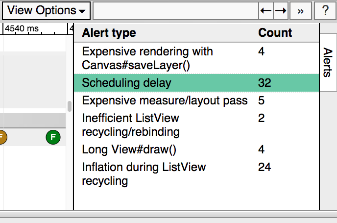

这些新功能让Systrace诊断UI问题更加简单了。

## 第三方工具

每个大的芯片厂商都有自己的GPU评测工具，可以帮助发现更多渲染时遇到瓶颈的信息。这些工具对一些特定的芯片更有针对性，信息也更多。可以帮你针对不同的GPU做更深度的优化。Qualcomm，NVIDIA和Intel都提供了这些开发者工具，有兴趣的可以自己试下。

## 感知优化

上面的内容都是在讨论怎么通过测试，调试，优化布局来让UI的体验更快。其实还有另外一个办法让你的app UI更快：让用户感觉更快。当然作为开发者要尽可能优化自己的代码，view，overdraw和其它所有可能会影响渲染性能的地方，上面这些都做了之后，再考虑下面这些能让用户觉得你的app更快的方法。

人类大脑工作的方式很有意思，通过改变大脑对等待的感知，可以让你的用户感觉延迟变短了。杂货店的老板都会在走廊上放一些没用的杂志，就是为了让客户有东西可以看，感觉等待的时间就会短一些。如果在向用户展示内容的时候增加一些过渡效果，见效明显。这就像一个小魔术一样让用户感觉体验变的更快了，归根结底重要的是用户觉得你的app有多快。这个技巧实现起来也有点取巧，有时候这种感知的优化甚至会得到相反的效果，做A／B test来确保你的优化对用户来说真的有效。

### loading菊花：优缺点

loading菊花，进度条，沙漏图标，和其它所有表示等待的方式都存在很久了。这些都可以让app的内容过渡变得更快。比如在app里加一个进度条，加载的时候播放一个进度的动画来让用户等待。研究表明使用一个带有动画的滑动条的时候用户会感觉更舒服。快速旋转的loading菊花也让用户感觉等待的时间更短。

但是，有延迟的时候，加个菊花并不总是有效的。iOS app Polar的开发者发现他们的app渲染一个view的时候有一点延迟。他们第一反应是在页面里加了一个菊花告诉用户页面正在渲染内容，但效果不如预期。用户开始反馈app变慢了，等待页面加载的时间变长了（其实app没有变慢，不过是加了一个菊花）。加了个等待的标识之后让用户明显的感觉到他们在等。取消菊花之后，用户感觉app又变快了（开发者仅仅是改变了菊花）。通过改变用户对等待的感知，可以让用户觉得app变快了。Facebook也遇到过类似的问题：使用自己定制的菊花让用户感觉更慢，用默认菊花感觉更快。

增加菊花最好让用户测试下他们的真实感受。一般来说，当等待的时间稍微有点长的时候，增加菊花是可以接受的：比如打开一个新页面或者从网上下载一张图片。如果延迟很短（一般来说小于一秒），就应该考虑去掉菊花了。这种情况下应该让用户觉得他们并没有在等。

### 用动画来抵消等待的时间

点击后看到一个空白的屏幕会让用户感觉在等待。就是这个原因让浏览器在点击链接，新页面刷出来之前都是展示旧的页面。在手机app里，一般来说我们不希望让用户停留在老的页面上，一个快速的切换动画可以争取到足够的时间让下一个页面准备就绪。可以观察下你最常用的android app，当页面切换的时候有多少从边上或者底部出现的动画。

### 瞬时更新的小谎言

如果你的用户在页面上做了更新数据的操作，即使数据还没抵达服务器，可以马上把用户看到的数据更新掉（当然开发者要保证这些数据能100%抵达服务器）。比如说，你在Instagram上点了赞，页面上马上就更新了赞的状态，其实赞的状态甚至可能还没有更新到服务器。Instangram的开发者管这叫“行为最优化”，状态的更新要几秒后才能到服务器并对网站的用户可见（网速不好的时候可能要几分钟），但是更新最后都会成功，等待服务器返回成功其实是没必要的。移动端用户一般都不希望在等待，只要最后能成功就好。

瞬时更新的另一个好处是，用户会感觉你的app在网速或者信号不好（火车经过隧道）的时候也能正常工作。FlipBoard就做过一个离线发送网络请求的框架，可以很方便的应用到更新UI。

另一个优化的小技巧是提前上传。对于像Instagram这种app来说，上传大量的图片会增加主线程的延迟，提前开始上传这些图片会是个好办法。Instagram发现发一个新post是慢在上传图片这一步，所以Instagram就在用户在图片上添加文字的间隙开始上传图片了，图片被真正发布到服务器之前就已经传好了。用户只要一点击Post按钮，就只需要上传文本和创建post的命令了，这样就会让用户感知非常快。Instagram在遇到“是否要添加菊花”这个问题时，他们的答案是通过改变架构的方式永远的杜绝菊花。

### 提升感知体验的小提示

当app的速度通过优化代码或者view的优化提升之后，你可以用秒表来测试下结果。有些感知是可以用秒表测量的（Instagram的例子），有些则不能（菊花的例子）。当常规的分析或者测量工具不可靠的时候，需要让用户来真正的体验这些优化效果。可以做一些可用性测试，增加测试的范围，A／B测试，这些才能真正的让你确认你的优化是让用户更开心还是更沮丧。

## 总结

Android app的用户体验直接跟屏幕上展现的内容相关。如果app的内容加载很慢或者滑动不够流畅，用户的感知就是负面的。在这篇文章，我们讲了如何优化view树形结构，看是否扁平或者简化view等等。我们还讲了怎么检测解决overdraw的问题。还有一些需要深度分析的优化（像CPU导致的问题），systrace很适合发现和解决这种卡顿问题。最后是一些让你的app感觉更快的小技巧，比如把CPU或者网络相关的任务延后处理，不要影响绘制渲染。

[英文-原文链接](https://www.safaribooksonline.com/library/view/high-performance-android/9781491913994/ch04.html#figure-story_tree)

