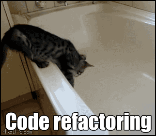

# 关于烂代码的那些事（上）

来源:[Axb的自我修养](http://blog.2baxb.me/archives/1343)

## 1.摘要

最近写了不少代码，review了不少代码，也做了不少重构，总之是对着烂代码工作了几周。为了抒发一下这几周里好几次到达崩溃边缘的情绪，我决定写一篇文章谈一谈烂代码的那些事。 这里是上篇，谈一谈烂代码产生的原因和现象。

## 2.写烂代码很容易

刚入程序员这行的时候经常听到一个观点：你要把精力放在ABCD（需求文档/功能设计/架构设计/理解原理）上，写代码只是把想法翻译成编程语言而已，是一个没什么技术含量的事情。

当时的我在听到这种观点时会有一种近似于高冷的不屑：你们就是一群傻X，根本不懂代码质量的重要性，这么下去迟早有一天会踩坑，呸。

可是几个月之后，他们似乎也没怎么踩坑。而随着编程技术一直在不断发展，带来了更多的我以前认为是傻X的人加入到程序员这个行业中来。

语言越来越高级、封装越来越完善，各种技术都在帮助程序员提高生产代码的效率，依靠层层封装，程序员真的不需要了解一丁点技术细节，只要把需求里的内容逐行翻译出来就可以了。

很多程序员不知道要怎么组织代码、怎么提升运行效率、底层是基于什么原理，他们写出来的是在我心目中烂成一坨翔一样的代码。

但是那一坨翔一样代码竟然他妈的能正常工作。

即使我认为他们写的代码是坨翔，但是从不接触代码的人的视角来看（比如说你的boss），代码编译过了，测试过了，上线运行了一个月都没出问题，你还想要奢求什么？

所以，即使不情愿，也必须承认，时至今日，写代码这件事本身没有那么难了。

## 3.烂代码终究是烂代码

但是偶尔有那么几次，写烂代码的人离职了之后，事情似乎又变得不一样了。

想要修改功能时却发现程序里充斥着各种无法理解的逻辑、改完之后莫名其妙的bug一个接一个，接手这个项目的人开始漫无目的的加班，并且原本一个挺乐观开朗的人渐渐的开始喜欢问候别人祖宗了。


### 3.1.意义不明

能力差的程序员容易写出意义不明的代码，他们不知道自己究竟在做什么.

就像这样：

```
public void save() {
    for(int i=0;i<100;i++) {
        //防止保存失败，重试100次
        document.save(); 
    }
}
```

```
public void save() {
    for(int i=0;i<100;i++) {
        //防止保存失败，重试100次
        document.save(); 
    }
}
```

对于这类程序员，我一般建议他们转行。

### 3.2.不说人话

不说人话是新手最经常出现的问题，直接的表现就是写了一段很简单的代码，其他人却看不懂。

比如下面这段：

```
public boolean getUrl(Long id) {
    UserProfile up = us.getUser(ms.get(id).getMessage().aid);
    if (up == null) {
        return false;
    }
    if (up.type == 4 || ((up.id >> 2) & 1) == 1) {
        return false;
    } 
    if(Util.getUrl(up.description)) {
        return true;
    } else {
        return false;
    }
}
```

```
public boolean getUrl(Long id) {
    UserProfile up = us.getUser(ms.get(id).getMessage().aid);
    if (up == null) {
        return false;
    }
    if (up.type == 4 || ((up.id >> 2) & 1) == 1) {
        return false;
    } 
    if(Util.getUrl(up.description)) {
        return true;
    } else {
        return false;
    }
}
```

很多程序员喜欢简单的东西：简单的函数名、简单的变量名、代码里翻来覆去只用那么几个单词命名；能缩写就缩写、能省略就省略、能合并就合并。这类人写出来的代码里充斥着各种`g/s/gos/of/mss`之类的全世界没人懂的缩写，或者一长串不知道在做什么的连续调用。

还有很多程序员喜欢复杂，各种宏定义、位运算之类写的天花乱坠，生怕代码让别人一下子看懂了会显得自己水平不够。

简单的说，他们的代码是写给机器的，不是给人看的。

### 3.3.不恰当的组织

不恰当的组织是高级一些的烂代码，程序员在写过一些代码之后，有了基本的代码风格，但是对于规模大一些的工程的掌控能力不够，不知道代码应该如何解耦、分层和组织。

这种反模式的现象是经常会看到一段代码在工程里拷来拷去；某个文件里放了一大坨堆砌起来的代码；一个函数堆了几百上千行；或者一个简单的功能七拐八绕的调了几十个函数，在某个难以发现的猥琐的小角落里默默的调用了某些关键逻辑。


这类代码大多复杂度高，难以修改，经常一改就崩；而另一方面，创造了这些代码的人倾向于修改代码，畏惧创造代码，他们宁愿让原本复杂的代码一步步变得更复杂，也不愿意重新组织代码。当你面对一个几千行的类，问为什么不把某某逻辑提取出来的时候，他们会说：

“但是，那样就多了一个类了呀。”

### 3.4.假设和缺少抽象

相对于前面的例子，假设这种反模式出现的场景更频繁，花样更多，始作俑者也更难以自己意识到问题。比如：

```
public String loadString() {
    File file = new File("c:/config.txt");
    // read something
}
```

```
public String loadString() {
    File file = new File("c:/config.txt");
    // read something
}
```

文件路径变更的时候，会把代码改成这样：

```
public String loadString(String name) {
    File file = new File(name);
    // read something
}
```

```
public String loadString(String name) {
    File file = new File(name);
    // read something
}
```

需要加载的内容更丰富的时候，会再变成这样：

```
public String loadString(String name) {
    File file = new File(name);
    // read something
}
public Integer loadInt(String name) {
    File file = new File(name);
    // read something
}
```

```
public String loadString(String name) {
    File file = new File(name);
    // read something
}
public Integer loadInt(String name) {
    File file = new File(name);
    // read something
}
之后可能会再变成这样：


public String loadString(String name) {
    File file = new File(name);
    // read something
}
public String loadStringUtf8(String name) {
    File file = new File(name);
    // read something
}
public Integer loadInt(String name) {
    File file = new File(name);
    // read something
}
public String loadStringFromNet(String url) {
    HttpClient ...
}
public Integer loadIntFromNet(String url) {
    HttpClient ...
}
```

```
public String loadString(String name) {
    File file = new File(name);
    // read something
}
public String loadStringUtf8(String name) {
    File file = new File(name);
    // read something
}
public Integer loadInt(String name) {
    File file = new File(name);
    // read something
}
public String loadStringFromNet(String url) {
    HttpClient ...
}
public Integer loadIntFromNet(String url) {
    HttpClient ...
}
```

这类程序员往往是项目组里开发效率比较高的人，但是大量的业务开发工作导致他们不会做多余的思考，他们的口头禅是：“我每天要做XX个需求”或者“先做完需求再考虑其他的吧”。

这种反模式表现出来的后果往往是代码很难复用，面对deadline的时候，程序员迫切的想要把需求落实成代码，而这往往也会是个循环：写代码的时候来不及考虑复用，代码难复用导致之后的需求还要继续写大量的代码。

一点点积累起来的大量的代码又带来了组织和风格一致性等问题，最后形成了一个新功能基本靠拷的遗留系统。

### 3.5.还有吗

烂代码还有很多种类型，沿着功能-性能-可读-可测试-可扩展这条路线走下去，还能看到很多匪夷所思的例子。

那么什么是烂代码？个人认为，烂代码包含了几个层次：

* 如果只是一个人维护的代码，满足功能和性能要求倒也足够了。
* 如果在一个团队里工作，那就必须易于理解和测试，让其它人员有能力修改各自的代码。
* 同时，越是处于系统底层的代码，扩展性也越重要。

所以，当一个团队里的底层代码难以阅读、耦合了上层的逻辑导致难以测试、或者对使用场景做了过多的假设导致难以复用时，虽然完成了功能，它依然是坨翔一样的代码。

### 3.6.够用的代码

而相对的，如果一个工程的代码难以阅读，能不能说这个是烂代码？很难下定义，可能算不上好，但是能说它烂吗？如果这个工程自始至终只有一个人维护，那个人也维护的很好，那它似乎就成了“够用的代码”。

很多工程刚开始可能只是一个人负责的小项目，大家关心的重点只是代码能不能顺利的实现功能、按时完工。

过上一段时间，其他人参与时才发现代码写的有问题，看不懂，不敢动。需求方又开始催着上线了，怎么办？只好小心翼翼的只改逻辑而不动结构，然后在注释里写上这么实现很ugly，以后明白内部逻辑了再重构。

再过上一段时间，有个相似的需求，想要复用里面的逻辑，这时才意识到代码里做了各种特定场景的专用逻辑，复用非常麻烦。为了赶进度只好拷代码然后改一改。问题解决了，问题也加倍了。

几乎所有的烂代码都是从“够用的代码”演化来的，代码没变，使用代码的场景发生变了，原本够用的代码不符合新的场景，那么它就成了烂代码。

## 4.重构不是万能药

程序员最喜欢跟程序员说的谎话之一就是：现在进度比较紧，等X个月之后项目进度宽松一些再去做重构。

不能否认在某些（极其有限的）场景下重构是解决问题的手段之一，但是写了不少代码之后发现，重构往往是程序开发过程中最复杂的工作。花一个月写的烂代码，要花更长的时间、更高的风险去重构。

曾经经历过几次忍无可忍的大规模重构，每一次重构之前都是找齐了组里的高手，开了无数次分析会，把组内需求全部暂停之后才敢开工，而重构过程中往往哀嚎遍野，几乎每天都会出上很多意料之外的问题，上线时也几乎必然会出几个问题。



从技术上来说，重构复杂代码时，要做三件事：理解旧代码、分解旧代码、构建新代码。而待重构的旧代码往往难以理解；模块之间过度耦合导致牵一发而动全身，不易控制影响范围；旧代码不易测试导致无法保证新代码的正确性。

这里还有一个核心问题，重构的复杂度跟代码的复杂度不是线性相关的。比如有1000行烂代码，重构要花1个小时，那么5000行烂代码的重构可能要花2、3天。要对一个失去控制的工程做重构，往往还不如重写更有效率。

而抛开具体的重构方式，从受益上来说，重构也是一件很麻烦的事情：它很难带来直接受益，也很难量化。这里有个很有意思的现象，基本关于重构的书籍无一例外的都会有独立的章节介绍“如何向boss说明重构的必要性”。

重构之后能提升多少效率？能降低多少风险？很难答上来，烂代码本身就不是一个可以简单的标准化的东西。

举个例子，一个工程的代码可读性很差，那么它会影响多少开发效率？

你可以说：之前改一个模块要3天，重构之后1天就可以了。但是怎么应对“不就是做个数据库操作吗为什么要3天”这类问题？烂代码“烂”的因素有不确定性、开发效率也因人而异，想要证明这个东西“确实”会增加两天开发时间，往往反而会变成“我看了3天才看懂这个函数是做什么的”或者“我做这么简单的修改要花3天”这种神经病才会去证明的命题。

而另一面，许多技术负责人也意识到了代码质量和重构的必要性，“那就重构嘛”，或者“如果看到问题了，那就重构”。上一个问题解决了，但实际上关于重构的代价和收益仍然是一笔糊涂账，在没有分配给你更多资源、没有明确的目标、没有具体方法的情况下，很难想象除了有代码洁癖的人还有谁会去执行这种莫名其妙的任务。

于是往往就会形成这种局面：

* 不写代码的人认为应该重构，重构很简单，无论新人还是老人都有责任做重构。
* 写代码老手认为应该迟早应该重构，重构很难，现在凑合用，这事别落在我头上。
* 写代码的新手认为不出bug就谢天谢地了，我也不知道怎么重构。

## 5.写好代码很难

与写出烂代码不同的是，想写出好代码有很多前提：

* 理解要开发的功能需求。
* 了解程序的运行原理。
* 做出合理的抽象。
* 组织复杂的逻辑。
* 对自己开发效率的正确估算。
* 持续不断的练习。

写出好代码的方法论很多，但我认为写出好代码的核心反而是听起来非常low的“持续不断的练习”。这里就不展开了，留到下篇再说。

很多程序员在写了几年代码之后并没有什么长进，代码仍然烂的让人不忍直视，原因有两个主要方面：

* 环境是很重要的因素之一，在烂代码的熏陶下很难理解什么是好代码，知道的人大部分也会选择随波逐流。
* 还有个人性格之类的说不清道不明的主观因素，写出烂代码的程序员反而都是一些很好相处的人，他们往往热爱公司团结同事平易近人工作任劳任怨–只是代码很烂而已。

而工作几年之后的人很难再说服他们去提高代码质量，你只会反复不断的听到：“那又有什么用呢？”或者“以前就是这么做的啊？”之类的说法。

那么从源头入手，提高招人时对代码的质量的要求怎么样？

前一阵面试的时候增加了白板编程、最近又增加了上机编程的题目。发现了一个现象：一个人工作了几年、做过很多项目、带过团队、发了一些文章，不一定能代表他代码写的好；反之，一个人代码写的好，其它方面的能力一般不会太差。

举个例子，最近喜欢用“写一个代码行数统计工具”作为面试的上机编程题目。很多人看到题目之后第一反映是，这道题太简单了，这不就是写写代码嘛。

从实际效果来看，这道题识别度却还不错。

首先，题目足够简单，即使没有看过《面试宝典》之类书的人也不会吃亏。而题目的扩展性很好，即使提前知道题目，配合不同的条件，可以变成不同的题目。比如要求按文件类型统计行数、或者要求提高统计效率、或者统计的同时输出某些单词出现的次数，等等。

从考察点来看，首先是基本的树的遍历算法；其次有一定代码量，可以看出程序员对代码的组织能力、对问题的抽象能力；上机编码可以很简单的看出应聘者是不是很久没写程序了；还包括对于程序易用性和性能的理解。

最重要的是，最后的结果是一个完整的程序，我可以按照日常工作的标准去评价程序员的能力，而不是从十几行的函数里意淫这个人在日常工作中大概会有什么表现。

但即使这样，也很难拍着胸脯说，这个人写的代码质量没问题。毕竟面试只是代表他有写出好代码的能力，而不是他将来会写出好代码。

## 6.悲观的结语

说了那么多，结论其实只有两条，作为程序员：

* 不要奢望其他人会写出高质量的代码
* 不要以为自己写出来的是高质量的代码

如果你看到了这里还没有丧失希望，那么可以期待一下这篇文章的第二部分，关于如何提高代码质量的一些建议和方法。
