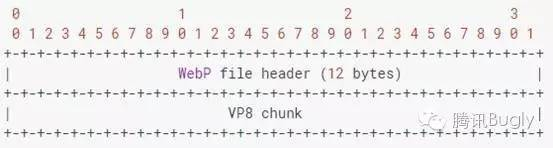
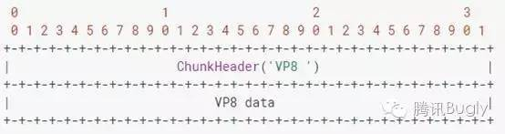
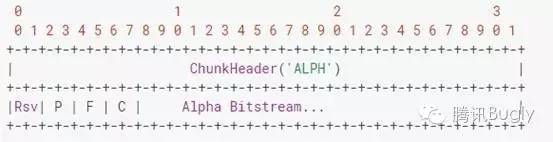

# WebP原理和Android支持现状介绍

来源:[http://dev.qq.com/topic/582939577ef9c5b708556b0d](http://dev.qq.com/topic/582939577ef9c5b708556b0d)

## 1.背景

目前网络中图片仍然是占用流量较大的一部分，对于移动端更是如此，因此，如何在保证图片视觉不失真前提下缩小体积，对于节省带宽和电池电量十分重要。

然而目前对于JPEG、PNG、GIF等常用图片格式的优化已几乎达到极致，因此Google于2010年提出了一种新的图片压缩格式 – WebP，给图片的优化提供了新的可能。

WebP为网络图片提供了无损和有损压缩能力，同时在有损条件下支持透明通道。据官方实验显示：无损WebP相比PNG减少26%大小；有损WebP在相同的SSIM（Structural Similarity Index，结构相似性）下相比JPEG减少25%~34%的大小；有损WebP也支持透明通道，大小通常约为对应PNG的1/3。

同时，谷歌于2014年提出了动态WebP，拓展WebP使其支持动图能力。动态WebP相比GIF支持更丰富的色彩，并且也占用更小空间，更适应移动网络的动图播放。

目前国内外各大互联网公司已逐步使用WebP，科技博客GigaOM曾报道，YouTube的视频缩略图采用WebP后，网页加载速度提升了10%；谷歌网上应用商店采用WebP后，每天可节省几TB的带宽，页面平均加载时间大约减少1/3；谷歌移动应用市场采用WebP图片格式后，每天节省了50TB的存储空间；2014年腾讯新闻客户端应用了WebP后，流量峰值带宽降低9GB，网络连接延时不变的前提下，平均图片延时和数据下载延时降低了100ms；2014年空间装扮也全量转换成WebP，带宽上也有显著降低。（虽然听说目前已转成SharpP格式…）

WebP的优势在于它具有更优的图像数据压缩算法，在拥有肉眼无法识别差异的图像质量前提下，带来更小的图片体积，同时具备了无损和有损的压缩模式、Alpha 透明以及动画的特性，在 JPEG 和 PNG 上的转化效果都非常优秀、稳定和统一。

**本文主要对WebP现状与原理进行整理，并尤其研究其动图格式在Android上的支持情况。**

## 2.原理

WebP的压缩主要分为有损压缩、无损压缩以及有损带透明通道压缩。

### 2.1 有损WebP

有损WebP基于VP8视频编码中的预测编码方法来压缩图像数据，其基本步骤类似于JPEG压缩，主要包含格式转换、分割子块、预测编码、FDCT、量化、Z排列、熵编码，流程如下图所示，红色代表与JPEG不同的部分。

#### 1) 格式转换

若压缩前图像数据为RGB格式，则需先进行格式转换成YUV格式，Y表示亮度分量，UV表示色度分量。之所以转换成YUV格式是因为人类视觉对亮度远比色度敏感，所以可通过适当减少色度数据的存储来节省数据占用的空间，但却不会对视觉效果造成太大影响，如可每两个或四个相邻的像素点才保存一对UV值。

#### 2) 分割宏块

接下来将数据分割成一个个8x8或16x16的宏块。

#### 3) 预测编码

预测编码的原理是基于前面编码好的宏块，预测多余的动作颜色等信息，属于帧内预测。对各宏块可使用以下几种帧内预测模式：

H_PRED(horizontal prediction).使用block左边的一列L来填充block中的每一列

V_PRED(vertical prediction):使用block上边的一行A来填充block中的每一行

DC_PRED(DC prediction):使用L和A中所有像素的平均值作为唯一的值填充block

TM_PRED(TrueMotion prediction):使用渐进的方式，记录上面一行的渐进差，以同样的差值，以L为基准拓展每一行。

#### 4) FDCT

FDCT(Forward Discrete Cosine Transform，正向离散余弦变换)是将一组空间域的像素点转变成频域中的系数，对每个宏块执行FDCT，使得变换后数据的低频部分分布在数据块的左上方，高频部分集中在右下方，其中左上角第一个系数称为直流系数，其他均为交流系数。

#### 5) 量化

量化是压缩中损失数据的主要步骤，它主要原理是把经过DCT变换后的宏块中每个数值除以量化表中对应的系数并取整。其中量化表中高频部分对应的系数比低频部分系数要大得多，则在经过量化后，高频部分的频率系数被大大衰减甚至许多被清零，而低频部分的频率系数则较好地被保留。由于人眼对低频部分更敏感，所以经过量化后再还原成图像对视觉效果影响较小，但数据得到有效的压缩。量化的最终目的是减少低频部分非零系数的幅值并增加高频部分零值系数的数量。

#### 6) Z排列

为更便于后续的编码，需在编码前对数据块进行重新的排列，使得低频部分的数据排在前面，高频部分的数据排在后面，以增加数组中连续零值的数量，所以采用一种Z字型的排列方式。

#### 7) DPCM

可用DPCM(Differential Pulse Code Modulation，差分脉冲编码调制)对直流系数进行编码。由于直流系数的数值较大，且相邻数据块的直流系数相差不大，所以可使用DPCM对相邻数据块间量化后的直流系数差值进行编码，从而提高压缩比。

#### 8) 行程编码

行程编码是一种根据相同数据重复多次的情况简化表示的算法，例如1111222222333按照行程编码表示为(1,4)(2,6)(3,3)。由于量化后的交流系数中包含较多连续零值系数，因此可用行程编码对它们进行编码来有效压缩数据长度。

#### 9) 熵编码

熵编码是一种无损数据压缩编码方式，WebP中采用布尔算术编码作为熵编码方式。和其它熵编码方法不同的地方在于，其他的熵编码方法通常是把输入的消息分割为符号，然后对每个符号进行编码，而算术编码是直接把整个输入的消息编码为一个数，一个满足(0.0 ≤ n < 1.0)的小数n。消息越长，编码表示它的间隔就越小，表示这一间隔所需的二进制位就越多。

#### 10) 其他

WebP还有一些细节上的步骤，比如自适应分块（对不同区域的宏块分配不同的压缩参数）、环路滤波等。

为什么有损WebP会比JPEG好？

主要原因是预测编码。

自适应分块也提供了较好表现。

环路滤波在中、低比特率的情况下有较大帮助。

算数编码相比霍夫曼增强了5%~10%的压缩能力。

### 2.2 无损WebP

无损WebP基于使用不同的技术对图像数据进行转换，包括：预测空间变换、色彩空间转换、使用调色板、多像素打包成一个像素、alpha值替换等技术。对于熵编码，则采用改进的LZ77-Huffman编码来紧凑稀疏值，它是一种对距离值的2D编码技术。

#### 2.3 有损WebP（支持透明）

区别于有损WebP和无损WebP，这种编码允许对RGB频道的有损编码同时可对透明度频道进行无损编码。由于这种形式目前其他的格式还未能提供，所以目前需要使用透明度的话都会使用无损的PNG，导致大小膨胀。对于这类图片，WebP提供了较好的压缩效果。相比有损的WebP，添加透明通道只增加22%的大小。

因此，将支持透明的PNG换成无损+支持透明的WEBP可以平均节省60%-70%大小，这个已经被一些含较多Icon的移动网站证明。

（如：[https://github.com/EverythingMe/webp-test#readme](https://github.com/EverythingMe/webp-test#readme)）

### 2.4 动态WebP

动态WebP的原理与GIF和APNG原理类似，每一帧记录变化区域的坐标、长宽、播放延时等用于还原并播放。

## 3.文件结构

一个WebP文件表示一个静态图片或动画，并可选的包含透明度、色彩

配置文件和元数据等。

### 3.1 WebP文件首部

RIFF：ASCII字符RIFF。

File Size：文件大小，以字节为单位。

WEBP：ASCII字符WEBP，标识这是WebP文件

### 3.2 有损WebP简要文件格式

这种文件格式支持有损编码，但不包含透明度以及其他拓展特性，可以被许多旧版本软件支持。

VP8 chunk：

Chunk Header:VP8块首部，定义了VP8比特流数据的大小，以及该帧VP8数据的长宽等信息。

VP8 data:VP8比特流数据。

VP8比特流格式的定义可参考rfc6386，主要定义了如何将图像数据转换成YUV格式。[https://tools.ietf.org/html/rfc6386](https://tools.ietf.org/html/rfc6386)

### 3.3无损WebP简要文件格式

这种格式用在无损WebP编码（可选透明）并且不要求拓展特性时。需要注意的是，较旧的WebP软件可能不支持该格式。

VP8L chunk：

属性意义类似于有损WebP的简要格式，其中VP8L的定义可参考文档：

[https://chromium.googlesource.com/webm/libwebp/+/master/doc/webp-lossless-bitstream-spec.txt](https://chromium.googlesource.com/webm/libwebp/+/master/doc/webp-lossless-bitstream-spec.txt)

### 3.4 拓展格式

拓展格式包括：

* VP8X用于指明使用的特性
* 可选的‘ICCP’用于色彩配置
* 可选的‘ANIM’用于动画控制
* 可选的‘EXIF’用于EXIF元数据
* 可选的‘XMP’用于XMP元数据

对于静态图像，图像数据包含一帧数据，由以下组成：

* 一个可选的透明度子chunk
* 1个比特流子chunk
* 对于动态图像，图像数据则包含多帧数据。

拓展头部格式：

ICC profile(I):置位时表示包含ICC配置文件。

Alpha(L):当图像包含透明数据时置位。

EXIF metadata(E)当包含EXIF元数据时置位。

XMP metadata(X):当包含XMP元数据时置位。

Animation(A):动态WebP置位，此时ANIM和ANMF数据块中的数据将会被使用来控制动画。

Canvas Width Minus One:画布的真实宽度是该数值+1。

Canvas Height Minus One:画布的真实高度是该数值+1。

**动画**

WebP动画被ANIM和ANMF块所控制。

ANIM Chunk：

对于一个动图，该块数据定义了动画的全局参数。

Background Color: 定义画布的背景颜色，以BGRA的顺序存储。这个颜色会被填充到每帧数据没用到的区域。

LoopCount：循环次数，0表示无限循环。

当动画标识被置位时，该数据块必须出现。当动画标识位没出现时，该数据块会被忽略。

ANMF chunk：

对于动图，该数据块包含了一帧图像的数据。

Frame X:该帧数据左上角X坐标为该值*2。

Frame Y:该帧数据左上角Y坐标为该值*2。

Frame Duration: 播放该帧后的延时时间，以ms为单位。

Blending method (B)：标识如何混用前面画布的相应透明像素点。置0时，处理完前面一帧图像后，使用透明混合。置1时，不混合，渲染时直接覆盖矩形区域。

Disposal method (D):标识该帧数据在被显示后如何处理画布。置0时不处理；置1时将画布矩形区域转换成ANIM定义的背景颜色。

Frame Data:以2字节为单位，包含图像比特流数据以及可选的透明度数据。

Alpha

Pre-processing §: 标识压缩中使用了预处理。

Filtering method (F): 滤波方法。0-无过滤；1-横向过滤；2-垂直过滤；3-梯度过滤。

Compression method ©: 0-无压缩；1-使用WebP无损格式压缩。

Alpha bitstream：编码的透明度比特流数据

颜色配置文件、元数据数据的文件格式类似，主要是头部ASCII码不同。

### 3.5 文件布局示例

带透明有损WebP文件形如：

无损WebP形如：

无损WebP包含ICC配置文件和XMP元数据形如：

动态WebP包含EXIF元数据形如：

## 4.与其他格式比较

**有损WebP vs JPEG：**

谷歌使用Lenna、Kodak、Tecnick还有Image_crawl四个图像来源来做实验，在相同或稍高的SSIM基础上，WebP相比JPEG体积降低25% ~ 34%。详见：

[https://developers.google.com/speed/webp/docs/webp_study](https://developers.google.com/speed/webp/docs/webp_study)

**无损WebP 、有损带透明WebP vs PNG**

下图是选取了1000张网络中的PNG，对其进行压缩后，与对应的无损WebP以及有损带透明WebP比较。可见绝大部分图片经过两种WebP压缩后均比PNG要小。

WebP的编码时间较长，是PNG的5倍以上，但解码速度与PNG差不多，甚至很多时候比PNG快。而WebP在编码时占用内存比PNG高25%，解码时比PNG低30%。

详见：[https://developers.google.com/speed/webp/docs/webp_lossless_alpha_study](https://developers.google.com/speed/webp/docs/webp_lossless_alpha_study)

**动态WebP vs GIF**

**优势：**

WebP支持24位RGB和8位透明通道，GIF仅支持8位色彩及1位透明度。

WebP支持无损和有损两种模式，而且对于动态图，能同时结合有损和无损的图片。而GIF仅支持无损的压缩。WebP的有损压缩技术也更好地适应从现实世界视频中创建的动图。

WebP相比GIF占用更小的空间。Animated GIFs转换为有损WebP减少64%，转换成无损WebP减少19%，这对移动网络十分重要。

WebP使用更短的解码时间，WebP所用解码时间是GIF的57%。

**劣势：**

支持不够普遍。

添加WebP支持到浏览器需要添加较多代码，但这在将来当WebP和WebM共享更多解码代码或者WebP被WebM合并后会有改善。

**动态WebP vs APNG**

APNG是一种基于PNG的编码，对动图的编码方式类似于WebP，都是对变化的区域进行编码。虽然理论上单张WebP要比PNG小，但有些整合成动图形式后WebP会比APNG更大：

**WEBP、APNG、GIF简要比较表格**

虽官方给出实验示例中无论静态或动态WebP都有比较好的压缩表现，但实际上，自己尝试用谷歌提供转换工具转换以及查询某些网站上的示例，都显示静态和动态WebP的压缩率均不太稳定，基于不同的图片压缩后的大小反而比JPEG或PNG更大。

## 5.支持情况

在浏览器上的支持：

在终端上的支持：

对于在App中使用WebP，除了Android 4.0以上提供了静态WebP原生支持外，其他版本和IOS都可以直接使用官方提供的解析库来支持静态WebP

Android：[https://github.com/alexey-pelykh/webp-android-backport](https://github.com/alexey-pelykh/webp-android-backport)

IOS：[https://github.com/carsonmcdonald/WebP-iOS-example](https://github.com/carsonmcdonald/WebP-iOS-example)

然而，对于动态WebP，目前只能找到facebook的开源库Fresco对其支持，不过Fresco最低仅支持API 9，且引用的相关库较多。

[https://www.fresco-cn.org/](https://www.fresco-cn.org/)

## 6.总结

WebP作为一种较新的图片格式，在一定程度上提高了图片的压缩率，但目前压缩表现尤其对于动图，还较不稳定。

而Android对WebP动图支持较差，目前仅有Fresco一个开源库支持，要引入项目中，需进一步分离出无关的功能，并考虑最低仅支持API 9的问题。

## 参考文献

[https://developers.google.com/speed/webp/](https://developers.google.com/speed/webp/) 
[http://www.jianshu.com/p/555859783f63](http://www.jianshu.com/p/555859783f63) 
[https://isparta.github.io/compare-webp/index_a.html#12](https://isparta.github.io/compare-webp/index_a.html#12) 
[http://littlesvr.ca/apng/gif_apng_webp1.html](http://littlesvr.ca/apng/gif_apng_webp1.html) 
[https://www.fresco-cn.org/](https://www.fresco-cn.org/)

