#  Android性能专项测试之Allocation Tracker(AndroidStudio)

> [Speed up your app](http://blog.udinic.com/2015/09/15/speed-up-your-app?from=timeline&isappinstalled=0)

## Android Studio版的特点

Allocation Tracker(AS)工具比Allocation Tracker(Eclipse)工具强大的地方是更炫酷，更清晰，但是能做的事情都是一样的。

## Allocation Tracker启动

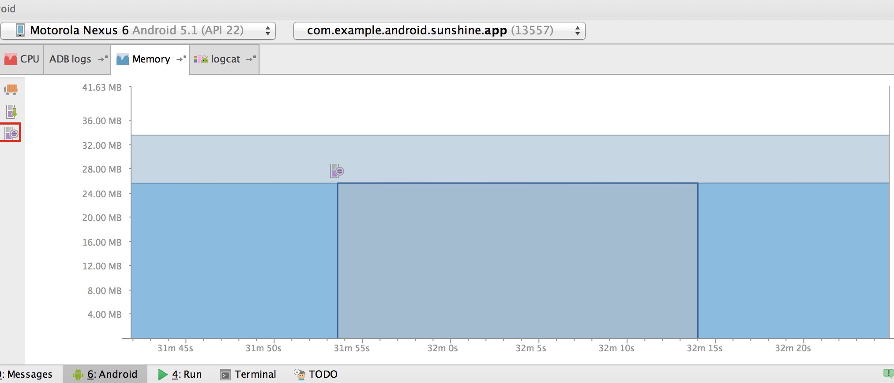

在内存图中点击途中标红的部分，启动追踪，再次点击就是停止追踪，随后自动生成一个alloc结尾的文件，这个文件就记录了这次追踪到的所有数据，然后会在右上角打开一个数据面板: 

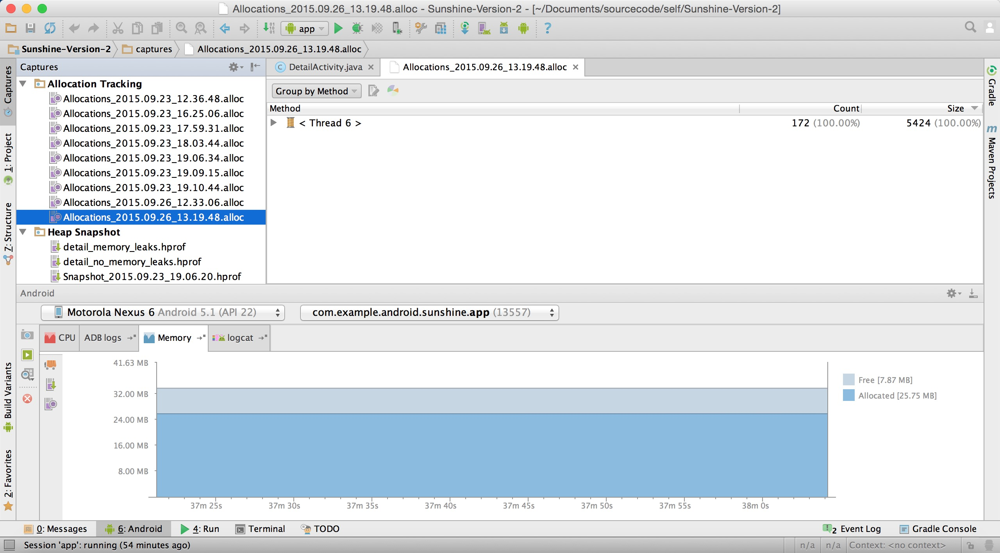

面板左上角是所有历史数据文件列表，后面是详细信息，好，现在我们来看详细介绍信息面板：

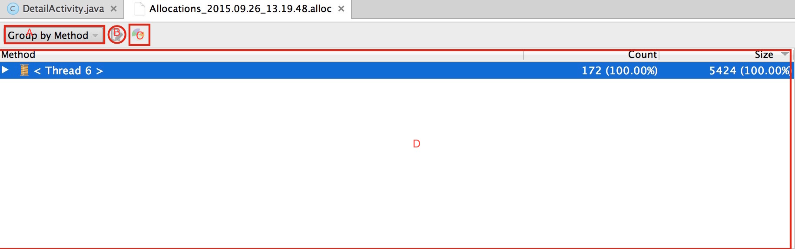

下面我们用字母来分段介绍

### A:查看方式选项

A标识的是一个选择框，有2个选项 

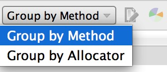

* Group by Method:用方法来分类我们的内存分配
* Group by Allocator:用内存分配器来分类我们的内存分配 

不同的选项，在D区显示的信息会不同，默认会以Group by Method来组织，我们来看看详细信息:

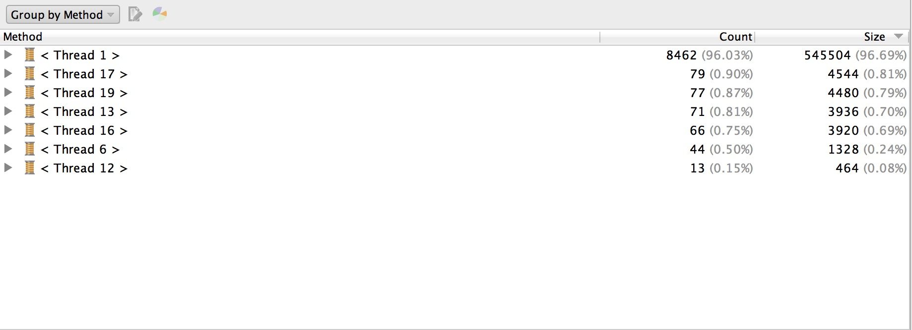

从上图可以看出，首先以线程对象分类，默认以分配顺序来排序，当然你可以更改，只需在Size上点击一下就会倒序，如果以Count排序也是一样，Size就是内存大小，Count就是分配了多少次内存，点击一下线程就会查看每个线程里所有分配内存的方法，并且可以一步一步迭代到最底部： 

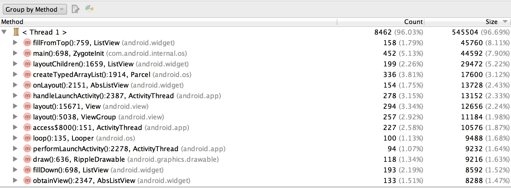

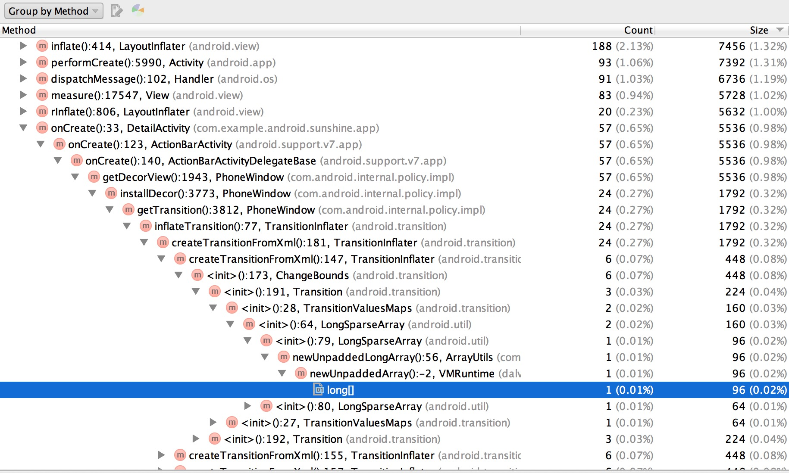

当你以Group by Allocator来查看内存分配的情况时，详细信息区域就会变成如下: 

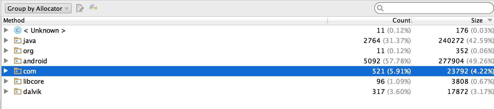

默认还是以内存分配顺序来排序，但是是以每个分配者第一次分配内存的顺序: 

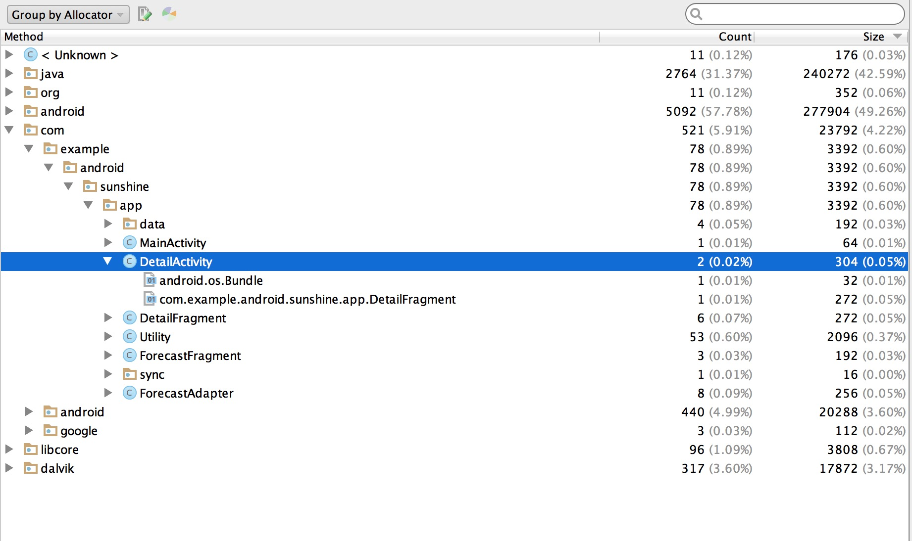

这种方式显示的好处，是我们很好的定位我们自己的代码的分析信息，比如上图中，以包名来找到我们的程序，在这次追踪中包民根目录一共有五个类作为分配器分配了78-4-1=73次内存。

### B:Jump To Source按钮

如果我们想看内存分配的实际在源码中发生的地方，可以选择需要跳转的对象，点击该按钮就能发现我们的源码，但是前提是你有源码：

如果你能跳转到源码，Jump To Source按钮才是可用的，都是跳转到类。

### C:统计图标按钮

该按钮比较酷炫，如果点击该按钮，会弹出一个新窗口，里面是一个酷炫的统计图标，有柱状图和轮胎图两种图形可供选择，默认是轮胎图，其中分配比例可以选择分配次数和占用内存大小，默认是大小Size

#### 轮胎图

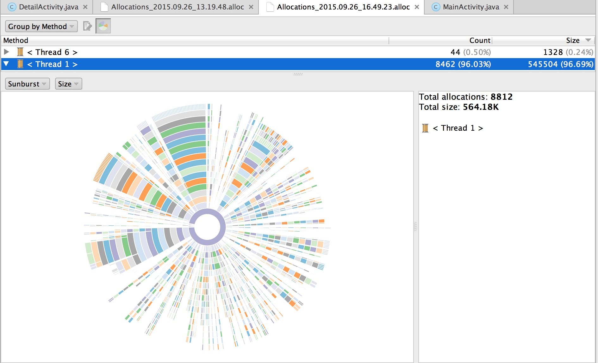

轮胎图是以圆心为起点，最外层是其内存实际分配的对象，每一个同心圆可能被分割成多个部分，代表了其不同的子孙，每一个同心圆代表他的一个后代，每个分割的部分代表了某一带人有多人，你双击某个同心圆中某个分割的部分，会变成以你点击的那一代为圆心再向外展开。如果想回到原始状态，双击圆心就可以了。

* 1.起点

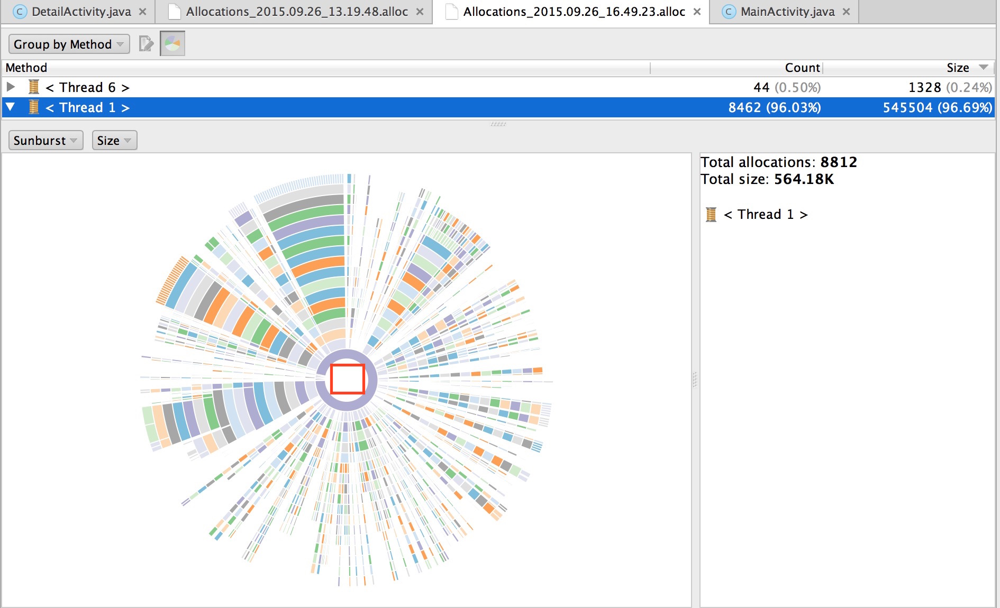

圆心是我们的起点处，如果你把鼠标放到我图中标注的区域，会在右边显示当前指示的是什么线程(Thread1)以及具体信息(分配了8821次，分配了564.18k的内存)，但是红框标注的区域并不代表Thread1，而是第一个同心圆中占比最大的那个线程，所以我们现在把鼠标放到第一个同心圆上，可以看出来，我们划过同心圆的轨迹时可以看到右边的树枝变化了好几个值: 

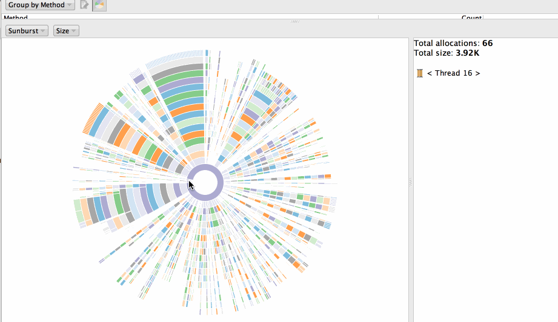

* 2.查看某一个扇面 

我们刚打开是全局信息，我们如果想看其中某个线程，详细信息，可以顺着某个扇面向外围滑动，当然如果你觉得不还是不清晰，可以双击该扇面全面展现该扇面的信息：

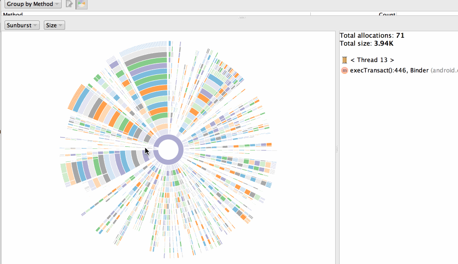

在某个地方双击时，新的轮胎图是以双击点为圆心，你如果想到刚才的圆，双击圆心空白处就可以: 

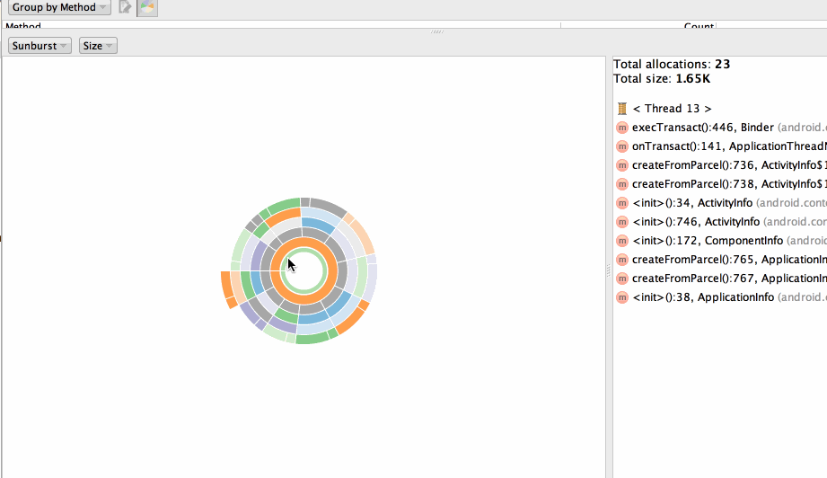

* 3.一个内存的完整路径 

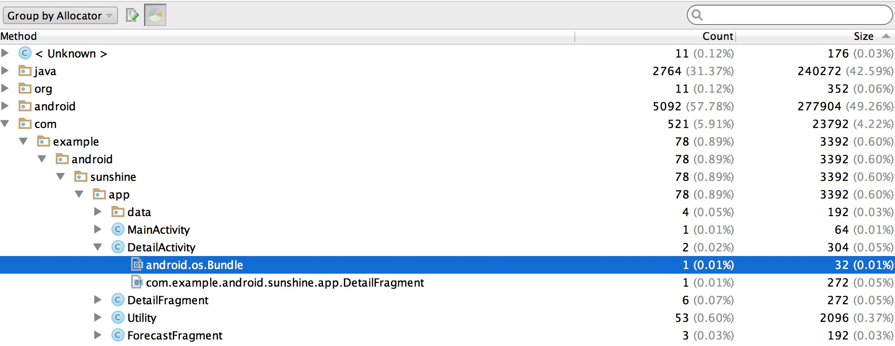

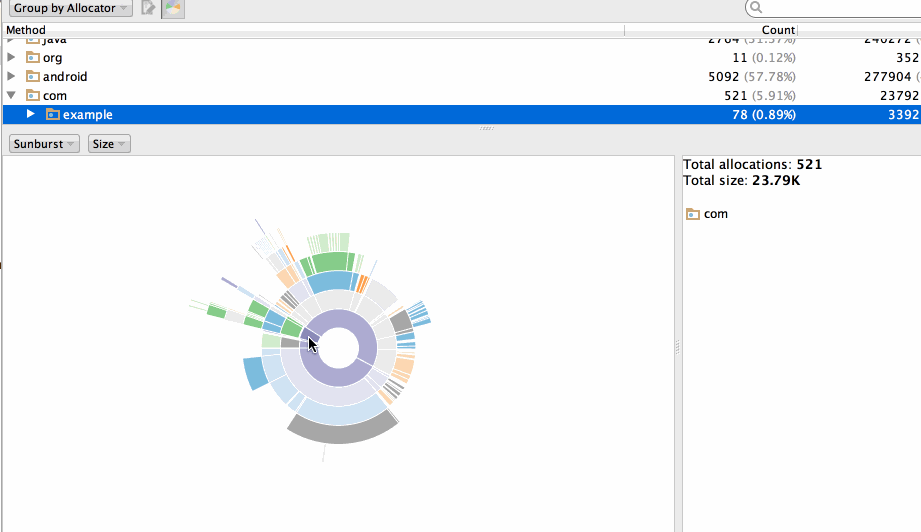

#### 柱状图

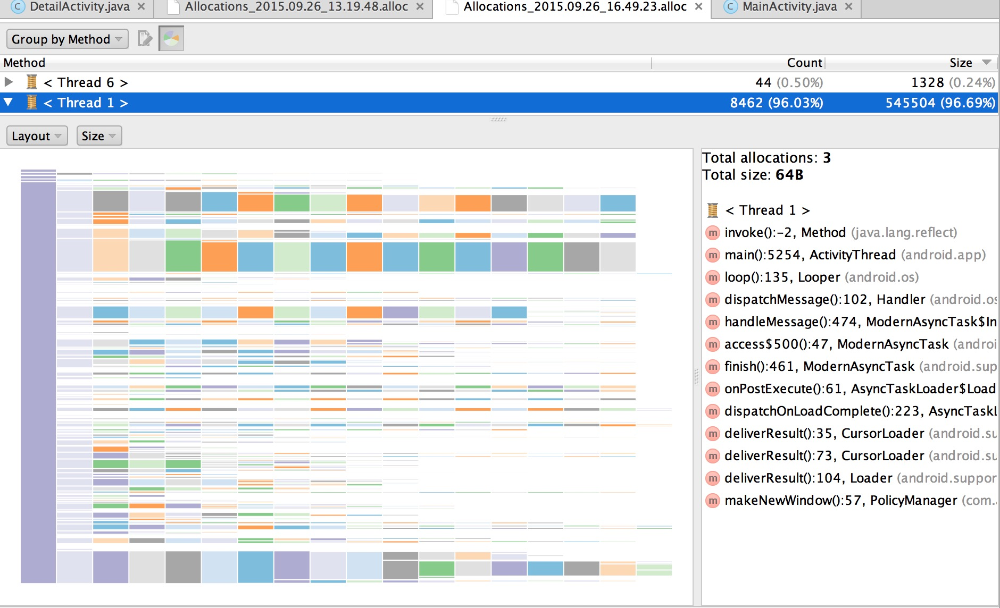

柱状图以左边为起始点，从左到右的顺序是某个的堆栈信息顺序，纵坐标上的宽度是以其Count/Size的大小决定的。柱状图的内容其实和轮胎图没什么特别的地方

* 1.起点

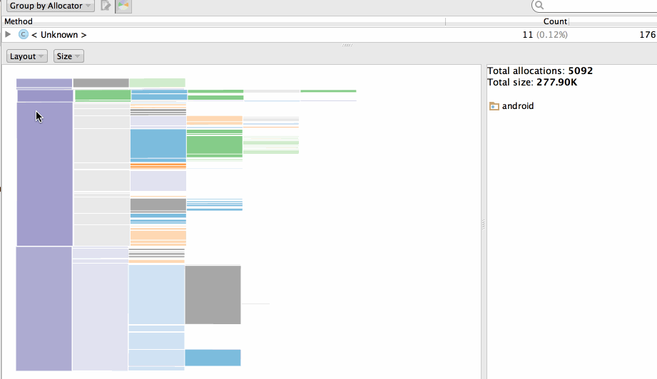

* 2.查看某一个分支

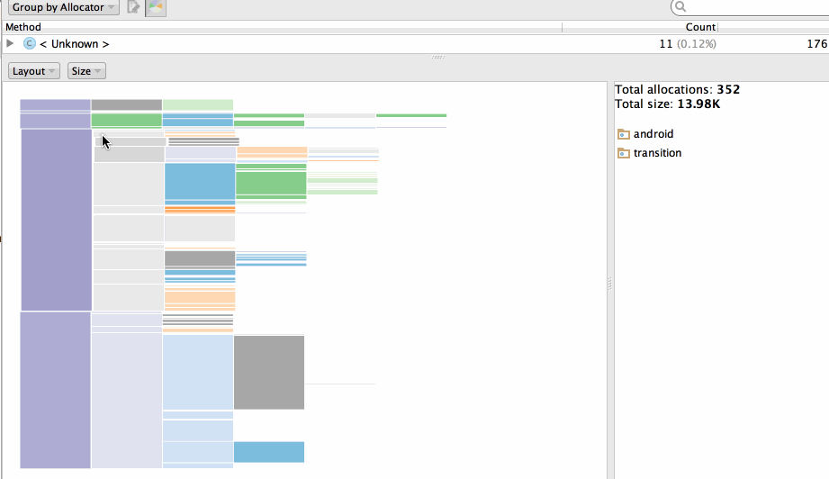

* 3.Count/Size切换

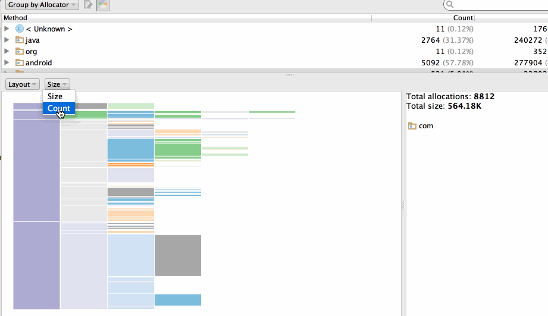