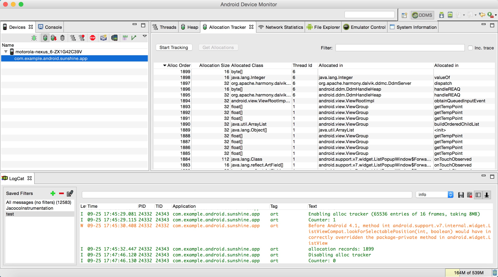
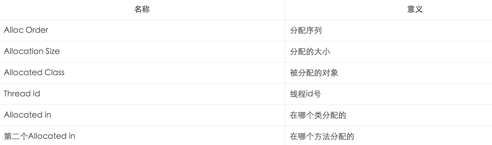
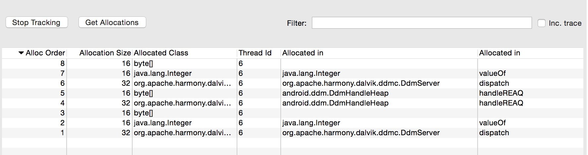
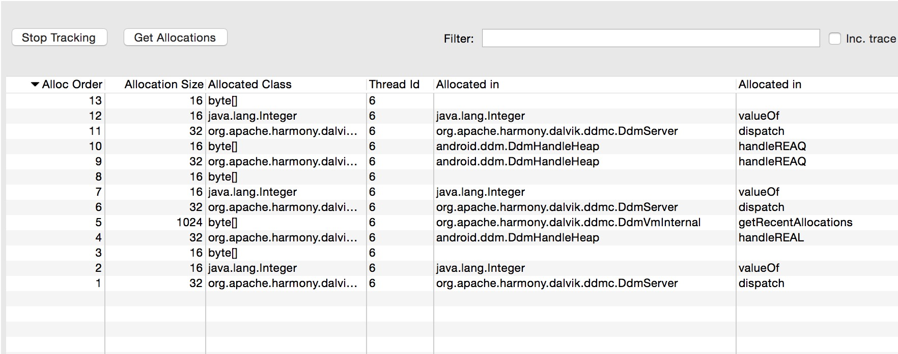
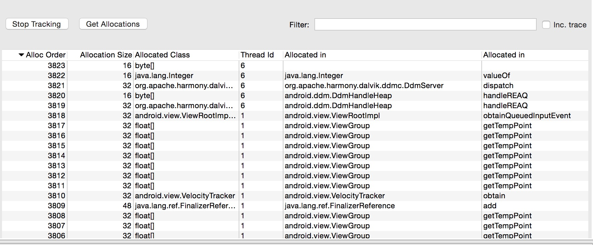
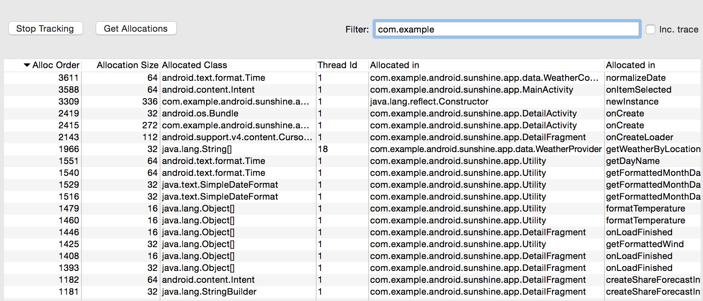
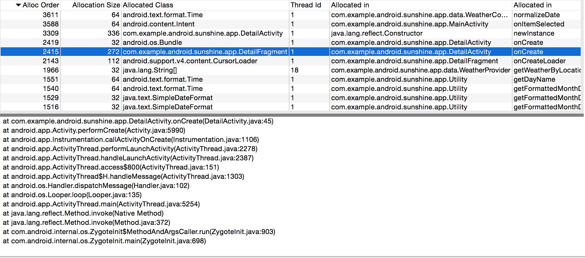

# Android性能专项测试之Allocation Tracker(Device Monitor)

来源:[http://blog.csdn.net/itfootball/article/details/48735041](http://blog.csdn.net/itfootball/article/details/48735041)


## Allocation Tracker 能做什么？

追踪内存分配信息，按顺序排列，这样我们就能清晰看出来某一个操作的内存是如何一步一步分配出来的。比如在有内存抖动的可疑点，我们可以通过查看其内存分配轨迹来看短时间内有多少相同或相似的对象被创建，进一步找出发生问题的代码。

## Allocation Tracker使用条件

* Root手机
* 开发者选项可用

## Allocation Tracker面板



各名称的含义如下:



## Allocation Tracker操作

* 1.首先进入你要追踪的界面 
* 2.点击**Start Tracking**按钮，开始跟踪内存分配轨迹 
* 3.操作你的界面，尽量时间短点 
* 4.点击**Get Allocations**按钮，抓去内存分配轨迹信息，显示在右边的面板中，默认以内存大小排序，你可以以分配顺序排序或者仍以列排序。 
* 5.logcat中会显示出这次的轨迹共抓到内存分配轨迹记录数，可以简单的理解分配了多少次内存，这个数值和Alloc order的最大值是相等的 
* 6.如果你不想看那么多乱七八糟的，你可以使用Filter来过滤，输入包名就可以了。

## 实例

### 无任何操作时内存轨迹

打开首页，点击**Stop tracking**，然后点击**Get Allocations**，会看到下面1～8的内存分配序列: 



再按一次**Get Allocations**会出现如下状态: 



这些信息估计都是DDMS和app交互产生的内存，我们可以忽略

### 正常操作的内存轨迹

如果这个时候我们想单独获取某次操作的内存轨迹，首先一定要记得**Stop Tracking**再**Start Tracking**一下，让追踪点初始化一下，这个时候我们从首页进入一个详情页,看一下我们的内存分配轨迹： 



追踪到的内存分配3823次，看着是不是有点无从下手，没关系，用Filter过滤下:



过滤后，就剩下了跟我们App源码有关系的分配轨迹，我们随便选择一栏，可以看到其trace信息:



上图中，我们可以看出来，在第2415次内存分配中，分配的是DetailFragment对象，占用内存272字节，处理线程Id为1，在`com.example.Android.sunshine.app.DetailActivity`的`onCreate`方法中分配的。从trace信息可以看出来该方法一步一步被调用的信息。

然后我们回源码中确认下，以下代码就是我们上面选择的内存分配的地方：

```
private final String LOG_TAG = DetailActivity.class.getSimpleName();

    @Override
    protected void onCreate(Bundle savedInstanceState) {
        super.onCreate(savedInstanceState);
        setContentView(R.layout.activity_detail);
        Log.d(LOG_TAG, "onCreate");
        ActivityManager.getInstance().registerActivity(this);
        if (savedInstanceState == null) {
            // Create the detail fragment and add it to the activity
            // using a fragment transaction.

            Bundle arguments = new Bundle();
            arguments.putParcelable(DetailFragment.DETAIL_URI, 
            				getIntent().getData());

            DetailFragment fragment = new DetailFragment();
            fragment.setArguments(arguments);

            getSupportFragmentManager().beginTransaction()
                    .add(R.id.weather_detail_container, fragment)
                    .commit();
        }
    }
```