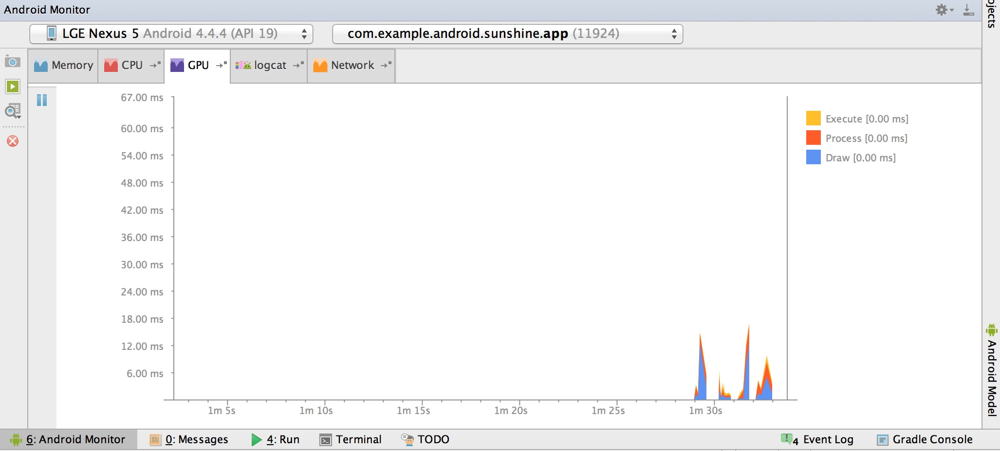

# Android性能专项测试之GPU Monitor

来源:[http://blog.csdn.net/itfootball/article/details/48976127](http://blog.csdn.net/itfootball/article/details/48976127)

> [Testing Display Performance](https://developer.android.com/intl/zh-cn/training/testing/performance.html#timing-dump) 
> [Speed up your app](http://blog.udinic.com/2015/09/15/speed-up-your-app?from=timeline&isappinstalled=0)

## GPU Monitor能做什么?

分析GPU的性能，实时查看绘制每一帧所花费的时间

## GPU Monitor使用准备

* root 手机
* 开发者选项中的Gpu profile开关打开
* Android Studio 1.4+

## GPU Monitor启动

在Android Monitor中点击GPU，就已经打开了该工具，这个时候你在所选App界面中操作的话，面板中就会实时显示绘制数据:

## GPU Monitor的4类数据

5.1之前的数据只有蓝,红,黄三种颜色，5.1加入了紫色数据

### Draw(蓝)

表示View.onDraw()方法的耗时,这部分主要是建立DisplayList对象用的，这些对象将会被转化成OpenGL命令，GPU只能读懂OpenGL命令。 

如果这个地方耗时比较大，说明视图比较复杂。 

蓝色区域代表的时间，是创建DisplayList对象的时间。

### Prepare(紫色)

5.1以后将UI Thread线程所做的事分成了2个线程来做：UI Thread和Render Thread。新加的Render Thread线程会将Draw过程生成的DisplayList对象转化成为OpenGL的命令，然后发送给GPU，这个时候UI Thread可以空闲下来处理下一个frame的数据。如果传送的资源过多的话这个地方耗时就比较大。

紫色区域代表的时间就是UI Thread传送数据给Render Thread所用的时间。

### Process(红)

红色区域代表创建OpenGL命令的时间

### Execute(黄)

黄色区域代表发送OpenGL命令给GPU所用的时间
