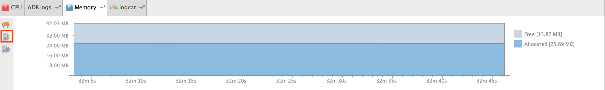
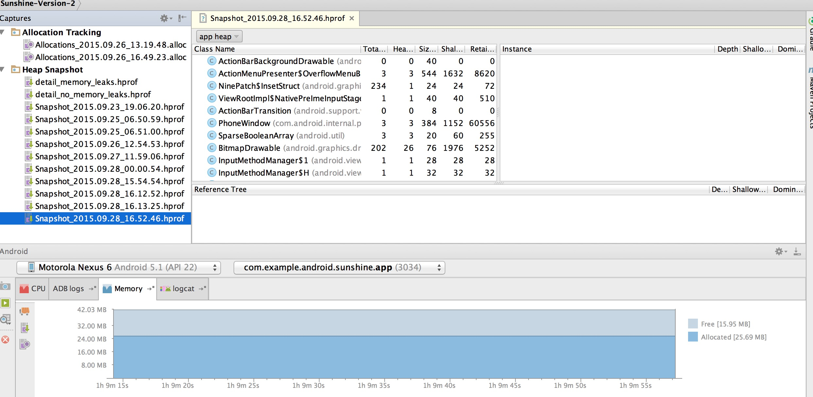
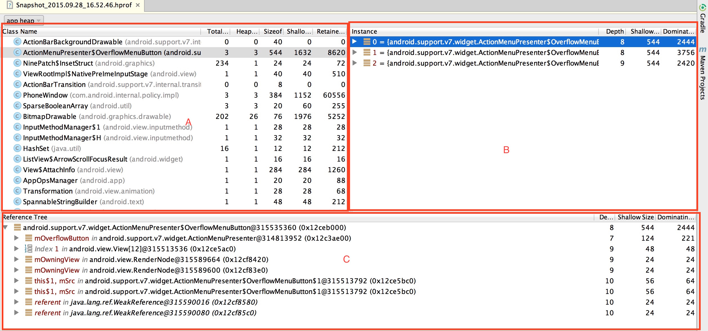
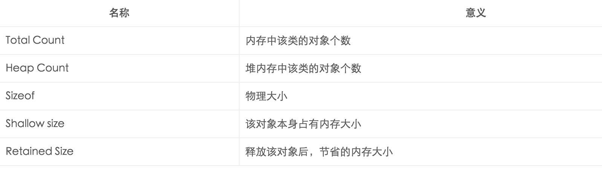
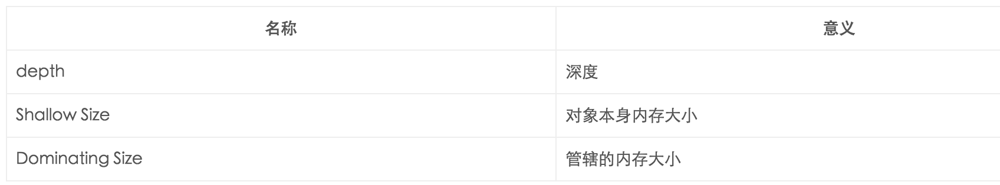
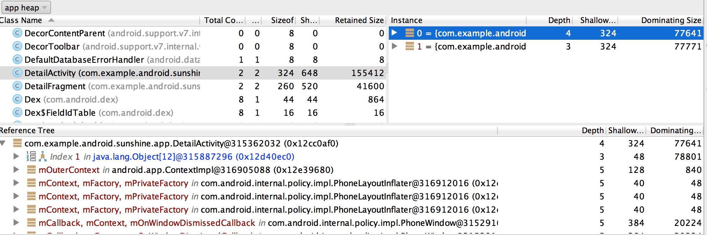
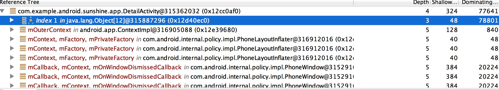
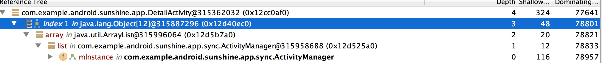
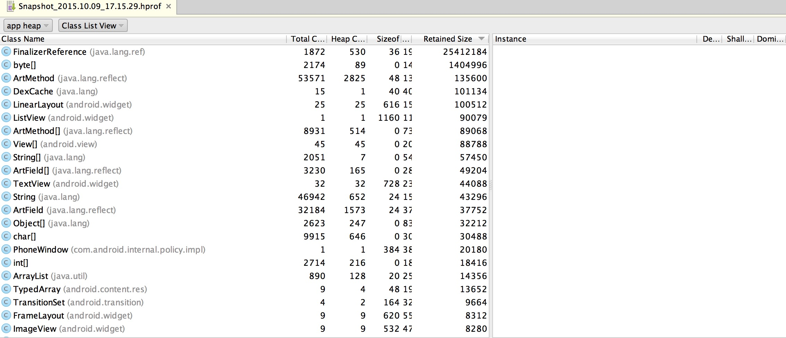
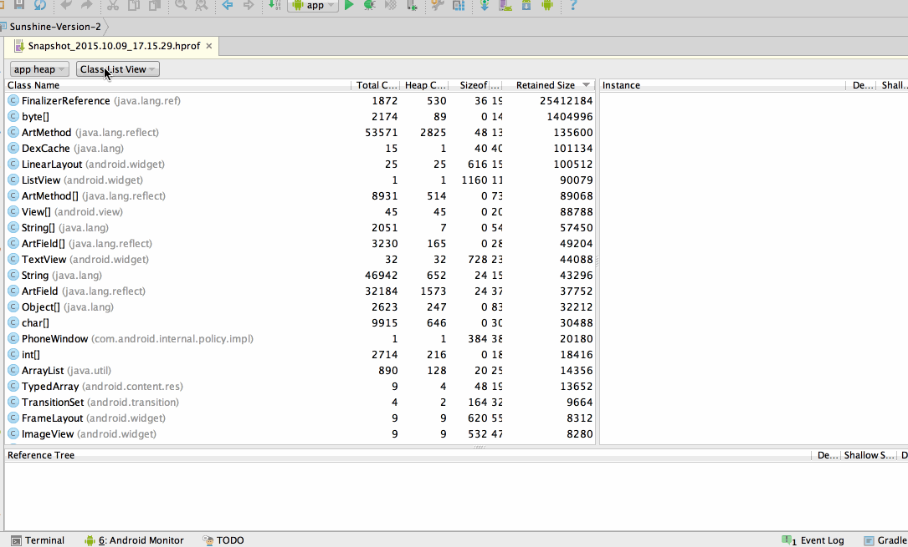

# Android性能专项测试之Heap Snapshot工具

来源:[http://blog.csdn.net/itfootball/article/details/48786275](http://blog.csdn.net/itfootball/article/details/48786275)

> [Speed up your app](http://blog.udinic.com/2015/09/15/speed-up-your-app?from=timeline&isappinstalled=0)

## Heap Snapshot能做什么?

获取Java堆内存详细信息，可以分析出内存泄漏的问题

## Heap Dump启动

在内存面板中，点击图中红色标注的按钮，就会显示我们的Heap Snapshot面包

## Heap Snapshot面板

## Heap Snapshot详细信息面板

该面板里的信息可以有三种类型:app heap/image heap/zygote heap. 

分别代表app 堆内存信息，图片堆内存信息，zygote进程的堆内存信息。

### A区域

列举了堆内存中所有的类,一下是列表中列名:

### B区域

当我们点击某个类时，右边的B区域会显示该类的实例化对象，这里面会显示有多少个实体，以及详细信息。

当你点击某个对象时，将展开该对象内部含有哪些对象，同时C区域也会显示哪些对象引用了该对象: 

### C区域

某对象引用树对象，在这里面能看出其没谁引用了，比如在内存泄漏中，可以看出来它被谁引用，比如上图，引用树的第一行，可以看出来，该对象被Object[12]对象引用，索引值为1，那我们展开后，可以看到，该Object[12]是一个ArrayList. 

## Android Studio 1.4的更新

1.4的面板有一些变化: 

较之前添加了一个数据显示方式的选择，可以选择类名排列或者包名排列:

