# Android性能专项测试之Heap Viewer工具

来源:[http://blog.csdn.net/itfootball/article/details/48734553](http://blog.csdn.net/itfootball/article/details/48734553)

> [Heap Viewer](https://developer.android.com/intl/zh-cn/tools/performance/heap-viewer/index.html) 
> [Android 内存监测工具 DDMS –> Heap](http://blog.csdn.net/feng88724/article/details/6460918) 
> [使用DDMS中的内存监测工具Heap来优化内存](http://www.cnblogs.com/tianzhijiexian/p/4267919.html)

## Heap Viewer能做什么？

* 实时查看App分配的内存大小和空闲内存大小
* 发现Memory Leaks

## Heap Viewer使用条件

* 5.0以上的系统，包括5.0
* 开发者选项可用

## Heap Viewer启动

可以直接在Android studio工具栏中直接点击小机器人启动: 

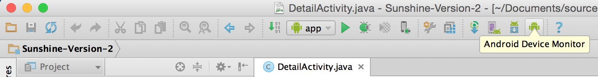

还可以在Android studio的菜单栏中Tools也可以：

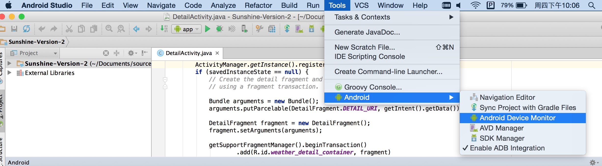

如果你不用Android studio，可以在SDK下的tools下的monitor程序打开: 

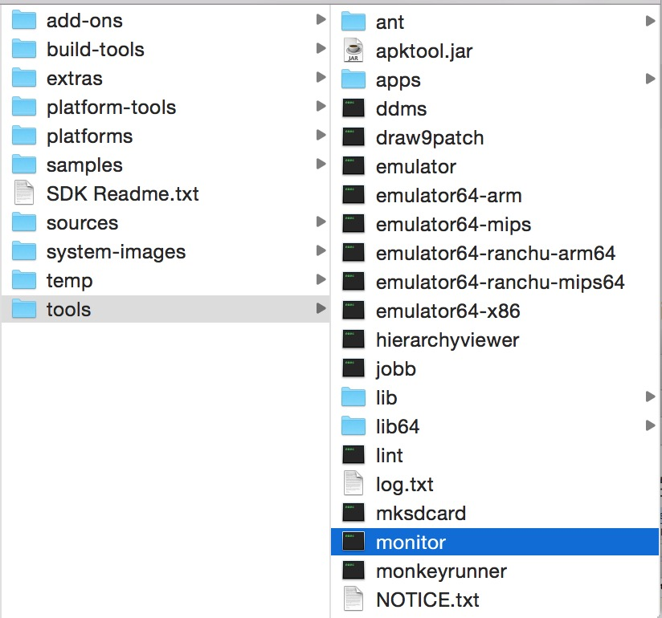

## Heap Viewer面板

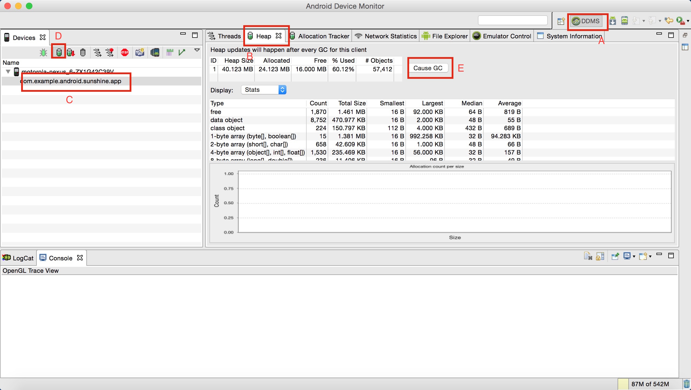

按上图的标记顺序按下，我们就能看到内存的具体数据，右边面板中数值会在每次GC时发生改变，包括App自动触发或者你来手动触发。

ok，现在来解释下面板中的名词

## 总览

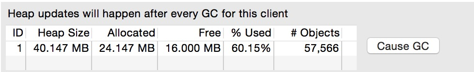

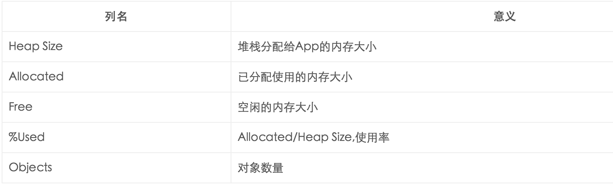

## 详情

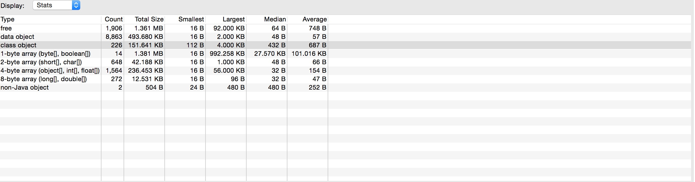

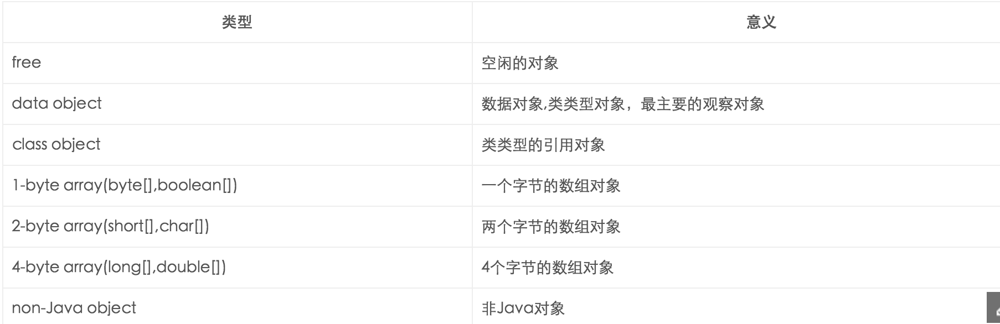

下面是每一个对象都有的列名含义：

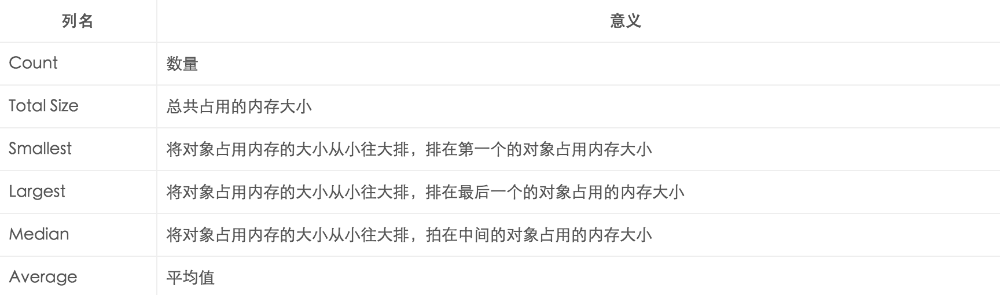

当我们点击某一行时，可以看到如下的柱状图：

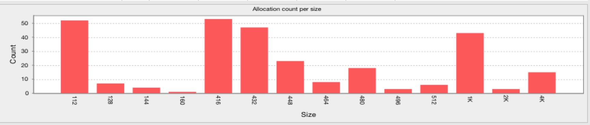

横坐标是对象的内存大小，这些值随着不同对象是不同的，纵坐标是在某个内存大小上的对象的数量

## Heap Viewer的使用

我们说Heap Viewer适合发现内存泄漏的问题，那你知道何为内存泄漏么？

### 内存泄漏

英文名：Memory Leaks 
标准解释：无用的单纯，但是还是没GC ROOT引用的内存 
通俗解释：该死不死的内存

### 检测

那么如何检测呢？Heap Viewer中的数值会自动在每次发生GC时会自动更新，那么我们是等着他自己GC么？小弟不才，刚开始我就是这么一直等啊等，由于GC的时机是系统把握的，所以很不好把握，既然我们是来看内存泄漏，那么我们在需要检测内存泄漏的用例执行过后，手动GC下，然后观察data object一栏的total size(也可以观察Heap Size/Allocated内存的情况)，看看内存是不是会回到一个稳定值，多次操作后，只要内存是稳定在某个值，那么说明没有内存溢出的，如果发现内存在每次GC后，都在增长，不管是慢增长还是快速增长，都说明有内存泄漏的可能性。

### 实例

先来看3个图： 

* 1.刚打开首页,手动GC一下: 

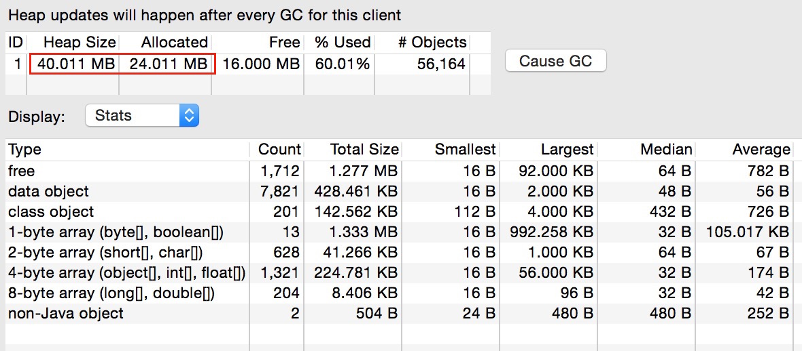

* 2.首页到详情页10遍，最后回到首页，手动GC一下,直到数值不再变化： 

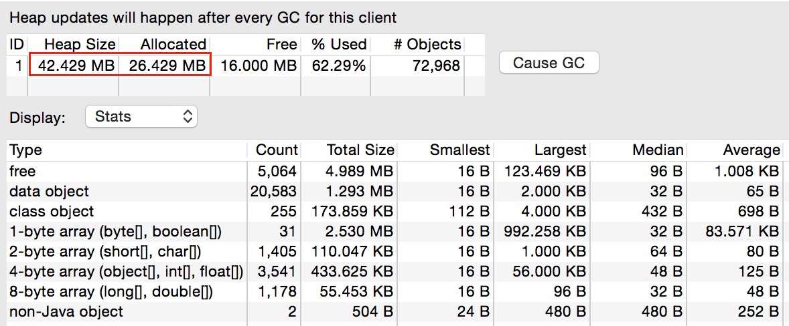

* 3.首页到详情页10遍，最后回到首页，手动GC一下： 

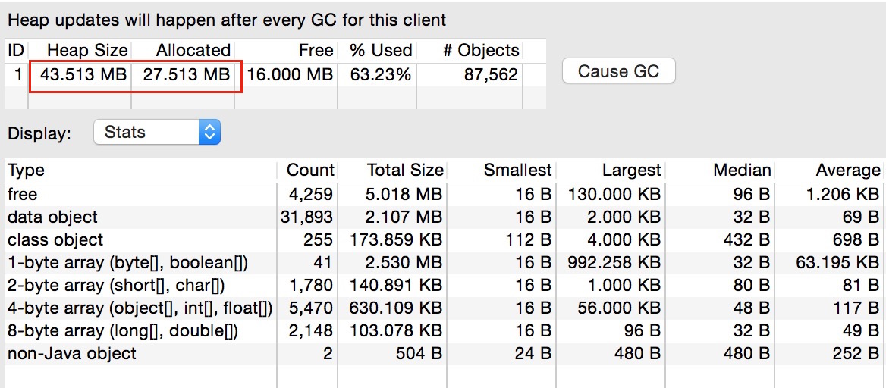

从data object一栏看到该类型的数值会在不断增长，可能发生了内存泄漏，而我们也可以从上面三个图的标红部分来看，Allocated分别增加了2.418M和1.084M，而且你继续这么操作下去，内存依然是增长的趋势

## 补充

Heap Viewer不光可以用来检测是否有内存泄漏，对于内存抖动，我们也可以用该工具检测，因为内存抖动的时候，会频繁发生GC，这个时候我们只需要开启Heap Viewer,观察数据的变化，如果发生内存抖动，会观察到数据在段时间内频繁更新。
