# Android性能专项测试之MAT

来源:[http://blog.csdn.net/itfootball/article/details/48834711](http://blog.csdn.net/itfootball/article/details/48834711)

> [Android内存优化之二：MAT使用进阶](http://ju.outofmemory.cn/entry/172685) 
> [Android内存优化之一：MAT使用入门](http://ju.outofmemory.cn/entry/172684) 
> [MAT中的Bitmap图像](http://androidperformance.com/2015/04/11/AndroidMemory-Open-Bitmap-Object-In-MAT/) 
> [10 Tips for using the Eclipse Memory Analyzer](http://eclipsesource.com/blogs/2013/01/21/10-tips-for-using-the-eclipse-memory-analyzer/)

## MAT使用

MAT工具全称为Memory Analyzer Tool，一款详细分析Java堆内存的工具，该工具非常强大，为了使用该工具，我们需要hprof文件，该文件我们在之前的[Heap Snapshot](http://blog.csdn.net/itfootball/article/details/48786275)工具的时候，我们就生成了该文件。但是该文件不能直接被MAT使用，需要进行一步转化，可以使用hprof-conv命令来转化，但是Android Studio可以直接转化,转化方法如下： 

1.选择一个hprof文件，点击右键选择Export to standard .hprof选项。 

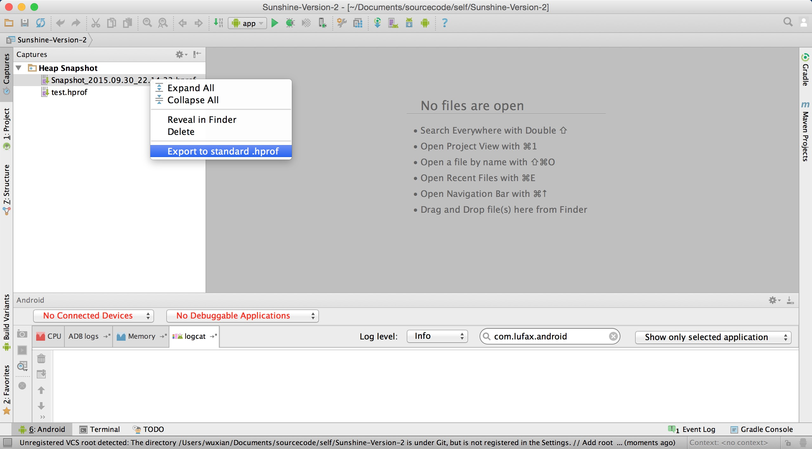

2.填写更改后的文件名和路径: 

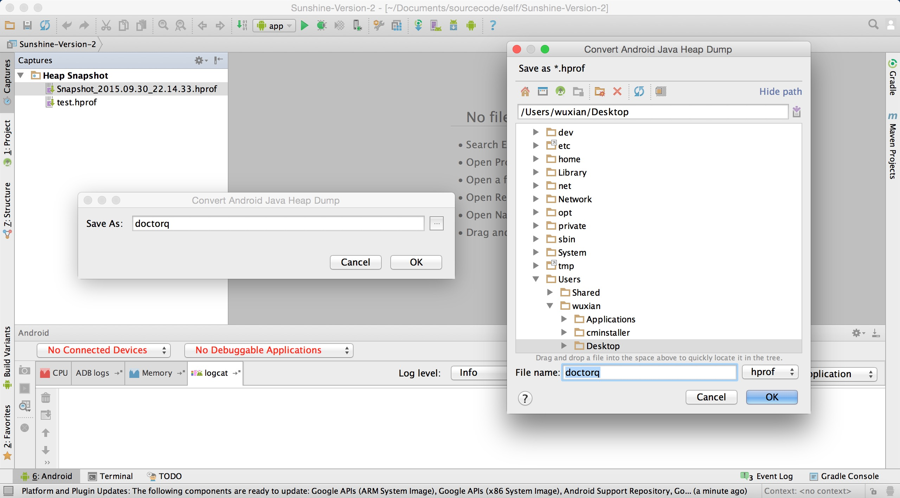

点击OK按钮后，MAT工具所需的文件就生成了，下面我们用MAT来打开该工具: 

1.打开MAT后选择File->Open File选择我们刚才生成的doctorq.hprof文件

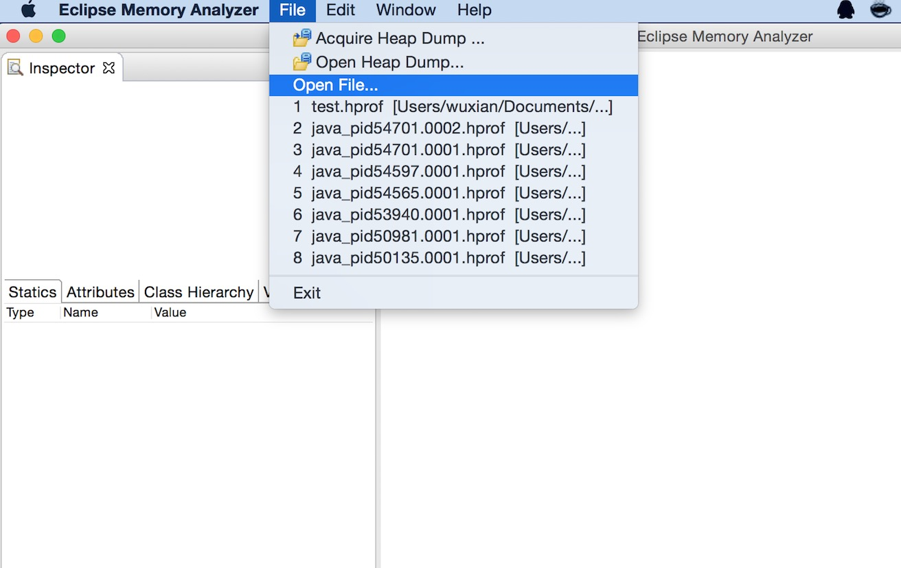

2.选择该文件后，MAT会有几秒种的时间解析该文件，有的hprof文件可能过大，会有更长的时间解析，解析后，展现在我们的面前的界面如下: 

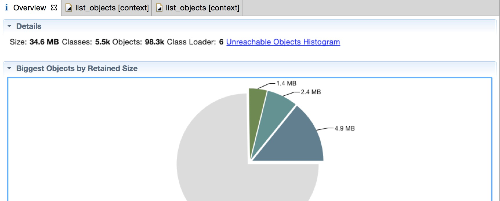

这是个总览界面，会大体给出一些分析后初步的结论

## Overview视图

该视图会首页总结出当前这个Heap dump占用了多大的内存，其中涉及的类有多少，对象有多少，类加载器，如果有没有回收的对象，会有一个连接，可以直接参看(图中的Unreachable Objects Histogram)。 

比如该例子中显示了Heap dump占用了41M的内存，5400个类，96700个对象，6个类加载器。 
然后还会有各种分类信息:

### Biggest Objects by Retained Size

会列举出Retained Size值最大的几个值，你可以将鼠标放到饼图中的扇叶上，可以在右侧看出详细信息:

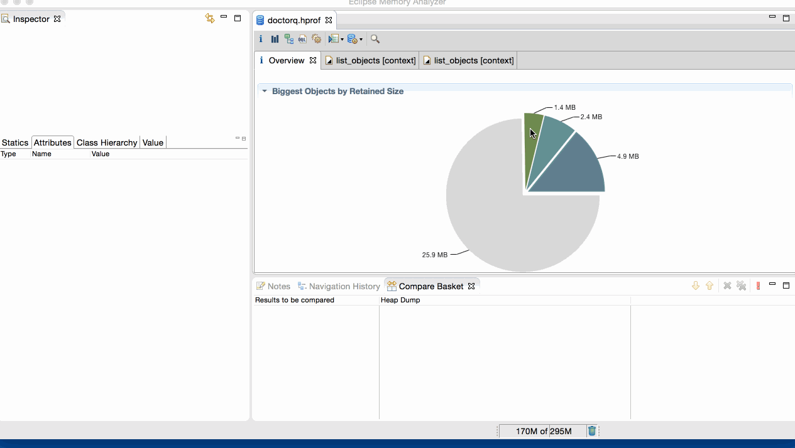

图中灰色区域，并不是我们需要关心的，他是除了大内存对象外的其他对象，我们需要关心的就是图中彩色区域，比如图中2.4M的对象，我们来看看该对象到底是啥:

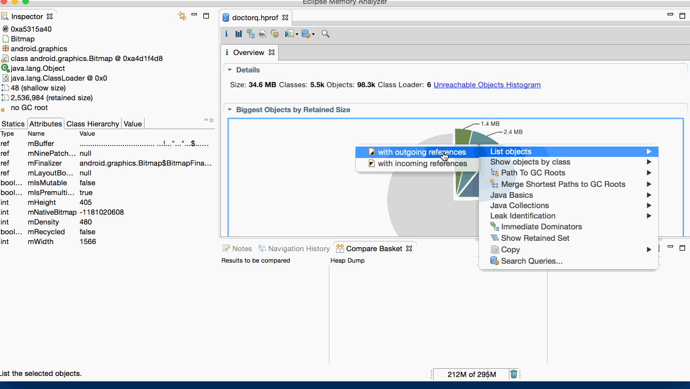

该对象是一个Bitmap对象，你如果想知道该对象到底是什么图片，可以使用图片工具gimp工具浏览该对象.

## histogram视图

histogram视图主要是查看某个类的实例个数，比如我们在检查内存泄漏时候，要判断是否频繁创建了对象，就可以来看对象的个数来看。也可以通过排序看出占用内存大的对象: 

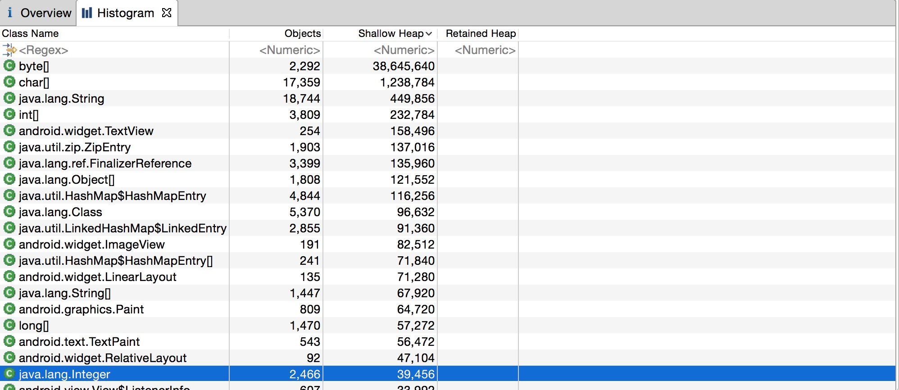

默认是类名形式展示，你也可以选择不同的显示方式，有以下四种方式: 

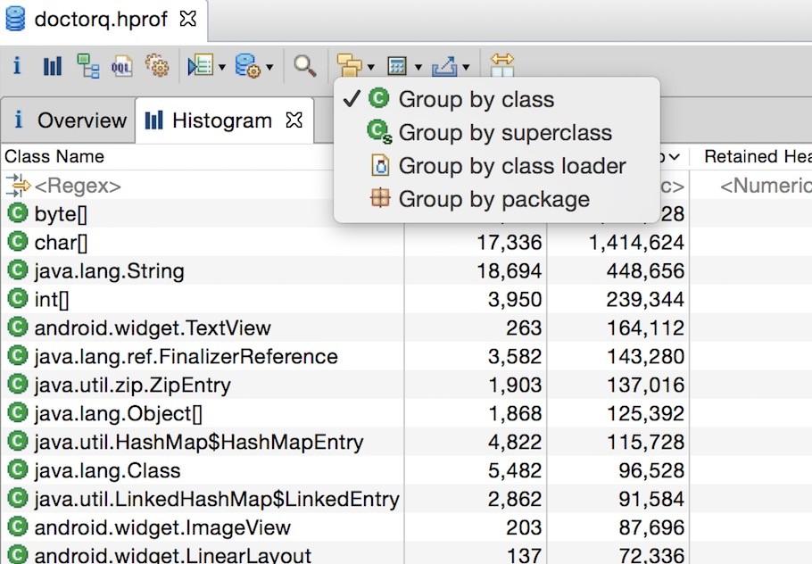

下面来演示一下: 

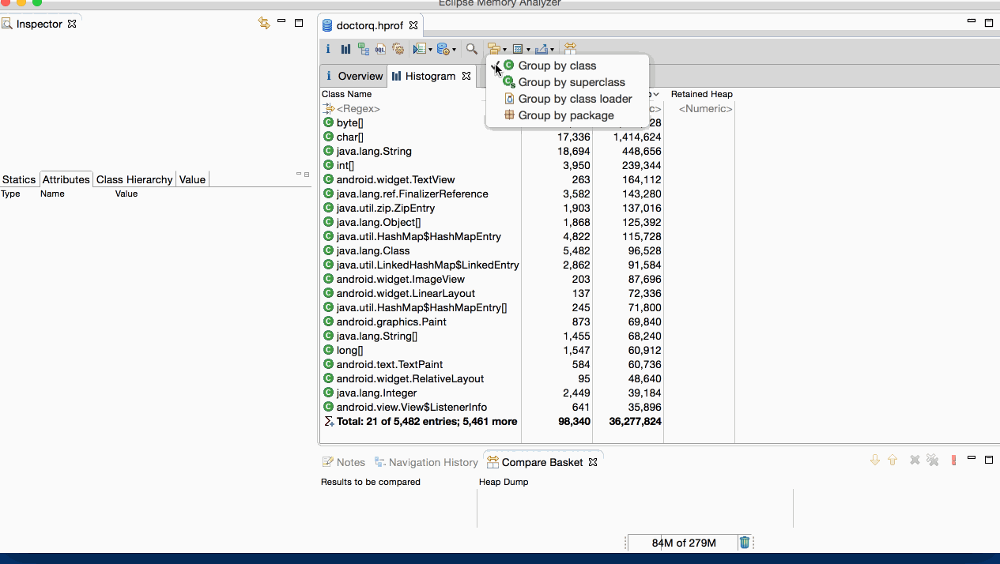

## Dominator tree视图

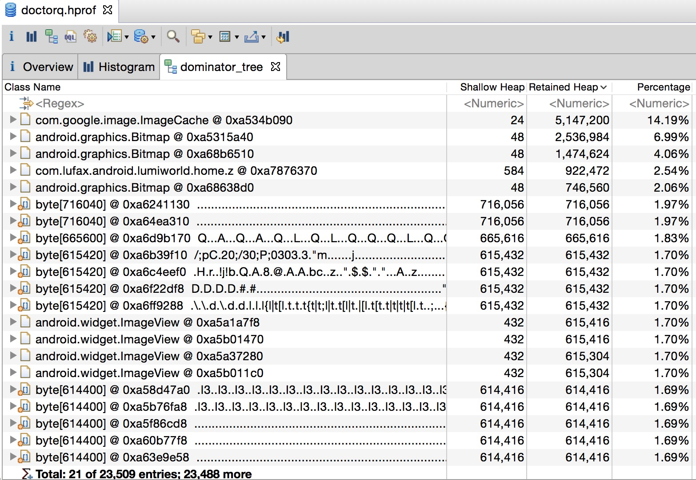

该视图会以占用总内存的百分比来列举所有实例对象，注意这个地方是对象而不是类了，这个视图是用来发现大内存对象的。这些对象都可以展开查看更详细的信息，可以看到该对象内部包含的对象： 

## Leaks suspects视图

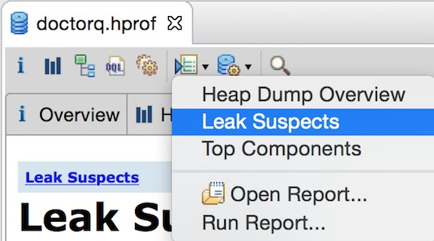

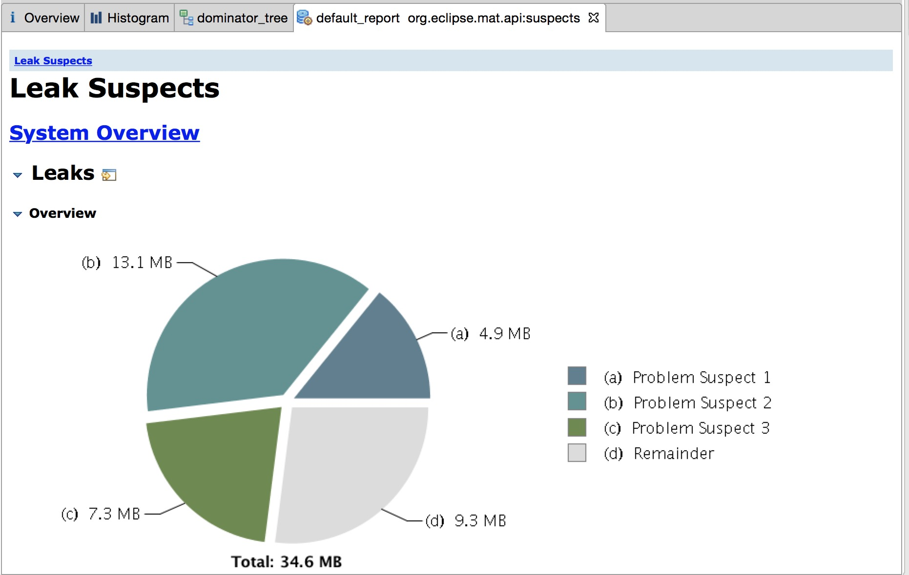

这个视图会展示一些可能的内存泄漏的点，比如上图上图显示有3个内存泄漏可疑点，我们以Problem Suspect 1为例来理解该报告，首先我们来看该可疑点详细信息: 

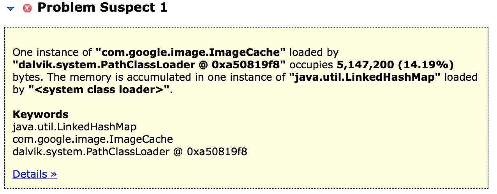

上面信息显示ImageCahe类的一个实例0xa50819f8占用了14.19%的内存，具体值为5147200字节(5147200/1024/1024=4.9M),并存放在LinkedHashMap这个集合中，然后我们点击Details跳转到更详细的页面: 

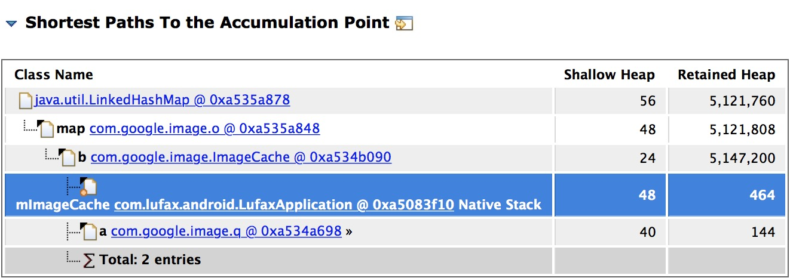

这样我们就能找到在我们的app源码中造成该泄漏可疑点的地方，很容易去定位问题.

