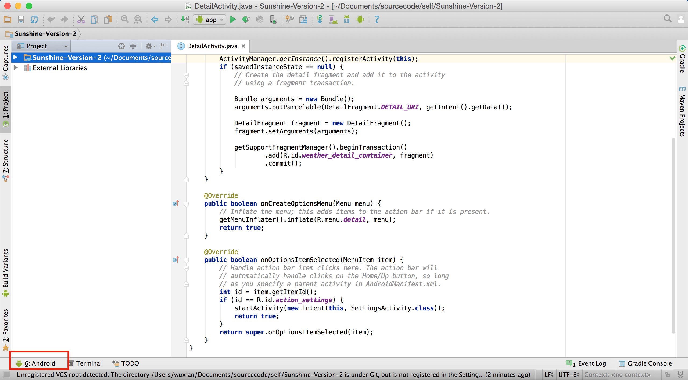
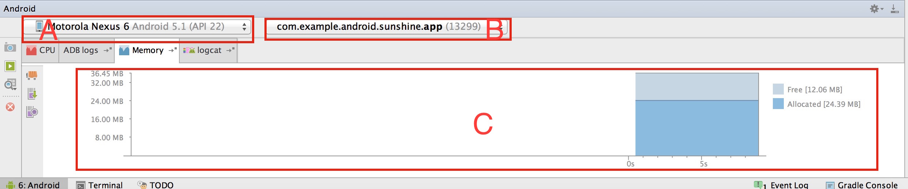
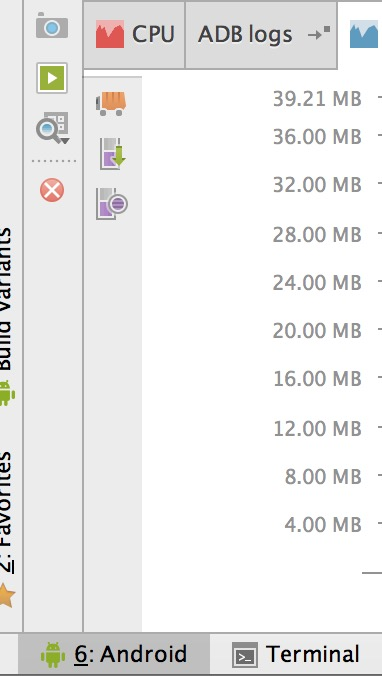
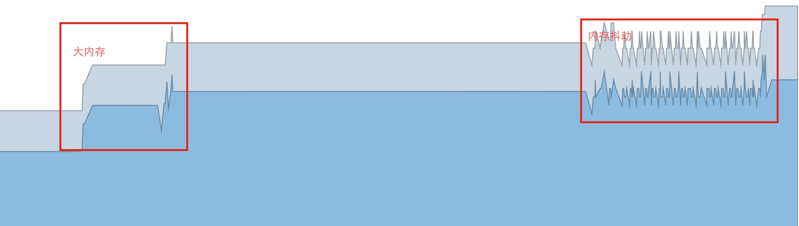

#  Android性能专项测试之Memory Monitor工具

来源:[http://blog.csdn.net/itfootball/article/details/48712595](http://blog.csdn.net/itfootball/article/details/48712595)

> [Memory Monitor Walkthrough](http://developer.android.com/intl/zh-cn/tools/performance/memory-monitor/index.html)

## Memory Monitor能做什么?

* 实时查看App的内存分配情况
* 快速判断App是否由于GC操作造成卡顿
* 快速判断App的Crash是否是因为超出了内存

## Memory Monitor使用准备

* 开发者选项可用
* USB调试开启

备注:Android Studio的Enable ADB Integration勾选(Tools/Android下)。

## Memory Monitor面板

首先执行adb devices来确保设备可用，然后启动Android Studio,选择一个Android项目或者新建一个项目进入主面板，如果你有你的待测App的源码，那么最好进入你自己的App项目中，这样方便调试和定位问题。进入项目后，可以看到Android Studio的主面板左下角有一个Android标签: 

点击该标签打开Android面板,如下图所示: 

* A:设备选择 
* B:可监控的App选择 
* C:内存的实时数据

重点来看C区域，横坐标记录从采集开始点到目前已经过去的时间，纵坐标是分配给App使用的内存总量[Allocated+Free]，蓝色区域表示已分配[Allocated]使用的的，灰色区域表示空闲[Free]未使用的。在坐标轴的右边可以看见具体数值。

## GC

GC就是垃圾回收的意思，我们可以从Memory monitor看到何时发生了GC event，当一个内存短时间内发生掉落，我们可以认为发生了GC操作。你也可以手动触发GC,下图中的小车子就是触发GC的按钮，一旦按下就会回收那些没被引用的对象(这个地方不能说没用的对象，因为没用的对象有可能是内存泄漏时的对象，后期会来研究)： 

## Memory Monitor可以发现的问题

Memory Monitor工具为监控工具，是一种发现型或者说监控性质的工具，比如医生的四大技能[望闻问切]，[望]是第一步。这里的Memory Monitor就是一种[望]的工具，目前我主要用它来看下面几个内存问题： 

* 1.发现内存抖动的场景 
* 2.发现大内存对象分配的场景 
* 3.发现内存不断增长的场景 
* 4.确定卡顿问题是否因为执行了GC操作

## 案例分析

上面的第一段标记显示内存突然增加了7M，我们也能看的很清楚，所以这个点我们要去定位了一下问题在哪里，是Bitmap还是什么原因造成的，第二段标记是内存抖动，很明显在很短的时间了发生了多次的内存分配和释放。而且在发生内存抖动的时候，也能感觉到App的卡顿，可以看出来是由于执行了GC操作造成的。 
内存的不断增加通过Memory monitor很容易看出来，蓝色的曲线是一路高歌猛进的，一看便知。

## 关于内存泄漏的问题

Memory Monitor也可以归纳到用于检测内存泄漏的工具，但是我没这么做，因为在实际过程中，当泄漏的点每一次很小的时候，你很难发现，没有Heap Viewer好使。如果泄漏的对象占用内存大的话，也能通过Memory Monitor看出来。