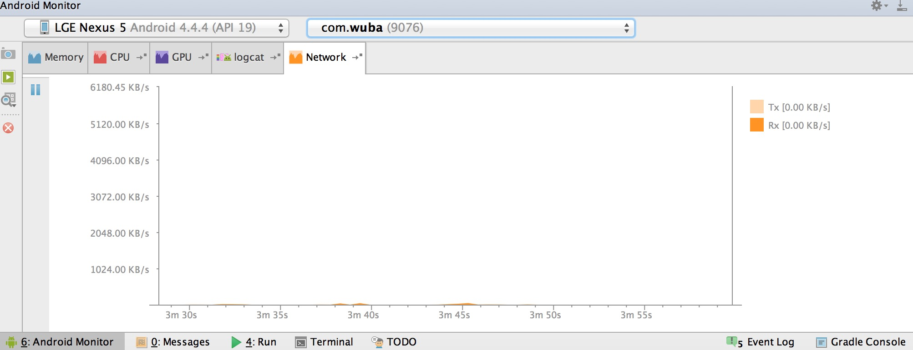

# Android性能专项测试之Network monitor

来源:[http://blog.csdn.net/itfootball/article/details/48999179](http://blog.csdn.net/itfootball/article/details/48999179)

## Network monitor工具能做什么?

实时监控上传和接收的网速

## Network monitor使用条件

* root手机
* Android studio 1.4+

## Network monitor开启

* Tx:上传网速 
* Rx:接受网速