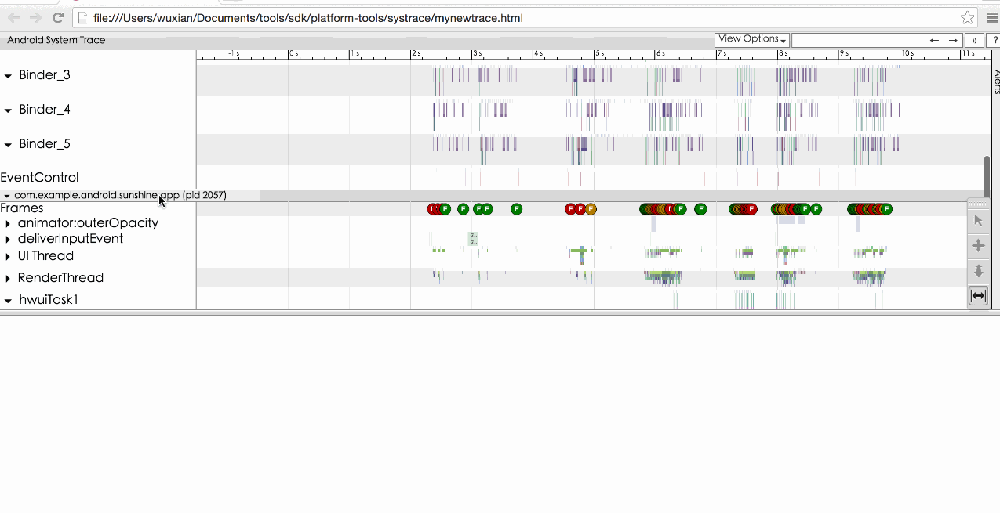

# Android性能专项测试之Systrace工具

来源:[http://blog.csdn.net/itfootball/article/details/48915935](http://blog.csdn.net/itfootball/article/details/48915935)

> [Systrace Walkthrough](https://developer.android.com/intl/zh-cn/tools/performance/systrace/index.html) 
> [Systrace](http://developer.android.com/intl/zh-cn/tools/help/systrace.html#options) 
> [Analyzing UI Performance with Systrace](http://developer.android.com/intl/zh-cn/tools/debugging/systrace.html#app-trace) 
> [Speed up your app](http://blog.udinic.com/2015/09/15/speed-up-your-app?from=timeline&isappinstalled=0)

## Systrace能做什么?

* 计算容器的性能
* 发现性能的瓶颈

## Systrace的使用准备

* 4.1以上
* root
* Android SDK Tools 20
* python环境

## Systrace启动

你可以通过命令行或者Device Monitor两种方式收集Systrace信息，以下以命令行为例介绍收集方式(因为我Device Monitor的方式报错)。 

首先进入sdk下的platform-tools/systrace目录下: 

然后在命令下执行以下命令来收集数据: 

> Python systrace.py --time=10 -o mynewtrace.html sched gfx view wm

上面的参数–time为间隔时间,-o为文件名，更详细的参数信息如下:

|参数名|意义|
|:--|:--|
|-h,--help|帮助信息|
|-o <FILE>|保存的文件名|
|-t N,--time=N|多少秒内的数据，默认为5秒，以当前时间点往后倒N个时间|
|-b N,--buf-size=N|单位为千字节,限制数据大小|
|-k <KFUNCS> --ktrace=<KFUNCS>|追踪特殊的方法|
|-l,--list-categories|设置追踪的标签|
|-a <APP_NAME>,--app=<APP_NAME>|包名|
|--from-file=<FROM_FILE>|创建报告的来源trace文件|
|-e <DEVICE_SERIAL>,--serial=<DEVICE_SERIAL>|设备号|

其中标签可选项如下:

|标签名|意义|
|:--|:--|
|gfx|Graphics|
|input|Input|
|view|View|
|webview|Webview|
|vm|WindowManager|
|am	|Activity Manager|
|audio|	Audio|
|video|Video|
|camera|Camera|
|hal|Hardware Modules|
|res|Resource Loading|
|dalvik|Dalvik VM|
|rs|RenderScript|
|sched|Cpu Scheduling|
|freq|Cpu Frequency|
|membus|Memory Bus Utilization|
|idle|Cpu Idle|
|disk|Disk input and output|
|load|Cpu Load|
|sync|Synchronization Manager|
|workq|Kernel Workqueues|

以上标签并不支持所有机型,还有要想在输出中看到任务的名称，需要加上sched.

上面的命令执行完后，会生成一个html文件: 

打开该文件后，我们会看到如下页面: 

## systrace快捷键

|快捷键|作用|
|:--|:--|
|w|放大|
|s|缩小|
|a|左移|
|d|右移|
|f|返回选中区域，切放大选中区域|

## Alerts

Alerts一栏标记了以下性能有问题的点，你可以点击该点查看详细信息,右边侧边栏还有一个Alerts框，点击可以查看每个类型的Alerts的数量:

## Frame

在每个包下都有Frame一栏，该栏中都有一个一个的F代表每一个Frame，用颜色来代表性能的好坏，依次为绿-黄-红(性能越来越差),点击某一个F,会显示该Frame绘制过程中的一些Alerts信息: 

如果你想查看Frame的耗时，可以点击某个F标志，然后按m键: 

