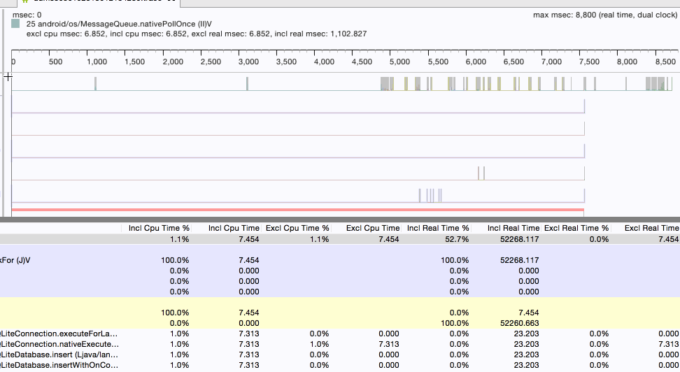

# Android性能专项测试之TraceView工具(Device Monitor)

来源:[http://blog.csdn.net/itfootball/article/details/48792435](http://blog.csdn.net/itfootball/article/details/48792435)

> [Traceview Walkthrough](https://developer.android.com/intl/zh-cn/tools/performance/traceview/index.html) 
> [Android 编程下的 TraceView 简介及其案例实战](http://www.cnblogs.com/sunzn/p/3192231.html) 
> [正确使用Android性能分析工具——TraceView](http://blog.jobbole.com/78995/) 
> [Android内存使用分析和程序性能分析](http://liaohuqiu.net/cn/posts/memory-and-profile-analysis-in-android/)

## TraceView工具能做什么？

从代码层面分析性能问题，针对每个方法来分析，比如当我们发现我们的应用出现卡顿的时候，我们可以来分析出现卡顿时在方法的调用上有没有很耗时的操作，关注以下两个问题：

* 调用次数不多，但是每一次执行都很耗时
* 方法耗时不大，但是调用次数太多

简单一点来说就是我们能找到频繁被调用的方法，也能找到执行非常耗时的方法，前者可能会造成Cpu频繁调用，手机发烫的问题，后者就是卡顿的问题

## TraceView工具启动

打开Monitor,点击图中的标注的按钮，启动追踪:

## TraceView工具面板

打开App操作你的应用后，再次点击的话就停止追踪并且自动打开traceview分析面板: 

traceview的面板分上下两个部分:

* 时间线面板以每个线程为一行，右边是该线程在整个过程中方法执行的情况
* 分析面板是以表格的形式展示所有线程的方法的各项指标

### 时间线面板

左边是线程信息,main线程就是Android应用的主线程，这个线程是都会有的，其他的线程可能因操作不同而发生改变.每个线程的右边对应的是该线程中每个方法的执行信息，左边为第一个方法执行开始，最右边为最后一个方法执行结束，其中的每一个小立柱就代表一次方法的调用，你可以把鼠标放到立柱上，就会显示该方法调用的详细信息: 

你可以随意滑动你的鼠标，滑倒哪里，左上角就会显示该方法调用的信息。 

1.如果你想在分析面板中详细查看该方法，可以双击该立柱，分析面板自动跳转到该方法: 

2.放大某个区域 

刚打开的面板中，是我们采集信息的总览，但是一些局部的细节我们看不太清，没关系，该工具支持我们放大某个特殊的时间段:

如果想回到最初的状态，双击时间线就可以。 

3.每一个方法的表示: 

可以看出来，每一个方法都是用一个凹型结构来表示，坐标的凸起部分表示方法的开始，右边的凸起部分表示方法的结束，中间的直线表示方法的持续.

分析面板

面板列名含义如下:

你可以点击某个函数展开更详细的信息: 

展开后，大多数有以下两个类别:

* Parents:调用该方法的父类方法
* Children:该方法调用的子类方法

如果该方法含有递归调用，可能还会多出两个类别:

* Parents while recursive:递归调用时所涉及的父类方法
* Children while recursive:递归调用时所涉及的子类方法

首先我们来看当前方法的信息:

根据下图中的toplevel可以看出总的cpu执行时间为1797.167ms，当前方法占用cpu的时间为375.201，375.201/1797.167=0.2087，和我们的Incl Cpu Time%是吻合的。当前方法消耗的时间为580.668，而toplevel的时间为53844.141ms,580.668/53844.141=1.07%,和Incl Real Time %也是吻合的。在来看调用次数为177，递归次数为354，和为177+354=531，375.201/531 = 0.7065和Cpu Time/Call也是吻合的，580.668/531=1.0935,和Real Time/Call一栏也是吻合的。 

### Parents

现在我们来看该方法的Parents一栏: 

其中的Incl Cpu Time%变成了100%，因为在这个地方，总时间为当前方法的执行时间，这个时候的Incl Cpu Time%只是计算该方法调用的总时间中被各父类方法调用的时间占比，比如Parents有2个父类方法，那就能看出每个父类方法调用该方法的时间分布。因为我们父类只有一个，所以肯定是100%，Incl Real Time一栏也是一样的，重点是Call/Total，之前我们看当前方式时，这一栏的列名为Call+Recur，而现在变成了Call/Total,这个里面的数值变成了177/531，因为总次数为531次，父类调用了177次，其他531次是递归调用。这一数据能得到的信息是，当前方法被调用了多少次，其中有多少次是父类方法调用的。

### Children

可以看出来，我们的子类有2个，一个是自身，一个是
23android/view/View.draw(L android/graphics/Canvas;)V，self代表自身方法中的语句执行情况，由上面可以看出来，该方法没有多余语句，直接调用了其子类方法。另外一个子类方法，可以看出被当前方法调用了177次，但是该方法被其他方法调用过，因为他的总调用次数为892次，你可以点击进入子类方法的详细信息中。

### Parents while recursive

列举了递归调用当前方法的父类方法，以及其递归次数的占比，犹豫我们当前的方法递归了354次，以上三个父类方法递归的次数分别为348+4+2 = 354次。

### Children while recursive

列举了当递归调用时调用的子类方法。

