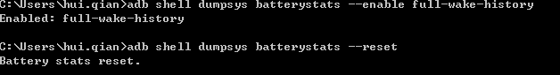
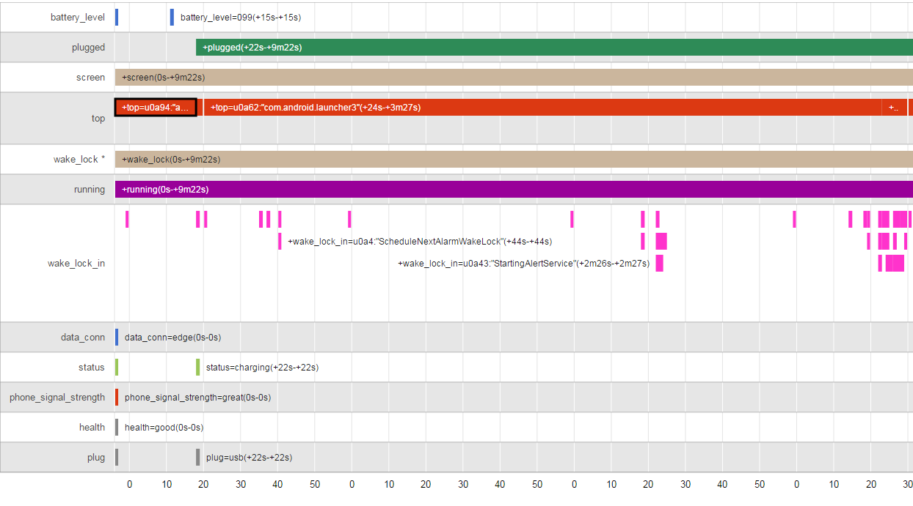
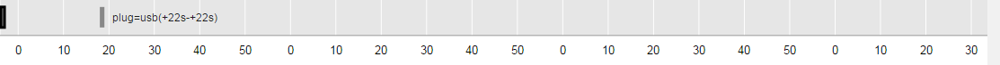
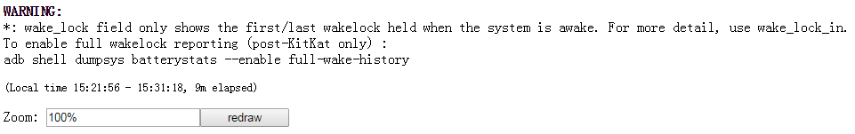

#  Android性能专项测试之battery-historian试用

来源:[http://blog.csdn.net/itfootball/article/details/44084159](http://blog.csdn.net/itfootball/article/details/44084159)

## 数据准备

battery-historian工具需要使用bugreport中的Battery History数据，我们在开始的时候需要通过以下命令来打开电池数据的获取以及重置：

```
adb shell dumpsys batterystats --enable full-wake-history
adb shell dumpsys batterystats --reset
```

执行的效果如下：



上面的操作相当于初始化操作，现在做一些测试，手动或者跑一些自动化的case都行。经过一段时间后，我们运行下面两条命令来将bugreport的信息保存到txt文档中，然后将txt文档转化为html文件。

```
adb bugreport > bugreport.txt
python historian.py -a bugreport.txt > battery.html
```

上面的historian.py脚本是Python写的，所以需要python环境，然后从[github](https://github.com/google/battery-historian)上下载这个脚本。上面两条命令执行成功后，会在目录下发现两个文件 `bugreport.txt`和`battery.html`，这个时候我们用google浏览器打开html文件，可以看到如下信息：



## 各个参数的意义

首先我们在bugreport.txt找到Battery History数据栏类似下面的信息：

> ----------------------------------------------------
> 
> DUMP OF SERVICE batterystats:
> 
> Battery History (2% used, 5980 used of 256KB, 45 strings using 2592):
>
>                   0 (9) RESET:TIME: 2015-03-05-15-21-56
>
>                   0 (2) 100 c0900422 status=discharging health=good 
> 							plug=none temp=200 volt=4167 +running 
> 							+ wake_lock +sensor +screen 
> 							data_conn=edge 
> 							phone_signal_strength=great brightness=medium 
> 							proc=u0a15:"android.process.acore"
>
>                   0 (2) 100 c0900422 
> 							proc=u0a7:"com.android.cellbroadcastreceiver"
>
>                   0 (2) 100 c0900422 proc=u0a53:"com.android.gallery3d"
> 

你在html中信息都能从bugreport.txt中找到相应的信息。 

现在来分析各个指标代表的意义：

## 横坐标



上面的10，20代表的就是秒的意思，它是以一分钟为周期，到第60秒的时候变为0。横坐标就是一个时间范围，咱们的例子中统计的数据是以重置为起点，获取bugreport内容时刻为终点。我们一共采集了多长时间的数据，图表下也有信息说明。（经其他人的反馈，这个坐标间隔是会随着时间的长度发生改变，所以要以你的实际情况为准）



## 纵坐标

纵坐标的数据就很麻烦了，数据量太多，一条一条来吧。

### battery_level

电量，可以看出电量的变化。比如上图中的数据显示刚开始电量是100%，然后在第11秒-12秒中间的某个时刻降到了99%。

### plugged

充电状态，这一栏显示是否进行了充电，以及充电的时间范围。例如上图反映了我们在第22s插入了数据线，然后一直持续了数据采集结束。

### screen

屏幕是否点亮，这一点可以考虑到睡眠状态和点亮状态下电量的使用信息。

### top

该栏显示当前时刻哪个app处于最上层，就是当前手机运行的app，用来判断某个app对手机电量的影响，这样也能判断出该app的耗电量信息。该栏记录了应用在某一个时刻启动，以及运行的时间，这对我们比对不同应用对性能的影响有很大的帮助。

### wake_lock*

[wake_lock](http://blog.csdn.net/g_salamander/article/details/7978772) 该属性是记录wake_lock模块的工作时间。是否有停止的时候等

### running

界面的状态，主要判断是否处于idle的状态。用来判断无操作状态下电量的消耗。

### wake_lock_in

wake_lock有不同的组件，这个地方记录在某一个时刻，有哪些部件开始工作，以及工作的时间。

### data_conn

数据连接方式的改变，上面的edge是说明采用的gprs的方式连接网络的。此数据可以看出手机是使用2g，3g，4g还是wifi进行数据交换的。这一栏可以看出不同的连接方式对电量使用的影响。

### status

电池状态信息，有充电，放电，未充电，已充满，未知等不同状态。 
这一栏记录了电池状态的改变信息。

### phone_signal_strength

手机信号状态的改变。 
这一栏记录手机信号的强弱变化图，依次来判断手机信号对电量的影响。

### health

电池健康状态的信息，这个信息一定程度上反映了这块电池使用了多长时间。 
这一栏记录电池状态在何时发生改变，上面的图中电池状态一直处于good状态。

### plug

充电方式，usb或者插座，以及显示连接的时间。 
这一栏显示了不同的充电方式对电量使用的影响。