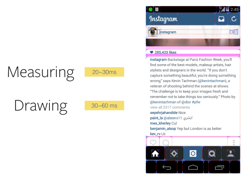
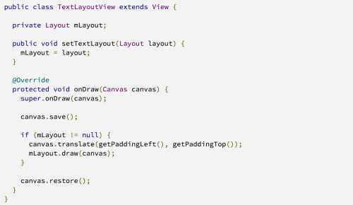
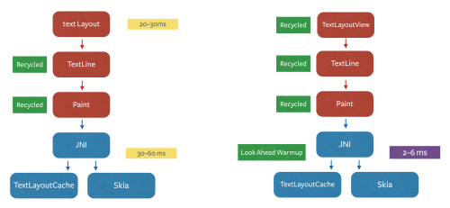
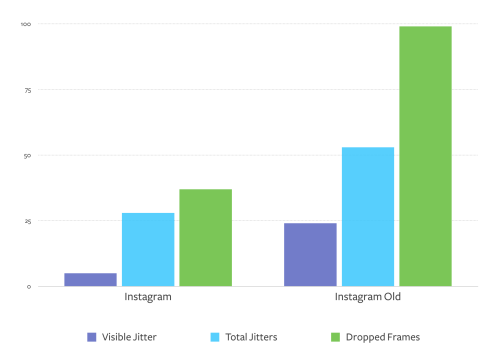

# Instagram是如何提升TextView渲染性能的

来源：[codethink.me](http://codethink.me/2015/04/23/improving-comment-rendering-on-android/)

原文链接: [Improving Comment Rendering on Android](http://instagram-engineering.tumblr.com/post/114508858967/improving-comment-rendering-on-android)

上周，成千上万来自全世界的IG用户齐聚在社区组织的先下聚会 Worldwide InstaMeet11上。WWIM11 是历史上最大，最具地域多样性的Instagram聚会，从Muscat到Bushwick，成千上万用户分享了大约10万张照片。

每月世界上有超过3亿用户每月使用IG，其中65%来自美国以外的国家，无论用户在哪，我们一致致力于让IG更快，更容易使用。自从去年夏天IG重新设计后，我们在继续努力提升性能。

我们最近的一项改进是关于渲染庞大复杂的文本以及如何通过改进它优化IG的feed滚动。我们希望你可以从我们的经验中找到提升自己app速度的方法。

## 产品需求和性能问题
在IG中，feed是由图片，视频和文字组成的。对于每个图片和视频，我们需要展示对应的图片说明和5条最近的评论。由于用户通常通过图片说明来讲书图片背后的故事，这些图片说明通常是大段复杂的文字，甚至可能包含链接和emoji表情。

渲染这种复杂文本的主要问题在于它滚动时对性能的影响。在Android中，文本的渲染是很慢的。即使在一个像Nexus 5这样的新设备上，一段有十几行复杂文本的图片说明的初始绘制时间可能会达到50ms，而其文本的measure阶段就需要30ms。这些都发生在UI线程，在滚动时会导致app跳帧。

## 使用text.Layout，缓存text.Layout

Android有很多用于文字展示的控件，但实际上，他们都用text.Layout进行渲染。例如，TextView会将String转化为一个text.Layout对象，并通过canvas API将它绘制到屏幕上。

由于text.Layout需要在构造函数中测量文本的高度，因此它的创建效率不高。缓存text.Layout和复用text.Layout实例可以节省这部分时间。Android的TextView控件并没有提供设置TextLayout的方法，但是添加一个这样的方法并不困难：

使用自定义的view来手动绘制text.Layout会提升其性能：TextView是一个包含大量特性的通用控件。如果我们只需要在屏幕上渲染静态的，可点击的文本，事情就简单多了：

* 我们可以不用从SpannableStringBuilder转化到String。根据你的文本中是否包含链接，底层的TextView可能会复制一份你的字符串，这需要分配一些内存。
* 我们可以一直使用StaticLayout，这比DynamicLayout要稍微快一些。
* 我们可以避免使用TexView中其他的逻辑： 监听文本修改的逻辑，展示嵌入drawable的逻辑，绘制编辑器的逻辑以及弹出下拉列表的逻辑。

通过使用TextLayoutView，我们可以缓存和复用text.Layout，从而避免了每次调用TextView的`setText(CharSequence c)`方法时都要花费20ms来创建它。

## 下载feed后准备好Layout缓存

由于我们确定会在下载评论后展示他们，一个简单的改进是在下载它们后就准备好text.Layout的缓存。

## 停止滚动后准备好TextLayoutCache

在可以设置text.Layout缓存后，我们的到来常数级的测量（measure）和绑定（binding）时间。但是初次绘制的时间仍然很长。50ms的绘制时间可能会导致明显的卡顿。

这50ms中的大部分被用于测量文本高度以及产生文字符号。这些都是CPU操作。为了提升文本渲染速度，Android在ICS中引入了TextLayoutCache用于缓存这些中间结果。TextLayoutCache是一个LRU缓存，缓存的key是文本。如果查询缓存时命中，文本的绘制速度会有很大提升。

在我们的测试中，这种缓存可以将绘制时间从30ms-50ms减少到2ms-6ms。

为了更好的提升绘制性能，我们可以在绘制文本到屏幕前准备好这个缓存。我们的思路是在一块屏幕外的canvas上虚拟的绘制这些文本。这样在我们绘制文本到屏幕前，TextLayoutCache就已经在一个背景线程中被准备好了。

默认情况下，TextLayoutCache的大小为0.5M，这足以缓存十几张图片的评论。我们决定在用户停止滑动时准备缓存，我们向用户滑动的方向提前缓存5个图片的评论。在任何时候，我们都至少在任何一个方向上缓存了5个图片的评论。

在应用了所有的这些优化后，掉帧情况减少了60%，而卡顿的情况减少了50%。我们希望这些能帮助你提升你app的速度和性能。告诉我们你的想法吧，我们期待听到你的经验。
