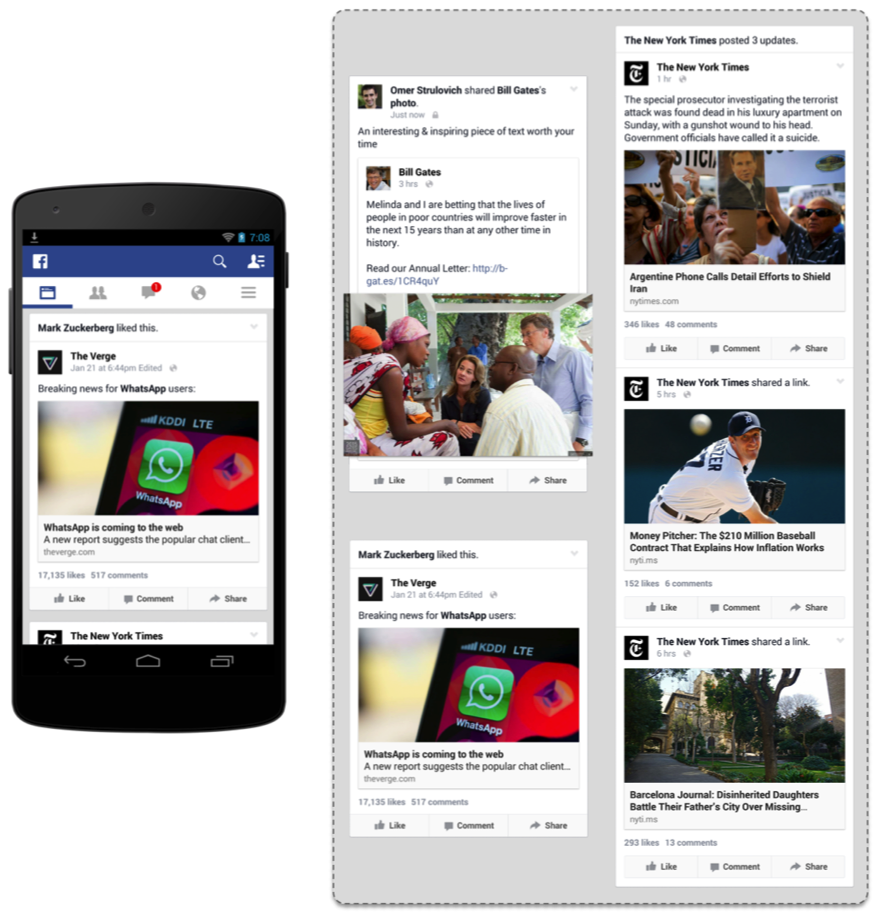
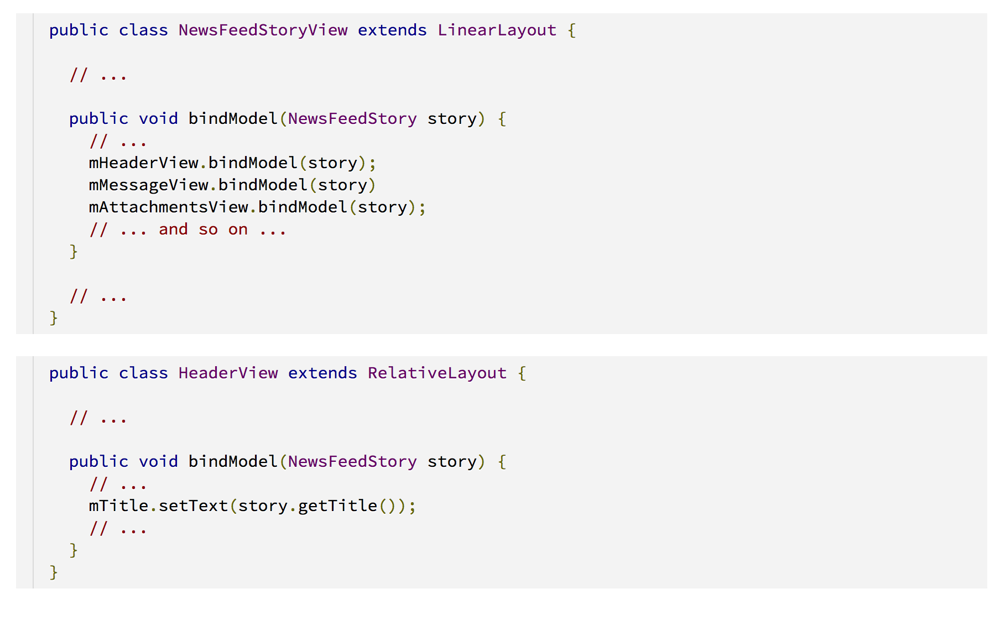
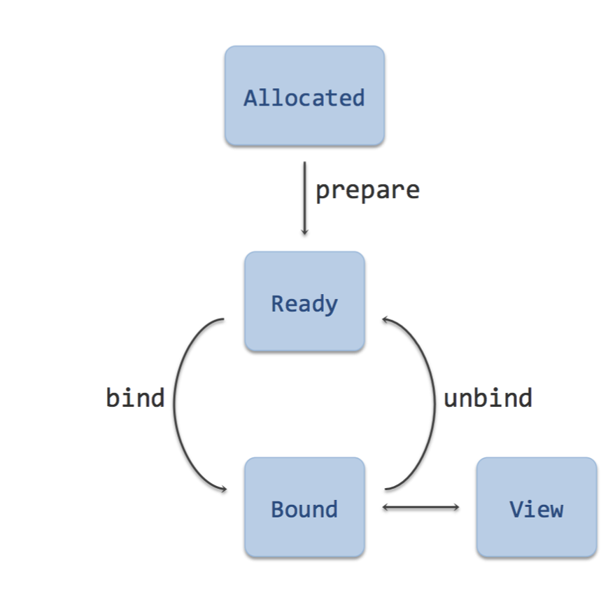
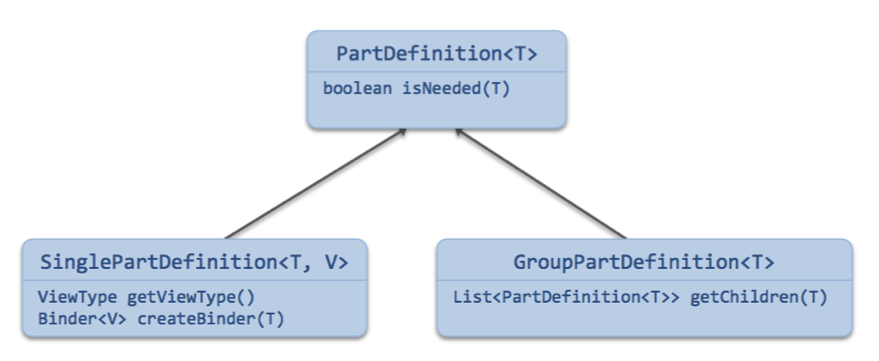
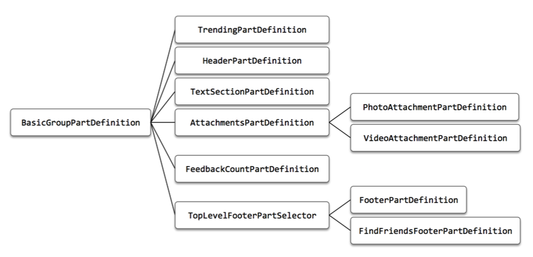

# facebook新闻页ListView优化

来源:[blog.aaapei.com](http://blog.aaapei.com/article/2015/02/facebookxin-wen-ye-listviewyou-hua)

[origin]:https://code.facebook.com/posts/879498888759525/fast-rendering-news-feed-on-android/
[rebbit-comments]:http://www.reddit.com/r/androiddev/comments/2tzrqe/fast_rendering_news_feed_on_android/

## 引言
原文链接：[https://code.facebook.com/posts/879498888759525/fast-rendering-news-feed-on-android/][origin] 透漏的信息量不大，且大多数项目并不会遇到facebook这种ListView的场景，不过可以拓展下思路：逻辑单元不一定是视图单元；移动端不要死搬MVC的架构，在市场上仍是中低端机型为主时，还是应该多考虑性能；附上[rebbit的关于本文的讨论][rebbit-comments]，有些干货 :)

## 基础知识

android系统每隔16.7ms发出一个渲染信号，通知ui线程进行界面的渲染。为了达到流畅的体验，应用程序需要在这个时间内完成应用逻辑，使系统达到60fps。当一个Listview被添加到布局时，其关联的adapter的getView方法将会被回调。在16.7毫秒这样一个时间单元内，可见listitem单元的getView方法将被按照顺序执行。在大多数情况下，由于其他绘图行为的存在，例如measure和draw，getVIew实际分配到执行时间远低于16ms。一旦listview包含复杂控件时，在16毫秒内不能完成渲染，用户只能看到上一祯的结果，这时就发生了掉帧。

## Facebook新闻页介绍

Facebook的新闻页是一个复杂的listview控件，如何使它获得流畅的滚动体验一直困扰我们。 首先，新闻页的每一条新闻的可见区域非常大，包含一系列的文本以及照片；其次，新闻的展现类型也很多样，除了文本以及照片，新闻的附件还可包含链接、音频、视频等。除此之外，新闻还可以被点赞、被转载，导致一个新闻会被其他新闻包含在内。当新闻被大量用户转载时，甚至会出现一条新闻占据两个屏幕的情况。加上android用户的机型多为中低端设备，这使我们在16.7ms内完成新闻页的渲染变的非常困难。

## 新闻页最初架构

在2012年，我们将新闻页从web-view转化成本地控件，在最初的那个版本中，基于View-Model-Binder设计模型，我们为新闻listitem创建了一个自定义StoryView类，这个类有一个bindModel方法，该方法用于和数据进行绑定。代码是这样的：

StoryView的包含的子控件都会有一个bindModel方法，例如HeadVIew通过该方法与其相关的数据进行绑定。
这种设计，代码非常直观清晰，但他的缺点也很明显：

* listview复用机制不能有效的工作,Android's recycling mechanism does not work well in this case: Every item in the ListView was usually a StoryView, but once bound to a story, two StoryViews would be radically different and recycling one into the other wasn't effective.（这一段存疑，直接放原文）
* 逻辑嵌套：采用bindModel绑定控件和数据，业务逻辑与视图逻辑耦合，导致逻辑类层次非常深；
* 布局嵌套非常深：不但导致低效的视图渲染，例如新闻被不停的转载的极端场景下还会导致栈溢出；
* bindModel方法逻辑过重：bindModel方法在当用户滚动列表时被ui线程回调，由于所有的数据解析都在这个方法内，导致该方法耗时

以上这些问题虽有他们单独的解决方法，例如我们可以自己设计一套回收机制解决storyView复用问题。但基于维护成本和开发时间考虑，我们决定进行一次重构。

## 重构方案

重构工作大约是一年之前开始的，为了解决前一个架构的问题，首先我们决定将一条新闻分隔成多个listview item。例如，新闻的headerview将是一个独立的listitem。这样，我们可以利用android回收机制，HeaderView新闻子控件将被不同的新闻复用。另外，切分成小view也使得内存占用更小，在之前的架构中，Storyview部分的可见会导致这个Storyview被加载到内存中，而现在，粒度更小，只有可见的子控件才会被加载。

另一个大的修改是，我们将视图逻辑和数据逻辑分离，StoryView被分离成两个类： 只负责展现的视图类，以及一个Binder类。视图类仅包含set方法（例如HeaderView包含了setTitle，setSubTitle。setProfiePic等等）。Binder类包含了原来的bindMethod的逻辑，binder类包含三个方法：prepare，bind，unbind。 bind方法调用view的set方法设置数据，unbind清理视图数据，prepare方法在cpu空闲期间做一些预初始化工作，例如进行click事件绑定、数据格式化、创建spannable等等，它会在getView方法之前被调用

我们遇到的技术难点是Binder的设计，由于StoryView被拆分不同的子控件，一条新闻可能会包含多个不同的Binder。而在之前，我们只需要根据视图的树结构进行结构化赋值。因此，我们引进了PartDefinition类，PartDefinition负责维护一条新闻包含哪些子控件、包含Binder的类型以及为新闻创建Binder类，有两种类型的PartDefinition：单个PartDefinition以及PartDefinition集合。

一个新闻在重构之后的PartDefinition结构是这样的：

## 结论
* 采取新的架构，内存错误减少了17%，总crash率减少了8%，彻底解决涨溢出问题
* 渲染时间减少了10%，大新闻场景不再掉帧
* 精简了原来的自定义回收机制，同时在重构过程中增加了单元测试

