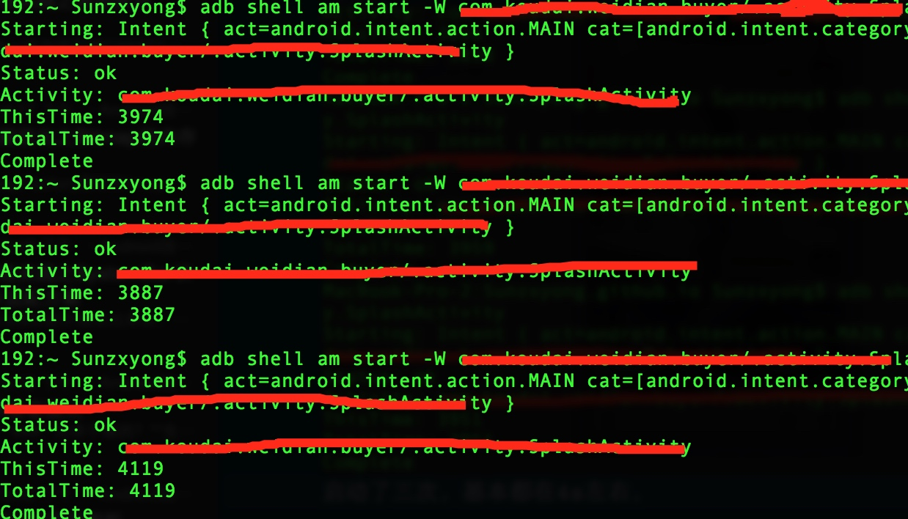
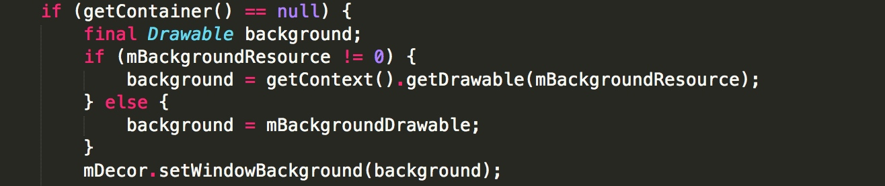
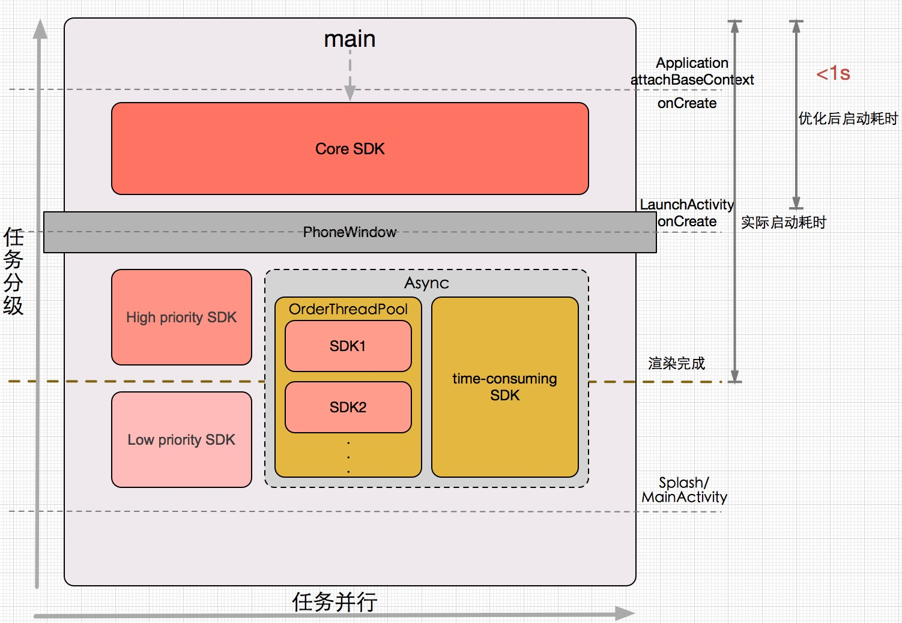
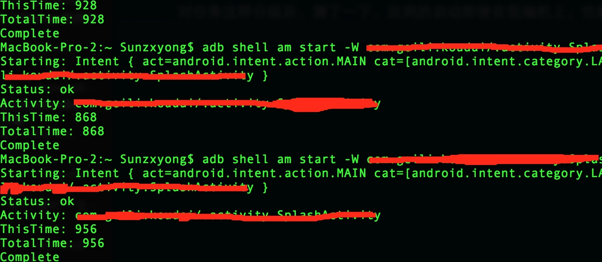

# Android端应用秒开优化体验

来源:[Android端应用秒开优化体验](http://zhengxiaoyong.me/2016/07/18/Android%E7%AB%AF%E5%BA%94%E7%94%A8%E7%A7%92%E5%BC%80%E4%BC%98%E5%8C%96%E4%BD%93%E9%AA%8C/)

## 前言

最近部门内抛出了一个问题，应用启动很慢、卡图标？主要表现在中低端机型中。究其这个问题，由于对性能优化比较感兴趣，借了个低端机和一个中端机来一看究竟，对同一应用分别测了下它在中低端机的启动时间，下面为启动耗时情况：



启动了三次，基本都在4s左右。

## 原因

究其原因，主要因素是任务在界面绘制前过于集中化。

应用启动过程从用户点击launcher图标到看到第一帧这个过程中，主要会经过以下这些过程：

> main()->Application:attachBaseContext()->onCreate()->Activity:onCreate()->onStart()->onPostCreate()->onResume()->onPostResume()

而一般我们的初始化任务主要都会集中化在Application:onCreate()方法中，这就使得初始化任务在第一帧绘制之前得完成，这就造成了卡图标、应用启动慢。那么把任务打散呢？分散在LaunchActivity中去分段初始化？还是不行的，因为界面开始绘制是在onResume()方法开始后才开始绘制，所以，得从Activity的创建过程找办法。

main->Activity创建的这个过程会经过一系列framework层的操作，这些操作都是系统自动执行的，不易进行优化，不过可以在Activity创建这个过程前后来找一些蛛丝马迹，因为Activity的创建都会辗转到ActivityThread:performLaunchActivity()这个方法中，在这个方法中可以知道这么几件事：

* 1、先通过Instrumentation:newActivity()来创建一个Activity实例
* 2、再判断Application实例是否已创建，已创建则直接返回，否则调用
Instrumentation:newApplication()来创建Application实例，在这个过程中会依次执行attachBaseContext()和* onCreate()方法
* 3、之后Activity:attach()方法会创建一个PhoneWindow对象，它就是界面，它有一个DecorView，调用setContentView()时会给配置DecorView，其中就会设置一个背景：



我们的View也是add进DecorView中显示，它作为RootView肯定是最先显示，所以可以给它设置个默认背景

* 4、最后依次调用Activity的onCreate、onStart等方法

## 措施

> 1、任务分级<br/>
> 2、任务并行<br/>
> 3、界面预显示

对于任务集中初始化化、耗时初始化原因导致应用在中低端机启动过慢，而Activity界面绘制的时机导致简单的将任务分给Activity初始化也不起作用，我们必须找一个切入点

> 界面的创建和界面的绘制，这两个过程第一个是Application的attachBaseContext和onCreate这两个方法影响的，第二个则是Application创建一直到界面绘制

所以，可以对任务进行分级的临界点可以这样分：

> 1、CoreSDK——Application的创建<br/>
> 2、HighPrioritySDK——Activity的创建<br/>
> 3、LowPrioritySDK——Activity界面完成绘制<br/>
> 4、AsyncSDK——Activity的创建

如图：



对任务这样分级后，测了一下，应用的启动即使在低端机上，也能秒开:



## 分级带来的问题

正常启动过程那肯定是没问题的，不过有这么几种场景：

> 1、App切回后台，内存不足导致Application被回收，从最近任务列表中恢复界面时Application需重新创建<br/>
> 2、应用没挂起时，Push推送需从Notification跳入应用内某界面<br/>
> 3、应用没挂起时，浏览器外链需跳入应用内某界面

这些Case可能导致的问题是被跳入的界面使用到了未初始化的SDK，可能导致Crash或者数据异常，所以目标页面启动前必须确保SDK已经初始化，这个过程的原因是没有唤起启动页来初始化SDK，可以通过hook newActivity解决。

```
public Activity newActivity(ClassLoader cl, String className, Intent intent) 
			throws InstantiationException, 
					IllegalAccessException, ClassNotFoundException {
    if (InitializeOptimizer.isApplicationCreated()
            && (InitializeUtil.isOuterChainIntent(intent) ||					InitializeUtil.isNotificationIntent(intent)) 
            		&& (!InitializeOptimizer.isHighSDKInitialized()
            			|| !InitializeOptimizer.isLowSDKInitialized()
            			|| !InitializeOptimizer.isAsyncSDKInitialized())) {
        InitializeOptimizer.setApplicationCreated(false);
        intent.addCategory(InitializeUtil.INITIALIZE_CATEGORY);
        return (Activity) cl.loadClass(
        			InitializeOptimizer.getLaunchClassName()).newInstance();
    }
    InitializeOptimizer.setApplicationCreated(false);
    return super.newActivity(cl, className, intent);
}
```