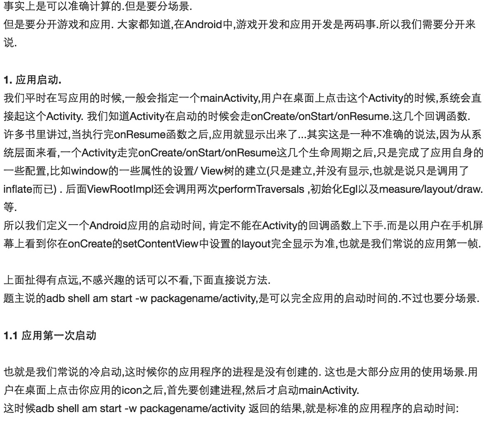
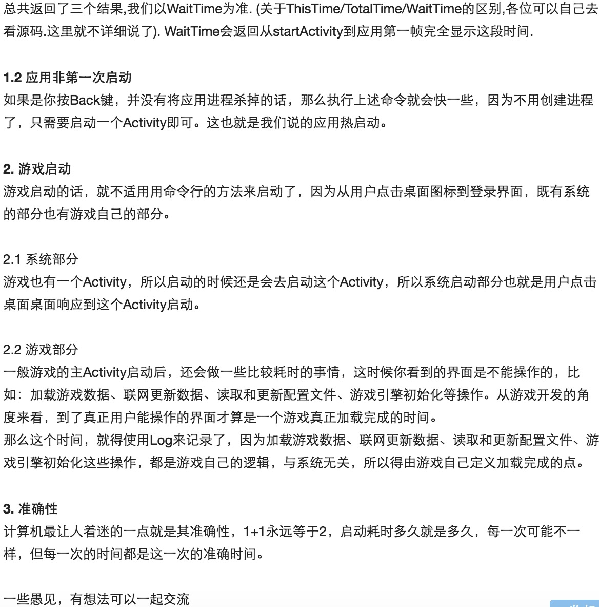
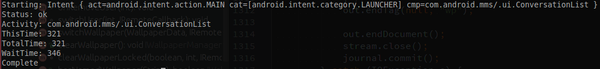
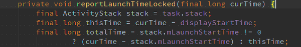
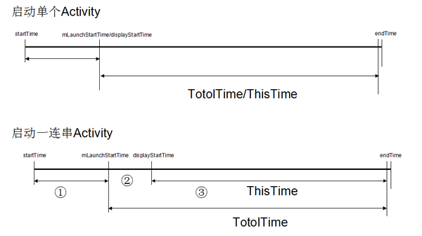

# 怎么计算apk的启动时间

来源:[知乎](https://www.zhihu.com/question/35487841)

## 问题

利用python或者直接用adb命令怎么计算apk的启动时间呢？就是计算从点击图标到apk完全启动所花费的时间。比如，对游戏来说就是点击游戏图标到进入到登录界面的这段时间。

已知的两种方法貌似可以获取，但是感觉结果不准确：一种是，`adb shell am start -w packagename/activity`,这个可以得到两个值，`ThisTime`和`TotalTime`，不知道两个有什么区别，而且与实际启动时间不匹配，两者相加都可能比实际启动时间小（测试游戏的时候差别更大）；另外一种是通过adb logcat的方式，感觉获取的结果也与实际有差别。

## 回答

### [高爷](https://www.zhihu.com/people/gracker)



```
adb shell am start -W com.meizu.media.painter/com.meizu.media.painter.PainterMainActivity
Starting: Intent { act=android.intent.action.MAIN cat=[android.intent.category.LAUNCHER] cmp=com.meizu.media.painter/.PainterMainActivity }
Status: ok
Activity: com.meizu.media.painter/.PainterMainActivity
ThisTime: 355
TotalTime: 355
WaitTime: 365
Complete
```



### [Groffa](https://www.zhihu.com/people/guo-qi-fa)

终于有空来填坑啦。关于应用启动速度，[@Gracker](http://www.zhihu.com/people/gracker)已经回答的很完善了。我补充下“adb shell am start -W ”这条命令得出的三个时间是如何计算出来的，了解了这个也就清楚了究竟哪个时间更准了。



“adb shell am start -W ”的实现在frameworks\base\cmds\am\src\com\android\commands\am\Am.java文件中。其实就是跨Binder调用ActivityManagerService.startActivityAndWait()接口（后面将ActivityManagerService简称为AMS），这个接口返回的结果包含上面打印的ThisTime、TotalTime时间。


startTime记录的刚准备调用startActivityAndWait()的时间点，endTime记录的是startActivityAndWait()函数调用返回的时间点，WaitTime = startActivityAndWait()调用耗时。

ThisTime、TotalTime的计算在frameworks\base\services\core\java\com\android\server\am\ActivityRecord.java文件的reportLaunchTimeLocked()函数中。



我们来解释下代码里curTime、displayStartTime、mLaunchStartTime三个时间变量。

* curTime表示该函数调用的时间点.
* displayStartTime表示一连串启动Activity中的最后一个Activity的启动时间点.
* mLaunchStartTime表示一连串启动Activity中第一个Activity的启动时间点.

正常情况下点击桌面图标只启动一个有界面的Activity，此时displayStartTime与mLaunchStartTime便指向同一时间点，此时ThisTime=TotalTime。另一种情况是点击桌面图标应用会先启动一个无界面的Activity做逻辑处理，接着又启动一个有界面的Activity，在这种启动一连串Activity的情况下（知乎的启动就是属于这种情况），displayStartTime便指向最后一个Activity的开始启动时间点，mLaunchStartTime指向第一个无界面Activity的开始启动时间点，此时ThisTime！=TotalTime。这两种情况如下图：



在上面的图中，我用①②③分别标注了三个时间段，在这三个时间段内分别干了什么事呢？

在第①个时间段内，AMS创建ActivityRecord记录块和选择合理的Task、将当前Resume的Activity进行pause；
在第②个时间段内，启动进程、调用无界面Activity的onCreate()等、pause/finish无界面的Activity；
在第③个时间段内，调用有界面Activity的onCreate、onResume；

看到这里应该清楚 ThisTime、TotalTime、WaitTime三个时间的关系了吧。WaitTime就是总的耗时，包括前一个应用Activity pause的时间和新应用启动的时间；ThisTime表示一连串启动Activity的最后一个Activity的启动耗时；TotalTime表示新应用启动的耗时，包括新进程的启动和Activity的启动，但不包括前一个应用Activity pause的耗时。也就是说，开发者一般只要关心TotalTime即可，这个时间才是自己应用真正启动的耗时。

Event log中TAG=am_activity_launch_time中的两个值分表表示ThisTime、TotalTime，跟通过“adb shell am start -W ”得到的值是一致的。

最后再说下系统根据什么来判断应用启动结束。我们知道应用启动包括进程启动、走Activity生命周期onCreate/onResume等。在第一次onResume时添加窗口到WMS中，然后measure/layout/draw，窗口绘制完成后通知WMS，WMS在合适的时机控制界面开始显示(夹杂了界面切换动画逻辑)。记住是窗口界面显示出来后，WMS才调用reportLaunchTimeLocked()通知AMS Activity启动完成。

**最后总结一下，如果只关心某个应用自身启动耗时，参考TotalTime；如果关心系统启动应用耗时，参考WaitTime；如果关心应用有界面Activity启动耗时，参考ThisTime。**


