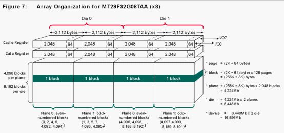
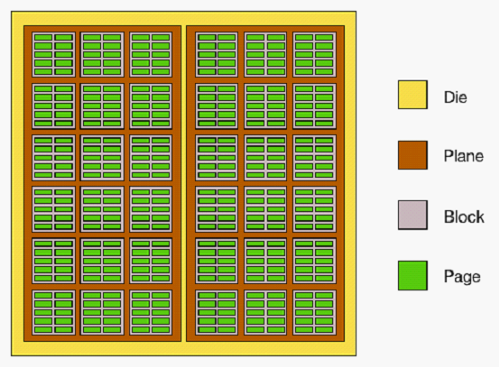
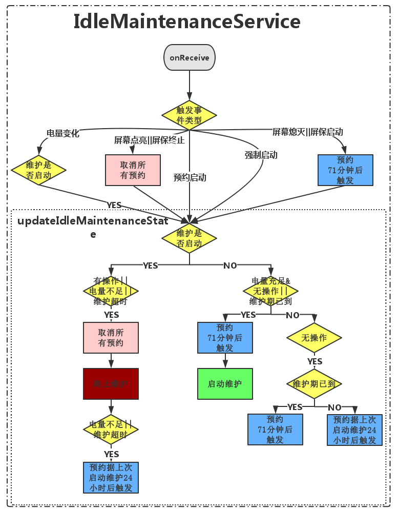
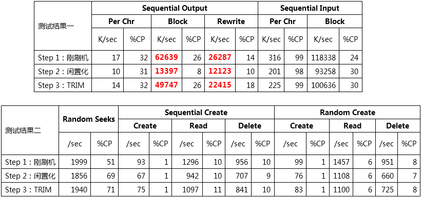

# TRIM：提升磁盘性能，缓解Android卡顿 

来源:[Bugly](http://bugly.qq.com/bbs/forum.php?mod=viewthread&tid=651&extra=page%3D1)

[Bugly](http://bugly.qq.com/)技术干货系列内容主要涉及移动开发方向，是由 Bugly 邀请腾讯内部各位技术大咖，通过日常工作经验的总结以及感悟撰写而成，内容均属原创，转载请标明出处。

在业内，Android 手机一直有着“越用越慢”的口碑。根据第三方的调研数据显示，有77%的 Android 手机用户承认自己曾遭遇过手机变慢的影响。他们不明白为什么购买之初“如丝般顺滑”的 Android 手机，在使用不到一年之后都会“卡顿”得让人抓狂！根据我们初步的测试数据，手机长期所使用产生的磁盘碎片可以使得磁盘的写入效率下降为原来的50%。是不是有一种“吓死本宝宝了”的感觉。

那么怎么办呢？笔者曾经对这一问题进行分析，且让我一一向你道来。

## 故事起因

故事的起因是，针对“Android 系统越用越卡的问题”，腾讯某产品团队希望在自身产品中进行优化，从而提升产品口碑。

经过简单的分析讨论，大家认为造成这种现象可能是由于两个方面原因：内存、磁盘：

* 先说内存。为了保证应用可以快速被再次调起，Android 在内存管理上采用如下策略：进程保持在内存中，在占用内存未超过阈值之前不会系统进行主动清理。但随着应用的增多，试图保持在内存中的进程将会增多，因此影响系统的流畅度。可以说，内存与系统卡顿的关系早已是业界的共识，其解决方案也比较明了，即赋予系统主动清理内存的能力，例如待机后杀掉不必要的进程。
* 再聊磁盘。长期使用 Android 手机必将产生大量的磁盘碎片，而磁盘碎片将会降低磁盘的读写性能，从而影响系统流畅度。但是磁盘碎片是否能对磁盘的读写性能造成了很大影响,以至于影响系统流畅度尚未可知，且暂时也没有发现可以进行尝试的潜在优化点。

于是，产品团队找到了我们专项测试组，希望分析 Android 越用越卡与磁盘是否有关系，并初步探索系统在磁盘管理模式方面是否存在潜在优化点。这就有了下文。

## 逐步分析

### Step 0：磁盘与系统流畅度的关系

其实，日常的生活经验（例如 SSD 可以让老笔记本焕发新生）已经我们能够感觉得到磁盘对系统流畅度的影响很大。但是，这里还是有再必要简单说一下，磁盘是如何影响系统流畅度的。

开发过 Android 项目的同学都知道 Android 在使用网络的最佳实践是使用3级缓存的设计来提升系统的流畅度并节省流量：CPU 首先尝试从内存中加载图片，若此时图片存在在内存中则加载成功，否则内存会从磁盘中加载图片，若此时图片存在在磁盘中则加载成功，否则磁盘会最终向网络中下载图片。

其实上述的执行逻辑，也就解释了磁盘是如何影响系统流畅度的：对于系统流畅度（其实也是各个应用的流畅度）影响最直接的就是 CPU 的执行效率，但是如果这个过程中内存、磁盘以及网络的读写速度如果跟不上 CPU 的执行效率的话，就会造成 CPU 在处理任务的时候需要花费时间等待数据，从而影响了流畅度。

所以第一个问题就弄清楚了：磁盘的读写速度的降低会使得系统流畅度变差！那么，我们要分析的问题就转化成：磁盘在长期使用的过程中，其读写速度会不会降低。

### Step 1：弄清 Android 磁盘的读写机制

为了分析清楚磁盘“磁盘在长期使用的过程中，其读写速度会不会降低”这个问题，我们有必要先弄明白 Android 磁盘所采用的读写机制。

通过资料查阅，我们了解到目前，Android 手机大多采用 NAND Flash 架构的闪存卡来存储内容。NAND Flash 的内部存储单位从小到大依次为：Page、Block、Plane、Die，而一个 Device 上可以封装若干个 Die。下图就是一个 NAND Flash 组成结构的示意图。

为了方便理解，针对一个 Die，我们再抽象一下，Page、Block、Plane、Die 的关系如下图所示。

虽然 NAND Flash 的优点多多，但是为了延长驱动器的寿命，它的读写操作均是以 Page 为单位进行的，但擦除操作却是按 Block 为单位进行的。

由于有大量的读写操作，于是我们的 NAND Flash 制定了如下的读写规则：

* 1、删除数据时，芯片将标记这些 Page 为闲置状态，但并不会立马执行擦除操作。
* 2、写入数据时，如果目前磁盘剩余空间充足，则由芯片指定 Block 后直接按 Page 为单位进行写入即可。
* 3、写入数据时，如果目前磁盘剩余空间不足，为了获得足够的空间，磁盘先将某块 Block 的内容读至缓存，然后再在该 Block 上进行擦除操作，最后将新内容与原先内容一起写入至该 Block。

那么问题来了！假如现在我要向磁盘中写入一张图片的数据，这个图片的数据大小刚好为一个 Page。最坏的情况就是，内存中恰好只有一个 Block 恰好有一个 Page 的无效数据可以擦除。为了存下这张图片，于是主控就把这个 Block 的所有数据读至缓存，擦除Block上的内容，再向缓存中加上这个4KB 新数据后最后写回 Block 中。

我的天啊，其实想存储的就是1个 Page 的图片内容，但是实际上确造成了整个 Block 的内容都被重新写入，同时原本简单一步搞定的事情被还被分成了前后四步执行（闪存读取、缓存改、闪存擦除、闪存写入）造成延迟大大增加，速度变慢。这就是传说中的“写入放大”（Write Amplification）问题。而“写入放大”也说明了磁盘在长期使用的过程中，其读写速度（尤其是写入速度）会存在降低的现象。

### Step 2：解决“写入放大”问题的技术——TRIM

不过，既然“写入放大”（Write Amplification）都这么出名了，肯定不会没有现成的解决方案的！这个很简单，Google 一下，我们就知道解决方案就是 TRIM 技术。

TRIM 是一条 ATA 指令，由操作系统发送给闪存主控制器，告诉它哪些数据占的地址是“无效”的。在 TRIM 的帮助下，闪存主控制器就可以提前知道哪些 Page 是“无效”的，便可以在适当的时机做出优化，从而改善性能。这里要强调下，TRIM 只是条指令，让操作系统告诉闪存主控制器这个 Page 已经“无效”就算完了，并没有任何其它多余的操作。在测试的过程中，我们发现 TRIM 的触发需要操作系统、驱动程序以及闪存主控三者都支持才能真正意义上实现。例如：

* 操作系统不支持的情况：Android 4.3以下均不支持
* 闪存主控不支持的情况：Samsung Galaxy Nexus（I9250）所选用的闪存不支持

基于 TRIM 技术，目前常见有两种方案可以解决“写入放大”的问题：

* **discard 选项**。该方案将在挂载 ext4 分区时加上 discard 选项，此后操作系统在执行每一个磁盘操作时同时都会执行 TRIM 指令。该方案的优点是总体耗时短，但影响会到删除文件时的性能。
* **fstrim 命令**。该方案将选择合适的时机对整个分区执行 TRIM 操作。相对于方案一，该方案总体耗时较长，但不会影响正常操作时的磁盘性能。

不得不说，如果从用户的角度出发，还是 FSTRIM 的方法更靠谱一些，但如何寻找合适的 TRIM 时机就是一个比较讲究的问题了。

### Step 3：TRIM 在 Android 中的实现

根据前面的分析，我们不难理解在 Android 中的 TRIM 选择通过 fstrim 命令的方式进行实现。那么，Google 又是如何设计触发TRIM的时机呢？

通过走读 Android 源码（AOSP 4.4.4），可以了解到 Android 通过系统服务 `IdleMaintenanceService`来进行系统状态监控并决定何时触发 TRIM。根据 `IdleMaintenanceService.java`源码，我们绘制了 fstrim 的触发示意图如下：

注释： - 有/无操作：距屏幕熄灭||屏保启动已超过71分钟 - 是/否电量充足：维护期20%，非维护期（充电状态30%，非充电状态80%） - 是/否维护超时：启动维护已超过71分钟 - 是/否已到维护期：据上次启动维护超过1天

### Step 4：分析闪存碎片及 TRIM 对磁盘 I/O 性能的影响

了解了这么多技术背景，那我们通过测试数据分析闪存碎片和 TRIM 对磁盘 I/O 性能的影响。根据测试目的，具体的测试设置如下：

* 测试目的：

评估闪存碎片和TRIM对磁盘 I/O 性能的影响

* 测试方案：

测试对象：LG Nexus 5 with cm-11-20140805-SNAPSHOT-M9-hammerhead

* 测试步骤：

   * 1.重新刷机，使用 Bonnie++ 测试 SD 卡目录的 I/O 性能；
   * 2.模拟长期使用 SD 卡的过程（期间需要避免TRIM触发），使用 Bonnie++ 测试 SD 卡目录的 I/O 性能；
   * 3.主动触发 TRIM，使用 Bonnie++ 测试 SD 卡目录的 I/O 性能。

* 备注：

   * 1.模拟长期使用 SD 卡的过程的方法：开发专用的测试应用，该应用将向 SD 卡目录不停写入大小随机的文件，当 SD 卡剩余空间不足时将删除所写入的文件，然后继续上述操作直到应用退出。
   * 2.避免 TRIM 触发的方法：根据 Android 的触发过程分析，只需设置屏幕常亮并即可避免 TRIM 的触发。
   * 3.测试数据：

* 数据解读：

   * 通过反复擦写 SD 卡，可以发现 SD 卡的 I/O 效率指标均存在一定幅度的下滑，其中反映磁盘空间分配性能及文件数据写回性能的指标下滑明显；
   * Sequential Output-Block 可以反映分配磁盘文件空间的效率，经反复擦写 SD 卡后，该效率降低至原始值的15-20%，应该是大量的磁盘闲置数据块造成的影响；
   * Sequential Output-Rewrite 可以反映文件系统缓存和数据传输的速度，经反复擦写 SD 卡制造闲置数据块后，该效率降低至原始值的50%。
   * 主动调用 TRIM 后，可以发现 SD 卡的 I/O 效率指标均恢复至接近原始值水平（但仍未完全达到初始状态的水平）。

* 测试结论：

   * 在 TRIM 无效的情况下，长期使用 SD 卡，磁盘写入速度会受到明显影响;
   * TRIM 对因闲置数据块造成的 I/O 性能下降有一定的恢复作用；
   * 大量的读写操作对 SD 卡造成了一定量的不可恢复的损耗。

### Step 5：FSTRIM 系统自动触发测试

完成了上面的工作，不由得让我们大吃一鲸：原来 TRIM 对 SD 卡的读写速度的维护如此重要！前面也说到，Android 选择 FSTRIM 方案的来实现 TRIM，那么 Android 所设计的 FSTRIM 触发时机有没有什么问题呢？

根据 Android 系统的设定，FSTRIM 预期是每隔24小时触发一次。所以，接下来我们需要评估一下，FSTRIM 能否依据上述设定成功被系统触发。

* 测试目的：

分析 FSTRIM 能否被按时被系统触发

* 测试方案：

   * 测试对象：2台 Samsung Galaxy Nexus 及2台 LG Nexus 5
   * 测试步骤：
      * 刷机后，安装常用应用并启动（均无SIM卡，其中1台设备开启 Wifi，另1台设备关闭 Wifi）；
      * 进行 Log 记录；
      * 强制执行一次 FSTRIM；
      * 灭屏等待30小时左右，提取 Log 记录进行分析。
      * 测试数据：

|| 开启WiFi | 关闭WiFi | 
|:----:|:----:|:----:|
| Samsung Galaxy Nexus | 启动FSTRIM 1次 | 启动FSTRIM 1次 | 
| LG Nexus 5 | 未启动FSTRIM | 启动FSTRIM 1次 |

* 数据解读：
   * FSTRIM 大多数情况会被自动触发，但也存在无法触发的情况；
   * 根据 FSTRIM 的触发逻辑，是否开启 WIFI 对 FSTRIM 的影响主要是有无推送消息（影响灭屏条件）以及不同的耗电。

* 测试结论：

测试数据显示 FSTRIM 大多数情况会被自动触发，但也存在无法触发的情况。可能的原因是：FSTRIM 对电量的要求略高，所以一旦发生意外情况（如应用的 PUSH 消息）终止了计划 FSTRIM 的执行之后，很长时间之内都无法再满足 FSTRIM 的启动条件。所以，如需提高其触发频率，我们可以考虑降低触发条件中对电量的要求。

## 总结&思考：
根据前面的分析，我们可以从 Android 源码及测试数据对前面两个问题做出回答：

* 磁盘碎片（更准确的说法是 SD 卡中的闲置数据块）会严重影响磁盘的读写性能，可能会导致 Android 系统越用越卡，而 Android 系统的 FSTRIM 对此有恢复的作用；
* 经过实验分析， FSTRIM 并不一定能够按期（每天一次）执行。而导致这一问题的原因可能是 IdleMaintenanceService 对电量的要求过高（未充电状态下大于80%）。

当然，我们可以通过一下手段对这一问题做出优化尝试：

* FSTRIM 对电量的要求略高，如需提高其触发频率可以从降低触发条件中对电量的要求；
* 在必要的情况下，可以发送特定的 Intent 事件，使系统强制触发 FSTRIM。

至此，我们也大致解答了项目组提出的问题，这个故事也基本可以告一段落了。

回顾整个分析问题的过程，我发现，作为一名专项测试人员，尽管我并不需要实际编写项目中的任何一句代码，但这并不意味着我不需要了解 Android 及其 Framework 的代码。实际上，只有在平时的学习和工作中了解其工作机制的基础上，我们才能设计出合理的测试方案，从而更好 的完成工作。

如果你觉得内容意犹未尽，如果你想了解更多相关信息，请扫描以下二维码，关注我们的公众账号，可以获取更多技术类干货，还有精彩活动与你分享~

