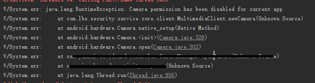
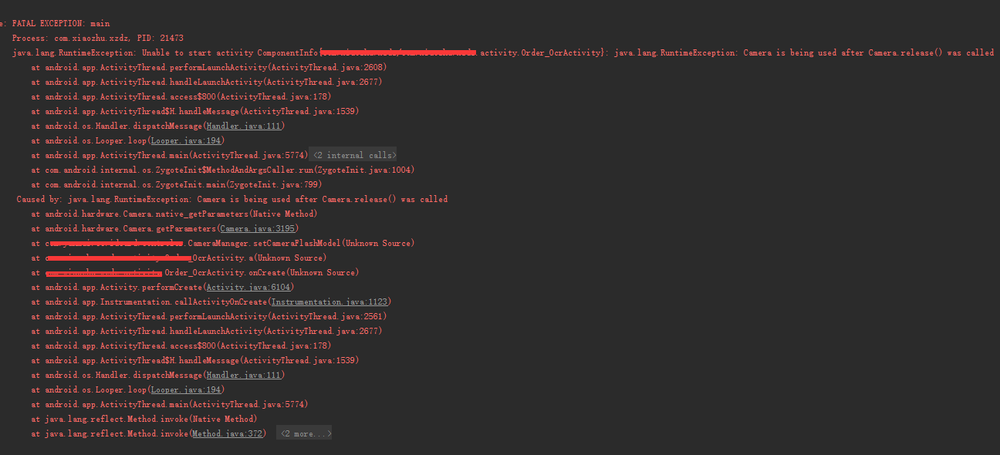

# android 判断摄像头是否可用（6.0以下 ）

来源:[CSDN](http://blog.csdn.net/jm_beizi/article/details/51728495)

## 问题概述

android 应用程序无法判定当前是否有摄像头的使用权限，是否可用。

## 问题描述

在做ocr 的时候遇到个问题，点击拍照/扫描页面的入口Button，弹出一个对话框 “申请拍照和录像权限” “禁止”/“允许”。如果这个时候点击了“禁止”，或者自己在移动设备的权限设置里把APP的 “拍照和摄像” 权限改为拒绝（或者禁止）。那么当我们在app 中再想调用拍照和摄像的功能就不行了， 有的手机没有任何反应，有的干脆就直接挂掉。

## 问题分析

android 6.0  Google 对Android的权限做了比较大的修改，比较好处理。问题主要是体现在6.0 以下的系统。
这是我用的一款测试机打印出来的log，忘记是三星还是小米了。 

> Caused by: Camera permission has been disabled for current app



而魅族MX5的比较怪，其他的魅族机没有测试 

> Caused by: java.lang.RuntimeException: Camera is being used after Camera.release() was called



**最开始的时候还以为是摄像头的资源没有释放掉之类的问题引起的，但是在“权限管理”中把摄像头的权限打开就没有这种问题，真心醉了，为什么会报这样的错误？！！！但是问题肯定是权限导致的。**


## 问题解决

网上有种方法是根据 checkPermission 判断权限，但这是判断是否在清单文件中注册了权限，并不能判断当前的摄像头是否被禁止，可用！

```
PackageManager pm = getPackageManager();  
	boolean permission = (PackageManager.PERMISSION_GRANTED ==   
			pm.checkPermission("android.permission.CAMERA ", "packageName"));  
	if (permission) {  
		showToast("有这个权限");  
	}else {  
		showToast("木有这个权限");  
}
```

找到种可行的处理方法，是用抓取 Camera.open() 异常的方法来解决，比较暴力。

```
public class PermissionTool {
    /**
     * 判断摄像头是否可用
     * 主要针对6.0 之前的版本，现在主要是依靠try...catch... 报错信息，感觉不太好，
     * 以后有更好的方法的话可适当替换
     *
     * @return
     */
    public static boolean isCameraCanUse() {
        boolean canUse = true;
        Camera mCamera = null;
        try {
            mCamera = Camera.open();
            // setParameters 是针对魅族MX5 做的。MX5 通过Camera.open() 拿到的Camera 
            // 对象不为null
            Camera.Parameters mParameters = mCamera.getParameters();
            mCamera.setParameters(mParameters);
        } catch (Exception e) {
            canUse = false;
        }
        if (mCamera != null) {
            mCamera.release();
        }
        return canUse;
    }
}
```

**而我们可以在APP进入拍照/扫描 页面的入口处，会先针对权限进行检查。如果有摄像头权限，则正常使用；没有摄像头使用权限，可以弹出个权限弹层或者相关提示之类的告诉用户正在使用的app 没有摄像头权限，需要自己开启。**

```
if (PermissionTool.isCameraCanUse()) {
    跳转到相关的拍照/扫描 页面
} else {
    当前APP没有摄像头权限弹层，或者其他相关提示
}
```

关于问题 “android 6.0以下系统判断当前摄像头是否可用” 目前我是这样处理的，感觉不太好，以后有更好的处理办法再替换吧！


-----------

## 补充

```
// 能否录音
public boolean canRecord(){
    boolean canRecorder = true;
    // isStart是为了处理魅族手机自己catch异常的问题
    boolean isStart = false;
    MediaRecorder mr = null;
    try{
        mr = new MediaRecorder();
        mr.setAudioSource(MediaRecorder.AudioSource.MIC);
        mr.setOutputFormat(MediaRecorder.OutputFormat.AMR_NB);

        File dir = Environment.getExternalStorageDirectory();
        mr.setOutputFile(new File(dir,"test.mp3").getPath());

        mr.setAudioEncoder(MediaRecorder.AudioEncoder.AMR_NB);

        mr.prepare();
        mr.start();
        isStart = true;
    }catch (Throwable e){
        canRecorder = false;
        e.printStackTrace();
    }finally {
        try{
            if(mr != null) {
                if(isStart) {
                    mr.stop();
                }
                mr.release();
            }
        }catch (Throwable e){
            canRecorder = false;
            e.printStackTrace();
        }
    }
    return canRecorder;
}
```