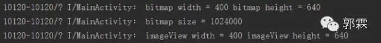

# 那些值得你去细细研究的Drawable适配(上、下)

来源:[那些值得你去细细研究的Drawable适配-上](http://mp.weixin.qq.com/s?__biz=MzA5MzI3NjE2MA==&mid=2650235875&idx=1&sn=add1f85f961b2e70164900cc287b1e66&scene=23&srcid=0523QaB9FqBoatOTnTxICNvY#rd)、[那些值得你去细细研究的Drawable适配-下](http://mp.weixin.qq.com/s?__biz=MzA5MzI3NjE2MA==&mid=2650235888&idx=1&sn=65eb1f2a5151f1cf22c5432a61eb5d5c&scene=4#wechat_redirect)

```
郭霖 
微信号：guolin_blog
功能介绍:Android技术分享平台，在这里不仅可以学到各种Android相关的最新技术，
	还可以将你自己的技术总结分享给其他人，每周定期更新。
```

# 那些值得你去细细研究的Drawable适配(上)

话说前段时间我写了一篇drawable微技术的文章，也是引起了不小的反响，因为讲的东西是大家天天在使用，但却偏偏却没有深入了解的知识。而本篇文章的投稿者 王月半子 表示“不服”，看完我写的那篇之后自己也忍不住写了一篇，我阅读之后发现写的挺棒，于是邀请他来公众号上投稿。由于本篇文章内容较长，因此分为上下两篇发表。

王月半子的博客地址：[http://blog.csdn.net/wrg_20100512](http://blog.csdn.net/wrg_20100512)

Android适配的问题太多，有屏幕尺寸的适配、屏幕分辨率的适配以及不同系统版本的适配。反映在代码上，就是需要在资源文件上下功夫，主要是layout和drawable目录下的文件，这里主要研究一下drawable的适配。首先我们先熟悉一下基本的概念。

## Android中的长度单位

### px(pixel)

表示屏幕实际的像素。例如，1200×1920的屏幕在横向有1200个像素，在纵向有1920个像素。

### dpi(dot per inch)

表示屏幕密度是指每英寸上的像素点数。Android将根据不同的dpi将Android设备分成多个显示级别。具体如下：


正如drawable目录和mipmap目录有ldpi、mdpi、hdpi、xhdpi、xxhdpi之分。

* 这里解释一下mipmap和drawable的区别

> 在Android studio开发中，新建一个module的时候不同于Eclipse(会生成drawable、drawable-ldpi、drawable-mdpi、drawable-hxpi等等)，在资源文件中会生成mipmap-hdpi、mipmap-mdpi、mipmap-xhdpi、mipmap-xxhdpi和一个drawable目录。

对于这个问题谷歌官方有说法：

> drawable/ <br/>
> For bitmap files (PNG, JPEG, or GIF), 9-Patch image files, and XML files that describe Drawable shapes or Drawable objects that contain multiple states (normal, pressed, or focused). 

意思是说以drawable开头的目录存放的文件有png、jpeg、gif格式图片文件、.9图片以及一些XML文件。

> mipmap/<br/>
> For app launcher icons. 

而以mipmap开头的目录存放的是App的图标。

### dp

也叫dip(density independent pixel)直译为密度无关的像素。我们猜测如果使用了这个单位，在不同屏幕密度的设备上显示的长度就会是相同的。那么在屏幕上显示图像时都是在屏幕上填充像素点，而使用这种与密度无关的像素（我们在布局文件中使用的 dp/dip 就是与密度无关的像素）是如何转换成像素的呢？其实在Android中，将屏幕密度为160dpi的中密度设备屏幕作为基准屏幕，在这个屏幕中，1dp=1px。其他屏幕密度的设备按照比例换算，具体如下表：


由上表不难计算1dp在hdpi设备下等于1.5px，同样的在xxhdpi设备下1dp=3px。这里我们从dp到px解释了Android中不同屏幕密度之间的像素比例关系。

下面换一个角度，从px到dp的变化来说明这种比例关系。

这里我们选择在以mipmap开头的目录中设计一个icon，要求icon在屏幕中占据相同的dp。那么对于不同的屏幕密度（MDPI、HDPI、XHDPI、XXHDPI 和 XXXHDPI）应按照 2:3:4:6:8 的比例进行缩放。比如尺寸为48x48dp，这表示在 MDPI 的屏幕上其实际尺寸应为 48x48px，在 HDPI 的屏幕上其实际大小是 MDPI 的 1.5 倍 (72x72 px)，在 XDPI 的屏幕上其实际大小是 MDPI 的 2 倍 (96x96 px)，依此类推。

* 图片的描述有两种：
   * 1、仅仅通过宽高的像素。
   * 2、通过图片分辨率（不同于屏幕分辨率，单位英寸中所包含的像素点数）和尺寸大小。

### sp（scale-independent pixels）

与dp类似，但是可以在设置里面调节字号的时候，文字会随之改变。当系统字号设为“普通”时，sp与px的尺寸换算和dp与px是一样的。

## 屏幕尺寸、屏幕分辨率、屏幕密度

### 屏幕尺寸

设备的物理屏幕尺寸，指屏幕的对角线的长度，单位是英寸，1 inch = 2.54 cm。比如“5寸大屏手机”，就是指对角线的尺寸，5寸×2.54厘米/寸=12.7厘米。

### 屏幕分辨率

也叫显示分辨率，是屏幕图像的精密度，是指屏幕或者显示器所能显示的像素点有多少。一般以横向像素×纵向像素表示分辨率，如1200×1920表示此屏幕在宽度方向有1200个像素，在高度方向有1920个像素。

### 屏幕密度

是指每英寸上的像素点数，单位是dpi(dot per inch)或者ppi(pixels per inch)，数值越高显示越细腻。屏幕密度与屏幕尺寸和屏幕分辨率有关。例如在屏幕尺寸一定的条件下，屏幕分辨率越高屏幕密度越大，反之越小。同理在屏幕分辨率一定的条件下，屏幕尺寸越小屏幕密度越大，反之越小。

屏幕尺寸和屏幕分辨率，这两个值是可以直接得到的。屏幕密度需要我们计算得到。例如我的手机的分辨率是1200×1920，屏幕尺寸是7寸的。根据屏幕尺寸、屏幕分辨率和屏幕密度定义不难看出他们之间的关系如下图：


根据勾股定理，我们得出对角线的像素数大约是2264，那么用2264除以7就是此屏幕的密度了，计算结果是323。

* 备注：上面的出现的0.75，1，1.5，2，3，4才是屏幕密度(density)。而120，160，240，320，480，640是屏幕密度dpi(densityDpi)。

### 实际密度与系统密度

实际密度就是我们自己算出来的密度，这个密度代表了屏幕真实的细腻程度，如上述例子中的323dpi就是实际密度，说明这块屏幕每寸有323个像素。7英寸1200×1920的屏幕密度是323,5英寸1200×1920的屏幕密度是452，而相同分辨率的4.5英寸屏幕密度是503。如此看来，屏幕密度将会出现很多数值，呈现严重的碎片化。而密度又是Android屏幕将界面进行缩放显示的依据，那么Android是如何适配这么多屏幕的呢？

其实，每部Android手机屏幕都有一个初始的固定密度，这些数值是120、160、240、320、480，这些就是Android为不同设备设定的系统密度。

得到实际密度以后，一般会选择一个最近的密度作为系统密度，系统密度是出厂预置的，如440dpi的系统密度就是和它最接近的480dpi；如果是330dpi的设备，它的系统密度就是320dpi。但是，现在很多手机不一定会选择这些值作为系统密度，而是选择实际的dpi作为系统密度，这就导致了很多手机的dpi也不是在这些值内。**例如小米Note这样的xxhdpi的设备他的系统密度并不是480，而是它的实际密度440。**

### 获取设备的上述属性

```
Android系统中有个DisplayMetrics的类，通过这个类就可以得到上述的所有属性。
DisplayMetrics displayMetrics = getResources().getDisplayMetrics();
float density = displayMetrics.density; //屏幕密度
int densityDpi = displayMetrics.densityDpi;//屏幕密度dpi
int heightPixels = displayMetrics.heightPixels;//屏幕高度的像素
int widthPixels = displayMetrics.widthPixels;//屏幕宽度的像素
String screenResolution = widthPixels + "X" + heightPixels;
float scaledDensity = displayMetrics.scaledDensity;//字体的放大系数
float xdpi = displayMetrics.xdpi;//宽度方向上的dpi
float ydpi = displayMetrics.ydpi;//高度方向上的dpi
```

其中xdpi = ydpi = densityDpi.打印结果如下：


上面计算的我的设备的dpi为323。这里系统给定的屏幕密度dpi为320。

OK，基础的东西介绍完了，那么回归正题：

**1. android项目中那么多以drawable开头的文件夹，那应用的配图应该放在哪个文件夹之下呢？**

一般的开发的话，都会做三套配图，对应着drawable-hdpi、drawable-xhdpi、drawable-xxhdpi三个文件夹。

**2. 那要是做一套呢？应该做哪一套呢？**

做一套也是可以的，放在drawable-xxdpi文件夹中。

**3. 为什么做一套配图要放在drawable-xxdpi文件夹中？**

这里先不给出答案，我在网上也看了一些说法，说是省内存，这里暂且不置可否。

**明天我们就从内存的角度去分析问题3，使用同一张图片，放置在不同的drawable文件夹，在同一设备上运行，研究一下图片大小及内存的占用。**

# 那些值得你去细细研究的Drawable适配(下)

本篇文章由 王月半子 投稿，继续承接上篇带你研究Drawable的适配问题。相比于上篇，下篇文章更加面向于实战，内容也更加实用。

王月半子的博客地址：[http://blog.csdn.net/wrg_20100512](http://blog.csdn.net/wrg_20100512)

上篇中我们讲了基本概念，今天我们就进入实战对上篇的问题做出解答，相对于昨天的开胃菜，今天这篇你可能需要花费一番工夫阅读。

首先我**准备一张600×960像素的png图片，大小为248k，放在不同分辨率的drawable文件夹下，使用同一手机（1200X1920像素）测试**。布局很简单，一个RelativeLayout里面包含一个ImageView，ImageView的宽高均为"wrap_content"，Activity中关键的代码如下：

```
BitmapDrawable drawable = (BitmapDrawable) imageView.getDrawable();
if (drawable != null) {
    Bitmap bitmap = drawable.getBitmap();
    Log.i(TAG, "bitmap width = " + bitmap.getWidth() 
    		+ " bitmap height = " + bitmap.getHeight());
    Log.i(TAG, "bitmap size = " + bitmap.getByteCount());//获取bitmap的占用内存
    Log.i(TAG, "imageView width = " + imageView.getWidth() 
    	+ " imageView height = " + imageView.getHeight());
}
```

篇幅有限，这里我直接贴出部分结果以及汇总结果：

放在drawable-mhdpi文件夹下：


放在drawable-xxhdpi文件夹下：



汇总结果（原图600×960像素）：


接下来我们来分析两个问题：

## 同一张图片，放在不同目录下，生成了不同大小的Bitmap

要想回答这个问题，必须要深入理解Android系统加载drawable目录下图片的过程，用的是 decodeResource 方法：

```
final TypedValue value = new TypedValue();
is = res.openRawResource(id, value);
bm = decodeResourceStream(res, value, is, null, opts);
```

该方法本质上就两步：

* 1.读取原始资源，这个调用了 Resource.openRawResource 方法，这个方法调用完成之后会对 TypedValue 进行赋值，其中包含了原始资源的 density 等信息；原始资源的 density 其实取决于资源存放的目录（比如 drawable-xxhdpi 对应的是480， drawable-hdpi对应的就是240，而drawable目录对应的是TypedValue.DENSITY_DEFAULT=0）。

* 2.调用 decodeResourceStream 对原始资源进行解码和适配。这个过程实际上就是原始资源的 density 到屏幕 density 的一个映射，代码如下：

```
public static Bitmap decodeResourceStream(Resources res, TypedValue value,
            InputStream is, Rect pad, Options opts) {
      if (opts == null) {
          opts = new Options();
      }
      if (opts.inDensity == 0 && value != null) {
          final int density = value.density;
          if (density == TypedValue.DENSITY_DEFAULT) {
              opts.inDensity = DisplayMetrics.DENSITY_DEFAULT;
          } else if (density != TypedValue.DENSITY_NONE) {
              opts.inDensity = density;
          }
      }      if (opts.inTargetDensity == 0 && res != null) {
          opts.inTargetDensity = res.getDisplayMetrics().densityDpi;
      }      return decodeStream(is, pad, opts);
}
```

该方法主要就是对opts对象中的属性进行赋值，代码不难理解。如果**value.density=DisplayMetrics.DENSITY_DEFAULT**也就是0的话，将 opts.inDensity赋值为 **DisplayMetrics.DENSITY_DEFAULT**默认值为160.否则就将 opts.inDensity赋值为第一步获取到的值。此外将 opts.inTargetDensity赋值为屏幕密度Dpi。inDensity 和 inTargetDensity要特别注意，这两个值与下面 cpp 文件里面的 density 和 targetDensity 相对应。

BitmapFactory.cpp:

```
static jobject doDecode(JNIEnv* env, SkStreamRewindable* stream, 
									jobject padding, jobject options) {
...... 
    if (env->GetBooleanField(options, gOptions_scaledFieldID)) {
    	//通过JNI获取opts.inDensity的值
        const int density = env->GetIntField(options, gOptions_densityFieldID);
        //通过JNI获取opts.inTargetDensity的值
        const int targetDensity = env->GetIntField(options, gOptions_targetDensityFieldID);                		const int screenDensity = env->GetIntField(options, gOptions_screenDensityFieldID);
        if (density != 0 && targetDensity != 0 && density != screenDensity) {
            scale = (float) targetDensity / density;//求出缩放的倍数。
        }
    }
}
        
const bool willScale = scale != 1.0f;
......
SkBitmap decodingBitmap;
if (!decoder->decode(stream, &decodingBitmap, prefColorType,decodeMode)) {
   return nullObjectReturn("decoder->decode returned false");
}
//这里这个deodingBitmap就是解码出来的bitmap，大小是图片原始的大小
int scaledWidth = decodingBitmap.width();
int scaledHeight = decodingBitmap.height();
if (willScale && decodeMode != SkImageDecoder::kDecodeBounds_Mode) {
    scaledWidth = int(scaledWidth * scale + 0.5f);//缩放后的宽
    scaledHeight = int(scaledHeight * scale + 0.5f);//缩放后的高
}
if (willScale) {
    const float sx = scaledWidth / float(decodingBitmap.width());//宽的缩放倍数
    const float sy = scaledHeight / float(decodingBitmap.height());//高的缩放倍数
    ......
    SkPaint paint;
    SkCanvas canvas(*outputBitmap);
    canvas.scale(sx, sy);//缩放画布
    canvas.drawBitmap(decodingBitmap, 0.0f, 0.0f, &paint);//画出图像
}
```

代码中的density 和 targetDensity均是通过JNI获取的值，前者是 opts.inDensity，targetDensity 实际上是opts.inTargetDensity也就是 DisplayMetrics 的 densityDpi，我的手机的densityDpi在上面已经打印过了320。最终我们看到 Canvas 放大了 scale 倍，然后又把读到内存的这张 bitmap 画上去，相当于把这张 bitmap 放大了 scale 倍。

Android中一张图片（BitMap）占用的内存主要和以下几个因数有关：图片长度，图片宽度，单位像素占用的字节数。这里我们需要知道bitmap中单位像素占据的内存大小，而单位像素占据的内存大小是与.Options的inPreferredConfig有关的：

```
public Bitmap.Config inPreferredConfig = Bitmap.Config.ARGB_8888;
```

inPreferredConfig的类型为Bitmap.Config默认值为Bitmap.Config.ARGB_8888。ARGB指的是一种色彩模式，里面A代表Alpha，R表示red，G表示green，B表示blue。ARGB_8888代表的就是这四个通道各占8位也就是一个字节，合起来就是4个字节。同理Bitmap.Config中还有ARGB_4444、 ALPHA_8、 RGB_565 ，他们占用内存的大小和ARGB_8888一样。

我们再来分析一下上面的那汇总表：

已知图片的大小为600×960，格式为png，测试手机的densityDpi为320（ opts.inTargetDensity=320）。

当图片放在drawable-mdpi目录时，此时得到的opts.inDensity=160，那么放大的倍数就是320/160=2，放大后图片的大小就是1200×1920，占用的内存就是：1200×1920×4=9216000B，9216000÷1024÷1024≈8.79M。同样的当图片放在drawable-xxhdpi目录下时，此时得到的opts.inDensity=480，那么放大的倍数就是320/480=2/3，放大后图片的大小就是400×640，占用的内存就是：400×640×4=1024000B，1024000÷1024÷1024≈0.98M。其他的类似，这里就不再赘述。至此问题分析完毕。

## 如果只做一套配图,为什么要放在drawable-xxhdpi文件夹中？

由汇总图可看出，同一张图片，放在不同的drawable目录下（从drawable-lpdi到drawable-xxhpdi）在同一手机上占用的内存越来越小。

因为同一部手机，它的densityDpi是固定的，而不同的drawable目录对应的原始密度不同，并且从drawable-lpdi到drawable-xxhpdi原始密度越来越大，而图片的放大倍数=densityDpi÷原始密度，所以放大倍数变小，自然占用的内存小了。

图片占用的内存主要和以下几个因数有关：

* 1.图片在内存中的像素。
* 2.单位像素占用的字节数。

而对于同一应用来说，单位像素占用的字节数一定是相同的，那么图片占用的内存只与图片在内存中的像素有关了，而图片在内存中的像素又由图片的原始像素和图片在内存中放大的倍数（scale = densityDpi÷原始密度）。 

综上所述，图片占用的内存和以下几个因素有关： 

* 图片的原始像素
* 设备的densityDp
* 图片在哪个drawable目录下

**设想一下，做一套适配xhdpi设备的配图，放在drawable-xhdpi目录下，和做一套适配mdpi设备的配图，放在drawable-mdpi目录下，这时候我用一个hdpi的设备来测试这两种方案，哪种方案更省内存呢？**

咱们具体分析一下，就拿我的设备来说是xhdpi的，分辨率为1200×1920，仍旧用原来的测试代码，要让ImageView显示为全屏，并且图片放在drawable-xhdpi目录下，那么图片的原始像素就应该是1200×1920。对于相同尺寸的mdpi来说，他的分辨率是600×960，要让ImageView显示为全屏，并且图片放在drawable-mhdpi目录下，那么图片的原始像素就应该是600×960。

这时候使用hdpi的设备来测试方案一，可以得到：图片原始的像素为1200×1920，设备的densityDpi为240，原始的dpi为320。所以放大倍数为2/3，最终图片在内存中的大小为800×1280。

使用hdpi的设备来测试方案二，可以得到：图片原始的像素为600×960，设备的densityDpi为240，原始的dpi为160。所以放大倍数为3/2，最终图片在内存中的大小也为800×1280。

当然在其他不同dpi的设备上这两种方案占用的内存也是一样的，这里就不再赘述。

所以如果只做一套图的话，不考虑app包的大小以及app内部配图的清晰度来说，只要图片所处的drawable目录适配该目录对应着dpi设备(例如做一套适配mdpi设备的图，将这些配图放在drawable-mdpi目录下)，再通过android系统加载图片的缩放机制后，不论哪种方案，对于同种dpi的设备，图片所占的内存是相同的。

但是这些都是不考虑app包的大小以及app内部配图的清晰度来说的，事实上不可能不考虑这些因素。在考虑这些因素之前，先说一下图片缩放的问题。

图片的像素、分辨率以及尺寸满足如下关系：

**分辨率 = 像素 ÷ 尺寸**

图片在进行缩放的时候，分辨率是不变的，变化的是像素和尺寸。比如将图片放大两倍，这时就会有白色像素插值补充原有的像素中，所以就会看起来模糊，清晰度不高。而缩小图片，会通过对图片像素采样生成缩略图，将会增强它的平滑度和清晰度。

如果制作适配xxhdpi设备的图片，同时放在drawable-xxhdpi目录中，其他除了xxxhdpi的设备在显示配图时都是缩小原图，不会出现模糊的情况。而这样的话App打包由于配图的质量高，自然App会相对大些。

相比较App的大小和用户体验来说，毫无疑问，用户至上。所以如果只有一套配图的话，制作高清大图适配xxhdpi的设备，将配图放置在drawable-xxhdpi目录下就可以了。

**另外对于xxxhdpi来说，市场上的设备不多，没必要为了那么一点点特殊群体来加大app的容量（4÷3≈1.3倍，容量放大的倍数不小呀！！！）**

至此，所有的问题都分析完毕，感谢您的阅读。


如果你有好的技术文章想和大家分享，欢迎向我的公众号投稿，投稿具体细节请在公众号主页点击“投稿”菜单查看。

欢迎长按下图 -> 识别图中二维码或者扫一扫关注我的公众号：


