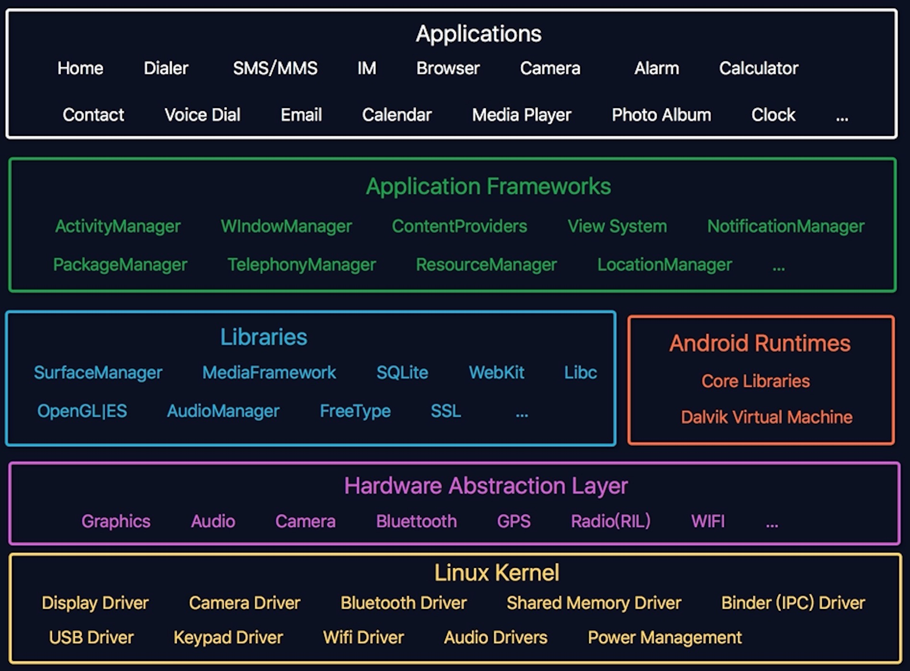

## Android 体系架构图

## 内核层

Android底层是基于Linux操作系统的。严格意义上讲是Linux操作系统的一个变种。为什么使用Linux作为内核？

* 避开了与硬件直接打交道
> Linux在与硬件打交道方面是强项，而且Linux开源
* 基于Linux的驱动开发可扩展项很强

## 硬件抽象层

HAL:Hardware Abstraction Layer,通过定义硬件驱动接口来进一步降低Android系统与硬件的耦合度。

* User space C/C++ library layer
* Defines the interface that Android requires hardware "drivers" to implement
* Separates the Android platform logic from the hardware interface

## 系统运行库

这一层包含支撑整个系统正常运行的基础库。由于使用C或者C++实现的，所以被称为C库

## 应用程序框架层

一般使用Java实现，所以也称为java库

## 应用层

系统应用和普通应用