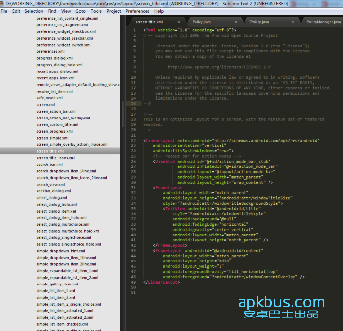

# Activity的绘制流程简单分析

来源:[apkbus](http://www.apkbus.com/android-243287-1-1.html)

要明白这个流程，我们还得从第一部开始，大家都知道 在`activity`里面 `setContentView` 调用结束以后 就可以看到程序加载好我们的布局文件了，从而让我们在手机上看到这个画面。那么我们来看一下这个源码是如何实现的。

```
   /**
     * Set the activity content from a layout resource.  The resource will be
     * inflated, adding all top-level views to the activity.
     *
     * @param layoutResID Resource ID to be inflated.
     * 
     * [url=home.php?mod=space&uid=189949]@See[/url] #setContentView(android.view.View)
     * @see #setContentView(android.view.View, android.view.ViewGroup.LayoutParams)
     */
    public void setContentView(int layoutResID) {
        getWindow().setContentView(layoutResID);
        initActionBar();
    }

```

我们这里看到是调用了`getWindow`的返回值来调用`setContentView`方法的。

```
	/** Retrieve the current {@link android.view.Window} for the activity.
     * This can be used to directly access parts of the Window API that
     * are not available through Activity/Screen.
     * 
     * [url=home.php?mod=space&uid=309376]@return[/url] Window The current window, or null if the activity is not
     *         visual.
     */
    public Window getWindow() {
        return mWindow;
    }
```

们再来看看`mWindow`这个值是从哪来的。

```
final void attach(Context context, ActivityThread aThread,            Instrumentation instr, IBinder token, int ident,
            Application application, Intent intent, ActivityInfo info,
            CharSequence title, Activity parent, String id,
            NonConfigurationInstances lastNonConfigurationInstances,
            Configuration config) {
        attachBaseContext(context);
 
        mFragments.attachActivity(this);
         
        mWindow = PolicyManager.makeNewWindow(this);
        mWindow.setCallback(this);
        mWindow.getLayoutInflater().setPrivateFactory(this);
        if (info.softInputMode != WindowManager.LayoutParams.SOFT_INPUT_STATE_UNSPECIFIED) {
            mWindow.setSoftInputMode(info.softInputMode);
        }
        if (info.uiOptions != 0) {
            mWindow.setUiOptions(info.uiOptions);
        }
        mUiThread = Thread.currentThread();
         
        mMainThread = aThread;
        mInstrumentation = instr;
        mToken = token;
        mIdent = ident;
        mApplication = application;
        mIntent = intent;
        mComponent = intent.getComponent();
        mActivityInfo = info;
        mTitle = title;
        mParent = parent;
        mEmbeddedID = id;
        mLastNonConfigurationInstances = lastNonConfigurationInstances;
 
        mWindow.setWindowManager(null, mToken, mComponent.flattenToString(),
                (info.flags & ActivityInfo.FLAG_HARDWARE_ACCELERATED) != 0);
        if (mParent != null) {
            mWindow.setContainer(mParent.getWindow());
        }
        mWindowManager = mWindow.getWindowManager();
        mCurrentConfig = config;
    }

```

注意看11行的代码 我们发现这个`mWindow`的值 是通过`makeNewWindow`这个方法来实现的。我们再来看看这个方法，当然了我们要先找到这个类，这个类位于`<source_code>/frameworks/base/core/java/com/android/internal/policy/PolicyManager.java`

```
/* * Copyright (C) 2008 The Android Open Source Project
 *
 * Licensed under the Apache License, Version 2.0 (the "License");
 * you may not use this file except in compliance with the License.
 * You may obtain a copy of the License at
 *
 *      http://www.apache.org/licenses/LICENSE-2.0
 *
 * Unless required by applicable law or agreed to in writing, software
 * distributed under the License is distributed on an "AS IS" BASIS,
 * WITHOUT WARRANTIES OR CONDITIONS OF ANY KIND, either express or implied.
 * See the License for the specific language governing permissions and
 * limitations under the License.
 */
 
package com.android.internal.policy;
 
import android.content.Context;
import android.view.FallbackEventHandler;
import android.view.LayoutInflater;
import android.view.Window;
import android.view.WindowManagerPolicy;
 
import com.android.internal.policy.IPolicy;
 
/**
 * {@hide}
 */
 
public final class PolicyManager {
    private static final String POLICY_IMPL_CLASS_NAME =
        "com.android.internal.policy.impl.Policy";
 
    private static final IPolicy sPolicy;
 
    static {
        // Pull in the actual implementation of the policy at run-time
        try {
            Class policyClass = Class.forName(POLICY_IMPL_CLASS_NAME);
            sPolicy = (IPolicy)policyClass.newInstance();
        } catch (ClassNotFoundException ex) {
            throw new RuntimeException(
                    POLICY_IMPL_CLASS_NAME + " could not be loaded", ex);
        } catch (InstantiationException ex) {
            throw new RuntimeException(
                    POLICY_IMPL_CLASS_NAME + " could not be instantiated", ex);
        } catch (IllegalAccessException ex) {
            throw new RuntimeException(
                    POLICY_IMPL_CLASS_NAME + " could not be instantiated", ex);
        }
    }
 
    // Cannot instantiate this class
    private PolicyManager() {}
 
    // The static methods to spawn new policy-specific objects
    public static Window makeNewWindow(Context context) {
        return sPolicy.makeNewWindow(context);
    }
 
    public static LayoutInflater makeNewLayoutInflater(Context context) {
        return sPolicy.makeNewLayoutInflater(context);
    }
 
    public static WindowManagerPolicy makeNewWindowManager() {
        return sPolicy.makeNewWindowManager();
    }
 
    public static FallbackEventHandler makeNewFallbackEventHandler(Context context) {
        return sPolicy.makeNewFallbackEventHandler(context);
    }
}

```

这里发现是一个反射的动态加载，我们暂时不去深究他，继续看代码，找到`Policy`这个类，他位于`<source_code>/frameworks/base/policy/src/com/android/internal/policy/impl/Policy.java`

```
/* * Copyright (C) 2008 The Android Open Source Project
 *
 * Licensed under the Apache License, Version 2.0 (the "License");
 * you may not use this file except in compliance with the License.
 * You may obtain a copy of the License at
 *
 *      http://www.apache.org/licenses/LICENSE-2.0
 *
 * Unless required by applicable law or agreed to in writing, software
 * distributed under the License is distributed on an "AS IS" BASIS,
 * WITHOUT WARRANTIES OR CONDITIONS OF ANY KIND, either express or implied.
 * See the License for the specific language governing permissions and
 * limitations under the License.
 */
 
package com.android.internal.policy.impl;
 
import android.content.Context;
import android.util.Log;
import android.view.FallbackEventHandler;
import android.view.LayoutInflater;
import android.view.Window;
import android.view.WindowManagerPolicy;
 
import com.android.internal.policy.IPolicy;
import com.android.internal.policy.impl.PhoneLayoutInflater;
import com.android.internal.policy.impl.PhoneWindow;
import com.android.internal.policy.impl.PhoneWindowManager;
 
/**
 * {@hide}
 */
 
// Simple implementation of the policy interface that spawns the right
// set of objects
public class Policy implements IPolicy {
    private static final String TAG = "PhonePolicy";
 
    private static final String[] preload_classes = {
        "com.android.internal.policy.impl.PhoneLayoutInflater",
        "com.android.internal.policy.impl.PhoneWindow",
        "com.android.internal.policy.impl.PhoneWindow$1",
        "com.android.internal.policy.impl.PhoneWindow$ContextMenuCallback",
        "com.android.internal.policy.impl.PhoneWindow$DecorView",
        "com.android.internal.policy.impl.PhoneWindow$PanelFeatureState",
        "com.android.internal.policy.impl.PhoneWindow$PanelFeatureState$SavedState",
    };
 
    static {
        // For performance reasons, preload some policy specific classes when
        // the policy gets loaded.
        for (String s : preload_classes) {
            try {
                Class.forName(s);
            } catch (ClassNotFoundException ex) {
                Log.e(TAG, "Could not preload class for phone policy: " + s);
            }
        }
    }
 
    public Window makeNewWindow(Context context) {
        return new PhoneWindow(context);
    }
 
    public LayoutInflater makeNewLayoutInflater(Context context) {
        return new PhoneLayoutInflater(context);
    }
 
    public WindowManagerPolicy makeNewWindowManager() {
        return new PhoneWindowManager();
    }
 
    public FallbackEventHandler makeNewFallbackEventHandler(Context context) {
        return new PhoneFallbackEventHandler(context);
    }
}
```

看62行代码，到这里我们就发现了 在`activity`里`getQåindow`返回的 实际上就是这个`PhoneWindow`对象！！！！！！！！！！！！！！我们继续看这个`PhoneWindow`类,他位于`<source_code>/frameworks/base/policy/java/com/android/internal/policy/impl/PhoneWindow.java`,注意在这里我就不放这个类的源码了，因为2000多行。。。我只抽部分重要的说一下:

```
/**
 * Android-specific Window.
 * <p>
 * todo: need to pull the generic functionality out into a base class
 * in android.widget.
 */
public class PhoneWindow extends Window implements MenuBuilder.Callback {
 
    private final static String TAG = "PhoneWindow";
 
    private final static boolean SWEEP_OPEN_MENU = false;
 
    /**
     * Simple callback used by the context menu and its submenus. The options
     * menu submenus do not use this (their behavior is more complex).
     */
    final DialogMenuCallback mContextMenuCallback = new DialogMenuCallback(FEATURE_CONTEXT_MENU);
 
    final TypedValue mMinWidthMajor = new TypedValue();
    final TypedValue mMinWidthMinor = new TypedValue();
 
    // This is the top-level view of the window, containing the window decor.
    private DecorView mDecor;
 
    // This is the view in which the window contents are placed. It is either
    // mDecor itself, or a child of mDecor where the contents go.
    private ViewGroup mContentParent;
 
    SurfaceHolder.Callback2 mTakeSurfaceCallback;
     
    InputQueue.Callback mTakeInputQueueCallback;
     
    private boolean mIsFloating;
 
    private LayoutInflater mLayoutInflater;
 
    private TextView mTitleView;
     
    private ActionBarView mActionBar;
    private ActionMenuPresenterCallback mActionMenuPresenterCallback;
    private PanelMenuPresenterCallback mPanelMenuPresenterCallback;
 
    private DrawableFeatureState[] mDrawables;
 
    private PanelFeatureState[] mPanels;
```

看22和23行代码,我们就知道 这个`DectorView`就是我们绘制view的时候最顶层的那个`view`。换句话说就是最根部的视图。
而且再继续跟代码,我们会发现他就是`phonewindow`的一个内部类,注意看他是继承的`FrameLayout`

```
private final class DecorView extends FrameLayout implements RootViewSurfaceTaker {
       /* package */int mDefaultOpacity = PixelFormat.OPAQUE;
 
       /** The feature ID of the panel, or -1 if this is the application's DecorView */
       private final int mFeatureId;
 
       private final Rect mDrawingBounds = new Rect();
 
       private final Rect mBackgroundPadding = new Rect();
 
       private final Rect mFramePadding = new Rect();
 
       private final Rect mFrameOffsets = new Rect();
 
       private boolean mChanging;
 
       private Drawable mMenuBackground;
       private boolean mWatchingForMenu;
       private int mDownY;
 
       private ActionMode mActionMode;
       private ActionBarContextView mActionModeView;
       private PopupWindow mActionModePopup;
       private Runnable mShowActionModePopup;
 
       public DecorView(Context context, int featureId) {
           super(context);
           mFeatureId = featureId;
       }
```

所以到这里我们可以发现 在`activity`里调用`setConteView`的时候 最终就是调用的`PhoneWindow`的这个方法

```
@Override
public void setContentView(int layoutResID) {
  if (mContentParent == null) {
    installDecor();
  } else {
    mContentParent.removeAllViews();
  }
  mLayoutInflater.inflate(layoutResID, mContentParent);
  final Callback cb = getCallback();
  if (cb != null && !isDestroyed()) {
    cb.onContentChanged();
  }
}
```

这里代码其实也很好理解，如果是第一次调用就`installDecor`否则就`remove`所有的`view`我们来看这个`installDecor`的代码

```
private void installDecor() {
    if(mDecor == null) {
        mDecor = generateDecor();
        mDecor.setDescendantFocusability(ViewGroup.FOCUS_AFTER_DESCENDANTS);
        mDecor.setIsRootNamespace(true);
    }
    if(mContentParent == null) {
        mContentParent = generateLayout(mDecor);

        mTitleView = (TextView)findViewById(com.android.internal.R.id.title);
        if(mTitleView != null) {
            if((getLocalFeatures() & (1 << FEATURE_NO_TITLE)) != 0) {
                View titleContainer = findViewById(com.android.internal.R.id.title_container);
                if(titleContainer != null) {
                    titleContainer.setVisibility(View.GONE);
                } else {
                    mTitleView.setVisibility(View.GONE);
                }
                if(mContentParent instanceof FrameLayout) {
                    ((FrameLayout)mContentParent).setForeground(null);
                }
            } else {
                mTitleView.setText(mTitle);
            }
        } else {
            mActionBar = (ActionBarView)findViewById(com.android.internal.R.id.action_bar);
            if(mActionBar != null) {
                mActionBar.setWindowCallback(getCallback());
                if(mActionBar.getTitle() == null) {
                    mActionBar.setWindowTitle(mTitle);
                }
                final int localFeatures = getLocalFeatures();
                if((localFeatures & (1 << FEATURE_PROGRESS)) != 0) {
                    mActionBar.initProgress();
                }
                if((localFeatures & (1 << FEATURE_INDETERMINATE_PROGRESS)) != 0) {
                    mActionBar.initIndeterminateProgress();
                }

                boolean splitActionBar = false;
                final boolean splitWhenNarrow = (mUiOptions & ActivityInfo.UIOPTION_SPLIT_ACTION_BAR_WHEN_NARROW) != 0;
                if(splitWhenNarrow) {
                    splitActionBar =
                        getContext().getResources().getBoolean(com.android.internal.R.bool.split_action_bar_is_narrow);
                } else {
                    splitActionBar =
                        getWindowStyle().getBoolean(com.android.internal.R.styleable.Window_windowSplitActionBar, false);
                }
                final ActionBarContainer splitView =
                    (ActionBarContainer)findViewById(com.android.internal.R.id.split_action_bar);
                if(splitView != null) {
                    mActionBar.setSplitView(splitView);
                    mActionBar.setSplitActionBar(splitActionBar);
                    mActionBar.setSplitWhenNarrow(splitWhenNarrow);

                    final ActionBarContextView cab =
                        (ActionBarContextView)findViewById(com.android.internal.R.id.action_context_bar);
                    cab.setSplitView(splitView);
                    cab.setSplitActionBar(splitActionBar);
                    cab.setSplitWhenNarrow(splitWhenNarrow);
                } else if(splitActionBar) {
                    Log.e(TAG, "Requested split action bar with " + "incompatible window decor! Ignoring request.");
                }

                // Post the panel invalidate for later; avoid application onCreateOptionsMenu
                // being called in the middle of onCreate or similar.
                mDecor.post(new Runnable() {

                    public void run() {
                        // Invalidate if the panel menu hasn't been created before this.
                        PanelFeatureState st = getPanelState(FEATURE_OPTIONS_PANEL, false);
                        if( ! isDestroyed() && (st == null || st.menu == null)) {
                            invalidatePanelMenu(FEATURE_ACTION_BAR);
                        }
                    }
                });
            }
        }
    }
}
```

注意看第八行代码 这个就是绘制`activity`根布局最关键的地方  这个函数一共有300行左右 我也不能全部放上来，有兴趣的同学可以自己看一下源码，我在这截取部分重要的说。其实重要的代码就是这么一些:

```
int layoutResource;
int features = getLocalFeatures();
// System.out.println("Features: 0x" + Integer.toHexString(features));
if((features & ((1 << FEATURE_LEFT_ICON) | (1 << FEATURE_RIGHT_ICON))) != 0) {
    if(mIsFloating) {
        TypedValue res = new TypedValue();
        getContext().getTheme().resolveAttribute(com.android.internal.R.attr.dialogTitleIconsDecorLayout, res, true);
        layoutResource = res.resourceId;
    } else {
        layoutResource = com.android.internal.R.layout.screen_title_icons;
    }
    // XXX Remove this once action bar supports these features.
    removeFeature(FEATURE_ACTION_BAR);
    // System.out.println("Title Icons!");
} else if((features & ((1 << FEATURE_PROGRESS) | (1 << FEATURE_INDETERMINATE_PROGRESS))) != 0
    && (features & (1 << FEATURE_ACTION_BAR)) == 0) {
    // Special case for a window with only a progress bar (and title).
    // XXX Need to have a no-title version of embedded windows.
    layoutResource = com.android.internal.R.layout.screen_progress;
    // System.out.println("Progress!");
} else if((features & (1 << FEATURE_CUSTOM_TITLE)) != 0) {
    // Special case for a window with a custom title.
    // If the window is floating, we need a dialog layout
    if(mIsFloating) {
        TypedValue res = new TypedValue();
        getContext().getTheme().resolveAttribute(com.android.internal.R.attr.dialogCustomTitleDecorLayout, res, true);
        layoutResource = res.resourceId;
    } else {
        layoutResource = com.android.internal.R.layout.screen_custom_title;
    }
    // XXX Remove this once action bar supports these features.
    removeFeature(FEATURE_ACTION_BAR);
} else if((features & (1 << FEATURE_NO_TITLE)) == 0) {
    // If no other features and not embedded, only need a title.
    // If the window is floating, we need a dialog layout
    if(mIsFloating) {
        TypedValue res = new TypedValue();
        getContext().getTheme().resolveAttribute(com.android.internal.R.attr.dialogTitleDecorLayout, res, true);
        layoutResource = res.resourceId;
    } else if((features & (1 << FEATURE_ACTION_BAR)) != 0) {
        if((features & (1 << FEATURE_ACTION_BAR_OVERLAY)) != 0) {
            layoutResource = com.android.internal.R.layout.screen_action_bar_overlay;
        } else {
            layoutResource = com.android.internal.R.layout.screen_action_bar;
        }
    } else {
        layoutResource = com.android.internal.R.layout.screen_title;
    }
    // System.out.println("Title!");
} else if((features & (1 << FEATURE_ACTION_MODE_OVERLAY)) != 0) {
    layoutResource = com.android.internal.R.layout.screen_simple_overlay_action_mode;
} else {
    // Embedded, so no decoration is needed.
    layoutResource = com.android.internal.R.layout.screen_simple;
    // System.out.println("Simple!");
}

mDecor.startChanging();

View in = mLayoutInflater.inflate(layoutResource, null);
decor.addView(in, new ViewGroup.LayoutParams(MATCH_PARENT, MATCH_PARENT));
```

这个`layoutResource`的值 实际上就代表了窗口修饰的哪些布局文件，你看最后两行代码就知道,当我们确定了这个布局文件以后就把她`add`到`decor`这个对象里。所以我们就能想明白 为啥 我们的`requestWindowFeature`这个方法一定要在`setContentview`前面调用才有作用了~~然后给大家随便看下布局文件吧，就是系统自带的这些根布局。



这种大家肯定经常用了，就是上面有个标题 然后下面就放我们自己的布局文件来展示内容,当然了还有人喜欢用全屏的`screen_simple`，他的代码也是很简单的。这里不截图上代码:

```
<?xml version="1.0" encoding="utf-8"?><!--
/* //device/apps/common/assets/res/layout/screen_simple.xml
**
** Copyright 2006, The Android Open Source Project
**
** Licensed under the Apache License, Version 2.0 (the "License"); 
** you may not use this file except in compliance with the License. 
** You may obtain a copy of the License at 
**
**     http://www.apache.org/licenses/LICENSE-2.0 
**
** Unless required by applicable law or agreed to in writing, software 
** distributed under the License is distributed on an "AS IS" BASIS, 
** WITHOUT WARRANTIES OR CONDITIONS OF ANY KIND, either express or implied. 
** See the License for the specific language governing permissions and 
** limitations under the License.
*/
 
This is an optimized layout for a screen, with the minimum set of features
enabled.
-->
 
<LinearLayout xmlns:android="http://schemas.android.com/apk/res/android"
    android:fitsSystemWindows="true"
    android:orientation="vertical">
    <ViewStub android:id="@+id/action_mode_bar_stub"
              android:inflatedId="@+id/action_mode_bar"
              android:layout="@layout/action_mode_bar"
              android:layout_width="match_parent"
              android:layout_height="wrap_content" />
    <FrameLayout
         android:id="@android:id/content"
         android:layout_width="match_parent"
         android:layout_height="match_parent"
         android:foregroundInsidePadding="false"
         android:foregroundGravity="fill_horizontal|top"
         android:foreground="?android:attr/windowContentOverlay" />
</LinearLayout>
```

那 注意 33行代码`android:id="@android:id/content"`这个地方跟我们上一张的博客 那边有一样的地方，都是用的这个`id=content`为根布局的，有兴趣的同学可以看看我们view教程05的结尾部分，

两个串起来看就能明白了~~~

然后看一下这个函数 另外一个重要的代码

```
ViewGroup contentParent = (ViewGroup)findViewById(ID_ANDROID_CONTENT);
if(contentParent == null) {
    throw new RuntimeException("Window couldn't find content container view");
}

if((features & (1 << FEATURE_INDETERMINATE_PROGRESS)) != 0) {
    ProgressBar progress = getCircularProgressBar(false);
    if(progress != null) {
        progress.setIndeterminate(true);
    }
}

// Remaining setup -- of background and title -- that only applies
// to top-level windows.
if(getContainer() == null) {
    Drawable drawable = mBackgroundDrawable;
    if(mBackgroundResource != 0) {
        drawable = getContext().getResources().getDrawable(mBackgroundResource);
    }
    mDecor.setWindowBackground(drawable);
    drawable = null;
    if(mFrameResource != 0) {
        drawable = getContext().getResources().getDrawable(mFrameResource);
    }
    mDecor.setWindowFrame(drawable);

    // System.out.println("Text=" + Integer.toHexString(mTextColor) +
    // " Sel=" + Integer.toHexString(mTextSelectedColor) +
    // " Title=" + Integer.toHexString(mTitleColor));

    if(mTitleColor == 0) {
        mTitleColor = mTextColor;
    }

    if(mTitle != null) {
        setTitle(mTitle);
    }
    setTitleColor(mTitleColor);
}

mDecor.finishChanging();

return contentParent;
```

返回值是`contentParent`而他的值实际上就是我们那个布局文件里装内容的`android id content`，很好理解吧
所以`generateLayout`这个函数的作用就是 确定一下我们`activity`的显示风格还有把`content`这个`framelayout`的值给`mContentParent`,然后通过第8行的代码就把我们的布局文件添加到这个`FreamLayout`里了。

```
@Override
public void setContentView(int layoutResID) {
    if(mContentParent == null) {
        installDecor();
    } else {
        mContentParent.removeAllViews();
    }
    mLayoutInflater.inflate(layoutResID, mContentParent);
    final Callback cb = getCallback();
    if(cb != null && ! isDestroyed()) {
        cb.onContentChanged();
    }
}
```

最终由`ActivityManagerService`这个类还显示我们的`decorview`。

**最后我们再把前面的流程简单复述一下**

启动一个`activity`的时候，我们最终是调用的`PhoneWindow`的`setContentView`方法 ，这个方法会创建一个`DecorViw`对象,然后再过一遍窗口属性这个流程，最后取得`android id content`这个`FrameLayout`，然后将布局文件添加到这个`FrameLayout`里面,最后由`ActivityManagerService`负责把这个最终的界面展示出来~~~

自定义view 07 将会讲一下view的绘制流程~ 