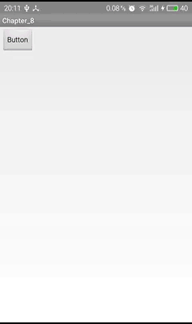

# Windows和WindowManager

来源：[Spark Yuan](http://sparkyuan.me/2016/03/11/Windows%E5%92%8CWindowManager/)

Window表示一个窗口的概念，在某些特殊的时候，比如你需要在桌面或者锁屏上显示一些类似悬浮窗的东西时候就需要用到Window。Window是一个抽象类，Window的实现类是PhoneWindow。Window的具体实现位于WindowManagerService中，WindowManager和WindowManagerService的交互是一个IPC过程。Android中所有的视图都是通过Window来呈现的，不管是Activity、Dialog还是Toast，他们的视图实际上都是附加在Window上的。

## 一个悬浮窗的例子

点击Button按钮，将一个ImageView添加到坐标为（100,300）的位置上，并且可以随手拖动的。



下面是这一段的源码，展示了如何使用WindowManager添加一个Window。

```
public class TestActivity extends Activity implements OnTouchListener {

    private static final String TAG = "TestActivity";

    private Button mCreateWindowButton;

    private ImageView mImageView;
    private WindowManager.LayoutParams mLayoutParams;
    private WindowManager mWindowManager;

    @Override
    protected void onCreate(Bundle savedInstanceState) {
        super.onCreate(savedInstanceState);
        setContentView(R.layout.activity_test);
        initView();
    }

    private void initView() {
        mCreateWindowButton = (Button) findViewById(R.id.button1);
        mWindowManager = (WindowManager) getSystemService(
        								Context.WINDOW_SERVICE);
    }

    public void onButtonClick(View v) {

        if (v == mCreateWindowButton) {
            mImageView = new ImageView(this);
            mImageView.setBackgroundResource(R.drawable.ic_launcher);
            mLayoutParams = new WindowManager.LayoutParams(
                    LayoutParams.WRAP_CONTENT, LayoutParams.WRAP_CONTENT,
                     0, 0,
                    PixelFormat.TRANSPARENT);
            mLayoutParams.flags = LayoutParams.FLAG_NOT_TOUCH_MODAL
                    | LayoutParams.FLAG_NOT_FOCUSABLE
                    | LayoutParams.FLAG_SHOW_WHEN_LOCKED;
            mLayoutParams.type = LayoutParams.TYPE_SYSTEM_ERROR;
            mLayoutParams.gravity = Gravity.TOP | Gravity.LEFT;
            mLayoutParams.x = 100;
            mLayoutParams.y = 300;
            mImageView.setOnTouchListener(this);
            mWindowManager.addView(mImageView, mLayoutParams);
        }
    }

    @Override
    public boolean onTouch(View v, MotionEvent event) {
        int rawX = (int) event.getRawX();
        int rawY = (int) event.getRawY();
        int x = (int) event.getX();
        int y = (int) event.getY();

        switch (event.getAction()) {
        case MotionEvent.ACTION_DOWN: {
            break;
        }
        case MotionEvent.ACTION_MOVE: {
            Log.d(TAG, "onTouch: rawX " + rawX);
            Log.d(TAG, "onTouch: rawY " + rawY);
            mLayoutParams.x = rawX;
            mLayoutParams.y = rawY;
            mWindowManager.updateViewLayout(mImageView, mLayoutParams);
            break;
        }
        case MotionEvent.ACTION_UP: {
            break;
        }
        default:
            break;
        }
        return false;
    }

    @Override
    protected void onDestroy() {
        try {
            mWindowManager.removeView(mImageView);
        } catch (IllegalArgumentException e) {
            e.printStackTrace();
        }
        super.onDestroy();
    }
}
```

## WindowManager.LayoutParams的Flag和Type

### FLAG

**FLAG_NOT_FOCUSABLE**，当前Window不获取焦点，也不接收各种输入事件，会同时启用FLAG_NOT_TOUCH_MODAL，事件会传递给下层具有焦点的Window。

**FLAG_NOT_TOUCH_MODAL**，当前Window区域外的单击事件传递给底层，区域内的单击事件自己处理，一般都需要开启。

**FLAG_SHOW_WHEN_LOCKED**，可以让Window显示在锁屏界面上。

### Type

Type表示Window的类型，有应用Window、子Window和系统Window。

应用Window，一般对应一个Activity。层级范围1～99。

子Window，不能单独存在，需要特定的父Window，比如一般的Dialog。层级范围1000～1999。

系统Window，需要权限声明，比如Toast。层级范围2000～2999。

一般可以选用WindowManager.LayoutParams.TYPE_SYSTEM_ERROR或者TYPE_SYSTEM_OVERLAY同时声明权限。使用WindowManager.LayoutParams.TYPE_SYSTEM_ERROR时，同时声明

## 注

Window并不实际存在，以View的形式存在。每个Window对应着一个View和ViewRootImpl，Window和View通过ViewRootImpl建立联系。所以在实际使用中其实我们并不能访问到真正的Window，而只能通过WindowManager。

WindowManager常用的三个功能：addView，updateViewLayout，removeView

别忘了onDestory()中的mWindowManager.removeView(mImageView)

