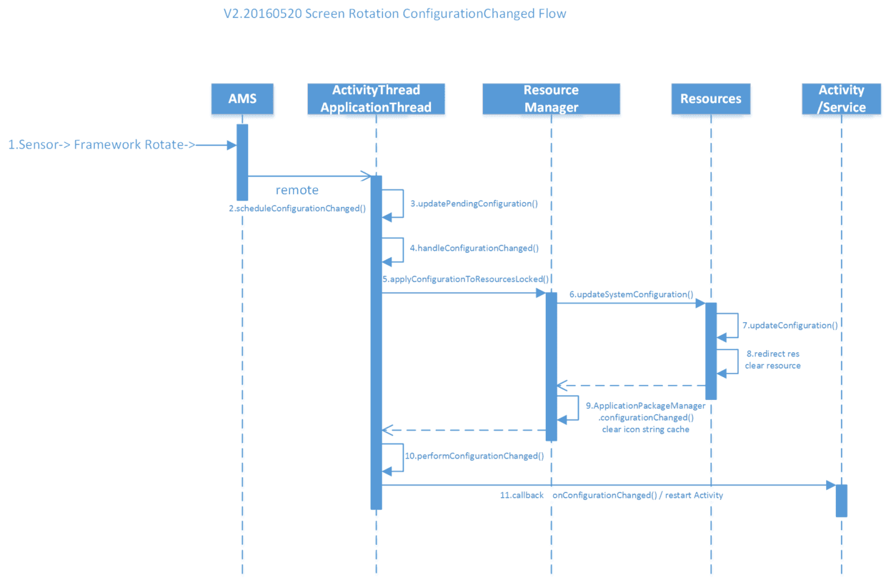

# ConfigurationChanged流程梳理(屏幕旋转、语言及字体切换)

来源:[七号大蒜 ](http://www.jianshu.com/p/e3f9de297370?plg_nld=1&plg_uin=1&plg_auth=1&plg_nld=1&plg_usr=1&plg_vkey=1&plg_dev=1)

前段时间做了关于系统字体切换的功能，其中涉及到较多ConfigurationChanged的流程。屏幕旋转、mcc、系统语言切换等均是通过该流程来实现的。

网上少有这方面的描述，故将该部分总结提炼出来做个小结。

以下以屏幕旋转为例。关于屏幕旋转对于Activity的生命周期的影响也在以下可以体现，如何处理屏幕旋转对Act的影响也有启示作用。

## ConfigurationChange Flow

讲太多也不如一个图来得实在，下图也是整个ConfigurationChange通用流程的概括，该流程是基于Android 5.1 和6.0画出，kk版本应该也是差不多的



## 流程跟踪

下面是对屏幕旋转的事件跟踪，尽量干货.

注：有序列表标号代表对应上图中的时序节点

### 1.屏幕旋转事件上传

G-Sensor将旋转事件由底层上传到FW处理，改变Configuration中orientation的值并将事件继续上传：

Configuration中对屏幕方向的定义：

```
    /**
     * Overall orientation of the screen.  May be one of
     * {@link #ORIENTATION_LANDSCAPE}, {@link #ORIENTATION_PORTRAIT}.
     */
    public int orientation;
```

调用`ActivityManagerNative.getDefault().updatePersistentConfiguration(newConfig)`将事件上传

### 2.ActivityManagerNative中使用远程代理通过Binder调用AMS的同名方法updatePersistentConfiguration

（远程代理这块不作深入了解）

```
public void updatePersistentConfiguration(Configuration values) 
   		throws RemoteException{
        Parcel data = Parcel.obtain();
        Parcel reply = Parcel.obtain();
        data.writeInterfaceToken(IActivityManager.descriptor);
        values.writeToParcel(data, 0);
        mRemote.transact(UPDATE_PERSISTENT_CONFIGURATION_TRANSACTION, 
        				data, reply, 0);
        reply.readException();
        data.recycle();
        reply.recycle();
    }
```

然后在AMS中，遍历每一个最近运行的程序，同步顺序执行以下方法

```
    /**
     * Do either or both things: (1) change the current configuration, and (2)
     * make sure the given activity is running with the (now) current
     * configuration.  Returns true if the activity has been left running, or
     * false if <var>starting</var> is being destroyed to match the new
     * configuration.
     * @param persistent TODO
     */
boolean updateConfigurationLocked(Configuration values, 
			ActivityRecord starting, 
			boolean persistent, 
			boolean initLocale) {
    ...
    mSystemThread.applyConfigurationToResources(configCopy);
    for (int i=mLruProcesses.size()-1; i>=0; i--) {
        ProcessRecord app = mLruProcesses.get(i);
        try {
              if (app.thread != null) {
                  if (DEBUG_CONFIGURATION) Slog.v(TAG, 
                  			"Sending to proc " + app.processName + 
                  			" new config " + mConfiguration);
                  app.thread.scheduleConfigurationChanged(configCopy);
             }
         } catch (Exception e) {
         }
    }
    ...
}
```

### 3.通过代理对每个进程上传事件

得到远程服务对象在`ActivityManagerService`在本地的代理，最终调用了AMS的`updateConfiguration()`来更新系统`Configuration`。

其中`scheduleConfigurationChanged()`实际是通过Binder远程调用(该过程同步)`ActivityThread`中的同名方法//咳咳：

```
public final void scheduleConfigurationChanged(Configuration config)
        throws RemoteException {
    Parcel data = Parcel.obtain();
    data.writeInterfaceToken(IApplicationThread.descriptor);
    config.writeToParcel(data, 0);
    mRemote.transact(SCHEDULE_CONFIGURATION_CHANGED_TRANSACTION, 
    			data, null,
            IBinder.FLAG_ONEWAY);
    data.recycle();
}

public void scheduleConfigurationChanged(Configuration config) {
    updatePendingConfiguration(config);
    sendMessage(H.CONFIGURATION_CHANGED, config);
}
```

### 4.每个进程进行事件响应

将该进程下执行对应**CONFIGURATION_CHANGED**处理：

```
final void handleConfigurationChanged(Configuration config, 
			CompatibilityInfo compat) {
    ...

    mResourcesManager.applyConfigurationToResourcesLocked(config, compat);         
    ...

    configDiff = mConfiguration.diff(config);
    mConfiguration.updateFrom(config);
    config = applyCompatConfiguration(mCurDefaultDisplayDpi);
    ArrayList<ComponentCallbacks2> callbacks = 
    				collectComponentCallbacks(false, config);
    freeTextLayoutCachesIfNeeded(configDiff);

    if (callbacks != null) {
        final int N = callbacks.size();
        for (int i=0; i<N; i++) {
            performConfigurationChanged(callbacks.get(i), config);
        }
    }
}
```

### 5.更新资源

Reload New Resources: 将Config应用到Resource的一系列操作。

```
public final boolean applyConfigurationToResourcesLocked(
			Configuration config,
        	CompatibilityInfo compat) {
    ... //对Configuration的比较以及更新到Resource      

    Resources.updateSystemConfiguration(config, defaultDisplayMetrics, compat);

    ApplicationPackageManager.configurationChanged();//清空Icon和String缓存

    Configuration tmpConfig = null;

    for (int i=mActiveResources.size()-1; i>=0; i--) {
        ResourcesKey key = mActiveResources.keyAt(i);
        Resources r = mActiveResources.valueAt(i).get();
        if (r != null) {
            ...//更新Resource的Config

        } else {
            //Slog.i(TAG, "Removing old resources " + v.getKey());
            mActiveResources.removeAt(i);
        }
    }
    return changes != 0;
}
```

### 7.8.更新资源Res

在Resource中更新资源，在重新加载时就会使用新的资源

```
public void updateConfiguration(Configuration config, 
				DisplayMetrics metrics, CompatibilityInfo compat) {
    synchronized (mAccessLock) {
        ... 
        //更新Resource指向
        //{@kth add 20151127 start
        //像字体大小切换、语言切换等都会在此处开始更新资源的指向
        //kth add 20151127 end@}
        ...
        //清空drawable资源
        clearDrawableCachesLocked(mDrawableCache, configChanges);
        clearDrawableCachesLocked(mColorDrawableCache, configChanges);
        mAnimatorCache.onConfigurationChange(configChanges);
        mStateListAnimatorCache.onConfigurationChange(configChanges);

        mColorStateListCache.clear();
        flushLayoutCache();
    }
    ...
}
```

### 10.回调反馈

当Configuration的操作执行完后，实现了ComponentCallbacks2接口的组件如Activity、Services、Application等将会执行回调onConfigurationChanged()方法(接口回调)，从而实现正在运行的app中所有组件对Config的更新响应。针对屏幕旋转更新前台显示，其他Configuration如字体、语言等需要通知所有。

该方法针对同一进程下Activity的状态进行甄别，将符合条件的Act放入list以方便后面操作.。

```
private static void performConfigurationChanged(
				ComponentCallbacks2 cb, Configuration config) {
    // Only for Activity objects, check that they actually call up to their
    // superclass implementation.ComponentCallbacks2 is an interface, so
    // we check the runtime type and act accordingly.
    Activity activity = (cb instanceof Activity) ? (Activity) cb : null;
    ...
    boolean shouldChangeConfig = false;
    if ((activity == null) || (activity.mCurrentConfig == null)) {
        shouldChangeConfig = true;
    } else {
        // If the new config is the same as the config this Activity
        // is already running with then don't bother calling
        // onConfigurationChanged
        int diff = activity.mCurrentConfig.diff(config);
        if (diff != 0) {
            // If this activity doesn't handle any of the config changes
            // then don't bother calling onConfigurationChanged as we're
            // going to destroy it.
            if ((~activity.mActivityInfo.getRealConfigChanged() & diff) == 0) {
                shouldChangeConfig = true;
            }
        }
    }
    ...
    if (shouldChangeConfig) {
        cb.onConfigurationChanged(config);
        if (activity != null) {
            ...
            activity.mCurrentConfig = new Configuration(config);
        }
    }
}
```

Activity、Service、Application、Provider同样实现了ComponentCallbacks接口，从而实现四大组件全部更新状态和资源

```
   ArrayList<ComponentCallbacks2> collectComponentCallbacks(
   			boolean allActivities,
   			 Configuration newConfig) {
        ArrayList<ComponentCallbacks2> callbacks= 
        			new ArrayList<ComponentCallbacks2>(); 

        synchronized (mResourcesManager) {
            final int NAPP = mAllApplications.size();// Application
            for (int i=0; i<NAPP; i++) {
                callbacks.add(mAllApplications.get(i));
            }
            final int NACT = mActivities.size();// Activity
            for (int i=0; i<NACT; i++) {
                ActivityClientRecord ar = mActivities.valueAt(i);
                Activity a = ar.activity;
                if (a != null) {
                    Configuration thisConfig = applyConfigCompatMainThread(
                            mCurDefaultDisplayDpi, newConfig,
                            ar.packageInfo.getCompatibilityInfo());
                    if (!ar.activity.mFinished && (allActivities 
                    				|| !ar.paused)) {
                        // If the activity is currently resumed, 
                        // its configuration
                        // needs to change right now.
                        callbacks.add(a);
                    } else if (thisConfig != null) {
                        // Otherwise, we will tell it about the change
                        // the next time it is resumed or shown.  Note that
                        // the activity manager may, before then, decide the
                        // activity needs to be destroyed to handle its new
                        // configuration.
                        if (DEBUG_CONFIGURATION) {
                            Slog.v(TAG, "Setting activity " + 
                            	ar.activityInfo.name + 
                            	" newConfig=" + thisConfig);
                        }
                        ar.newConfig = thisConfig;
                    }
                }
            }
            final int NSVC = mServices.size();// Service
            for (int i=0; i<NSVC; i++) {
                callbacks.add(mServices.valueAt(i));
            }
        }
        synchronized (mProviderMap) {
            final int NPRV = mLocalProviders.size();// Provider
            for (int i=0; i<NPRV; i++) {
                callbacks.add(mLocalProviders.valueAt(i).mLocalProvider);
            }
        }
        return callbacks;
    }
```

### 11.四大组件事件响应

如果在manifest.xml中配置了configChnages属性则表示由app自己来处理configuration change，就会回调Activity等组件的onConfigurationChanged方法。否则就重启当前这个activity（这个重启步骤位于当activity回到前台时执行onDestroy->onStart->onResume），而重启之前，旧的resources已经被清空, 那么就会装载新的资源。对于未启动的应用则会在启动时加载新的资源。参考如下：

```
/**
 * Called by the system when the device configuration changes while your
 * activity is running.  Note that this will <em>only</em> be called if
 * you have selected configurations you would like to handle with the
 * {@link android.R.attr#configChanges} attribute in your manifest.  If
 * any configuration change occurs that is not selected to be reported
 * by that attribute, then instead of reporting it the system will stop
 * and restart the activity (to have it launched with the new
 * configuration).
 *
 * <p>At the time that this function has been called, your Resources
 * object will have been updated to return resource values matching the
 * new configuration.
 *
 * @param newConfig The new device configuration.
 */
```

顺道贴下ConfigurationChanged时Act的生命周期以便理解：

```
01-02 18:01:44.039 11305 11305 E MainActivity: onPause
01-02 18:01:44.040 11305 11305 E MainActivity: onSaveInstanceState
01-02 18:01:44.040 11305 11305 E MainActivity: onStop

01-02 18:01:44.040 11305 11305 E MainActivity: onDestroy
01-02 18:01:44.063 11305 11305 E MainActivity: onStart
01-02 18:01:44.064 11305 11305 E MainActivity: onRestoreInstanceState
01-02 18:01:44.064 11305 11305 E MainActivity: onResume
```

## 小结
以上就是Configuration时间的流程梳理,好记性不如烂笔头。主要是流程时序图麻烦，从自己知道到写下来中间也来回经历好些个小时翻源码。

记录以供需要的人参考。

Fucking The Source Code

附上参考过的csdn链接

[七号大蒜](http://blog.csdn.net/kong92917)<br/>
[android源码分析(一) - 语言切换机制](http://blog.csdn.net/wqhjfree/article/details/8244520)

谢捧场，如有疏漏谬误还请指正

[vito的专栏 - 博客频道 - CSDN.NET](http://blog.csdn.net/kong92917)
