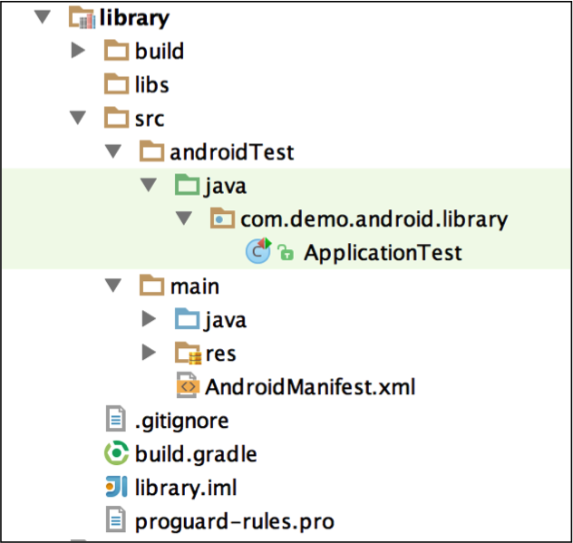
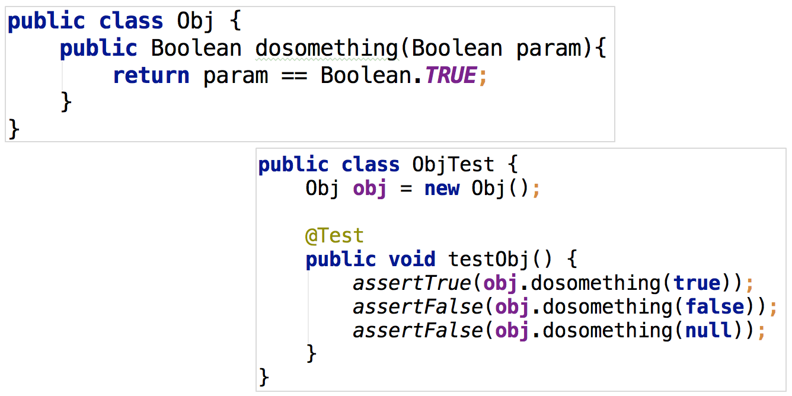
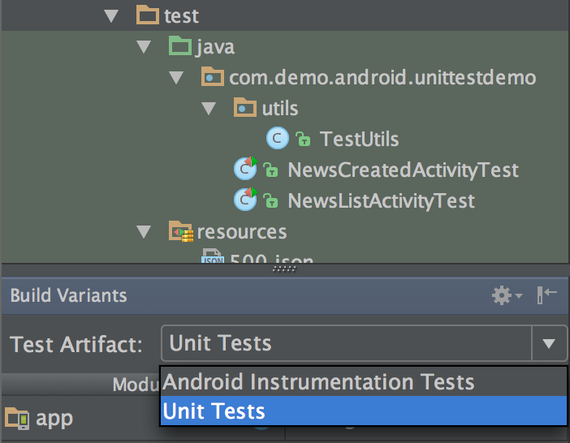
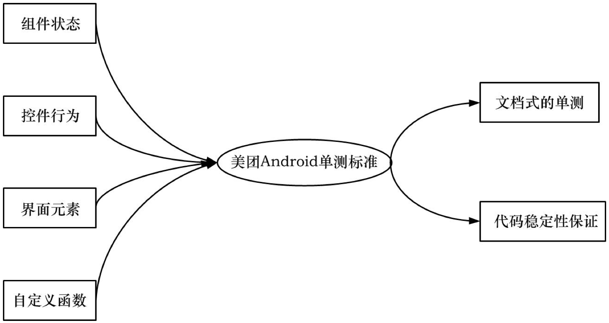
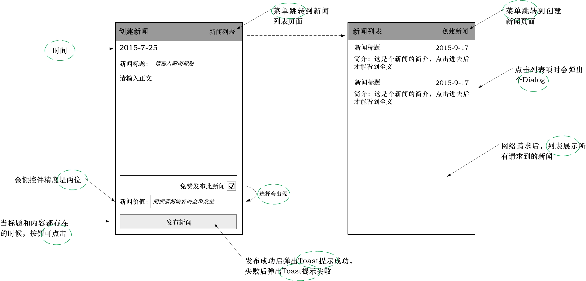
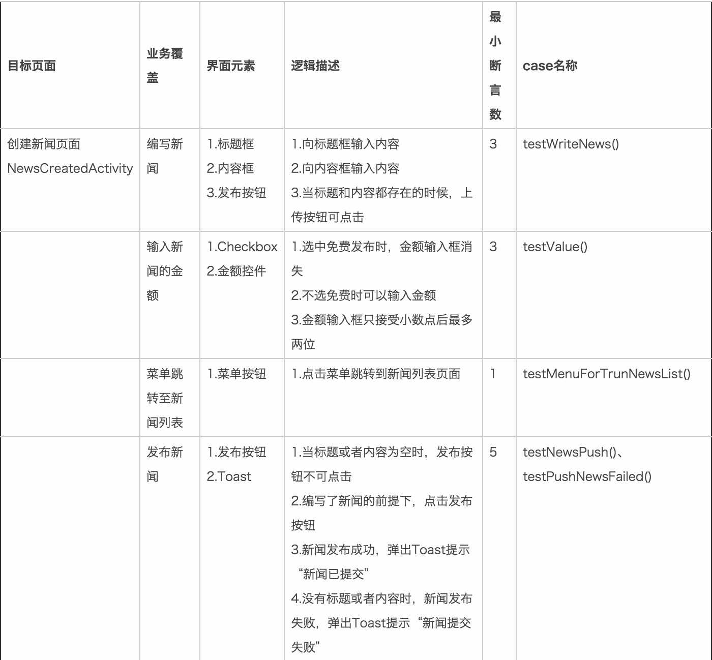

# Android单元测试研究与实践

来源:[美团技术团队](http://tech.meituan.com/Android_unit_test.html)

## Android单元测试介绍

处于高速迭代开发中的Android项目往往需要除黑盒测试外更加可靠的质量保障，这正是单元测试的用武之地。单元测试周期性对项目进行函数级别的测试，在良好的覆盖率下，能够持续维护代码逻辑，从而支持项目从容应对快速的版本更新。

单元测试是参与项目开发的工程师在项目代码之外建立的白盒测试工程，用于执行项目中的目标函数并验证其状态或者结果，其中，单元指的是测试的最小模块，通常指函数。如图1所示的绿色文件夹即是单元测试工程。这些代码能够检测目标代码的正确性，打包时单元测试的代码不会被编译进入APK中。



与Java单元测试相同，Android单元测试也是维护代码逻辑的白盒工程，但由于Android运行环境的不同，Android单元测试的环境配置以及实施流程均有所不同。

## Java单元测试

在传统Java单元测试中，我们需要针对每个函数进行设计单元测试用例。如图2便是一个典型的单元测试的用例。



上述示例中，针对函数dosomething(Boolean param)的每个分支，我们都需要构造相应的参数并验证结果。单元测试的目标函数主要有三种：

* 有明确的返回值，如上图的dosomething(Boolean param)，做单元测试时，只需调用这个函数，然后验证函数的返回值是否符合预期结果。
* 这个函数只改变其对象内部的一些属性或者状态，函数本身没有返回值，就验证它所改变的属性和状态。
* 一些函数没有返回值，也没有直接改变哪个值的状态，这就需要验证其行为，比如点击事件。

既没有返回值，也没有改变状态，又没有触发行为的函数是不可测试的，在项目中不应该存在。当存在同时具备上述多种特性时，本文建议采用多个case来真对每一种特性逐一验证，或者采用一个case，逐一执行目标函数并验证其影响。

构造用例的原则是测试用例与函数一对一，实现条件覆盖与路径覆盖。Java单元测试中，良好的单元测试是需要保证所有函数执行正确的，即所有边界条件都验证过，一个用例只测一个函数，便于维护。在Android单元测试中，并不要求对所有函数都覆盖到，像Android SDK中的函数回调则不用测试。

## Android单元测试
在Android中，单元测试的本质依旧是验证函数的功能，测试框架也是JUnit。在Java中，编写代码面对的只有类、对象、函数，编写单元测试时可以在测试工程中创建一个对象出来然后执行其函数进行测试，而在Android中，编写代码需要面对的是组件、控件、生命周期、异步任务、消息传递等，虽然本质是SDK主动执行了一些实例的函数，但创建一个Activity并不能让它执行到resume的状态，因此需要JUnit之外的框架支持。

当前主流的单元测试框架AndroidTest和Robolectric，前者需要运行在Android环境上，后者可以直接运行在JVM上，速度也更快，可以直接由Jenkins周期性执行，无需准备Android环境。因此我们的单元测试基于Robolectric。对于一些测试对象依赖度较高而需要解除依赖的场景，我们可以借助Mock框架。

## Android单元测试环境配置
### Robolectric环境配置
Android单元测试依旧需要JUnit框架的支持，Robolectric只是提供了Android代码的运行环境。如果使用Robolectric 3.0，依赖配置如下：

```
testCompile 'junit:junit:4.10'
testCompile 'org.robolectric:robolectric:3.0'
```

Gradle对Robolectric 2.4的支持并不像3.0这样好，但Robolectric 2.4所有的测试框架均在一个包里，另外参考资料也比较丰富，作者更习惯使用2.4。如果使用Robolectric 2.4，则需要如下配置：

```
classpath 'org.robolectric:robolectric-gradle-plugin:0.14.+'//这行配置在buildscript的dependencies中
apply plugin: 'robolectric'
androidTestCompile 'org.robolectric:robolectric:2.4'
```

上述配置中，本文将testCompile写成androidTest，并且常见的Android工程的单元测试目录名称有test也有androidTest，这两种写法并没有功能上的差别，只是Android单元测试Test Artifact不同而已。Test Artifact如图3所示：



在Gradle插件中，这两种Artifact执行的Task还是有些区别的，但是并不影响单元测试的写法与效果。虽然可以主动配置单元测试的项目路径，本文依旧建议采用与Test Artifact对应的项目路径和配置写法。

### Mock配置

如果要测试的目标对象依赖关系较多，需要解除依赖关系，以免测试用例过于复杂，用Robolectric的Shadow是个办法，但是推荐更加简单的Mock框架，比如Mockito，该框架可以模拟出对象来，而且本身提供了一些验证函数执行的功能。Mockito配置如下：

```
repositories {
    jcenter()
}
dependencies {
    testCompile "org.mockito:mockito-core:1.+"
}
```

## Robolectric使用介绍
### Robolectric单元测试编写结构

单元测试代码写在项目的test（也可能是androidTest，该目录在项目中会呈浅绿色）目录下。单元测试也是一个标准的Java工程，以类为文件单位编写，执行的最小单位是函数，测试用例（以下简称case）是带有@Test注解的函数，单元测试里面带有case的类由Robolectric框架执行，需要为该类添加注解@RunWith(RobolectricTestRunner.class)。基于Robolectric的代码结构如下：

```
//省略一堆import
@RunWith(RobolectricTestRunner.class)
public class MainActivityTest {
    @Before
    public void setUp() {
        //执行初始化的操作
    }
    @Test
    public void testCase() {
        //执行各种测试逻辑判断
    }
}
```

上述结构中，带有@Before注解的函数在该类实例化后，会立即执行，通常用于执行一些初始化的操作，比如构造网络请求和构造Activity。带有@test注解的是单元测试的case，由Robolectric执行，这些case本身也是函数，可以在其他函数中调用，因此，case也是可以复用的。每个case都是独立的，case不会互相影响，即便是相互调用也不会存在多线程干扰的问题。

### 常见Robolectric用法

Robolectric支持单元测试范围从Activity的跳转、Activity展示View（包括菜单）和Fragment到View的点击触摸以及事件响应，同时Robolectric也能测试Toast和Dialog。对于需要网络请求数据的测试，Robolectric可以模拟网络请求的response。对于一些Robolectric不能测试的对象，比如ConcurrentTask，可以通过自定义Shadow的方式现实测试。下面将着重介绍Robolectric的常见用法。

#### Robolectric 2.4模拟网络请求
由于商业App的多数Activity界面数据都是通过网络请求获取，因为网络请求是大多数App首要处理的模块，测试依赖网络数据的Activity时，可以在@Before标记的函数中准备网络数据，进行网络请求的模拟。准备网络请求的代码如下：

```
public void prepareHttpResponse(String filePath) throws IOException {
        String netData = FileUtils.readFileToString(FileUtils.
            toFile(getClass().getResource(filePath)), HTTP.UTF_8);
        Robolectric.setDefaultHttpResponse(200, netData);
}//代码适用于Robolectric 2.4，3.0需要注意网络请求的包的位置
```

由于Robolectric 2.4并不会发送网络请求，因此需要本地创建网络请求所返回的数据，上述函数的filePath便是本地数据的文件的路径，setDefaultHttpResponse()则创建了该请求的Response。上述函数执行后，单元测试工程便拥有了与本地数据数据对应的网络请求，在这个函数执行后展示的Activity便是有数据的Activity。

在Robolectric 3.0环境下，单元测试可以发真的请求，并且能够请求到数据，本文依旧建议采用mock的办法构造网络请求，而不要依赖网络环境。
#### Activity展示测试与跳转测试

创建网络请求后，便可以测试Activity了。测试代码如下：

```
@Test
public void testSampleActivity(){
    SampleActivity sampleActivity＝Robolectric.buildActivity(SampleActivity.class).
                create().resume().get();
    assertNotNull(sampleActivity);
    assertEquals("Activity的标题", sampleActivity.getTitle());
}
```

Robolectric.buildActivity()用于构造Activity，create()函数执行后，该Activity会运行到onCreate周期，resume()则对应onResume周期。assertNotNull和assertEquals是JUnit中的断言，Robolectric只提供运行环境，逻辑判断还是需要依赖JUnit中的断言。

Activity跳转是Android开发的重要逻辑，其测试方法如下：

```
@Test
public void testActivityTurn(ActionBarActivity firstActivity, Class secondActivity) {
    Intent intent = new Intent(firstActivity.getApplicationContext(), secondActivity);
    assertEquals(intent, Robolectric.shadowOf(firstActivity).getNextStartedActivity());//3.0的API与2.4不同
}
```

#### Fragment展示与切换

Fragment是Activity的一部分，在Robolectric模拟执行Activity过程中，如果触发了被测试的代码中的Fragment添加逻辑，Fragment会被添加到Activity中。

需要注意Fragment出现的时机，如果目标Activity中的Fragment的添加是执行在onResume阶段，在Activity被Robolectric执行resume()阶段前，该Activity中并不会出现该Fragment。采用Robolectric主动添加Fragment的方法如下：

```
@Test
public void addfragment(Activity activity, int fragmentContent){
    FragmentTestUtil.startFragment(activity.getSupportFragmentManager().findFragmentById(fragmentContent));
    Fragment fragment = activity.getSupportFragmentManager().findFragmentById(fragmentContent);
    assertNotNull(fragment);
}
```

startFragment()函数的主体便是常用的添加fragment的代码。切换一个Fragment往往由Activity中的代码逻辑完成，需要Activity的引用。

#### 控件的点击以及可视验证

```
@Test
public void testButtonClick(int buttonID){
    Button submitButton = (Button) activity.findViewById(buttonID);
    assertTrue(submitButton.isEnabled());
    submitButton.performClick();
    //验证控件的行为
}
```

对控件的点击验证是调用performClick()，然后断言验证其行为。对于ListView这类涉及到Adapter的控件的点击验证，写法如下：

```
//listView被展示之后
listView.performItemClick(listView.getAdapter().getView(position, null, null), 0, 0);
```

与button等控件稍有不同。

#### Dialog和Toast测试

测试Dialog和Toast的方法如下：

```
public void testDialog(){
    Dialog dialog = ShadowDialog.getLatestDialog();
    assertNotNull(dialog);
}
public void testToast(String toastContent){
    ShadowHandler.idleMainLooper();
    assertEquals(toastContent, ShadowToast.getTextOfLatestToast());
}
```

上述函数均需要在Dialog或Toast产生之后执行，能够测试Dialog和Toast是否弹出。

### Shadow写法介绍

Robolectric的本质是在Java运行环境下，采用Shadow的方式对Android中的组件进行模拟测试，从而实现Android单元测试。对于一些Robolectirc暂不支持的组件，可以采用自定义Shadow的方式扩展Robolectric的功能。

```
@Implements(Point.class)
public class ShadowPoint {
  @RealObject private Point realPoint;
  ...
  public void __constructor__(int x, int y) {
    realPoint.x = x;
    realPoint.y = y;
  }
}//样例来源于Robolectric官网
```

上述实例中，@Implements是声明Shadow的对象，@RealObject是获取一个Android 对象，constructor则是该Shadow的构造函数，Shadow还可以修改一些函数的功能，只需要在重载该函数的时候添加@Implementation，这种方式可以有效扩展Robolectric的功能。

Shadow是通过对真实的Android对象进行函数重载、初始化等方式对Android对象进行扩展，Shadow出来的对象的功能接近Android对象，可以看成是对Android对象一种修复。自定义的Shadow需要在config中声明，声明写法是`@Config(shadows=ShadowPoint.class)。`

### Mock写法介绍

对于一些依赖关系复杂的测试对象，可以采用Mock框架解除依赖，常用的有Mockito。例如Mock一个List类型的对象实例，可以采用如下方式：

```
List list = mock(List.class);   //mock得到一个对象，也可以用@mock注入一个对象
```

所得到的list对象实例便是List类型的实例，如果不采用mock，List其实只是个接口，我们需要构造或者借助ArrayList才能进行实例化。与Shadow不同，Mock构造的是一个虚拟的对象，用于解耦真实对象所需要的依赖。Mock得到的对象仅仅是具备测试对象的类型，并不是真实的对象，也就是并没有执行过真实对象的逻辑。

Mock也具备一些补充JUnit的验证函数，比如设置函数的执行结果，示例如下：

```
When(sample.dosomething()).thenReturn(someAction);//when(一个函数执行).thenReturn(一个可替代真实函数的结果的返回值);
//上述代码是设置sample.dosomething()的返回值，当执行了sample.dosomething()这个函数时，就会得到someAction，从而解除了对真实的sample.dosomething()函数的依赖
```

上述代码为被测函数定义一个可替代真实函数的结果的返回值。当使用这个函数后，这个可验证的结果便会产生影响，从而代替函数的真实结果，这样便解除了对真实函数的依赖。

同时Mock框架也可以验证函数的执行次数，代码如下：

```
List list = mock(List.class);   //Mock得到一个对象
list.add(1);                    //执行一个函数
verify(list).add(1);            //验证这个函数的执行
verify(list,time(3)).add(1);    //验证这个函数的执行次数
```

在一些需要解除网络依赖的场景中，多使用Mock。比如对retrofit框架的网络依赖解除如下：

```
//代码参考了参考文献[3]
public class MockClient implements Client {
    @Override
    public Response execute(Request request) throws IOException {
        Uri uri = Uri.parse(request.getUrl());
        String responseString = "";
        if(uri.getPath().equals("/path/of/interest")) {
            responseString = "返回的json1";//这里是设置返回值
        } else {
            responseString = "返回的json2";
        }
        return new Response(request.getUrl(), 200, "nothing", Collections.EMPTY_LIST, new TypedByteArray("application/json", responseString.getBytes()));
    }
}
//MockClient使用方式如下：
RestAdapter.Builder builder = new RestAdapter.Builder();
builder.setClient(new MockClient());
```

这种方式下retrofit的response可以由单元测试编写者设置，而不来源于网络，从而解除了对网络环境的依赖。

## 在实际项目中使用Robolectric构建单元测试

### 单元测试的范围

在Android项目中，单元测试的对象是组件状态、控件行为、界面元素和自定义函数。本文并不推荐对每个函数进行一对一的测试，像onStart()、onDestroy()这些周期函数并不需要全部覆盖到。商业项目多采用Scrum模式，要求快速迭代，有时候未必有较多的时间写单元测试，不再要求逐个函数写单元测试。

本文单元测试的case多来源于一个简短的业务逻辑，单元测试case需要对这段业务逻辑进行验证。在验证的过程中，开发人员可以深度了解业务流程，同时新人来了看一下项目单元测试就知道哪个逻辑跑了多少函数，需要注意哪些边界——是的，单元测试需要像文档一样具备业务指导能力。

在大型项目中，遇到需要改动基类中代码的需求时，往往不能准确快速地知道改动后的影响范围，紧急时多采用创建子类覆盖父类函数的办法，但这不是长久之计，在足够覆盖率的单元测试支持下，跑一下单元测试就知道某个函数改动后的影响，可以放心地修改基类。

美团的Android单元测试编写流程如图4所示。



单元测试最终需要输出文档式的单元测试代码，为线上代码提供良好的代码稳定性保证。

### 单元测试的流程

实际项目中，单元测试对象与页面是一对一的，并不建议跨页面，这样的单元测试藕合度太大，维护困难。单元测试需要找到页面的入口，分析项目页面中的元素、业务逻辑，这里的逻辑不仅仅包括界面元素的展示以及控件组件的行为，还包括代码的处理逻辑。然后可以创建单元测试case列表（列表用于纪录项目中单元测试的范围，便于单元测试的管理以及新人了解业务流程），列表中记录单元测试对象的页面，对象中的case逻辑以及名称等。工程师可以根据这个列表开始写单元测试代码。

单元测试是工程师代码级别的质量保证工程，上述流程并不能完全覆盖重要的业务逻辑以及边界条件，因此，需要写完后，看覆盖率，找出单元测试中没有覆盖到的函数分支条件等，然后继续补充单元测试case列表，并在单元测试工程代码中补上case。

直到规划的页面中所有逻辑的重要分支、边界条件都被覆盖，该项目的单元测试结束。单元测试流程如图5所示。


上述分析页面入口所得到结果便是@Before标记的函数中的代码，之后的循环便是所有的case（@Test标记的函数）。

## 单元测试项目实践

为了系统的介绍单元测试的实施过程，本文创建了一个小型的demo项目作为测试对象。demo的功能是供用户发布所见的新闻到服务端，并浏览所有已经发表的新闻，是个典型的自媒体应用。该demo的开发和测试涉及到TextView、EditView、ListView、Button以及自定义View，包含了网络请求、多线程、异步任务以及界面跳转等。能够为多数商业项目提供参照样例。项目页面如图6所示。



首先需要分析App的每个页面，针对页面提取出简短的业务逻辑，提取出的业务逻辑如图6绿色圈图所示。根据这些逻辑来设计单元测试的case（带有@Test注解的那个函数），这里的业务逻辑不仅指需求中的业务，还包括其他需要维护的代码逻辑。业务流程不允许跨页面，以免增加单元测试case的维护成本。针对demo中界面的单元测试case设计如下：

表1 单元测试case列表



接下来需要在单元测试工程中实现上述case，最小断言数是业务逻辑上的判断，并不是代码的边界条件，真实的case需要考虑代码的边界条件，比如数组为空等条件，因此，最终的断言数量会大于等于最小断言数。在需求业务上，最小断言数也是该需求的业务条件。

写完case后需要跑一遍单元测试并检查覆盖率报告，当覆盖率报告中缺少有些单元测试case列表中没有但是实际逻辑中会有的逻辑时，需要更新单元测试case列表，添加遗漏的逻辑，并将对应的代码补上。直到所有需要维护的逻辑都被覆盖，该项目中的单元测试才算完成。单元测试并不是QA的黑盒测试，需要保证对代码逻辑的覆盖。

对表1分析，第一个页面的“发布新闻”的case可以直接调用“编写新闻”的case，以满足条件“2.编写了新闻的前提下，点击发布按钮”，在JUnit框架下，case（带@Test注解的那个函数）也是个函数，直接调用这个函数就不是case，和case是无关的，两者并不会相互影响，可以直接调用以减少重复代码。第二个页面不同于第一个，一进入就需要网络请求，后续业务都需要依赖这个网络请求，单元测试不应该对某一个条件过度耦合，因此，需要用mock解除耦合，直接mock出网络请求得到的数据，单独验证页面对数据的响应。

## 总结

单元测试并不是一个能直接产生回报的工程，它的运行以及覆盖率也不能直接提升代码质量，但其带来的代码控制力能够大幅度降低大规模协同开发的风险。现在的商业App开发都是大型团队协作开发，不断会有新人加入，无论新人是刚入行的应届生还是工作多年，在代码存在一定业务耦合度的时候，修改代码就有一定风险，可能会影响之前比较隐蔽的业务逻辑，或者是丢失曾经的补丁，如果有高覆盖率的单元测试工程，就能很快定位到新增代码对现有项目的影响，与QA验收不同，这种影响是代码级的。

在本文所设计的单元测试流程中，单元测试的case和具体页面的具体业务流程以及该业务的代码逻辑紧密联系，单元测试如同技术文档一般，能够体现出一个业务逻辑运行了多少函数，需要注意什么样的条件。这是一种新人了解业务流程、对业务进行代码级别融入的好办法，看一下以前的单元测试case，就能知道与该case对应的那个页面上的那个业务逻辑会执行多少函数，以及这些函数可能出现的结果。

## 参考文献
* [1] [http://robolectric.org](http://robolectric.org)
* [2] [https://github.com/square/okhttp/tree/master/mockwebserver](https://github.com/square/okhttp/tree/master/mockwebserver)
* [3] [http://stackoverflow.com/questions/17544751/square-retrofit-server-mock-for-testing](http://stackoverflow.com/questions/17544751/square-retrofit-server-mock-for-testing)
* [4] [https://en.wikipedia.org/wiki/Unit_testing](https://en.wikipedia.org/wiki/Unit_testing)


