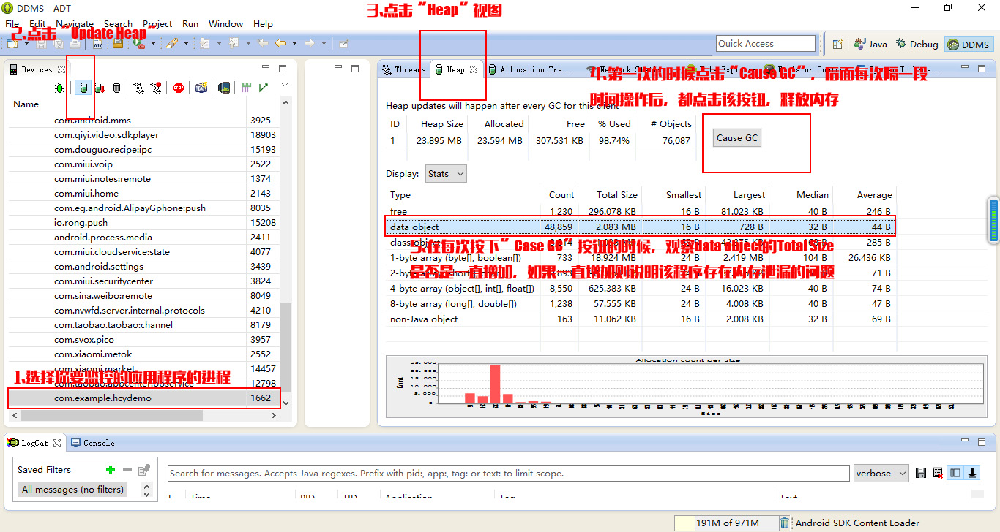
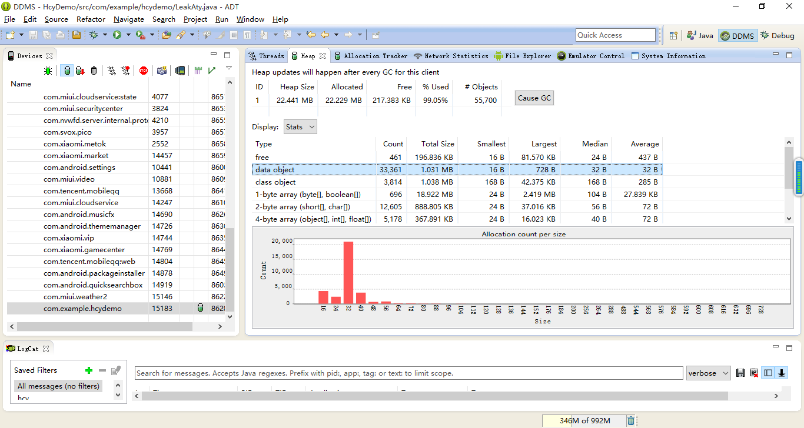
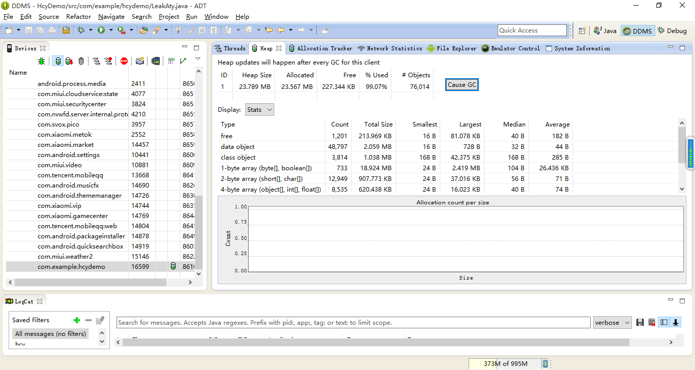
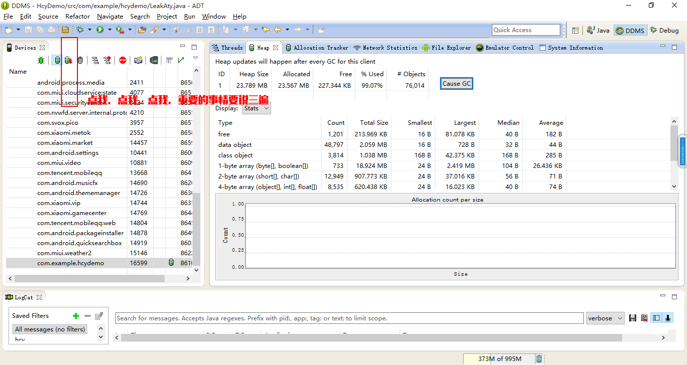
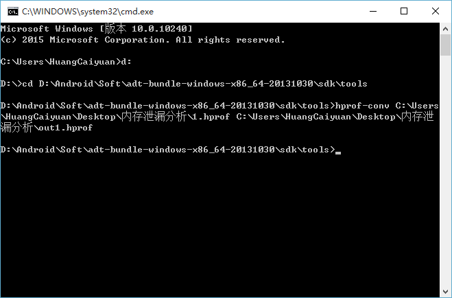
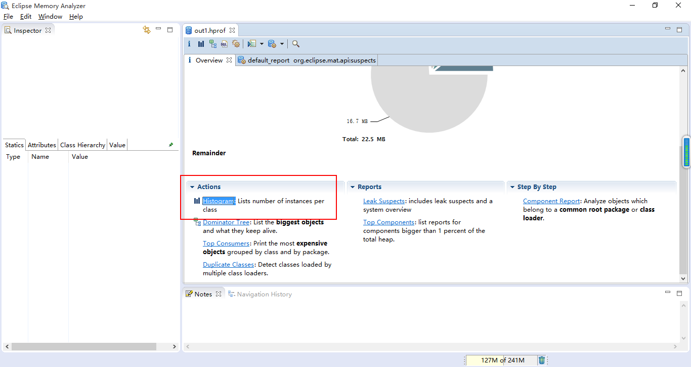
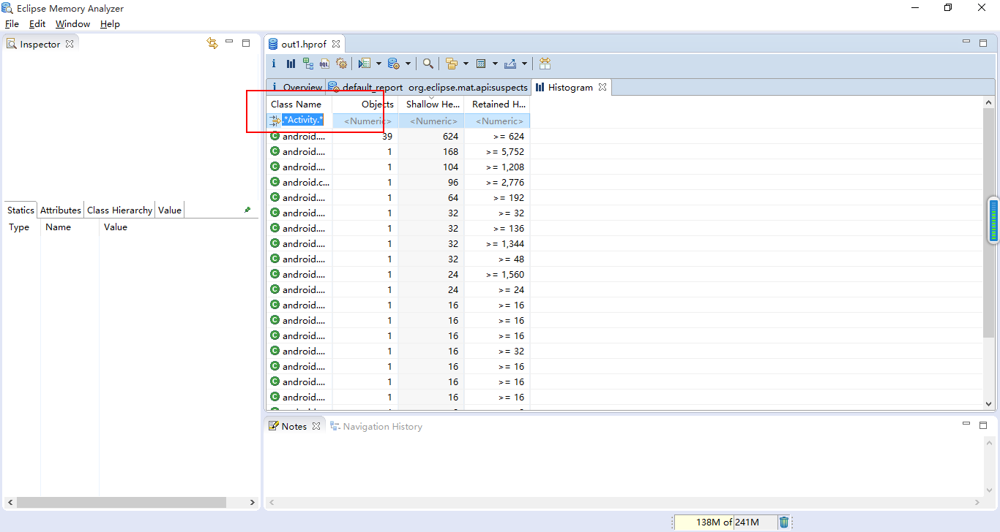
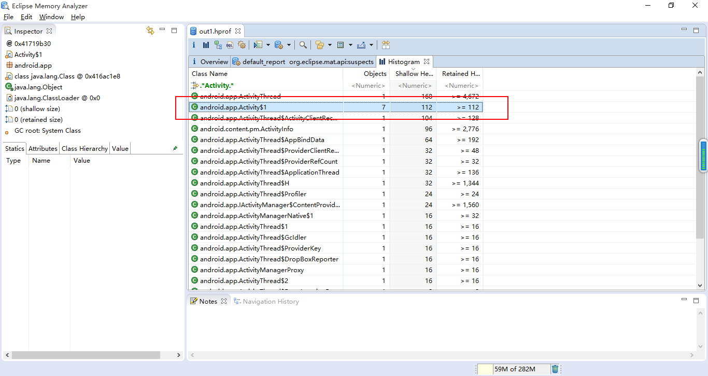
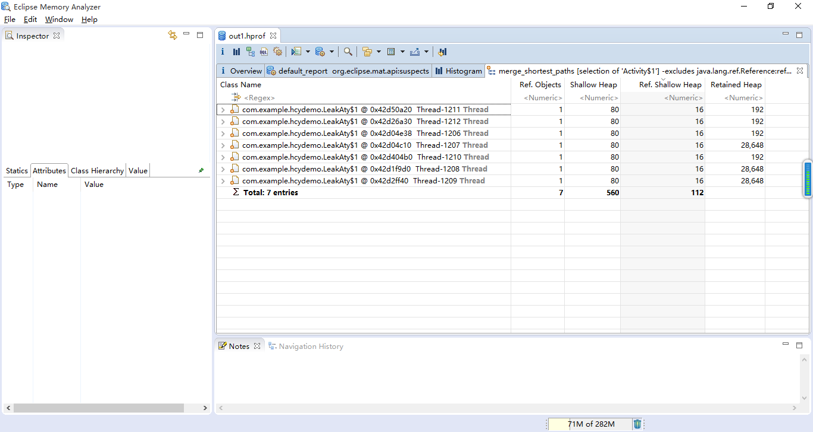

#  Android内存泄漏终极解决篇 上

来源:[Android内存泄漏终极解决篇 上](http://blog.csdn.net/huang_cai_yuan/article/details/50375019)

## 一、概述

Android内存的文章详见：[http://blog.csdn.net/linghu_java/article/details/39480761](http://blog.csdn.net/linghu_java/article/details/39480761)

在Android的开发中，经常听到“内存泄漏”这个词。“内存泄漏”就是一个对象已经不需要再使用了，但是因为其它的对象持有该对象的引用，导致它的内存不能被回收。“内存泄漏”的慢慢积累，最终会导致OOM的发生，千里之堤，毁于蚁穴。所以在写代码的过程中，应该要注意规避会导致“内存泄漏”的代码写法，提高软件的健壮性。 

本文将从发现问题、解决问题、总结问题的三个角度出发，循序渐进，彻底解决“内存泄漏”的问题。

## 二、内存泄漏的检查工具Heap

工欲善其事必先利其器，要检测“内存泄漏”的发生，需要借助DDMS中的Heap工具及MAT工具，Heap工具用于大致分析是否存在“内存泄漏”，而MAT工具则用于分析“内存泄漏”发生在哪里。

Heap工具的使用介绍 



具体操作 

* 1.在Devices设备列表中，找到你所在的设备，点击你想要监控的进程。 
* 2.点击“Update Heap”按钮更新堆内存的情况。 
* 3.点击“Heap”视图，查看内存的情况。 
* 4.每次在Activity的退出和进入的时候点击“Cause GC”，手动调用GC释放应用的内存。 
* 5.观察data oject那一行，每一次点击“Casue GC”的时候，观察Total Size的值，如果该值不断增加，则说明该应用程序存在“内存泄漏”。

我们先模拟一下内存泄漏，然后通过Heap工具来判断一下是否存在内存泄漏。 

上一段存在内存泄漏的代码：

```
public class LeakAty extends Activity {

    @Override
    protected void onCreate(Bundle savedInstanceState) {
        super.onCreate(savedInstanceState);
        setContentView(R.layout.aty_leak);
        testLeak();

    }

    /**
     * 测试内存泄漏的代码
     */
    private void testLeak() {
        new Thread(new Runnable() {

            @Override
            public void run() {
                while (true) {
                    try {
                        Thread.sleep(1000);
                    } catch (InterruptedException e) {
                        e.printStackTrace();
                    }
                }
            }
        }).start();
    }
}
```

上述的代码存在内存泄漏，new Runnable(){}是一个非静态的匿名内部类，所以它会强引用创建它的外围对象LeakAty，我们来测试一下内存泄漏的过程，开启手机的方向旋转功能，不断地旋转手机，让LeakAty不断地创建新的实例。理论上如果不存在上述泄漏的代码，之前的Activity会在onDestory之后被回收内存。而一旦存在上述泄漏的代码，新创建的Ruannale实例会一直处于运行状态，它不会被回收，而它强引用的LeakAty当然也不会被回收，所以在屏幕不断旋转，之前创建的LeakAty就不会被释放，会导致旋转n次，内存中就存在n+1个的LeakAty实例。 

Heap工具第一次按下Cause GC按钮的截图: 



上图的data object的Total Size的大小为1.031M。经过多次的旋转屏幕之后，我们再看一下截图 



Total Size变成了2.059M，从1.031M到2.059M，每次调用GC的过程中data object的总大小没有回落，所以可以证实上面的代码确实是存在内存泄漏的问题，那么泄漏发生在哪里？答案可以通过MAT工具来分析得到。

## 三、内存泄漏的分析工具MAT

要通过MAT分析，需要提供一个.hprof文件。我们可以通过”Dump HPROF file”按钮转存当前的堆内存信息。我们将其保存为1.hprof。 



导出的1.hprof的格式需要通过..\sdk\tools\目录下的hprof-conv.exe工具进行转换才能被MAT成功导入，我们将其转换成out1.hprof 



将out1.hprof导入到MAT工具中,File->Open Heap Dump… 


点击左边的标签Overview,Actions->Histogram[直方图]



在Histogram界面中，因为我们想要知道Activity是否泄漏了，所以输入关键词Activity,然后按下回车键。 



之后便可以得到Activity的相关的搜索结果,下图的搜索结果中Activity的实例有7个。点击选中下图标红色框框的地方，·右键->Merge Shortest Paths to GC Roots->exclude all phantom/weak/soft etc. references·。排除虚引用、弱引用、软引用的实例，剩下的都是强引用实例。 



从过滤出来的强引用的列表中，我们可以看到这七个实例都是被Thread所引用了。所以证实上面的代码确实存在内存泄漏。 



## 四、本文总结

内存泄漏检测可以使用Heap工具，内存分析可以使用MAT工具。本文的案例中提到了一种内存泄漏的情况，就是非静态内部类的对象会强引用其外围对象，一旦这个非静态内部类的实例没有释放，它的外围对象也不会释放，所以就会造成内存泄漏。下篇将具体探讨一下，在Android的开发过程中，哪些写法容易造成内存泄漏，该如何解决？请阅读[Android内存泄漏终极解决篇（下）](http://blog.csdn.net/Huang_Cai_Yuan/article/details/50443385)。

## 五、附件

MAT工具下载见：[MAT下载地址](http://download.csdn.net/detail/huang_cai_yuan/9377979)

-------
-------

# Android内存泄漏终极解决篇 下

来源:[Android内存泄漏终极解决篇 下](http://blog.csdn.net/huang_cai_yuan/article/details/50443385)

## 一、概述

在 [Android内存泄漏终极解决篇（上）](http://blog.csdn.net/huang_cai_yuan/article/details/50375019)中我们介绍了如何检查一个App是否存在内存泄漏的问题，本篇将总结典型的内存泄漏的代码，并给出对应的解决方案。内存泄漏的主要问题可以分为以下几种类型：

* 静态变量引起的内存泄漏
* 非静态内部类引起的内存泄漏
* 资源未关闭引起的内存泄漏

## 二、静态变量引起的内存泄漏

在java中静态变量的生命周期是在类加载时开始，类卸载时结束。换句话说，在android中其生命周期是在进程启动时开始，进程死亡时结束。所以在程序的运行期间，如果进程没有被杀死，静态变量就会一直存在，不会被回收掉。如果静态变量强引用了某个Activity中变量，那么这个Activity就同样也不会被释放,即便是该Activity执行了onDestroy(不要将执行onDestroy和被回收划等号)。这类问题的解决方案为：

* 1.寻找与该静态变量生命周期差不多的替代对象。
* 2.若找不到，将强引用方式改成弱引用。

比较典型的例子如下:

* 单例引起的Context内存泄漏

```
public class IMManager {
    private Context context;
    private static IMManager mInstance;

    public static IMManager getInstance(Context context) {
        if (mInstance == null) {
            synchronized (IMManager.class) {
                if (mInstance == null)
                    mInstance = new IMManager(context);
            }
        }
        return mInstance;
    }

    private IMManager(Context context) {
        this.context = context;
    }
}
```

当调用getInstance时，如果传入的context是Activity的context。只要这个单例没有被释放，这个Activity也不会被释放。

**解决方案**

传入Application的context,因为Application的context的生命周期比Activity长，可以理解为Application的context与单例的生命周期一样长，传入它是最合适的。

```
public class IMManager {
    private Context context;
    private static IMManager mInstance;

    public static IMManager getInstance(Context context) {
        if (mInstance == null) {
            synchronized (IMManager.class) {
                if (mInstance == null)
                    //将传入的context转换成Application的context
                    mInstance = new IMManager(context.getApplicationContext());
            }
        }
        return mInstance;
    }

    private IMManager(Context context) {
        this.context = context;
    }
}
```

## 三、非静态内部类引起的内存泄漏

在java中，创建一个非静态的内部类实例，就会引用它的外围实例。如果这个非静态内部类实例做了一些耗时的操作，就会造成外围对象不会被回收，从而导致内存泄漏。这类问题的解决方案为：

* 1.将内部类变成静态内部类
* 2.如果有强引用Activity中的属性，则将该属性的引用方式改为弱引用。
* 3.在业务允许的情况下，当Activity执行onDestory时，结束这些耗时任务。

* 内部线程造成的内存泄漏

```
public class LeakAty extends Activity {

    @Override
    protected void onCreate(Bundle savedInstanceState) {
        super.onCreate(savedInstanceState);
        setContentView(R.layout.aty_leak);
        test();
    }

    public void test() {
        //匿名内部类会引用其外围实例LeakAty.this,所以会导致内存泄漏
        new Thread(new Runnable() {

            @Override
            public void run() {
                while (true) {
                    try {
                        Thread.sleep(1000);
                    } catch (InterruptedException e) {
                        e.printStackTrace();
                    }
                }
            }
        }).start();
    }
}
```

**解决方案**

将非静态匿名内部类修改为静态匿名内部类

```
public class LeakAty extends Activity {

    @Override
    protected void onCreate(Bundle savedInstanceState) {
        super.onCreate(savedInstanceState);
        setContentView(R.layout.aty_leak);
        test();
    }
    //加上static，变成静态匿名内部类
    public static void test() {
        new Thread(new Runnable() {

            @Override
            public void run() {
                while (true) {
                    try {
                        Thread.sleep(1000);
                    } catch (InterruptedException e) {
                        e.printStackTrace();
                    }
                }
            }
        }).start();
    }
}
```

* Handler引起的内存泄漏

```
public class LeakAty extends Activity {

    @Override
    protected void onCreate(Bundle savedInstanceState) {
        super.onCreate(savedInstanceState);
        setContentView(R.layout.aty_leak);
        fetchData();

    }

    private Handler mHandler = new Handler() {
        public void handleMessage(android.os.Message msg) {
            switch (msg.what) {
            case 0:
                // 刷新数据
                break;
            default:
                break;
            }

        };
    };

    private void fetchData() {
        //获取数据
        mHandler.sendEmptyMessage(0);
    }
}
```

mHandler 为匿名内部类实例，会引用外围对象LeakAty.this,如果该Handler在Activity退出时依然还有消息需要处理，那么这个Activity就不会被回收。

**解决方案**

```
public class LeakAty extends Activity {
    private TextView tvResult;
    private MyHandler handler;

    @Override
    protected void onCreate(Bundle savedInstanceState) {
        super.onCreate(savedInstanceState);
        setContentView(R.layout.aty_leak);
        tvResult = (TextView) findViewById(R.id.tvResult);
        handler = new MyHandler(this);
        fetchData();

    }
    //第一步，将Handler改成静态内部类。
    private static class MyHandler extends Handler {
        //第二步，将需要引用Activity的地方，改成弱引用。
        private WeakReference<LeakAty> atyInstance;
        public MyHandler(LeakAty aty) {
            this.atyInstance = new WeakReference<LeakAty>(aty);
        }

        @Override
        public void handleMessage(Message msg) {
            super.handleMessage(msg);
            LeakAty aty = atyInstance == null ? null : atyInstance.get();
            //如果Activity被释放回收了，则不处理这些消息
            if (aty == null||aty.isFinishing()) {
                return;
            }
            aty.tvResult.setText("fetch data success");
        }
    }

    private void fetchData() {
        // 获取数据
        handler.sendEmptyMessage(0);
    }

    @Override
    protected void onDestroy() {
        //第三步，在Activity退出的时候移除回调
        super.onDestroy();
        handler.removeCallbacksAndMessages(null);
    }
}
```

## 四、资源未关闭引起的内存泄漏

当使用了BraodcastReceiver、Cursor、Bitmap等资源时，当不需要使用时，需要及时释放掉，若没有释放，则会引起内存泄漏。

## 五、总结

综上所述，内存泄漏的主要情况为上面的三大类型，最终归结为一点，就是资源在不需要的时候没有被释放掉。所以在编码的过程中要注意这些细节，提高程序的性能。