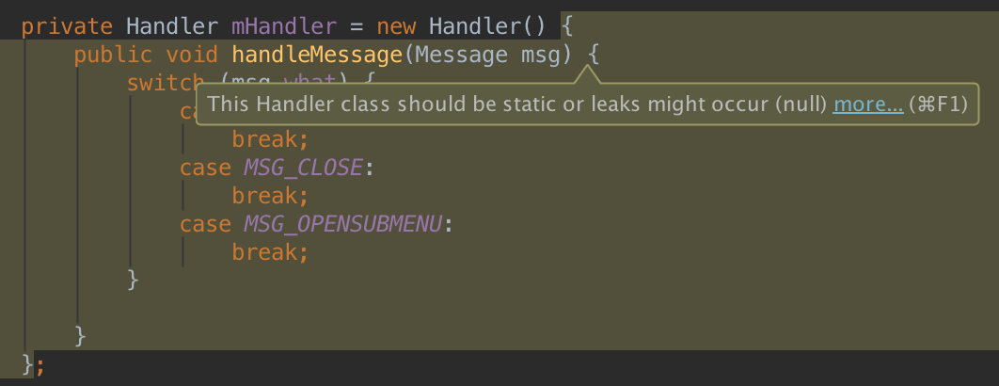
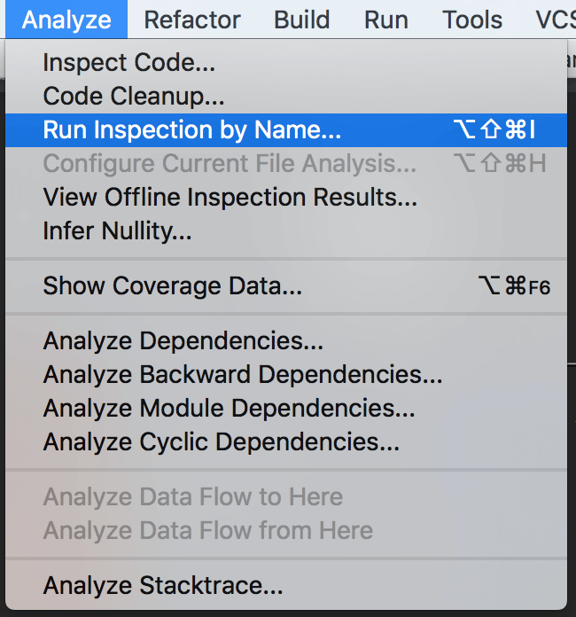
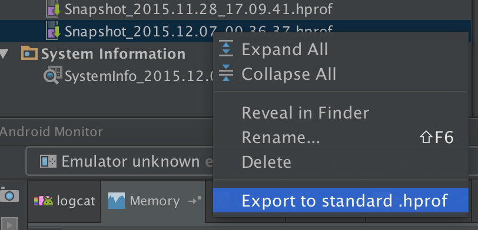
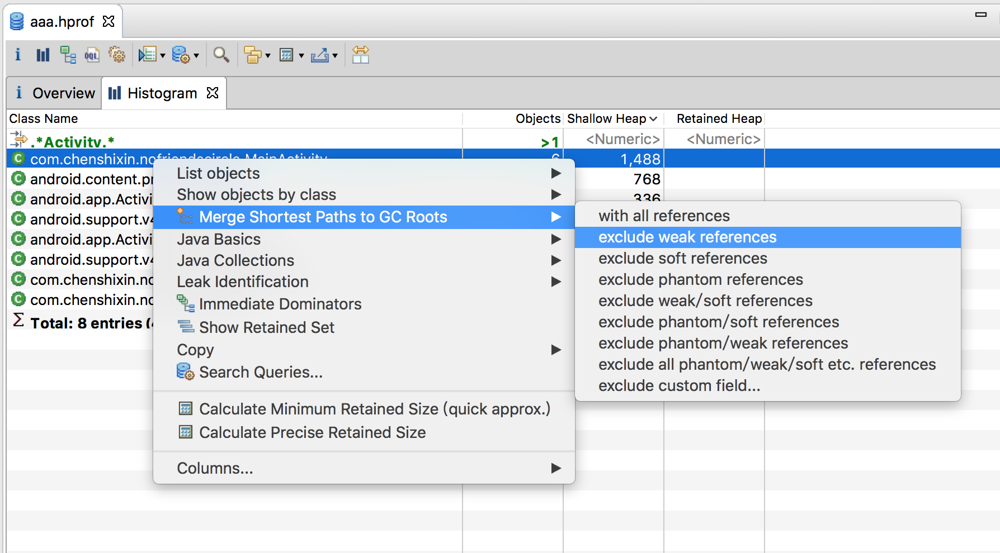
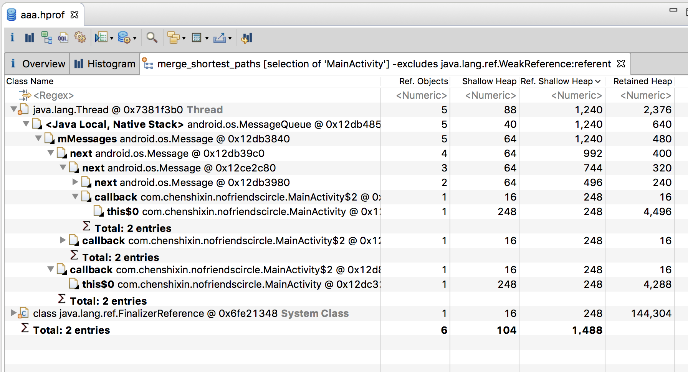

# 使用StrictMode和MAT分析Android内存泄露

来源:[七章](http://www.chenshixin.com/2015/12/06/%E4%BD%BF%E7%94%A8StrictMode%E5%92%8CMAT%E5%88%86%E6%9E%90Android%E5%86%85%E5%AD%98%E6%B3%84%E9%9C%B2%E9%97%AE%E9%A2%98/?hmsr=toutiao.io&utm_medium=toutiao.io&utm_source=toutiao.io)

## 涉及工具

* [Memory Analyzer (MAT)](http://www.eclipse.org/mat/downloads.php): Eclipse的内存分析工具，可选择独立版本(Stand-alone)或Eclipse插件(Update-site)。
* [Android Studio](http://tools.android.com/download/studio): Android开发的IDE，自带内存监视工具。
* [leakcanary](https://github.com/square/leakcanary): Square的内存泄露检测库。

## 文章由来
上周开发组内的同事介绍了Android自带的StrictMode，在使用过程发现有多处Activity泄露告警。通过结合Android Studio自带的内存监视工具和MAT，追踪到多处问题代码，并进行了修正，在此进行记录。

## 基本概念

### 垃圾对象

Android虚拟机GC采用的根搜索算法,GC从GC Roots出发，对heap进行遍历。最终没有直接或者间接引用GC Roots的对象就是需要回收的垃圾。

### 内存泄露

某些失去使用价值的对象仍然保持着对跟GC Roots的直接或间接应用，即可以视为发生了内存泄露的情况。Android应用可使用内存较少，发生内存泄露的情况使得内存的使用更加紧张，甚至可能发生OOM。

## 常见原因
* 类的静态变量持有大数据对象
* 静态变量长期维持到大数据对象的引用，阻止垃圾回收。
* 非静态内部类的静态实例
	
	非静态内部类会维持一个到外部类实例的引用，如果非静态内部类的实例是静态的，就会间接长期维持着外部类的引用，阻止被回收掉。

* 资源对象未关闭
	
	资源性对象如Cursor、File、Socket，应该在使用后及时关闭。未在finally中关闭，会导致异常情况下资源对象未被释放的隐患。
* 注册对象未反注册
	未反注册会导致观察者列表里维持着对象的引用，阻止垃圾回收。

* Handler临时性内存泄露
   * Handler通过发送Message与主线程交互，Message发出之后是存储在MessageQueue中的，有些Message也不是马上就被处理的。在Message中存在一个 target，是Handler的一个引用，如果Message在Queue中存在的时间越长，就会导致Handler无法被回收。如果Handler是非静态的，则会导致Activity或者Service不会被回收。
   * 由于AsyncTask内部也是Handler机制，同样存在内存泄漏的风险。 此种内存泄露，一般是临时性的。

## 检测方式
### 静态检测


* Android Lint

在开发过程中，Android Studio通常会提示我们可能会引起泄露的问题,比如图中所示的Handler。



* Insteption

也可通过Android Studio中的分析工具对整个项目进行静态分析。Analyze - Run Insteption by Name - 输入Memory Issues， 选择需要进行分析的项目进行分析即可。




* StrictMode

StrictMode除了通常使用的检测UI线程中的阻塞性操作外，还能检测内存方面的问题，在发生内存泄露时输出Error的LogCat日志。可以在Application或Activity中进行如下的设置。

**注意请不要在线上版本使用，建议设置开关**

```
@Override
protected void onCreate(Bundle savedInstanceState) {
    if (BuildConfig.DEBUG) {
        StrictMode.setVmPolicy(new StrictMode.VmPolicy.Builder()

                .detectActivityLeaks()              //检测Activity泄露

                .detectLeakedSqlLiteObjects()       //检测数据库对象泄露

                .detectLeakedClosableObjects()      //检测Closable对象泄露

                .detectLeakedRegistrationObjects()  //检测注册对象的泄露，需要API16及以上

                .penaltyLog()						//在LogCat中打印

                .build());
    }
    super.onCreate(savedInstanceState);
}
```

* LeakCanary

LeakCanary是Square推出的开源内存泄露检测库，可以检测Fragment、Activity等，并支持上传追踪文件到服务器。
最基本的使用方式如下。

1.在 build.gradle 中加入引用，不同的编译使用不同的引用：

```
dependencies {
  debugCompile 'com.squareup.leakcanary:leakcanary-android:1.3'
  releaseCompile 'com.squareup.leakcanary:leakcanary-android-no-op:1.3'
}
```

2.在 Application 中：

```
public class ExampleApplication extends Application {

  @Override public void onCreate() {
    super.onCreate();
    LeakCanary.install(this);
  }
}
```

这样，如果检测到某个 activity 有内存泄露，LeakCanary 会自动地显示一个通知。

## 使用MAT进行分析

这里我们模拟一个使用Handler时常见的可能出现内存泄露的情况。

```
private TextView mCountTV;

private Handler mHandler = new Handler(new Handler.Callback() {
    @Override
    public boolean handleMessage(Message msg) {
        return false;
    }
});

@Override
protected void onCreate(Bundle savedInstanceState) {
    super.onCreate(savedInstanceState);
    setContentView(R.layout.activity_main);
    mCountTV = (TextView) findViewById(R.id.tv_main_stop_times);
    mHandler.postDelayed(new Runnable() {
        @Override
        public void run() {
            mCountTV.setText("11111");
        }
    }, 10000);
}
```

当StrictMode或LeakCanary提示我们发生内存泄露问题时，我们可以通过Android Studio自带的内存监视工具转存Java堆文件。


转存成功后可以在Captures中看到堆镜像文件。


由于Android Studio目前提供的内存分析功能有限，这里我们使用MAT工具进行分析。这里我们需要将文件导出为标准的hprof格式才能被MAT成功分析。



使用MAT打开导出的内存文件，点击下方的Histogram视图(立方图)，搜索告警中提及到的Activity。这里可以搜索ClassName为包含Activity，Objects个数大于1的，可以直观的罗列存在多个实例的Activity。


找到疑似存在问题的Activity，我们需要知道是由于什么原因导致其之前的实例没有销毁，这里可以通过 **右键类名-Merge Shortest Paths to GC Roots-exclude weak references** 找到对GC根的引用。



通过展开可以分析出最终实例未销毁的原因是Activity被callback所引用，它又被Message中一系列的next所引用，最后到主线程才结束。



通过以上方法，可以分析出对象（特别是Activity）未销毁的原因，较为常见的是2中所列原因。为修正此类问题，可以通过避免非静态内部类或者使用弱引用等方式进行改造。

## 参考资料

* [使用Android studio分析内存泄露](http://www.jianshu.com/p/c49f778e7acf)
* [Android内存泄漏研究](http://jiajixin.cn/2015/01/06/memory_leak/)
* [避免Android中Context引起的内存泄露](http://droidyue.com/blog/2015/04/12/avoid-memory-leaks-on-context-in-android/)

