# 使用新版 Android Studio 检测内存泄露和性能

来源:[http://gold.xitu.io/entry/5732900179bc44005c248910](http://gold.xitu.io/entry/5732900179bc44005c248910)

> [NeXT___ 推荐：](http://gold.xitu.io/#/user/55f4419360b28e983c150d0e) Android 工程师 @ 稀土
> 内存泄露，是 Android 开发者最头疼的事。可能一处小小的内存泄露，都可能是毁于千里之堤的蚁穴。怎么才能检测内存泄露> 呢？网上教程非常多，不过很多都是使用 Eclipse 检测的, 其实 1.3 版本以后的 Android Studio 检测内存非常方便, > 如果结合上 MAT 工具, LeakCanary 插件, 一切就变得 so easy 了。 作者：@于连林 520wcf<br/>
> 原文链接：[http://www.jianshu.com/p/216b03c22bb8](http://www.jianshu.com/p/216b03c22bb8)

内存泄露，是[Android](http://lib.csdn.net/base/15)开发者最头疼的事。可能一处小小的内存泄露，都可能是毁于千里之堤的蚁穴。 

怎么才能检测内存泄露呢？网上教程非常多，不过很多都是使用Eclipse检测的, 其实1.3版本以后的Android Studio 检测内存非常方便, 如果结合上MAT工具,LeakCanary插件,一切就变得so easy了。

## 熟悉Android Studio界面

工欲善其事,必先利其器。我们接下来先来熟悉下Android Studio的界面 

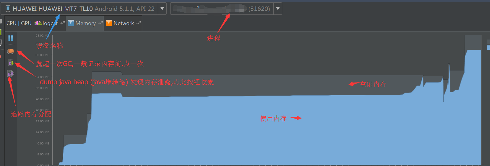

一般分析内存泄露, 首先运行程序,打开日志控制台,有一个标签Memory ,我们可以在这个界面分析当前程序使用的内存情况, 一目了然, 我们再也不需要苦苦的在logcat中寻找内存的日志了。

**图中蓝色区域，就是程序使用的内存， 灰色区域就是空闲内存**

当然，Android内存分配机制是对每个应用程序逐步增加, 比如你程序当前使用30M内存, 系统可能会给你分配40M, 当前就有10M空闲, 如果程序使用了50M了,系统会紧接着给当前程序增加一部分,比如达到了80M， 当前你的空闲内存就是30M了。 当然,系统如果不能再给你分配额外的内存,程序自然就会OOM(内存溢出)了。 每个应用程序最高可以申请的内存和手机密切相关，比如我当前使用的华为Mate7,极限大概是200M,算比较高的了, 一般128M 就是极限了, 甚至有的手机只有可怜的16M或者32M，这样的手机相对于内存溢出的概率非常大了。

## 我们怎么检测内存泄露呢

首先需要明白一个概念, 内存泄露就是指,本应该回收的内存,还驻留在内存中。 

一般情况下,高密度的手机,一个页面大概就会消耗20M内存,如果发现退出界面,程序内存迟迟不降低的话,可能就发生了严重的内存泄露。 

我们可以反复进入该界面，然后点击dump [Java](http://lib.csdn.net/base/17) heap 这个按钮,然后Android Studio就开始干活了,下面的图就是正在dump 


dump成功后会自动打开 hprof文件,文件以Snapshot+时间来命名 

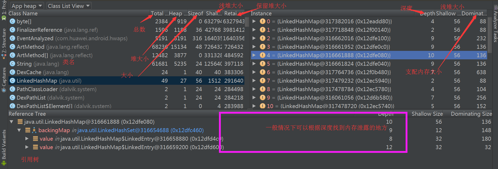

通过Android Studio自带的界面,查看内存泄露还不是很智能,我们可以借助第三方工具,常见的工具就是MAT了,下载地址 [http://eclipse.org/mat/downloads.php](http://eclipse.org/mat/downloads.php) ,这里我们需要下载独立版的MAT. 下图是MAT一开始打开的界面, 这里需要提醒大家的是，MAT并不会准确地告诉我们哪里发生了内存泄漏，而是会提供一大堆的数据和线索，我们需要自己去分析这些数据来去判断到底是不是真的发生了内存泄漏。

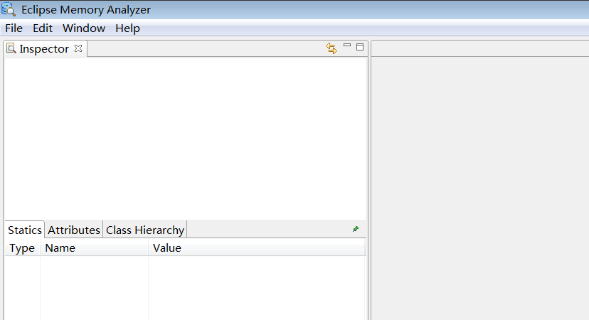

接下来我们需要用MAT打开内存分析的文件, 上文给大家介绍了使用Android Studio生成了 hprof文件, 这个文件在呢, 在Android Studio中的Captrues这个目录中,可以找到 

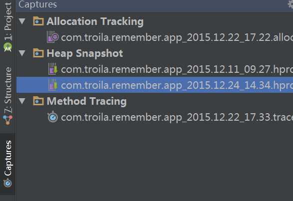

注意,这个文件不能直接交给MAT, MAT是不识别的, 我们需要右键点击这个文件,转换成MAT识别的。 

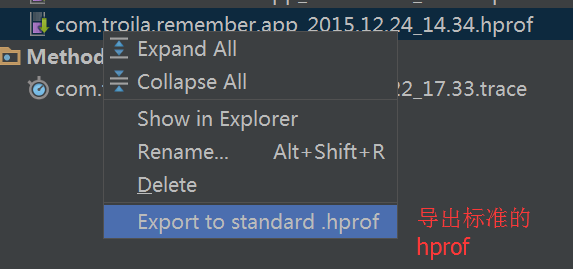

然后用MAT打开导出的hprof(File->Open heap dump) MAT会帮我们分析内存泄露的原因 

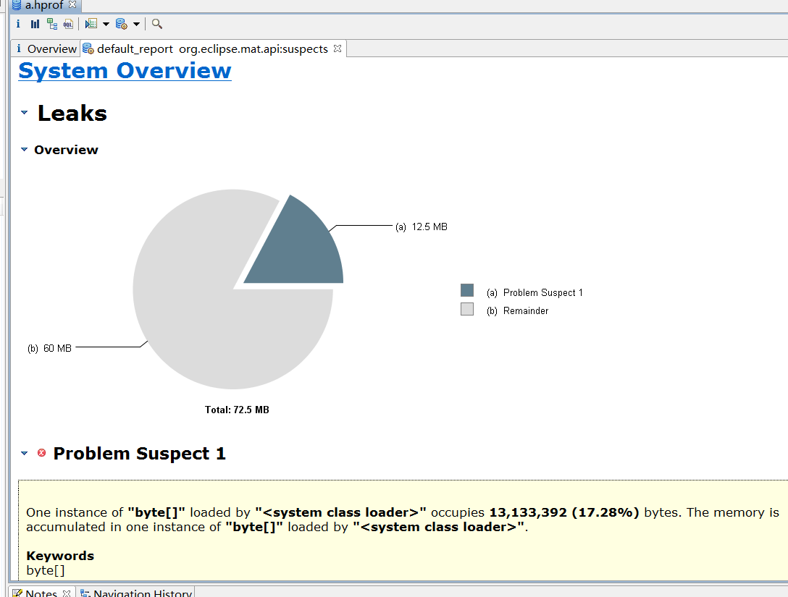

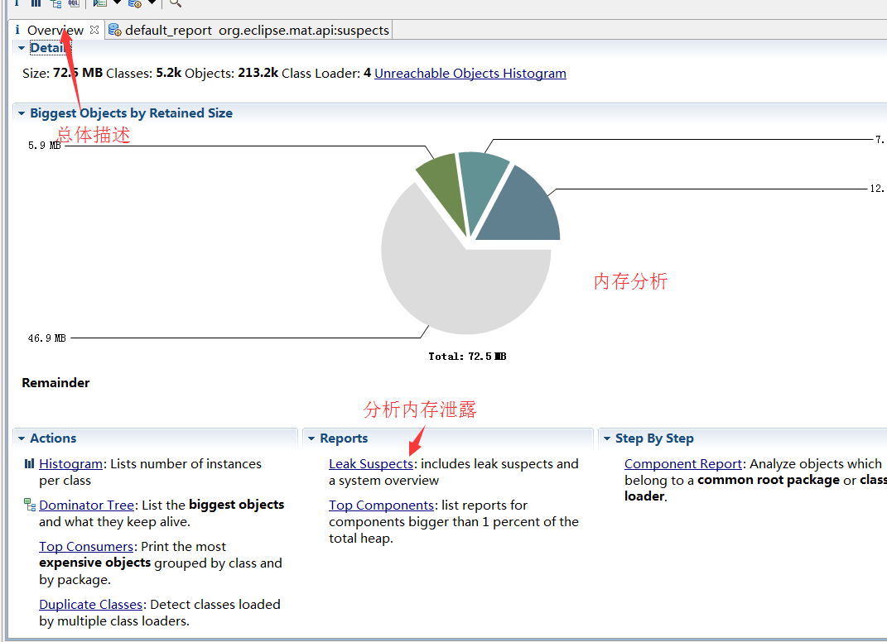

## LeakCanary

上面介绍了MAT检测内存泄露, 再给大家介绍LeakCanary。 

项目地址：[https://github.com/square/leakcanary](https://github.com/square/leakcanary)

LeakCanary会检测应用的内存回收情况，如果发现有垃圾对象没有被回收，就会去分析当前的内存快照，也就是上边MAT用到的.hprof文件，找到对象的引用链，并显示在页面上。这款插件的好处就是,可以在手机端直接查看内存泄露的地方,可以辅助我们检测内存泄露 

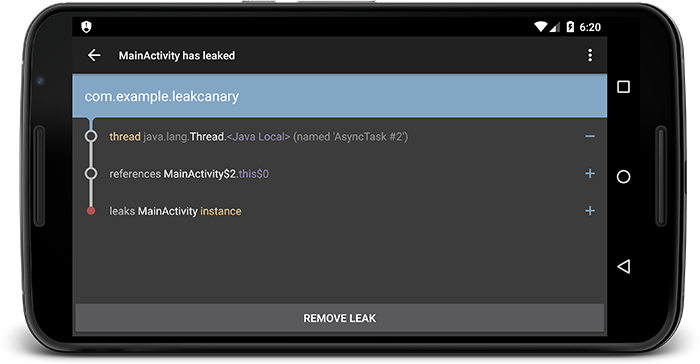

使用： 

在build.gradle文件中添加，不同的编译使用不同的引用：

```
dependencies { 
    debugCompile 'com.squareup.leakcanary:leakcanary-android:1.3' 
    releaseCompile 'com.squareup.leakcanary:leakcanary-android-no-op:1.3' 
}
```

在应用的Application onCreate方法中添加LeakCanary.install(this)，如下

```
public class ExampleApplication extends Application 
    @Override 
    public void onCreate() {
        super.onCreate(); 
        LeakCanary.install(this);
     }
 }
```

应用运行起来后，LeakCanary会自动去分析当前的内存状态，如果检测到泄漏会发送到通知栏，点击通知栏就可以跳转到具体的泄漏分析页面。 

Tips：就目前使用的结果来看，绝大部分泄漏是由于使用单例模式hold住了Activity的引用，比如传入了context或者将Activity作为listener设置了进去，所以在使用单例模式的时候要特别注意，还有在Activity生命周期结束的时候将一些自定义监听器的Activity引用置空。 

关于LeakCanary的更多分析可以看项目主页的介绍，还有这里[http://www.liaohuqiu.net/cn/posts/leak-canary-read-me/](http://www.liaohuqiu.net/cn/posts/leak-canary-read-me/)

## 追踪内存分配

如果我们想了解内存分配更详细的情况,可以使用Allocation Traker来查看内存到底被什么占用了。 

用法很简单： 

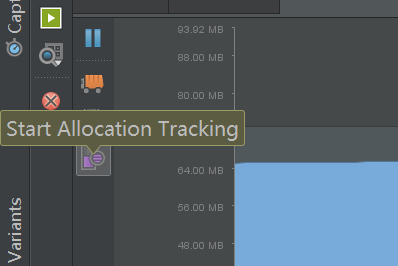

点一下是追踪， 再点一下是停止追踪， 停止追踪后 .alloc文件会自动打开,打开后界面如下: 

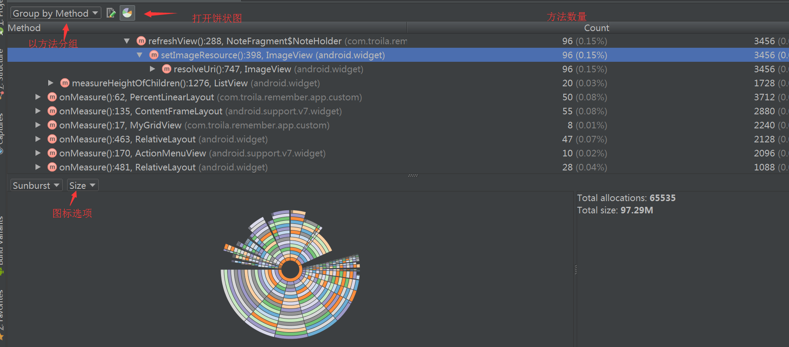

当你想查看某个方法的源码时,右键选择的方法,点击`Jump to source`就可以了

## 查询方法执行的时间

Android Studio 功能越来越强大了, 我们可以借助AS观测各种性能,如下图: 

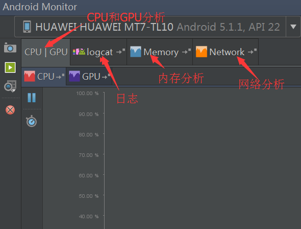

如果我们要观测方法执行的时间,就需要来到CPU界面 

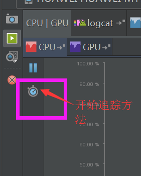

点击Start Method Tracking, 一段时间后再点击一次, trace文件被自动打开, 

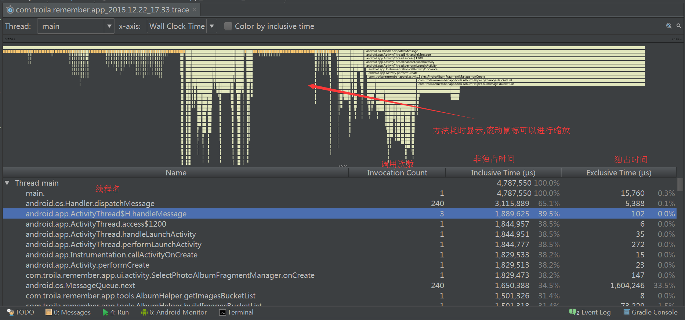

**非独占时间:** 某函数占用的CPU时间,包含内部调用其它函数的CPU时间。<br/> 
**独占时间:**某函数占用CPU时间,但不含内部调用其它函数所占用的CPU时间。

**我们如何判断可能有问题的方法？**

通过方法的调用次数和独占时间来查看，通常判断方法是：

* 如果方法调用次数不多，但每次调用却需要花费很长的时间的函数，可能会有问题。
* 如果自身占用时间不长，但调用却非常频繁的函数也可能会有问题。

## 综述

上面给大家介绍了若干使用Android Studio检查程序性能的工具,工具永远是辅助,不要因为工具耽误太长时间。如果有问题，欢迎大家纠正。
