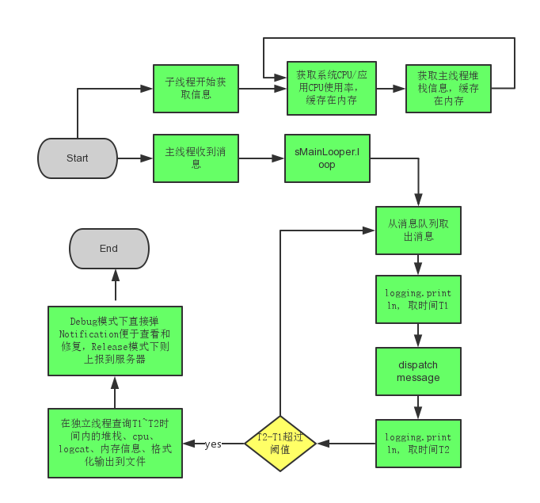
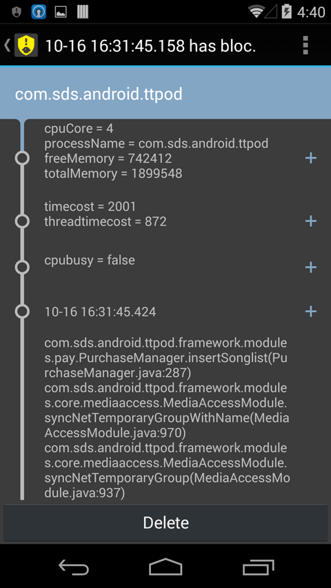

# BlockCanary — 轻松找出Android App界面卡顿元凶

来源：[markzhai's home](http://blog.zhaiyifan.cn/2016/01/16/BlockCanaryTransparentPerformanceMonitor/)

BlockCanary是我利用个人时间开发的Android平台上的一个轻量的，非侵入式的性能监控组件，应用只需要简单地加几行，提供一些该组件需要的上下文环境就可以在使用应用的时候检测主线程上的各种卡顿问题，并通过组件提供的各种信息分析出原因并进行修复。

开源代码：[moduth/blockcanary](https://github.com/moduth/blockcanary)

## 背景

在复杂的项目环境中，由于历史代码庞大，业务复杂，包含各种第三方库，偶尔再来个jni调用，所以在出现了卡顿的时候，我们很难定位到底是哪里出现了问题，即便知道是哪一个Activity/Fragment，也仍然需要进去里面一行一行看，动辄数千行的类再加上跳来跳去调来调去的，结果就是不了了之随它去了，实在不行了再优化吧。于是一拖再拖，最后可能压根就改不动了，客户端越来越卡。

事实上，很多情况下卡顿不是必现的，它们可能与机型、环境、操作等有关，存在偶然性，即使发生了，再去查那如山般的logcat，也不一定能找到卡顿的原因，是我们自己的应用导致的还是其他应用抢占资源导致的？是哪些方法导致的？很难去回朔。有些机型自己修改了api导致的卡顿，还必须拿那台机器才能去调试找原因。

BlockCanary就是来解决这个问题的。
告别打点，告别Debug，哪里卡顿，一目了然。

## 介绍

BlockCanary对主线程操作进行了完全透明的监控，并能输出有效的信息，帮助开发分析、定位到问题所在，迅速优化应用。其特点有：

* 非侵入式，简单的两行就打开监控，不需要到处打点，破坏代码优雅性。
* 精准，输出的信息可以帮助定位到问题所在（精确到行），不需要像Logcat一样，慢慢去找。

目前包括了核心监控输出文件，以及UI显示卡顿信息功能。仅支持Android端。

## 原理
熟悉Message/Looper/Handler系列的同学们一定知道Looper.java中这么一段：

```
private static Looper sMainLooper;  // guarded by Looper.class
...

/**
 * Initialize the current thread as a looper, marking it as an

 * application's main looper. The main looper for your application

 * is created by the Android environment, so you should never need

 * to call this function yourself.  See also: {@link #prepare()}

 */
public static void prepareMainLooper() {
    prepare(false);
    synchronized (Looper.class) {
        if (sMainLooper != null) {
            throw new IllegalStateException("The main Looper has already been prepared.");
        }
        sMainLooper = myLooper();
    }
}


/** 
 * Returns the application's main looper, 
 * which lives in the main thread of the application.
 */
public static Looper getMainLooper() {
    synchronized (Looper.class) {
        return sMainLooper;
    }
}
```

即整个应用的主线程，只有这一个looper，不管有多少handler，最后都会回到这里。

如果再细心一点会发现在Looper的loop方法中有这么一段

```
public static void loop() {

    ...

    for (;;) {
        ...

        // This must be in a local variable, in case a UI event sets the logger
        Printer logging = me.mLogging;
        if (logging != null) {
            logging.println(">>>>> Dispatching to " + msg.target + " " +
                    msg.callback + ": " + msg.what);
        }

        msg.target.dispatchMessage(msg);

        if (logging != null) {
            logging.println("<<<<< Finished to " + msg.target + " " + msg.callback);
        }

        ...
    }
}
```

是的，就是这个Printer - mLogging，它在每个message处理的前后被调用，而如果主线程卡住了，不就是在dispatchMessage里卡住了吗？

核心流程图：



该组件利用了主线程的消息队列处理机制，通过

```
Looper.getMainLooper().setMessageLogging(mainLooperPrinter);
```

并在`mainLooperPrinter`中判断start和end，来获取主线程dispatch该message的开始和结束时间，并判定该时间超过阈值(如2000毫秒)为主线程卡慢发生，并dump出各种信息，提供开发者分析性能瓶颈。

```
...

@Override
public void println(String x) {
    if (!mStartedPrinting) {
        mStartTimeMillis = System.currentTimeMillis();
        mStartThreadTimeMillis = SystemClock.currentThreadTimeMillis();
        mStartedPrinting = true;
    } else {
        final long endTime = System.currentTimeMillis();
        mStartedPrinting = false;
        if (isBlock(endTime)) {
            notifyBlockEvent(endTime);
        }
    }
}

private boolean isBlock(long endTime) {
    return endTime - mStartTimeMillis > mBlockThresholdMillis;
}
...
```

**说到此处，想到是不是可以用mainLooperPrinter来做更多事情呢？既然主线程都在这里，那只要parse出app包名的第一行，每次打印出来，是不是就不需要打点也能记录出用户操作路径？ 再者，比如想做onClick到页面创建后的耗时统计，是不是也能用这个原理呢？ 之后可以试试看这个思路（目前存在问题是获取线程堆栈是定时3秒取一次的，很可能一些比较快的方法操作一下子完成了没法在stacktrace里面反映出来）。**

## 功能
BlockCanary会在发生卡顿（通过MonitorEnv的getConfigBlockThreshold设置）的时候记录各种信息，输出到配置目录下的文件，并弹出消息栏通知（可关闭）。

简单的使用如在开发、测试、Monkey的时候，Debug包启用

* 开发可以通过图形展示界面直接看信息，然后进行修复
* 测试可以把log丢给开发，也可以通过卡慢详情页右上角的更多按钮，分享到各种聊天软件（不要怀疑，就是抄的LeakCanary）
* Monkey生成一堆的log，找个专人慢慢过滤记录下重要的卡慢吧

还可以通过Release包用户端定时开启监控并上报log，后台匹配堆栈过滤同类原因，提供给开发更大的样本环境来优化应用。

本项目提供了一个友好的展示界面，供开发测试直接查看卡慢信息（基于LeakCanary的界面修改）。

dump的信息包括：

* 基本信息：安装包标示、机型、api等级、uid、CPU内核数、进程名、内存、版本号等
* 耗时信息：实际耗时、主线程时钟耗时、卡顿开始时间和结束时间
* CPU信息：时间段内CPU是否忙，时间段内的系统CPU/应用CPU占比，I/O占CPU使用率
* 堆栈信息：发生卡慢前的最近堆栈，可以用来帮助定位卡慢发生的地方和重现路径

sample如下图，可以精确定位到代码中哪一个类的哪一行造成了卡慢。



## 总结

BlockCanary作为一个Android组件，目前还有局限性，因为其在一个完整的监控系统中只是一个生产者，还需要对应的消费者去分析日志，比如归类排序，以便看出哪些卡慢更有修复价值，需要优先处理；又比如需要过滤机型，有些奇葩机型的问题造成的卡慢，到底要不要去修复是要斟酌的。扯远一点的话，像是埋点除了统计外，完全还能用来做链路监控，比如一个完整的流程是A -> B -> D -> E, 但是某个时间节点突然A -> B -> D后没有到达E，这时候监控平台就可以发出预警，让开发人员及时定位。很多监控方案都需要C/S两端的配合。

目前阿里内多个Android项目接入并使用BlockCanary来优化Android应用的性能。
