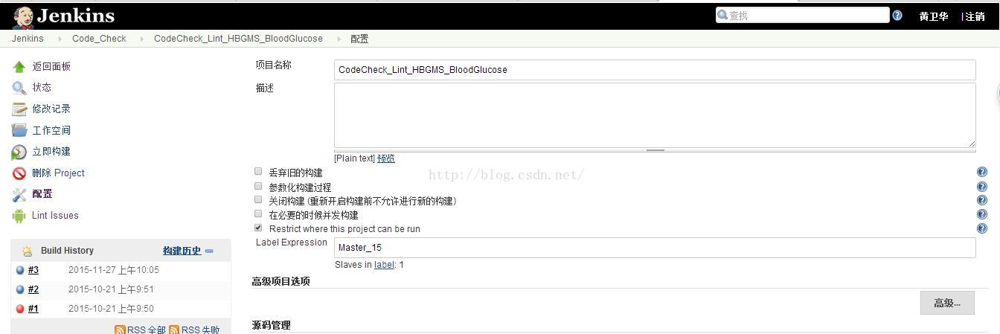
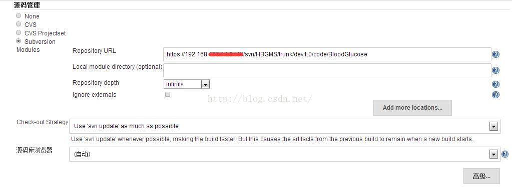
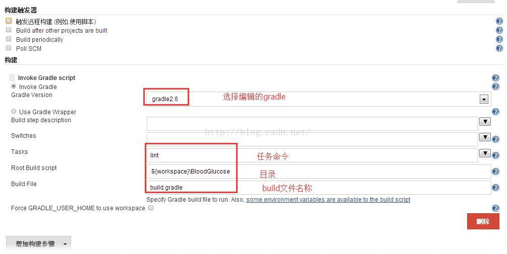
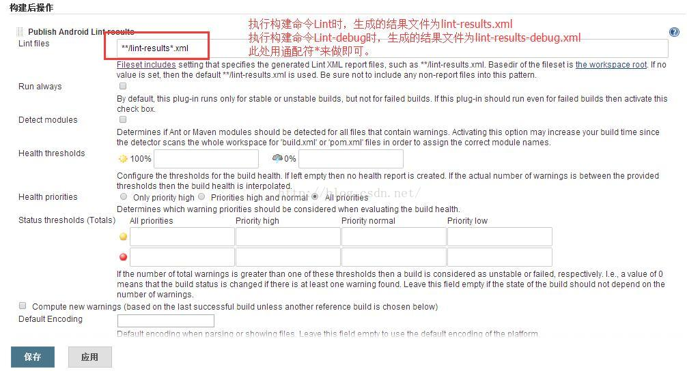
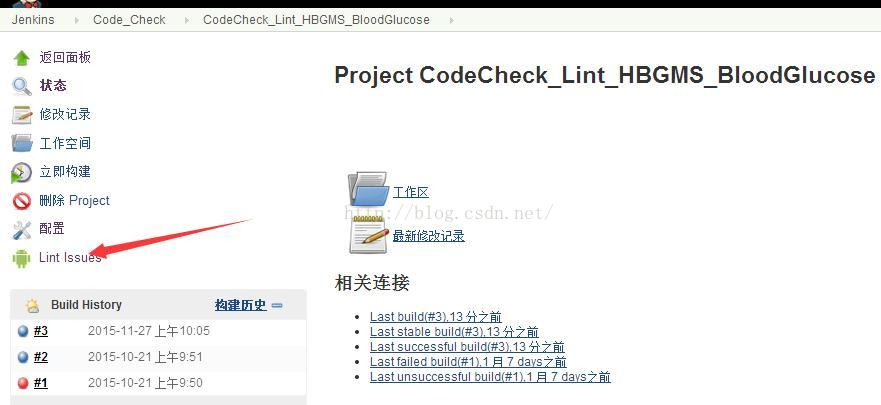
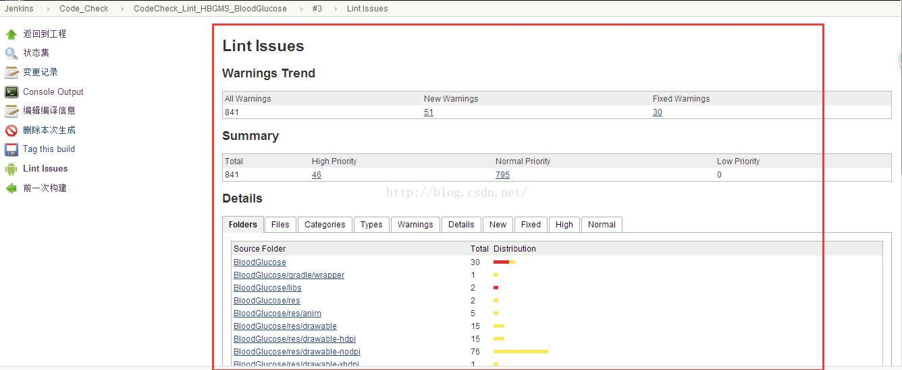

# Jenkins+Gradle+Lint对Android工程源码进行静态代码分析

来源:[测试蜗牛，一步一个脚印](http://blog.csdn.net/hwhua1986/article/details/50067089)

## Lint的介绍

### 官网介绍

> The Android linttool is a static code analysis tool that checks your Android project sourcefiles for potential bugs and optimization improvements for correctness,security, performance, usability, accessibility, and internationalization.

Android Lint工具是一个静态代码分析工具,检查你的Android项目源文件为潜在的bug和优化改进正确性,安全性、性能、可用性、可访问性和国际化。

### 静态检查原理

Figure 1 shows how the lint tool processes the application source files.

Figure 1. Code scanning workflow with thelint tool

* Application source files

The source files consist of files that make up your Android project, including Java and XML files, icons, and ProGuard configuration files.

* The lint.xml file

A configuration file that you can use to specify any lint checks that you want to exclude and to customize problem severity levels.

* The lint tool

A static code scanning tool that you can run on your Android project from the command-line or from Eclipse. Thelint tool checks for structural code problems that could affect the quality and performance of your Android application. It is strongly recommended that you correct any errors thatlint detects before publishing your application.

* Results of lint checking

You can view the results from lint in the console or in the Lint Warnings view in Eclipse. Each issue is identified by the location in the source files where it occurred and a description of the issue.  

## Jenkins配置如下：

### 新建job

### 配置svn

### 配置构建操作

### 配置分析报告生成步骤

### 构建结果查看

* 点击报告

* 报告详细列表

