# Jenkins+Gradle+pmd对Android工程源码进行静态代码分析

来源:[测试蜗牛，一步一个脚印](http://blog.csdn.net/hwhua1986/article/details/49278941)

## 环境说明

```
Gradle 2.6.
OS：windows server 2008
Jenkins 1.620
pmd 5.4.0
```

## 前提

Jenkins需要提前安装好PMD Plug-in插件

## 一、Jenkins配置如下：

* 1、  新建job

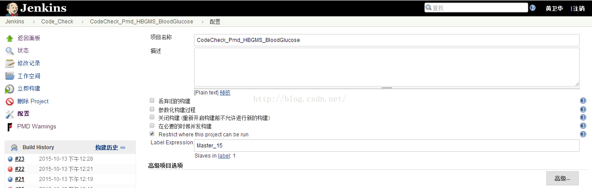

* 2、  配置svn

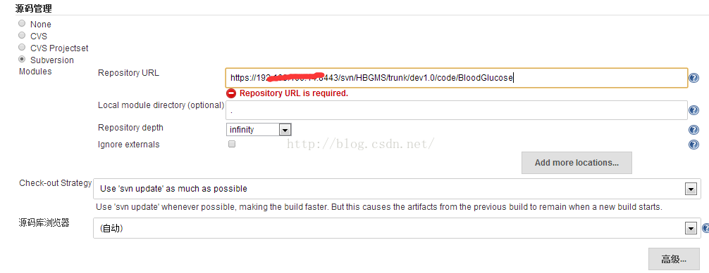

* 3、  配置构建操作

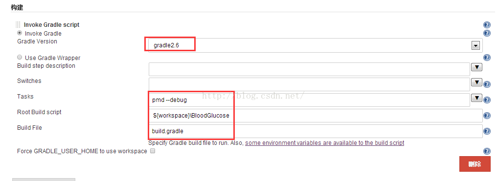

备注：

> Tasks指的是build.gradle里面的task名称<br/>
> 配置info参数是用来看调试日志，也可以配置debug级别。主要用来查看构建失败的原因。

* 4、  配置分析报告

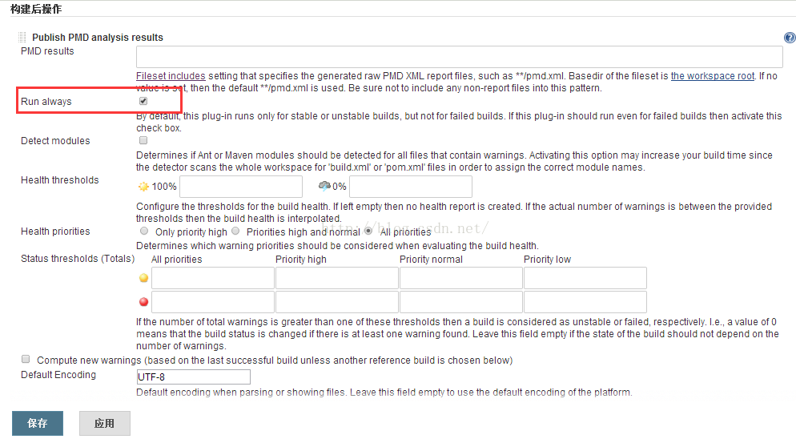

## 二、gradle.build的配置如下
 
* 1、添加checkstyle的依赖

```
buildscript {
   repositories {
               mavenCentral()
    }
   dependencies {
       classpath 'com.Android.tools.build:gradle:1.0.0+'
              //classpath  'io.fabric.tools:gradle:1.+'
              //classpath  'com.google.code.findbugs:findbugs:3.0.1'
              //classpath  'com.puppycrawl.tools:checkstyle:6.11.2'
              //classpath  'net.sourceforge.pmd:pmd:5.4.0'
    }
}
```

备注：版本包可以通过中央仓库（[http://mvnrepository.com/artifact/](http://mvnrepository.com/artifact/)）查看，如图

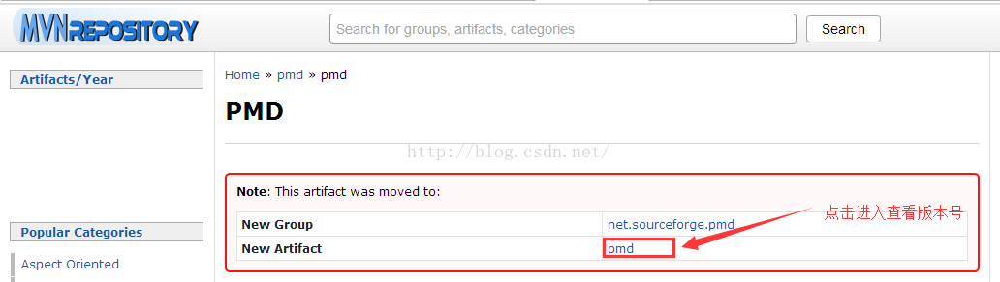

版本列表：

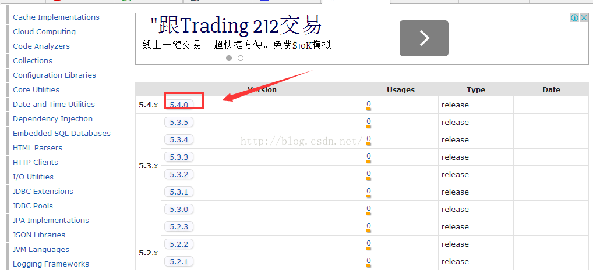

* 2、增加checkstyle的task

```
applyplugin: "pmd"
repositories{
  mavenCentral()
}
taskpmd(type: Pmd) {
    ignoreFailures = true
     source = fileTree('src/com/sn/')
       //ruleSetConfig =resources.file("${project.rootDir}/config/pmd/PmdRuleSets.xml")
       //ruleSetFiles =files("config/pmd/PmdRuleSets.xml")
       ruleSetFiles =files("${project.rootDir}/config/pmd/PmdRuleSets.xml")
       ruleSets = ["java-android"]
       reports {
    xml {
      destination "build/pmd.xml"
    }
  }
}
```

备注：其中检查规则文件PmdRuleSets.xml需要创建，步骤如下

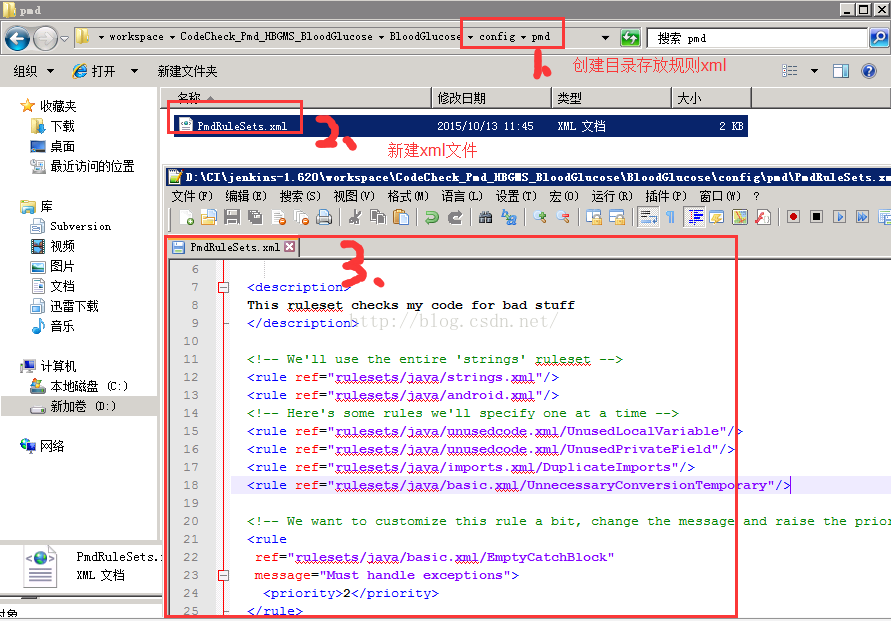

Xml内容代码(可以参考官网配置)：

PMD’官网地址：[http://pmd.sourceforge.net/pmd-5.1.1/howtomakearuleset.html](http://pmd.sourceforge.net/pmd-5.1.1/howtomakearuleset.html)

```
<?xml version="1.0"?>
<ruleset name="Custom ruleset"
   xmlns="http://pmd.sourceforge.net/ruleset/2.0.0"
   xmlns:xsi="http://www.w3.org/2001/XMLSchema-instance"
   xsi:schemaLocation="http://pmd.sourceforge.net/ruleset/2.0.0http://pmd.sourceforge.net/ruleset_2_0_0.xsd">
 
 <description>
 This ruleset checks my code for bad stuff
 </description>
 
 <!-- We'll use the entire 'strings' ruleset -->
 <rule ref="rulesets/java/strings.xml"/>
 <rule ref="rulesets/java/android.xml"/>
 <!-- Here's some rules we'll specify one at a time -->
 <ruleref="rulesets/java/unusedcode.xml/UnusedLocalVariable"/>
 <ruleref="rulesets/java/unusedcode.xml/UnusedPrivateField"/>
 <rule ref="rulesets/java/imports.xml/DuplicateImports"/>
 <rule ref="rulesets/java/basic.xml/UnnecessaryConversionTemporary"/>
 
 <!-- We want to customize this rule a bit, change the message andraise the priority  -->
 <rule
  ref="rulesets/java/basic.xml/EmptyCatchBlock"
  message="Must handle exceptions">
   <priority>2</priority>
 </rule>
 
 <!-- Now we'll customize a rule's property value -->
 <ruleref="rulesets/java/codesize.xml/CyclomaticComplexity">
   <properties>
       <property name="reportLevel" value="5"/>
   </properties>
 </rule>
 
 <!-- We want everything from braces.xml exceptWhileLoopsMustUseBraces -->
 <rule ref="rulesets/java/braces.xml">
   <exclude name="WhileLoopsMustUseBraces"/>
 </rule>
</ruleset>
```

## 三、构建结果查看

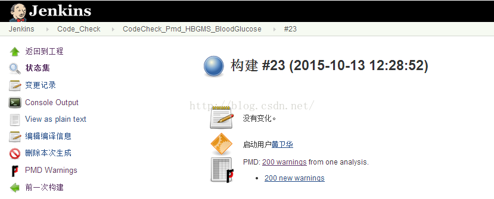
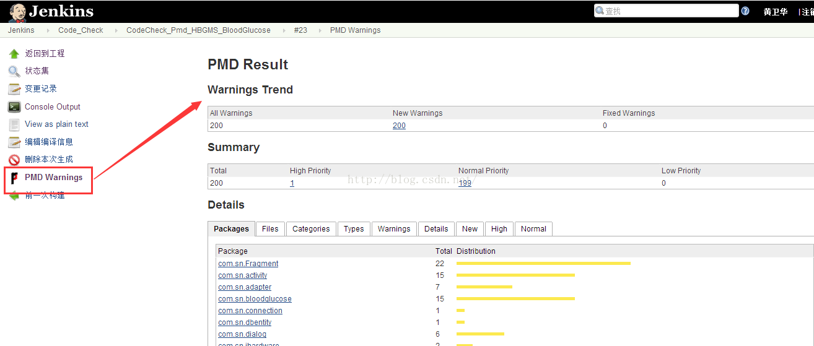

## 四、build.gradle的所有代码如下

```
buildscript {
    repositories {
		 mavenCentral()
    }
    dependencies {
        classpath  'com.android.tools.build:gradle:1.0.0+'
		//classpath  'io.fabric.tools:gradle:1.+'
		//classpath  'com.google.code.findbugs:findbugs:3.0.1'
		//classpath  'com.puppycrawl.tools:checkstyle:6.11.2'
		//classpath  'net.sourceforge.pmd:pmd:5.4.0'
    }
}
apply plugin: 'android'

dependencies {
    compile fileTree(dir: 'libs', include: '*.jar')
}

android {
    compileSdkVersion 20
    buildToolsVersion "20.0.0"

	//忽略编码错误
	lintOptions {  
	     abortOnError false  
	}  

	//设置版本号
	defaultConfig {
        versionCode 1
        versionName "1.0"
        minSdkVersion 8
        targetSdkVersion 18
    }
    
    //引用so包
	sourceSets{
        main{
            jniLibs.srcDir(['libs'])
            jniLibs.srcDir(['obj'])
        }
    }

	//设置编译编码
	tasks.withType(JavaCompile) { 
		options.encoding = 'UTF-8' 
	}
	
	//autograph
    signingConfigs{
        //keystore info
        myConfig {
            storeFile file("bgkey")
            storePassword "sinocare@ydyl"
            keyAlias "com.sn.bloodglucose"
            keyPassword "sinocare@ydyl"
        }
    }

  //混淆
    buildTypes{  
        release{  
            signingConfig signingConfigs.myConfig  
            minifyEnabled false  
        }  
    }  

    sourceSets {
        main {
            manifest.srcFile 'AndroidManifest.xml'
            java.srcDirs = ['src']
            resources.srcDirs = ['src']
            aidl.srcDirs = ['src']
            renderscript.srcDirs = ['src']
            res.srcDirs = ['res']
            assets.srcDirs = ['assets']
        }

        // Move the tests to tests/java, tests/res, etc...
        instrumentTest.setRoot('tests')

        // Move the build types to build-types/<type>
        // For instance, build-types/debug/java, build-types/debug/AndroidManifest.xml, ...
        // This moves them out of them default location under src/<type>/... which would
        // conflict with src/ being used by the main source set.
        // Adding new build types or product flavors should be accompanied
        // by a similar customization.
        debug.setRoot('build-types/debug')
        release.setRoot('build-types/release')
    }
}

apply plugin: "findbugs"

repositories {
  mavenCentral()
}

task findbugs(type: FindBugs) {
   //toolVersion = "2.0.1"
	ignoreFailures = true
	effort = "max"
	reportLevel = "low"
    classes = files("$project.buildDir/intermediates/classes")
	source = fileTree('build/intermediates/classes/debug/com/sn/')
	classpath = files()
	reports {
    xml {
      destination "build/findbugs.xml"
    }
  }
}


apply plugin: "checkstyle"

repositories {
  mavenCentral()
}
task checkstyle(type: Checkstyle) {
   ignoreFailures = true
	//config = files("build/config/checkstyle/checkstyle.xml")
	source = fileTree('build/intermediates/classes/debug/com/sn/')
	classpath = files()
	reports {
    xml {
      destination "build/checkstyle-result.xml"
    }
  }
}


apply plugin: "pmd"

repositories {
  mavenCentral()
}
task pmd(type: Pmd) {
    ignoreFailures = true
   	source = fileTree('src/com/sn/')
	//ruleSetConfig = resources.file("${project.rootDir}/config/pmd/PmdRuleSets.xml")
	//ruleSetFiles = files("config/pmd/PmdRuleSets.xml")
	ruleSetFiles = files("${project.rootDir}/config/pmd/PmdRuleSets.xml")
	ruleSets = ["java-android"]
	reports {
    xml {
      destination "build/pmd.xml"
    }
  }
}
```

## 问题列表：

* 1、Can't find resource 'null' for rule 'android

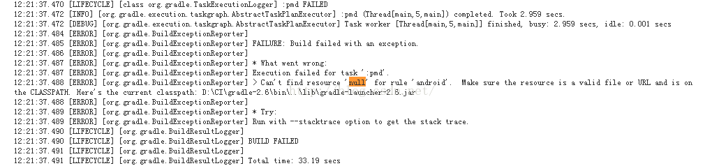

解决：

The reason is simple. In case of Gradle 2.0you must add language prefix before name of rule. You must use java-stringsinstead of plain strings.

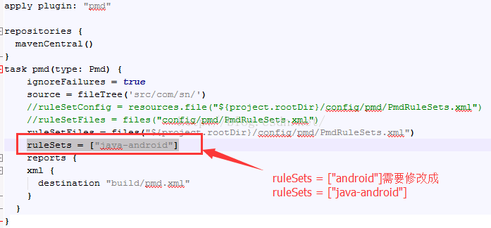